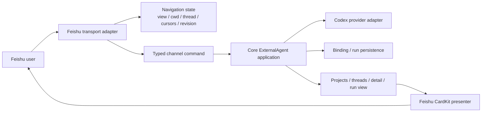

# Feishu ExternalAgent modernization plan

Status: **in progress — Option C approved**
Scope: `backend/channel-gateway`, Core `externalagent`, its chat route, and the
Workflow interaction used by this PR. Other LazyMind features are excluded.

## Objective and invariant

Core is the only owner of Codex thread, binding, run, approval, cancellation,
release, and native-turn state. The Feishu adapter may retain only navigation,
presentation preferences, and the Feishu message/revision needed to update a
card. No plugin compatibility layer is permitted; current Workflow semantics
are authoritative.



The dependency direction above is the architecture gate. A static import graph
without cycles is necessary but insufficient: a Core event must never be copied
into a persisted Feishu run state and then used to authorize a later Core call.

## Feasibility and safety ladder

- Strategy: **freeze-then-lift**. The live Core, Codex app-server, gateway, and
  Feishu bot already run; observable behavior can be pinned before deletion.
- Current Core level: **L3** — focused Go tests, bootable service, and live
  Core→Codex reads are available.
- Current gateway level: **L3** — it boots, the real integration works, and CI
  runs gateway syntax checks, 51 focused contract tests, architecture coverage
  assertions, and the Core ExternalAgent/chat tests. Secrets and Feishu
  credentials remain a manual real-service gate, never a mocked CI substitute.

Phase 0 baseline and hardening evidence on 2026-08-09:

- all compose services required by this slice healthy;
- live Core→Codex returned 5 projects and distinguished two `LazyRAG` projects
  by exact absolute cwd;
- `go test ./externalagent ./chat` passed in the mounted Core toolchain;
- architecture inventory after the first Core ownership milestone: 74 files,
  218 classes/types, 1,264 callables, 574 Mermaid views, with no reported
  import/inheritance/resolved-call cycles;
- a deliberately impossible expected project count failed, proving the oracle
  can reject a regression.
- live trace `feishu-ext-c8cea452e1f84fddb8f9bb6cbc75359f` returned an
  actor-visible project/session count of 6/6 for the exact cwd, a truthful
  `total=6`, matching native detail, and HTTP 404 for another actor's bound
  thread;
- Core persists terminal release as `pending` before unsubscribe, exposes the
  snapshot as `releasing`, recovers pending release after restart, and does not
  broadcast/detach when persistence fails. Focused crash/release/privacy tests
  and the full `externalagent` + `chat` suites pass.

Reproduce the read-only live trace inside the gateway network:

```bash
python tools/feishu_externalagent_trace.py \
  --core-url http://core:8000 \
  --actor-user-id <existing-e2e-user> \
  --expect-min-projects 1 \
  --expect-min-threads 1
```

## Phased migration

### Phase 0 — pin behavior (hardening complete; real takeover remains in Phase 4)

- Keep a repeatable live trace for projects → exact-cwd threads → native detail.
- Record cross-service request/thread/conversation IDs and timings.
- Preserve the existing full symbol inventory as the before snapshot.
- Red-team result: H4 applies, so public/authenticated/s2s/health/callback route
  classes must remain unchanged; H8 applies whenever endpoints/files move.
  H1/H2/H3/H5/H6 do not apply to this phase. H7 is controlled: this work stays
  on the already-open PR branch, with phase gates instead of stacked branches.

Exit: the positive live trace passes, its negative control fails, focused tests
pass, and an independent reviewer accepts the first deletion set.

### Phase 1 — Core query projection; delete duplicate gateway reads (code gate complete)

- Make Core return bounded project/thread/detail views, including a true tail
  page and cursor ownership.
- The gateway passes cwd/cursor/thread ID and renders the response; it does not
  rescan, repaginate, or probe total then read again.
- Creating a session creates the native Codex thread immediately; remove the
  local draft lifecycle.

Required same-phase deletions: local project pagination, both latest-thread
double-read paths, draft materialization state, and newly orphaned helpers.

Current result on 2026-08-10: `ListProjects`, `ListThreads`, and
`ReadThreadPage` provide the actor-visible canonical projection. The gateway
creates native threads immediately and persists no thread metadata, turns,
answer, approval, release, or run snapshot in `FeishuWorkspaceState`. Its
operation-bound `assistant_view` is a bounded **durable transport snapshot** in
the inbox/outbox, not a business source of truth: every later command
fresh-reads Core before acting. Project/session/detail renderers consume only
the canonical whitelisted fields; raw ExternalAgent stream events are not
copied to durable outbox metadata.

The scoped architecture checkpoint contains 98 files and 2,258 Mermaid views;
all 2,258 rendered successfully in a real browser with zero render errors and
no reported import, inheritance, or resolved-call cycles. A live Core→Codex
trace created one native thread and continued it for two turns (native total
`0→1→2`) with distinct run/turn/history IDs and `unsubscribed` release
after both turns. Gateway CI also runs 51 focused contracts covering the typed
execution boundary, approval projection, CardKit retry, and expired-card/image
recovery. Real Feishu CardKit callbacks and device screenshots remain the Phase
4 delivery gate; the direct service trace and contract tests do not substitute
for them.

Exit: net code deletion; live project/session/detail/new-session/two-turn paths
pass; architecture inventory is regenerated, rendered, visually inspected, and
independently reviewed before Phase 2.

### Phase 2 — typed channel boundary; delete magic-key interpretation

- Construct typed capability selection, attachments, and ExternalAgent target
  at the channel edge.
- Common routing/actions consume those values without knowing Feishu workspace
  keys or checking `provider == "feishu"`.

Required same-phase deletions: `workspace_resources` and
`external_agent_binding` business parsing from `provider_context`, plus all
obsolete key propagation.

Exit: route-class matrix passes, net code deletion, no new abstraction stack,
and the rendered architecture is accepted before Phase 3.

### Phase 3 — Core-owned run view; delete the parallel Feishu state machine

- Render thread/binding/run/pending/control data from a Core view and live
  events; re-query Core after commands.
- Persist only view/cwd/thread/cursors/UI preferences/message revision.

Required same-phase deletions: persisted thread metadata, turns, run output,
pending request and control flags; `apply_thread`, `apply_snapshot`, SSE→state
patching, and duplicated authorization decisions.

Aggressive cleanup checkpoint on 2026-08-10:

- deleted the persisted management-presentation cache (`view_snapshots`, its
  serializers, cache/read helpers, runtime cache renderer, and delivery merge
  path); Core presentations now travel only in the current typed outbound;
- converted data-dependent CardKit actions to typed Core reads, while strictly
  local actions never enter the classifier or inbox;
- management command callbacks no longer return or schedule a loading card, so
  a late callback cannot overwrite a completed Core result; stale results are
  discarded by source view/revision/operation/route, and same-lineage expired
  replacements follow the current Feishu message;
- management actions and typed bot-menu reads now use one transactional
  workspace-and-inbox claim on PostgreSQL and SQLite. The transaction owns
  duplicate rejection, UI lineage, pending new-conversation draft mutation,
  and inbox insertion; two older draft-specific CAS APIs and the independent
  `clear_turn` mutation path were deleted rather than retained as compatibility
  layers. Menu candidates use the Feishu event id as their stable provider
  idempotency identity;
- the three largest Feishu modules are now 8,445 lines, down 506 lines from the
  pre-cleanup checkpoint. Duplicate, stale revision/operation, invalid draft
  action, and active-route zero-write contracts still cover the unified
  transaction;
- collapsed the parallel `context` page into a single capability overview / catalog
  surface. The deleted view, wire actions, state mutators, and persisted context
  fields have no production references; new-conversation choices remain owned by
  the generic navigation draft and existing-conversation settings remain Core
  projections;
- replaced the durable multi-round `prepared_catalog` copy with at most eight
  typed selected-item leases. Each resumed item is joined back to the current Core
  catalog by ID before it can be used, and a resolved conversation target is kept
  only as a bounded ID until Core detail revalidates it;
- made task monitoring consume exact `task_id` / `conversation_id` bindings from
  rendered outbox parts. Title guessing, presentation-cache matching, the
  Workspace-task compatibility renderer, and task-image writes into Workspace
  were deleted. Task lineage and artifact delivery identities are fixed-size
  hashes with explicit task/artifact limits;
- replaced raw Core artifact/source copies with typed projections before outbox
  persistence. This closes the unbounded-field copy, but the current per-event
  limits are only an interim guard: the final attachment count and cumulative
  inline-byte budget still need one envelope-level limit;
- the complete focused Gateway suite now passes 95/95. Four independent
  architecture reviews accepted the capability merge, typed continuation,
  rendered task binding, and removal of the TaskMonitor→Workspace repository edge
  with P0=0/P1=0 before the next slice proceeded;
- architecture coverage remains 98 **audited source/test/CI files**, not 98
  runtime components. The report generator now groups up to 16 related symbols
  or edges per Mermaid page instead of two, reducing the current report from
  2,304 tiny pages to 507 useful paginated pages. It reports 279 classes/types,
  1,624 callables, complete declared/independent coverage, and no detected
  import, inheritance, or resolved-call cycles.

Exit: state ownership is singular; completed/failed/interrupted release,
command/file/permissions/user-input requests, restart and user isolation pass on
real services; architecture inventory and visual inspection pass.

### Phase 4 — fixed-point cleanup and delivery

- Repeat implementation → deletion → full inventory → rendered visual review
  until a complete pass finds no safe in-scope deletion or ownership leak.
- Run the prototype interaction matrix on real Feishu desktop/mobile and retain
  message/conversation/thread/run/request IDs, timestamps, and screenshots.
- Verify Workflow naming and “step-by-step confirmation” behavior; do not claim
  first-step preflight confirmation.
- Force a long-running task card past the Feishu update lifetime and verify that
  the monitor replaces/adopts the expired card before claiming delivery complete.
- Verify the declared transport budgets in the client: at most 20 source links,
  20 durable artifacts, the latest 20 workflow steps, and 20 valid images per
  task. Truncation must be visible or explicitly accepted by the prototype
  contract; it must not masquerade as a full Core result.
- Close the remaining task-delivery P1s as one transport-ledger slice: select the
  latest valid images rather than the oldest, retain a bounded retry lease for
  failed artifacts after the visible workflow window advances, replace/adopt an
  expired task card, and enforce one final-attachment/cumulative-byte budget for
  the whole outbound rather than multiplying per-event limits.

Exit: all prototype features pass against real services, no dependency cycle or
parallel business state remains, and the final reviewer finds no blocking drift.

## Route-class guardrail

| Class | Routes in this slice | Invariant |
|---|---|---|
| End-user authenticated | projects, threads, detail, snapshot, bind, chat, interrupt, release, respond | Existing scopes and actor isolation remain |
| Service-to-service | gateway → Core, Core → Codex app-server | Existing injected identity/token contract remains |
| Webhook/callback | Feishu events and CardKit actions | Verification and idempotency remain at the adapter |
| Infrastructure | Core/gateway health | Health behavior remains unchanged |
| Anonymous/public | none added | No new anonymous ExternalAgent route |

## Rollback and documentation discipline

Each phase is a bounded change group. Roll back the whole group if its live
trace, route matrix, release semantics, or visual architecture gate fails; do
not retain new and old state paths together. Every endpoint, ownership, file, or
command change updates this plan, the architecture diagnosis/inventory, and the
scoped contributor instructions in the same phase.
