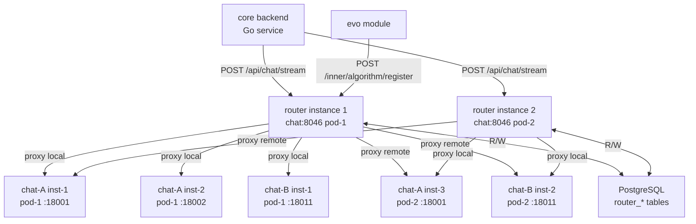
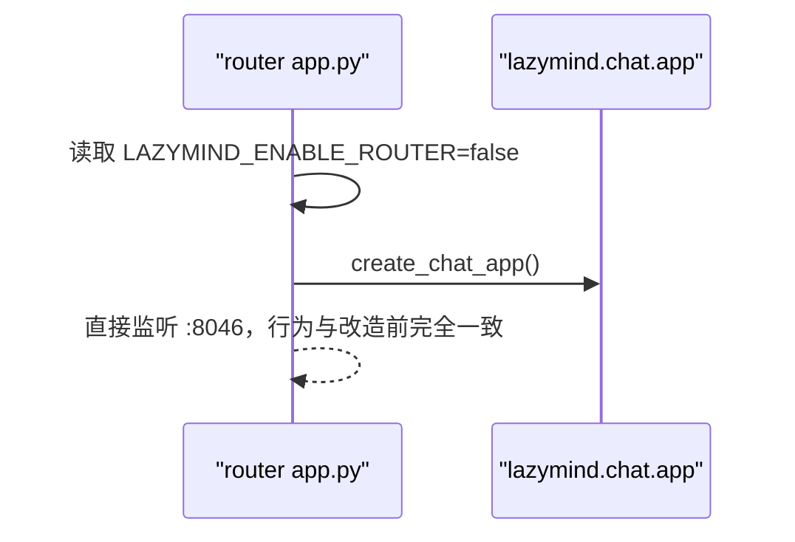
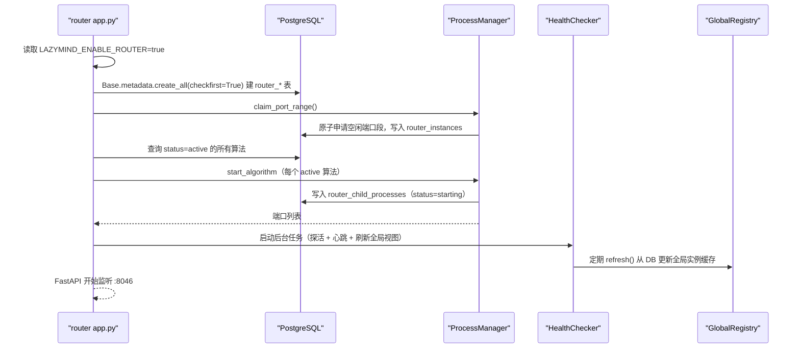

# LazyMind Router 模块设计方案

## 概述

新增 `router` 模块**替换**现有 `chat` 容器（Docker Compose service 名保持 `chat`，端口保持 `8046`，对 `core` backend 完全透明），作为 chat 子服务的管理层和流量代理层。支持多算法版本并行运行、动态 AB 测试分流、子进程健康探活与自动重启，并为 evo（算法跃迁）模块提供注册接口。

通过 `LAZYMIND_ENABLE_ROUTER` 环境变量控制是否启用 router 模式。关闭时 `app.py` 退化为原始 chat 服务，所有 router 功能不启动，行为与改造前完全一致。

---

## 1. 技术选型

**Python + FastAPI**，理由：

- chat 子服务是 Python/FastAPI，router 以子进程方式启动它，共享同一语言和启动入口
- 流式转发（SSE）在 Python `httpx` + FastAPI `StreamingResponse` 中有成熟范式
- evo 模块是 Python，调用注册接口可以直接在同语言内完成
- asyncio 足够处理 IO 密集型的代理并发场景

**为什么不挂载 Docker Socket**：技术上可行，但不选择，原因如下：
- 挂载 `/var/run/docker.sock` 等同于给容器宿主机 root 权限，生产环境安全风险高
- evo 修改的是运行时 Python 文件（volume mount 路径下），`docker run` 新容器仍需通过 volume 传代码，绕了一圈回到原点
- K8s 下 Docker Socket 不存在（containerd 时代），迁移需完全重写
- 子进程模式通过 `PYTHONPATH` 直接加载不同路径的代码，`localhost:port` 通信无额外网络配置，K8s Pod 内同样有效

---

## 2. 能力边界

### 做什么

- 接收来自 `core` backend 的 `/api/chat/stream`、`/api/chat/tools` 等请求，完整透明代理给 chat 子进程
- 管理 1-N 个"算法版本"，每个版本对应一个代码路径，可在本 Pod 内启动 1-M 个子进程实例
- 通过 `router_instances` 表发现其他 router 实例管理的子进程，跨实例路由请求
- 通过 `router_child_processes` 表感知所有子进程（包括其他实例管理的）的健康状态
- 根据 AB 策略（权重随机 + session 粘性）将请求分配到指定算法版本，从全局健康实例中选取
- 支持调用方在请求中直接指定 `algorithm_id`，此时绕过分流策略
- 对**本实例管理的**子进程做周期性健康探活，失败时自动退避重启；通过共享表感知其他实例子进程的健康状态
- 提供 API 供 evo 模块注册/注销算法版本、动态更新 AB 策略
- 将 session→algorithm 映射和 AB 策略持久化到 PostgreSQL（多 router 实例共享）
- 在响应 header 中注入 `X-Algorithm-Id` 供上层追踪
- 启动时自动从 `router_instances` 表申请端口范围，无需手动配置

### 不做什么

- 不管理 Docker 镜像的构建和拉取
- 不做算法内多实例之间的加权负载均衡（只做简单 round-robin）
- 不修改 chat 子服务任何代码
- 不持久化聊天内容（由 core 负责）
- 不做跨算法版本的 session 迁移
- 不接管其他 router 实例挂掉后遗留的子进程（子进程随其 router 实例一起消失，重启后恢复）

---

## 3. 架构图



**关键点**：

- 每个 router 实例只负责**启动和重启**本 Pod 内的 chat 子进程；但路由时从 `router_child_processes` 表读取**全局所有健康实例**（含其他 Pod 的），按 round-robin 选择目标，实现跨实例负载均衡
- 端口分配：router 启动时在 `router_instances` 表中原子地申请一段端口范围，无需手动配置
- AB 策略、session 映射、子进程状态全部存 PostgreSQL，多实例天然共享

---

## 4. `enable_router` 模式切换

通过环境变量 `LAZYMIND_ENABLE_ROUTER`（默认 `false`）控制启动模式。`app.py` 是统一入口，启动时读取此配置项决定走哪条路径：

```
LAZYMIND_ENABLE_ROUTER=false（默认）
  └─ 直接启动原始 chat FastAPI 应用（lazymind.chat.app.create_app()）
     完全等同于改造前，无任何 router 逻辑

LAZYMIND_ENABLE_ROUTER=true
  └─ 启动 router 模式：ProcessManager + GlobalRegistry + HealthChecker + AB 路由
     /inner/* 管理接口全部可用
```

`app.py` 核心逻辑：

```python
from lazymind.router.config import ENABLE_ROUTER

def create_app() -> FastAPI:
    if not ENABLE_ROUTER:
        # 退化模式：直接返回原始 chat 应用，零额外依赖
        from lazymind.chat.app import create_app as create_chat_app
        return create_chat_app()
    # router 模式：注册 proxy_routes、algorithm_routes、strategy_routes 等
    ...

app = create_app()
```

**退化模式的行为**：
- 不建 `router_*` 数据表，不申请端口范围，不启动子进程
- 不启动 `HealthChecker` 和 `GlobalRegistry` 后台任务
- `/inner/*` 路由全部不注册，返回 404
- `GET /health`、`GET /api/chat/tools`、`POST /api/chat/stream` 行为与原始 chat 完全相同

**Docker Compose 中的用法**：

```yaml
chat:
  command: python -m lazymind.router.app --port 8046
  environment:
    - LAZYMIND_ENABLE_ROUTER=${LAZYMIND_ENABLE_ROUTER:-false}
    # router 模式所需配置（enable_router=false 时忽略）
    - LAZYMIND_ROUTER_PORT_POOL_START=18000
    - LAZYMIND_ROUTER_PORT_POOL_END=18999
    - LAZYMIND_ROUTER_PORTS_PER_INSTANCE=100
    - LAZYMIND_ROUTER_DEFAULT_ALGO_PATH=/opt/lazymind/chat
    - LAZYMIND_ROUTER_DEFAULT_INSTANCE_COUNT=1
    - *db-conn
    - *core-db-conn
    # 原 chat 所有环境变量保持不变
  volumes:
    - ./algorithm/lazymind:/opt/lazymind
    - ./data/core/uploads:/var/lib/lazymind/uploads
```

默认 `LAZYMIND_ENABLE_ROUTER=false`，与改造前行为完全一致，不影响现有部署。需要 AB 测试时在 `.env` 中设置 `LAZYMIND_ENABLE_ROUTER=true` 即可。

---

## 5. Docker Compose 集成

`docker-compose.yml` 中**将原 `chat` service 替换为 router**，service 名保持 `chat`，端口保持 `8046`，`core` backend 的 `LAZYMIND_CHAT_SERVICE_URL=http://chat:8046` **完全不变**，无需任何 backend 改动。

router 模式启动时自动将 `LAZYMIND_ROUTER_DEFAULT_ALGO_PATH` 所指路径注册为 `id=default` 的算法并启动子进程。默认算法没有特殊地位，可以和其他算法一样被下线。

---

## 6. 数据表设计（PostgreSQL）

**初始化方式**：遵循 algorithm 侧的现有惯例，在 `router/db/models.py` 中用 SQLAlchemy ORM 定义表，在 `router/app.py` 启动时调用 `Base.metadata.create_all(engine, checkfirst=True)` 自动建表。不使用 `backend/core/migrations/`——那套迁移框架是 Go backend 侧的机制，algorithm 侧的表不应混入其中。

共 5 张表：

### `router_algorithms` — 算法版本注册表

```sql
CREATE TABLE router_algorithms (
    id           VARCHAR(64) PRIMARY KEY,        -- 由 evo 传入或自动生成
    name         VARCHAR(255) NOT NULL,
    code_path    VARCHAR(512) NOT NULL,           -- 容器内代码绝对路径
    config       JSONB NOT NULL DEFAULT '{}',     -- 额外环境变量覆盖
    status       VARCHAR(32) NOT NULL DEFAULT 'pending',  -- pending/active/disabled
    created_at   TIMESTAMPTZ NOT NULL DEFAULT NOW(),
    updated_at   TIMESTAMPTZ NOT NULL DEFAULT NOW()
);
```

### `router_ab_strategies` — AB 分流策略

```sql
CREATE TABLE router_ab_strategies (
    id          SERIAL PRIMARY KEY,
    weights     JSONB NOT NULL,          -- {"algo_v1": 70, "algo_v2": 30}
    is_active   BOOLEAN NOT NULL DEFAULT TRUE,
    created_at  TIMESTAMPTZ NOT NULL DEFAULT NOW(),
    updated_at  TIMESTAMPTZ NOT NULL DEFAULT NOW()
);
-- 仅一条 is_active=true 的记录为当前策略
```

### `router_session_assignments` — session 到算法的绑定

```sql
CREATE TABLE router_session_assignments (
    session_id   VARCHAR(255) PRIMARY KEY,
    algorithm_id VARCHAR(64) NOT NULL REFERENCES router_algorithms(id),
    assigned_at  TIMESTAMPTZ NOT NULL DEFAULT NOW(),
    last_seen_at TIMESTAMPTZ NOT NULL DEFAULT NOW()
);
CREATE INDEX ON router_session_assignments (algorithm_id);
```

### `router_instances` — router 实例注册与端口池协调

```sql
CREATE TABLE router_instances (
    instance_id    VARCHAR(64) PRIMARY KEY,   -- UUID，启动时生成
    host           VARCHAR(255) NOT NULL,      -- Pod IP 或容器名
    pid            INTEGER NOT NULL,
    port_range_start INTEGER NOT NULL,         -- 本实例申请到的端口范围起始
    port_range_end   INTEGER NOT NULL,         -- 本实例申请到的端口范围结束
    last_heartbeat TIMESTAMPTZ NOT NULL DEFAULT NOW()
);
-- router 启动时原子地找到未被占用的端口段并插入此表
-- 心跳超时（默认 30s 未更新）的实例视为死亡，其端口范围可被回收
```

### `router_child_processes` — 子进程注册表（全局可见）

```sql
CREATE TABLE router_child_processes (
    id             SERIAL PRIMARY KEY,
    instance_id    VARCHAR(64) NOT NULL REFERENCES router_instances(instance_id),
    algorithm_id   VARCHAR(64) NOT NULL REFERENCES router_algorithms(id),
    host           VARCHAR(255) NOT NULL,      -- 与所属 router 实例相同的 host
    port           INTEGER NOT NULL,
    pid            INTEGER,
    status         VARCHAR(32) NOT NULL DEFAULT 'starting', -- starting/healthy/unhealthy/stopped
    failures       INTEGER NOT NULL DEFAULT 0,
    last_health_at TIMESTAMPTZ,
    updated_at     TIMESTAMPTZ NOT NULL DEFAULT NOW(),
    UNIQUE (host, port)
);
CREATE INDEX ON router_child_processes (algorithm_id, status);
CREATE INDEX ON router_child_processes (instance_id);
```

**关键设计**：每个 router 实例只写自己管理的子进程记录，但所有 router 实例都读全表来构建全局健康实例视图，从而实现跨实例路由。

---

## 7. 模块结构

新增目录 `algorithm/lazymind/router/`，与 `chat/` 平级：

```
algorithm/lazymind/router/
├── __init__.py
├── app.py                        # 统一入口：读取 LAZYMIND_ENABLE_ROUTER，
│                                 # false -> 直接返回 chat app；true -> 启动 router 模式
├── config.py                     # 所有 LAZYMIND_ROUTER_* 环境变量（复用 Config 机制）
│                                 # 含 ENABLE_ROUTER、PORT_POOL_*、DEFAULT_ALGO_PATH 等
├── api/
│   ├── __init__.py
│   ├── proxy_routes.py           # 透明代理 /api/chat/stream, /api/chat/tools
│   ├── algorithm_routes.py       # 算法版本 CRUD + 注册接口（供 evo 调用）
│   ├── strategy_routes.py        # AB 策略读写
│   └── health_routes.py          # /health, /inner/status（含子进程状态）
├── core/
│   ├── __init__.py
│   ├── registry.py               # GlobalRegistry：从 DB 构建全局实例视图（本地缓存）
│   ├── process_manager.py        # ProcessManager：本实例子进程生命周期
│   ├── health_checker.py         # HealthChecker：本实例子进程探活 + 退避重启 + 心跳上报
│   ├── ab_router.py              # ABRouter：分流决策（策略 + session 粘性）
│   └── stream_proxy.py           # StreamProxy：httpx 流式转发
└── db/
    ├── __init__.py
    ├── client.py                 # DB 连接（复用 LAZYMIND_CORE_DATABASE_URL）
    └── models.py                 # SQLAlchemy ORM 模型（对应上述 5 张表）
                                  # app.py 启动时调用 Base.metadata.create_all(checkfirst=True)
```

---

## 8. 关键类和函数

### `core/registry.py` — `GlobalRegistry`

负责构建和维护全局子进程视图（本地内存缓存，定期从 DB 刷新）：

```python
class ChildProcessInfo:
    instance_id: str
    algorithm_id: str
    host: str
    port: int
    status: Literal['starting', 'healthy', 'unhealthy', 'stopped']
    failures: int

    @property
    def url(self) -> str:
        return f'http://{self.host}:{self.port}'

class GlobalRegistry:
    # 每 5s 从 router_child_processes 表刷新一次
    _global_instances: dict[str, list[ChildProcessInfo]]  # algo_id -> 全局实例列表
    _rr_cursors: dict[str, int]                           # algo_id -> round-robin 指针

    async def refresh(self) -> None
        # SELECT * FROM router_child_processes WHERE status = 'healthy'

    def get_healthy_instance(self, algorithm_id: str) -> ChildProcessInfo | None
        # round-robin 选择，跳过 unhealthy

    def get_all_instances(self, algorithm_id: str) -> list[ChildProcessInfo]
```

### `core/process_manager.py` — `ProcessManager`

只管理本实例（本 Pod）内的子进程：

```python
class ProcessManager:
    _my_instance_id: str
    _my_host: str
    _port_range: tuple[int, int]   # 从 DB 申请到的端口范围

    async def claim_port_range(self) -> tuple[int, int]
        # 在 router_instances 表中原子申请空闲端口段：
        # SELECT port_range_start, port_range_end FROM router_instances
        # 找到未被占用的段后 INSERT，失败则重试

    async def start_algorithm(self, algo_id: str, code_path: str,
                               count: int) -> list[int]
        # 从本实例端口范围中分配端口
        # subprocess.Popen('python -m lazymind.chat.app --port {port}',
        #                  env={**os.environ, 'PYTHONPATH': code_path_parent})
        # 写入 router_child_processes 表（status=starting）

    async def stop_algorithm(self, algo_id: str) -> None
    async def restart_instance(self, host: str, port: int) -> None
    async def _wait_until_healthy(self, port: int, timeout: int = 30) -> bool
```

### `core/health_checker.py` — `HealthChecker`

每 10s 对**本实例管理的**子进程发 `GET /health`，更新 `router_child_processes` 表（所有 router 实例都能看到）。同时每 10s 更新本实例在 `router_instances` 表中的 `last_heartbeat`。

```python
class HealthChecker:
    async def run_forever(self) -> None:
        # 并行任务：
        # 1. 探活本实例子进程，失败 3 次 -> 标记 unhealthy -> restart_instance
        #    重启退避：1s -> 2s -> 4s -> 8s，上限 60s
        # 2. 每 10s 更新本实例 heartbeat
        # 3. 每 5s 触发 GlobalRegistry.refresh()（刷新全局视图）
        # 4. 清理 heartbeat 超时的死亡实例记录（超过 30s 未心跳则删除其 child_processes 记录）
```

### `core/ab_router.py` — `ABRouter`

分流决策优先级：

1. 请求中携带 `algorithm_id` → 直接使用（策略失效）
2. `router_session_assignments` 表中存在该 session 的绑定 → 复用
3. 按当前激活策略的权重做加权随机选择 → 写入 `router_session_assignments`

```python
class ABRouter:
    async def select_algorithm(
        self,
        session_id: str,
        caller_algorithm_id: str | None,
    ) -> str

    async def _weighted_random(self, weights: dict[str, int]) -> str
```

### `core/stream_proxy.py` — `StreamProxy`

使用 `httpx.AsyncClient(timeout=None)` 转发完整请求体，逐 chunk `yield`，保持 `Content-Type: text/event-stream`。在响应 header 中注入 `X-Algorithm-Id` 和 `X-Instance-Host` 供上层追踪。

### `api/proxy_routes.py` — 对外接口（与现有 chat API 完全兼容）

```python
@router.post('/api/chat/stream')
async def proxy_chat_stream(request: Request):
    # 1. 解析 body，提取 session_id 和可选的 algorithm_id
    # 2. ab_router.select_algorithm(session_id, caller_algorithm_id)
    # 3. global_registry.get_healthy_instance(algorithm_id)  # 全局实例，含其他 Pod
    # 4. stream_proxy.forward(request, instance.url)

@router.get('/api/chat/tools')
async def proxy_chat_tools():
    # 选第一个 active 算法的任一全局健康实例转发
```

---

## 9. 全部 API

### 对外（`core` backend 调用，与现有 chat 完全兼容，`enable_router=false` 时同样提供）

| 方法 | 路径 | 描述 |
|---|---|---|
| `GET` | `/health` | 健康检查（router 模式返回子进程状态摘要；退化模式返回原始 chat 健康状态） |
| `GET` | `/api/health` | 同上，兼容现有 health_routes |
| `GET` | `/api/chat/tools` | 列出可用工具组，透传给某个 active 算法实例 |
| `POST` | `/api/chat/stream` | 流式对话。body 与现有 chat_routes 完全相同，**额外增加可选字段 `algorithm_id: str`**（传入时绕过 AB 策略，`enable_router=false` 时忽略此字段）；router 模式下 response header 注入 `X-Algorithm-Id` |

### 算法版本管理（`/inner/algorithm/*`，仅 `enable_router=true` 时可用，供 evo 和运维调用）

| 方法 | 路径 | 关键参数 | 描述 |
|---|---|---|---|
| `POST` | `/inner/algorithm/register` | `id?`, `name`, `code_path`, `instance_count=1`, `config={}` | evo 完成代码修改后调用；写 DB + 启动子进程，等待健康后返回端口列表 |
| `DELETE` | `/inner/algorithm/{algorithm_id}` | path: `algorithm_id` | 停止该算法所有子进程，标记 DB status=disabled |
| `GET` | `/inner/algorithm` | — | 列出所有算法版本及全局实例健康状态 |
| `GET` | `/inner/algorithm/{algorithm_id}` | path: `algorithm_id` | 查询单个算法版本详情 |
| `POST` | `/inner/algorithm/{algorithm_id}/restart` | path: `algorithm_id`；body: `port?` | 手动重启，不带 port 则重启该算法所有**本实例**的子进程 |

### AB 策略管理（`/inner/ab/*`，仅 `enable_router=true` 时可用）

| 方法 | 路径 | 关键参数 | 描述 |
|---|---|---|---|
| `PUT` | `/inner/ab/strategy` | `weights: dict[str, int]`（值之和须为 100） | 更新当前激活的分流策略，校验所有 algorithm_id 存在且 active |
| `GET` | `/inner/ab/strategy` | — | 查询当前策略，附带各算法的 session 分配数量统计 |
| `DELETE` | `/inner/ab/strategy` | — | 清空策略（所有流量回落到 `default` 算法） |

### 状态与诊断（`/inner/*`，仅 `enable_router=true` 时可用）

| 方法 | 路径 | 关键参数 | 描述 |
|---|---|---|---|
| `GET` | `/inner/status` | — | 本实例完整状态：instance_id、端口范围、本实例子进程列表、全局子进程摘要、当前 AB 策略 |
| `GET` | `/inner/session/{session_id}` | path: `session_id` | 查询某 session 当前绑定的算法版本 |
| `DELETE` | `/inner/session/{session_id}` | path: `session_id` | 清除 session 绑定，下次请求重新走 AB 策略（用于测试） |

---

## 10. 启动流程

### `enable_router=false`（退化模式）



### `enable_router=true`（router 模式）



---

## 11. 与现有模块的复用关系

| 现有代码 | 复用方式 |
|---|---|
| `lazymind.chat.app` | `ProcessManager` 以子进程方式启动 `python -m lazymind.chat.app` |
| `backend/core/chat/chat.go` 中 `ChatServiceEndpoint()` | 环境变量 `LAZYMIND_CHAT_SERVICE_URL=http://chat:8046` 完全不变，代码零改动 |
| `lazyllm/tools/sql/sql_manager.py` 中 `SqlManager` | 可选复用（传入表定义字典）；或直接用 SQLAlchemy `Base.metadata.create_all(checkfirst=True)`，与 `SqlManager` 内部机制相同 |
| `lazymind.config.Config` | router 复用同一套 `Config(prefix='LAZYMIND')` 机制读取环境变量 |

---

## 12. 分布式策略说明

| 能力 | 方案 |
|---|---|
| 多 router 实例共享 AB 策略 | 存 `router_ab_strategies` 表，所有实例读同一条记录 |
| 多 router 实例共享 session 绑定 | 存 `router_session_assignments` 表，同一 session 无论打到哪个 router 都路由到同一算法版本 |
| 端口范围自动申请 | 启动时在 `router_instances` 表中原子 INSERT 空闲端口段，无需手动配置 `PORT_RANGE_START/END` |
| 跨实例子进程发现 | 所有子进程状态写 `router_child_processes` 表，任意 router 实例读全表构建全局视图，可路由到其他 Pod 的子进程 |
| 感知其他实例子进程健康状态 | `router_child_processes.status` 由各子进程的**属主** router 实例负责更新，其他实例通过 `GlobalRegistry.refresh()` 定期读取，发现 unhealthy 后不向其转发 |
| 死亡实例清理 | `HealthChecker` 定期检查 `router_instances.last_heartbeat`，超时 30s 则删除其 `router_child_processes` 记录，避免路由到已消失的子进程 |
| **不做**：故障实例子进程接管 | router 实例挂掉后子进程随之消失；重启后 router 自动重建子进程，不跨实例迁移 |

---

## 13. 实施路径（分阶段）

- **Phase 1**：`app.py` 统一入口（含 `enable_router` 分支）+ 退化模式验证 + `ProcessManager`（含端口自动申请）+ `GlobalRegistry` + `HealthChecker`（含心跳）+ 透明代理（单算法，无 AB）+ `router_instances` + `router_child_processes` 表
- **Phase 2**：`ABRouter` + `router_session_assignments` + `router_ab_strategies` + DB 层完整 ORM
- **Phase 3**：`algorithm_routes.py` 注册接口 + evo 模块对接 + `router_algorithms` 表
- **Phase 4**：多 router 实例联调（死亡清理、跨实例路由验证）

---

## 14. K8s 兼容性

子进程模式不依赖 Docker Socket，K8s Pod 内完全有效：

- 端口自动申请机制无需 K8s 侧配置，每个 Pod 独立申请端口段
- `ProcessManager` 未来可替换为调用 K8s API 启动 sidecar container，`GlobalRegistry` 接口不变
- `router_session_assignments` 和 `router_ab_strategies` 存 PostgreSQL，天然多副本共享
- `router_child_processes` 的 `host` 字段在 K8s 下填 Pod IP，跨 Pod 路由无缝衔接
