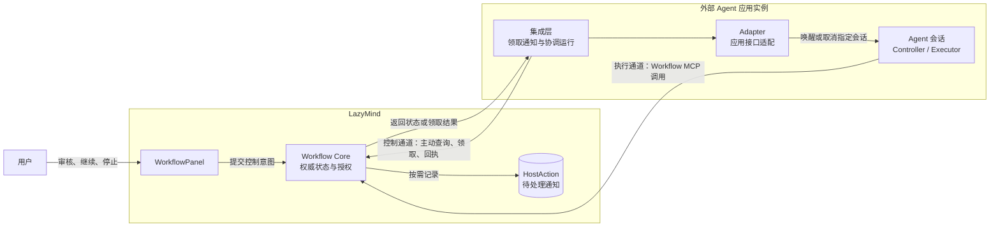

# 外部 Agent 与 Workflow 交互协议（草案）

> 状态：草案。本版定义参与方、通信方向、权威边界、Controller 绑定、HostAction 触发语义、执行分工与投递确认边界；消息字段和故障恢复机制留待后续章节。

## 1. 参与方

| 对象 | 职责 |
| --- | --- |
| 用户 | 通过 WorkflowPanel 提交审核、继续、停止等控制意图。 |
| Workflow Core | 保存权威状态，校验控制意图和执行请求，决定步骤授权。 |
| 外部 Agent 会话 | 作为 Controller 推进 Workflow；获得步骤授权时可作为 Executor。 |
| 外部 Agent 应用 | 管理 Agent 会话及其运行生命周期。 |
| 集成层与 Adapter | 运行在外部应用一侧，领取 Core 的控制通知，并调用应用接口操作指定会话。 |

图中的 HostAction 存在 Core 一侧。集成层主动向 Core 查询；Core 不直接向 Agent 会话推送消息。一个外部应用实例可以管理多个 Agent 会话，图中只画出其中一个。

## 2. 两条通信通道

| 通道 | 路径 | 内容 | 边界 |
| --- | --- | --- | --- |
| 执行通道 | Agent → Workflow MCP → Core | 读取状态、申请或认领步骤、发布产物、提交结果 | Core 最终授权；集成层不代理 MCP 调用。 |
| 控制通道 | Core 侧事件 → HostAction → 集成层 → Adapter → Agent 会话 | 唤醒或取消指定 Controller 会话 | 用户意图先在 Core 生效；内部执行完成也可触发通知；HostAction 不授予步骤执行权。 |

Controller 到达人工审核点时，按 Core 返回状态结束当前自动运行。被 HostAction 唤醒后，它重新读取 Core 状态，再通过执行通道推进 Workflow。

## 3. 权威边界

| 编号 | 规则 |
| --- | --- |
| A1 | 用户操作以 Core 的校验和持久化结果为准；外部 Agent 离线不影响 Core 中的状态变更。 |
| A2 | Core 是状态和步骤授权的唯一权威；集成层与 Adapter 不决定审核或执行许可。 |
| A3 | Workflow 控制不得误作用于同一 Agent 会话中的其他任务；取消当前运行前须确认其归属。 |
| A4 | 人工审核点由 Controller 在执行边界主动让出控制权；后续唤醒或明确停止使用 HostAction。 |

## 4. Controller 绑定

### 4.1 绑定标识

| 字段 | 含义 | 生命周期 |
| --- | --- | --- |
| Workflow run ID | Core 中的一次 Workflow 运行 | 整个 run 固定 |
| Provider | 外部 Agent 应用类型 | 绑定期间固定 |
| Connector ID | 已配对的外部应用接入点 | 跨应用进程重启保持稳定 |
| Driver session ID | 该应用内担任 Controller 的 Agent 会话 | 本版绑定期间固定 |
| Binding generation | 绑定版本，用于识别旧通知 | 建立绑定及停止、恢复等需要作废旧通知时递增 |

监听器的进程 ID 或本次启动的实例 ID 不是 Controller 绑定的一部分。同一个外部应用接入点可以管理多个 Agent 会话，但每个 Workflow run 同时只有一个绑定的 Controller 会话。

### 4.2 建立与保留

| 场景 | 规则 |
| --- | --- |
| `workflow.start` 创建 run | Core 创建 run；由已配对集成层根据外部应用中的真实会话身份提交绑定。MCP 请求中的自报身份不能单独作为绑定依据；Codex queue 阶段的明确例外见 §8。 |
| 尚未绑定 | Core 可返回 `binding_required`；不得向未确定的 Controller 自动投递 HostAction。 |
| 外部应用重启或暂时离线 | 保留绑定；不因进程变化而更换 Controller 会话。 |
| Controller 会话空闲 | 保留绑定，等待后续 HostAction 唤醒。 |
| Workflow Stop | Core 停止 run；绑定保留，用于准确取消、恢复和审计。 |
| Controller 会话不可恢复 | 不自动改绑到其他会话；自动唤醒不可用。 |

### 4.3 本版范围

- 不定义在新 Agent 会话中接管旧 Workflow run。
- 不定义跨外部应用转移 Controller。
- 不允许通过打开 WorkflowPanel 或读取 run 状态取得 Controller 绑定。

## 5. HostAction 触发语义

### 5.1 用途

| 类型 | 对外部应用的要求 | Controller 收到后 |
| --- | --- | --- |
| `continue` | 向已绑定的 Controller 会话投递一次唤醒输入。 | 重新读取 Core 状态，再按下表选择 MCP 操作。 |
| `cancel` | 在核对当前运行归属后，取消仍属于该 Workflow 的运行；没有此类运行时不取消其他任务。 | 不再按旧授权推进；Core 的停止已独立生效。 |

`continue` 表示“请回来查看最新状态”，不是“无条件开始下一步”。HostAction 不是步骤任务，也不包含执行授权。Core 只为已绑定外部 Controller、且确需外部应用采取动作的场景创建 HostAction。

| `continue` 内容 | Core 中是否已有指定执行 | Controller 醒来后的 MCP 路径 |
| --- | --- | --- |
| 无 `execution_id` | 没有为这次通知预先创建执行。 | 读取状态；在 Core 允许时选取可开始步骤，调用 `step.begin`。 |
| 有 `execution_id` | 已有该 ID 对应的一次具体执行尝试。 | 读取状态并调用 `step.claim(execution_id)`；按返回的 Executor 归属执行或观察，不再为该步骤调用 `step.begin`。 |

### 5.2 产生时机

| Core 侧事件 | HostAction | 条件与目的 |
| --- | --- | --- |
| `workflow.start` | 无 | Controller 已在当前会话中运行；启动后建立绑定即可。 |
| Agent 提交产物或完成外部执行，进入人工审核 | 无 | Controller 从该次 MCP 结果得知等待审核，并主动结束当前自动运行。 |
| 审核命令 `confirm` | 无 | Core 接受审核结果；该命令本身不要求继续执行。 |
| 审核命令 `confirm_and_continue` | 满足继续条件时发不带 `execution_id` 的 `continue`；否则无 | Core 先接受审核结果；允许开始下一步、没有活跃执行且已绑定时，唤醒 Controller，由其读取状态并 `step.begin`。 |
| 用户单独点击 Continue | 普通推进：不带 `execution_id` 的 `continue`；编辑后恢复：创建执行时带新 `execution_id`，无可推进步骤时不发 | Core 先校验并确定是否需要创建恢复执行；Controller 按通知中是否有 `execution_id` 选择 `step.begin` 或 `step.claim`。 |
| 用户 Retry / Rewind | `continue`，携带新建的 `execution_id` | Core 先确定目标步骤并创建新执行；Controller `step.claim` 该执行，按 Executor 归属执行或观察。 |
| 用户 Resume 已停止的 Workflow | 有新执行时为带 `execution_id` 的 `continue`；否则无 | Core 先解除停止；若找到可恢复或可开始的步骤，则创建执行并唤醒 Controller；若没有可推进步骤，则不唤醒。 |
| LazyMind 内部 Executor 完成 | `continue`，携带已有 `execution_id` | 需要外部 Controller 查看执行结果并决定后续推进时发出。 |
| 用户 Stop | `cancel` | Core 先停止 Workflow 并撤销执行授权；通知外部应用处理仍归属该 Workflow 的运行。 |
| 用户仅查看、编辑或保存产物 | 无 | 不要求 Controller 运行。 |

### 5.3 不变量

| 编号 | 规则 |
| --- | --- |
| H1 | Core 的状态变更与相应 HostAction 的创建应作为一次原子操作提交，避免状态已变而唤醒通知丢失。 |
| H2 | Core 在领取 HostAction 的同一事务中校验通知、绑定版本与当前控制状态，并随领取结果返回该状态；集成层在调用外部应用接口前复核通知仍有效。过期通知不得投递。 |
| H3 | `cancel` 的投递结果不决定 Stop 是否生效；Core 的停止先行生效。 |
| H4 | 不为 `awaiting_user` 单独创建“暂停”HostAction；正常等待由 Controller 在执行边界主动让出控制权。 |
| H5 | 外部应用若提供运行前拦截能力，排队的唤醒输入开始处理时须再次核对通知仍有效；不具备该能力的接入应声明限制。最终步骤授权始终由 Core 在 MCP 请求时校验。 |

## 6. Controller 与 Executor

| 角色 | 职责 | 边界 |
| --- | --- | --- |
| Controller | 读取 Core 状态，选择可推进步骤，调用 `step.begin`；对于已创建的执行调用 `step.claim`。 | 不自行决定审核结果或改写 Core 的执行归属。 |
| Executor | 按一次具体执行的步骤契约工作，发布产物并提交结果。 | 只有取得该执行的授权后才能提交；可与 Controller 是同一个外部 Agent。 |

| Core 返回的 Executor 归属 | 实际执行路径 | 外部 Controller 的行为 |
| --- | --- | --- |
| 外部 Agent | Core 返回步骤契约和 `execution_handle`；外部 Agent 执行并提交。 | 承担或安排这次执行，完成后读取最新状态。 |
| LazyMind 内部执行器 | Core 创建内部任务，由 LazyMind 执行；外部 Agent 不取得该步的执行授权。 | 让出执行并等待；内部执行结束后通过 HostAction 被唤醒，再查看结果。 |

普通继续由 Controller 调用 `step.begin` 创建执行；Retry、Rewind 等恢复操作由 Core 先创建执行，Controller 收到 `execution_id` 后调用 `step.claim`。两种入口均以 Core 返回的 Executor 归属决定后续路径。HostAction 只唤醒 Controller，不直接向 Executor 派发步骤。

## 7. HostAction 投递确认边界

### 7.1 领取与回执

| 阶段 | 集成层动作 | Core 记录 | 含义 |
| --- | --- | --- | --- |
| 待领取 | 无 | `pending` | HostAction 已持久化，尚无实例取得投递权。 |
| 领取 | 调用 `claim(action_id, instance_id)` | `dispatching` | Core 在事务内校验并授予临时投递权；不需要额外发送“已领取”回执。 |
| 投递 | Adapter 调用外部应用的会话接口 | 仍为 `dispatching` | 正在等待外部应用的受理结果。 |
| 结算 | 集成层向 Core 提交结果 | `accepted`、`failed` 或 `unknown` | 只结算外部应用侧的受理情况。 |

Core 持续记录每条 HostAction 的投递状态，但用户控制操作不等待 `accepted` 才在 Core 中生效。`claim` 防止多个集成层实例同时投递；它本身不是投递成功。

### 7.2 回执含义

| 结果 | 含义 | 不代表 |
| --- | --- | --- |
| `accepted` | 外部应用已接收发往目标会话的输入，或已受理针对该会话的取消操作。 | Agent 已开始运行、步骤已完成或取消已改变 Core 状态。 |
| `failed` | 可确定外部应用未接收本次投递。 | Workflow 本身失败。 |
| `unknown` | 投递已尝试，但无法确定外部应用是否接收。 | 可以安全地再次发送。 |

Workflow 是否推进、执行是否完成，只以 Core 中的步骤、产物和 run 状态为准，不通过 HostAction 回执推断。外部 Agent 无须另行发送“已执行 HostAction”的确认。

### 7.3 回执丢失与核对

| 不确定发生处 | 恢复时先查 | 处理 |
| --- | --- | --- |
| 外部应用可能已受理输入，但集成层未收到回复 | 外部应用中与 `action_id` 对应的持久化输入记录 | 找到接收证据则向 Core 补交 `accepted`；无可靠证据则保持 `unknown`，不得盲目重发。 |
| 集成层已提交 `accepted`，但未收到 Core 回复 | Core 中该 HostAction 的最新状态 | 已是 `accepted` 则结束；若是 `continue` 且状态仍不确定，再核对外部应用的输入证据。 |
| `cancel` 的处理结果不明 | Core 的停止状态及外部应用当前运行的归属 | 只对仍属于该 Workflow 的运行执行可重复的取消；不得取消后来开始的其他任务。 |

`dispatching` 的投递权过期，不能证明此前未送达；Core 将其视为 `unknown`。若外部应用不能按 `action_id` 提供持久化输入证据，本协议不承诺自动恢复结果不明的 `continue`。

### 7.4 内部标记与规则

| 内部字段 | 用途 | 协议边界 |
| --- | --- | --- |
| `consumed_at` | 标记通知已被后续 Workflow 推进或新的控制操作取代，避免旧通知再次起作用。 | 不作为 Agent 已阅读或按该通知执行的因果证明。 |

| 编号 | 规则 |
| --- | --- |
| D1 | HostAction 回执只覆盖外部应用对输入或取消请求的受理，不等待 Agent 推理或步骤完成。 |
| D2 | 结果不明的 `continue` 不得盲目重发；须先核对外部应用的持久化输入证据。 |
| D3 | Stop 由 Core 立即生效；`cancel` 的投递回执只反映外部应用侧的处理结果。 |
| D4 | 核对不确定投递时先读取 Core 的最新 Action 状态；对于未确认受理的 `continue`，再查询外部应用的输入证据。 |

## 8. Codex queue 阶段的能力降级

本节限定当前 Codex 桌面接入，不改变 DSH 的钩子与取消能力。

- 仅用桌面应用自带的 `codex queue` 投递 continue，涵盖恢复、审核后继续、Retry、Rewind 及内部执行完成通知。不连接或启动 App Server。
- 绑定在 `workflow.start` 的 MCP 处理内完成，优先使用宿主请求元数据中的 thread UUID。元数据缺失时，允许 Agent 从当前宿主环境读取真实 UUID 并传入 `driver_session_id`。这是 §4.2 的信任降级：格式校验不证明会话归属；不得猜测 ID，缺失时拒绝自动绑定。元数据与参数同时存在时以元数据为准。
- 启动绑定完成后直接返回最新状态，不产生首次绑定唤醒输入。创建后绑定失败需保留原 run ID 和幂等 key，重试同一 run。
- 不支持原生 turn 取消。Stop 在 Core 先行生效；cancel 通知明确以 failed 结算并说明宿主不支持中断，不得记录为 accepted。
- 人工审核由 MCP 指令、状态结果和唤醒 prompt 要求 Agent 主动结束当前 turn；不轮询等待、不自行审核、不继续下一步。最终 MCP 授权仍由 Core 校验。
- queue 无执行前钩子，已入队输入可能延后处理。Agent 须先读取最新状态；该能力限制按 H5 声明。
- queue 成功退出仅代表输入受理；回执的 native_event_seq 为 0。不能确定投递结果时保持 unknown，无持久化接收证据则不自动重发。
