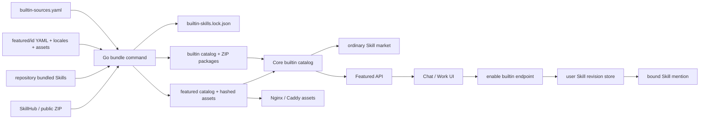
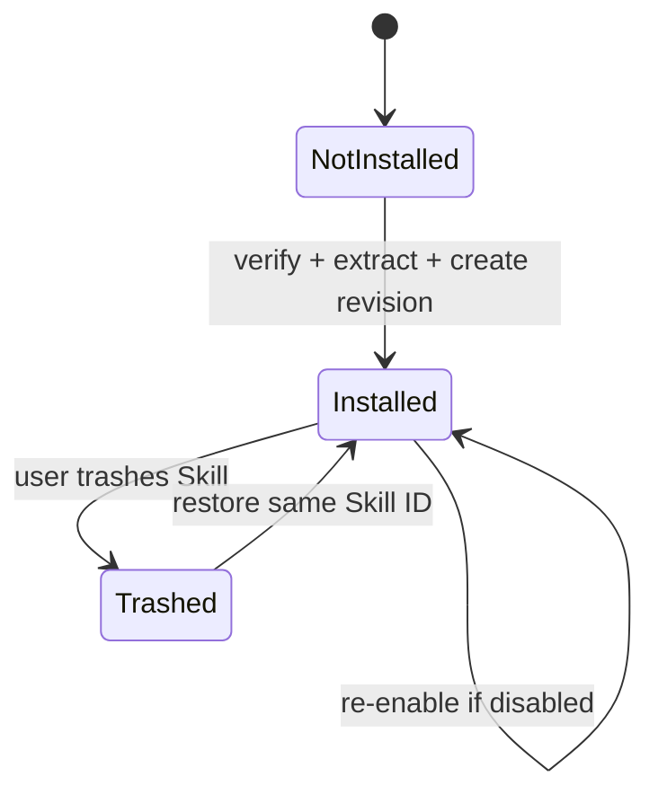

# ch/skill 合并后架构与功能审查

## 1. 审查快照

| 项目 | 值 |
| --- | --- |
| 仓库 | `https://github.com/chenhao0205/LazyRAG.git`；上游 `https://github.com/LazyAGI/LazyRAG.git` |
| 分支功能提交 | `ch/skill@aa4640da` |
| 合并目标 | `main@077d6dcd` |
| 原始功能范围 | 83 个文件，4906 行新增、1307 行删除 |
| 源码声明盘点 | 42 个非生成 Go/TS/JS 文件，387 个函数、类型、接口或组件声明；生成客户端另由 OpenAPI 管理 |

审查覆盖 `ch/skill` 的全部改动文件，以及它与 main 在 Skill 回收站、Knowledge Market、首页输入、Windows 安装器和错误目录上的交叉点。CI 是否配置成远端强制合并门禁无法从本地 checkout 证明，标记为 `[UNVERIFIED]`。

## 2. 技术栈与入口

| 层 | 技术 | 证据 |
| --- | --- | --- |
| 构建器、Core | Go 1.25 | [`backend/core/go.mod`](../backend/core/go.mod#L1-L25) |
| 内容配置 | YAML v3、严格 KnownFields | [`backend/core/showcase/catalog.go`](../backend/core/showcase/catalog.go#L300-L362) |
| 前端 | React、TypeScript、Vite、Vitest | [`frontend/package.json`](../frontend/package.json#L1-L25) |
| Compose 展示素材 | Nginx alias + 只读 runtime mount | [`frontend/default.conf.template`](../frontend/default.conf.template#L12-L22) [`docker-compose.yml`](../docker-compose.yml#L421-L443) |
| Native/desktop 展示素材 | Caddy + runtime resources | [`local/local-runtime-manager/frontend.go`](../local/local-runtime-manager/frontend.go#L308-L361) |
| Desktop 打包 | Bash、PowerShell、Electron Builder | [`desktop/scripts/build-darwin-arm64.sh`](../desktop/scripts/build-darwin-arm64.sh#L236-L259) [`desktop/scripts/build-windows-x64.ps1`](../desktop/scripts/build-windows-x64.ps1#L274-L351) |

### 命令与验证清单

| 命令 | 用途 | 证据 |
| --- | --- | --- |
| `make featured-check` | 只校验 Featured schema、locale 和素材 | [`Makefile`](../Makefile#L310-L313) |
| `make skills-build` | 解析链接、下载 ZIP、更新 lock 并编译两个 catalog | [`Makefile`](../Makefile#L315-L322) |
| `make skills-materialize` | frozen lock 离线物化发布产物 | [`Makefile`](../Makefile#L324-L333) |
| `go test ./...`（`backend/core`） | Core 全量测试 | [`Makefile`](../Makefile#L264-L284) |
| `pnpm typecheck` / `pnpm test` / `pnpm build` | 前端类型、测试和生产构建 | [`frontend/package.json`](../frontend/package.json#L6-L24) |
| `node --test scripts/desktop-build.test.mjs` | Desktop 构建契约 | [`desktop/scripts/desktop-build.test.mjs`](../desktop/scripts/desktop-build.test.mjs#L1-L130) |

## 3. 总体蓝图

依赖保持单向：配置和上游 ZIP 只进入构建器；运行时只读取已冻结 catalog/package；前端只读取 Core API 和哈希素材；个人 Skill 存储不反向修改发布 catalog。

## 4. 子系统一：下载、锁定与发布物化

`builtin-skill-bundle` 同时读取平台 `bundled_skills`、普通 URL 和已发布 Featured 的 `skill.source_url`，统一解析成 source spec。[输入模型](../backend/core/cmd/builtin-skill-bundle/main.go#L32-L75) SkillHub 页面被转换成下载 API；其他 HTTP(S) 地址按 ZIP 直链处理。[链接解析](../backend/core/cmd/builtin-skill-bundle/main.go#L351-L383)

构建输出有两个权威面：

- `builtin-skills.lock.json` 固定来源、版本、archive/tree SHA-256、大小和分发属性；
- runtime catalog/package 供 Core 按需读取，Featured catalog/assets 供 Showcase 与静态服务器读取。

frozen 模式验证已锁 ZIP，而不是重新相信上游；release 构建因此可以在缓存命中时离线完成。[frozen 流程](../backend/core/cmd/builtin-skill-bundle/main.go#L593-L638)

ZIP 只通过 `skillpackage.ReadZip` 解析，统一限制 512 个条目、32 MiB 单文件、128 MiB 解压总量，并拒绝绝对路径、路径穿越、反斜杠、重复路径和软链接。[安全解析](../backend/core/skillv2/skillpackage/package.go#L16-L109)

## 5. 子系统二：运行时按需安装

Core 启动时只加载 catalog 元数据；读取某个 package 时再校验 archive SHA-256、大小和 tree hash。[catalog 加载](../backend/core/skillv2/builtin/catalog.go#L80-L183) 普通列表只展示 `market_visible=true`，Featured-only package 因此不会形成第二个技能广场模型。[列表过滤](../backend/core/skillv2/handler/builtin.go#L23-L76)

安装状态机：

handler 优先返回现有安装，其次恢复回收站条目，最后读取 catalog ZIP 创建完整 revision；并发创建冲突后再次查询现有 ID，保证幂等。[安装实现](../backend/core/skillv2/handler/builtin.go#L78-L221)

## 6. 子系统三：Featured 配置与前端体验

每个 Featured 是自包含目录：`featured.yaml`、locale 和 assets。严格解析拒绝未知字段，校验 locale 的任务 ID/顺序/结果模板一致，并检查素材 MIME、尺寸、路径、引用和大小。[定义加载](../backend/core/showcase/catalog.go#L260-L362) [体验校验](../backend/core/showcase/catalog.go#L632-L735)

编译阶段把素材改名为 `<sha12>-<filename>`，生成稳定的 `/showcase-assets/<id>/<version>/...` URL。[素材编译](../backend/core/showcase/catalog.go#L210-L255) Core 在返回 Showcase 前再次验证 Featured 绑定的 builtin UID、版本、来源和 archive hash，并要求它保持 market hidden。[绑定验证](../backend/core/showcase/showcase.go#L152-L192)

前端依据入口模式过滤 `type`：快速问答传 `chat`，新建任务传 `work`；不存在额外滑块或 Skill 名称白名单。[Featured 过滤](../frontend/src/modules/showcase/FeaturedCases.tsx#L7-L50) 卡片主体进入试用，角落动作进入详情；详情页复用 tasks 数组支持单任务和多任务。[卡片](../frontend/src/modules/showcase/CaseCard.tsx#L20-L62) [详情](../frontend/src/modules/showcase/DetailPage.tsx#L139-L318)

进入试用后，`useFeaturedSkillBinding` 调用同一 builtin enable API，安装完成前阻止发送，成功后把个人 Skill ID 作为 mention 绑定，失败可重试。[绑定 Hook](../frontend/src/modules/showcase/useFeaturedSkillBinding.ts#L7-L46) 新对话页同时保留 main 的 Knowledge Market URL 预填能力，二者通过互斥 query 参数避免覆盖输入。[新对话接入](../frontend/src/modules/chat/pages/newChat/index.tsx#L86-L237)

## 7. 跨平台运行面

- Compose 把宿主 `skills/.runtime` 同时只读挂到 Core 和 Frontend；Nginx 直接服务 Featured assets。[Compose](../docker-compose.yml#L350-L443)
- Native Local 自动发现仓库 runtime，Caddy 服务同一路径。[Local runtime](../local/local-runtime-manager/frontend.go#L308-L361)
- macOS/Windows 构建在 runtime manifest 之前物化 Skill，manifest 记录 builtin/featured 文件校验和。[manifest](../desktop/scripts/write-runtime-manifest.mjs#L40-L124)
- Windows 合并结果同时保留离线 Skill 物化和 main 的延迟 Python runtime 安装阶段，两者没有覆盖关系。[Windows 构建](../desktop/scripts/build-windows-x64.ps1#L274-L407)

## 8. 合并审查与修复

本次解决 7 个文本冲突，并额外修复 3 个 Git 自动合并未标记的问题：

1. `go.mod` 同时保留 Featured 图片解析的 `x/image` 和 main 的 `x/sync`。
2. Skill Market 保留 main 的 URL 下载能力，但统一调用 `skillpackage.ReadZip`；删除重复 ZIP parser、旧默认测试文件生成器，并修复不存在的 `req` 引用。
3. builtin handler 删除重复的回收站恢复分支，保留“恢复 + 重新启用 + 幂等返回”语义。
4. Windows 同时保留离线 Skill 物化与延迟 Python runtime installer。
5. 新对话同时保留 Featured 自动安装绑定与 Knowledge Market 在线访问预填。
6. main 占用 `2002098` 后，`Invalid skill package` 迁移到 `2002294`；前端错误目录重新生成。
7. Core OpenAPI client 使用固定 7.20.0 Docker generator 重新生成，四个 API cache 均为 fresh。

Go 包图由编译器保证无循环；Showcase 前端文件不在检测到的 7 个既有前端 import cycle 中。现有 cycle 分布在 auth/request、ChatConfigs、PPT、Knowledge Table、Memory Skill API 和 Self Evolution，均不是 `ch/skill` 引入，本次不扩大修改。

## 9. 验证证据（2026-08-21）

- `make featured-check`：2 个 Featured 严格校验通过。
- `make skills-materialize`：frozen 模式生成 7 个 builtin package、2 个 Featured。
- 空缓存访问真实 SkillHub：高考 `1.0.0`、K12 `1.0.4` 下载成功，生成 lock 与提交的 lock 逐字节一致。
- Core `go test ./...`：全部通过。
- Local Runtime Manager `go test ./...`：全部通过。
- Desktop 构建契约：26/26 通过。
- Featured/ChatInput 定向前端测试：12/12 通过；`pnpm typecheck` 与 `pnpm build` 通过。
- 前端全量：227 通过、4 失败。失败属于 main 的 Writer anchor、TaskCenter 和 Skill Management 测试环境，与本分支文件无关。
- 新建临时 PostgreSQL 数据库启动真实 Core：health 通过；Showcase 返回 2 项，分别是 chat/4 tasks 与 work/3 tasks。
- 普通 builtin API 只返回 5 个市场可见 Skill；Featured-only 两项未泄漏。
- 高考 Skill 真实按需安装：生成 1 个 enabled Skill、9 个 revision entries；重复安装返回同一 ID。
- 真实 Nginx 下载封面：HTTP 200、`image/png`、1536×1024、SHA-256 与 catalog 完全一致。

当前持久化 `core` 数据库含兄弟分支 `ch/feishu` 的私有迁移 `20260820190000`，因此 `ch/skill + main` 按迁移安全规则拒绝直接使用该数据库。该状态不是 Skill 功能回归；在同一持久化库切换分支时必须合并对应迁移、使用独立开发库，或由用户明确授权重置。验收使用独立数据库完成，原 Core/Frontend 已恢复到 `ch/feishu` 镜像并保持 healthy。

## 10. 扩展指引与约束

实习生配置、字段说明、素材规范、真实验收和排错统一见 [`skills/PRODUCT_SKILLS_GUIDE.md`](../skills/PRODUCT_SKILLS_GUIDE.md)。普通 Skill 只编辑 `builtin-sources.yaml` 的 `skills`；Featured 只增加一个自包含目录并运行 `make skills-build`。不要手工编辑 lock hash、runtime catalog 或哈希素材 URL。

## 11. 可信度

| 结论 | 可信度 |
| --- | --- |
| 下载、锁定、ZIP 安全、按需安装 | 高：代码、全量测试、空缓存真实下载 |
| Featured schema、chat/work、任务和素材 | 高：严格校验、定向测试、真实 API/Nginx |
| macOS/Windows 产物集成 | 高（代码/契约测试）；Windows 实机完整安装 `[UNVERIFIED]` |
| 当前用户持久化 DB 的跨分支兼容性 | 高：真实启动失败与独立 DB 对照 |
| 远端 CI 是否强制阻塞合并 | `[UNVERIFIED]` |

## 12. 关键文件

- [`skills/builtin-sources.yaml`](../skills/builtin-sources.yaml)：普通外部链接和平台 bundled 清单。
- [`skills/builtin-skills.lock.json`](../skills/builtin-skills.lock.json)：发布锁文件。
- [`backend/core/cmd/builtin-skill-bundle/main.go`](../backend/core/cmd/builtin-skill-bundle/main.go)：下载与物化入口。
- [`backend/core/skillv2/skillpackage/package.go`](../backend/core/skillv2/skillpackage/package.go)：唯一 ZIP 安全解析器。
- [`backend/core/skillv2/builtin/catalog.go`](../backend/core/skillv2/builtin/catalog.go)：运行时 catalog 与 package 校验。
- [`backend/core/showcase/catalog.go`](../backend/core/showcase/catalog.go)：Featured 编译器。
- [`frontend/src/modules/showcase`](../frontend/src/modules/showcase)：统一展示组件。
