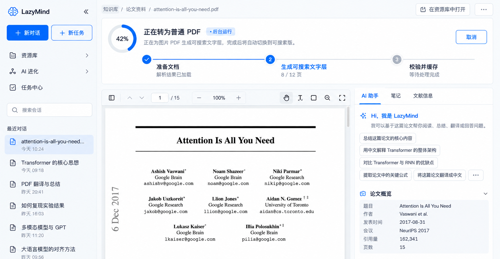
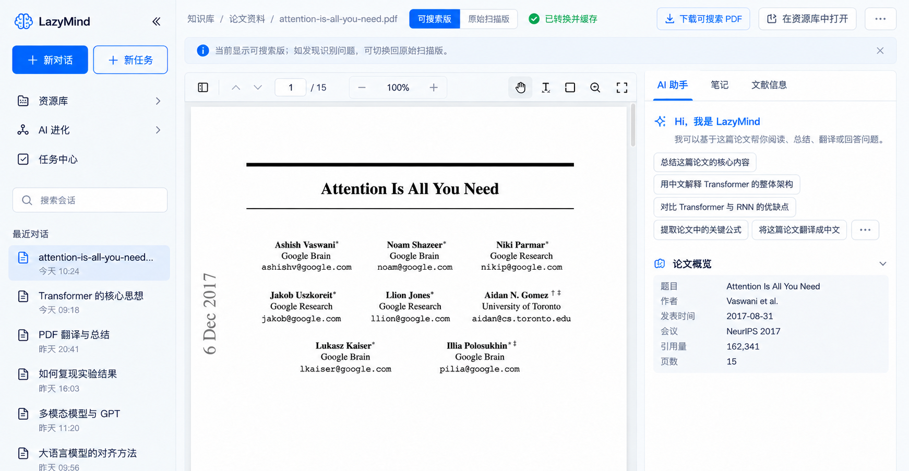
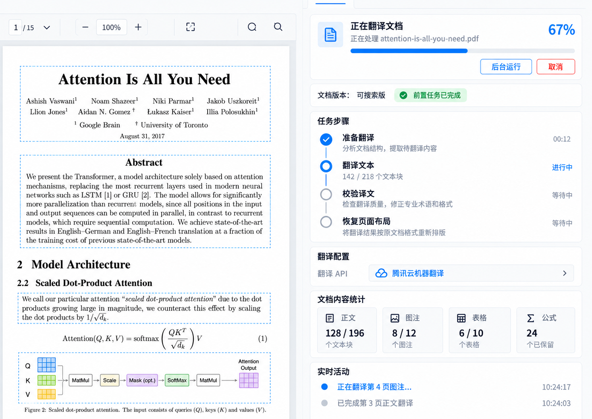
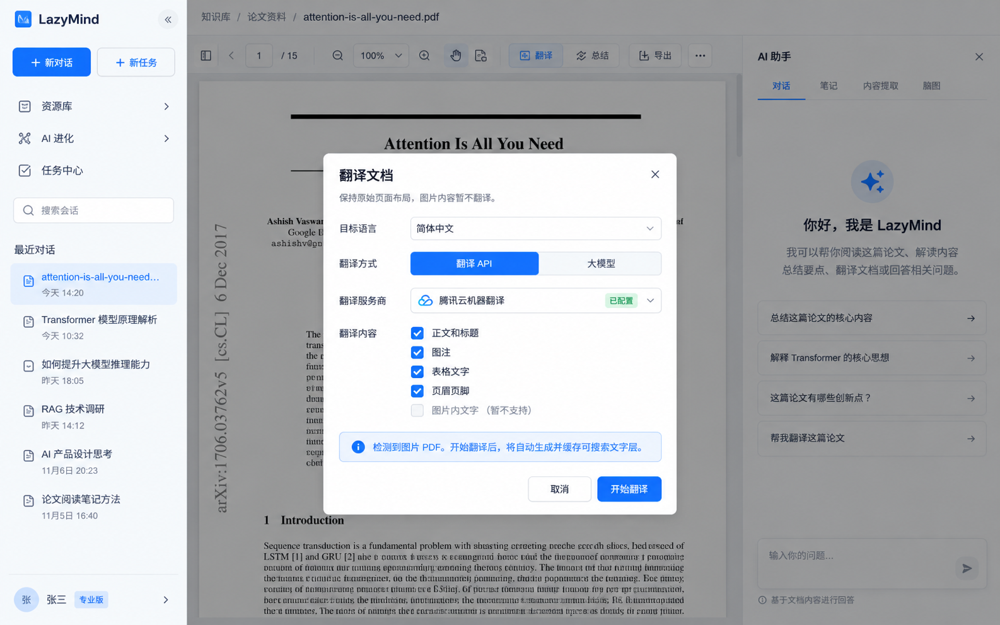
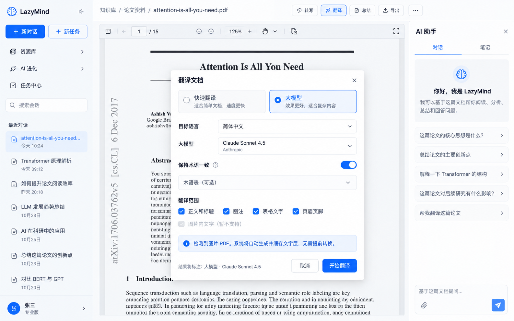
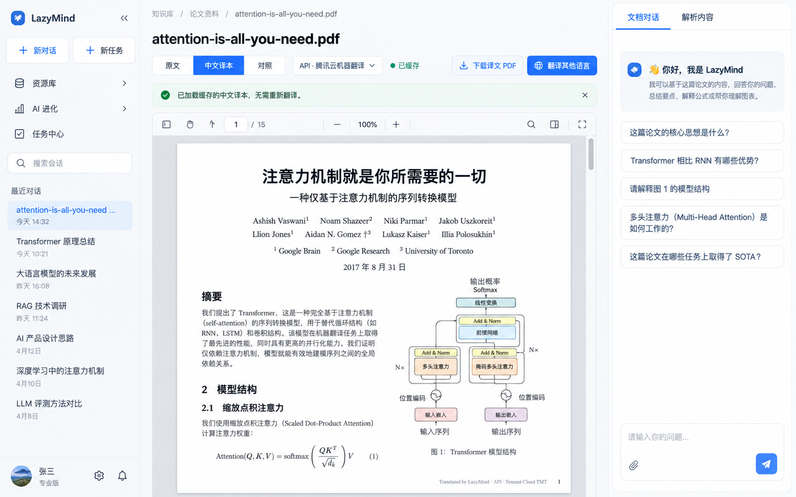
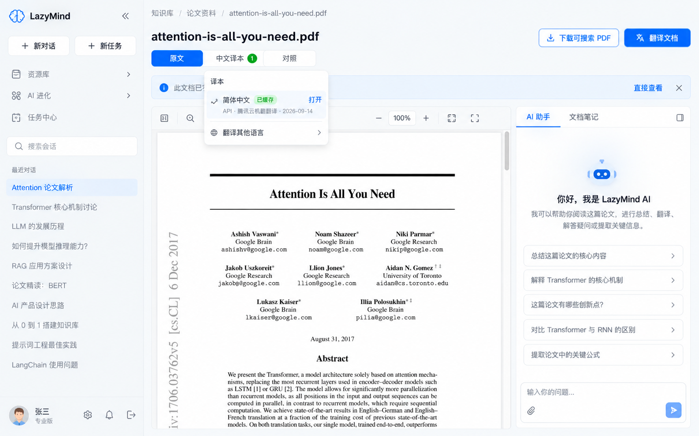
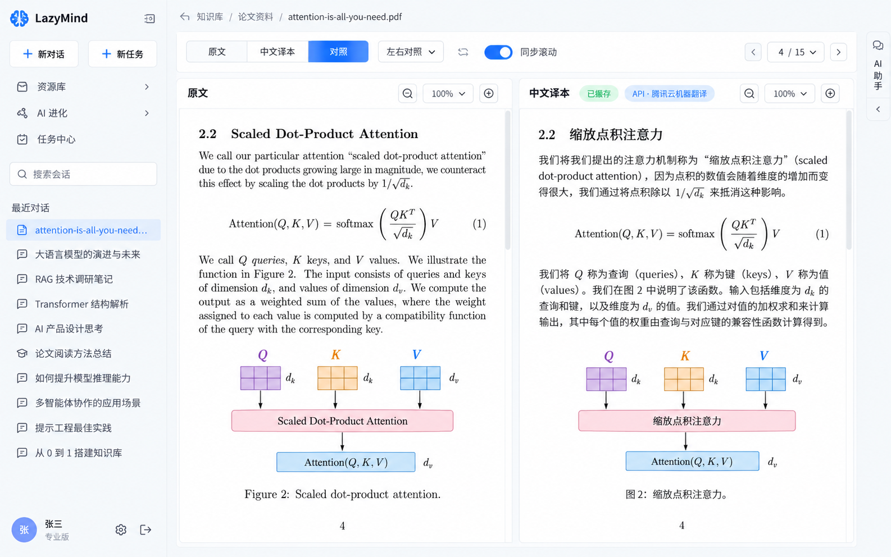
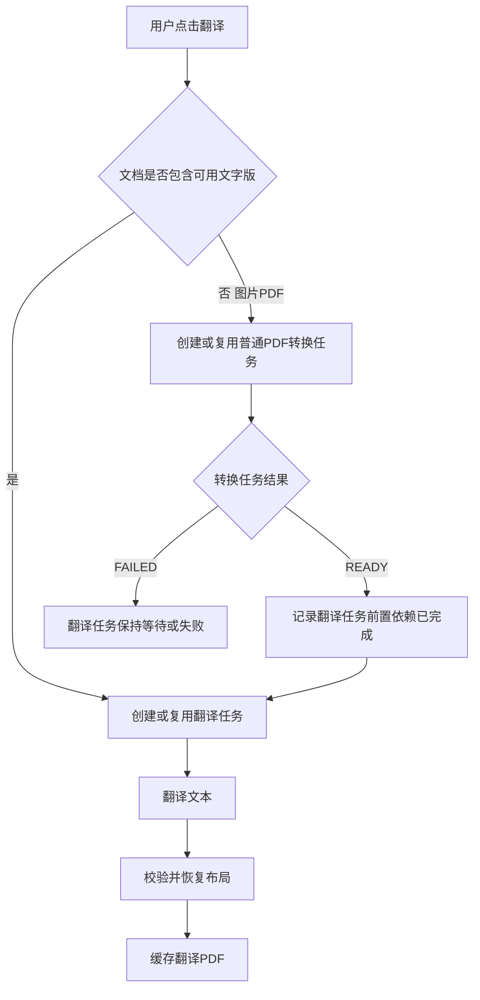

# LazyMind PDF 文字化与版式翻译方案

> 版本：1.1  
> 状态：可进入技术评审与任务拆分  
> 最后更新：2026-09-14

## 1. 方案结论

本方案包含两个彼此独立、可以分别创建和缓存的任务：

1. **图片 PDF 转为普通 PDF**：在不改变页面视觉内容的前提下，为扫描页面增加可搜索、可选择、可复制的文字层。
2. **PDF 翻译**：把已经完成 Reader 解析的 PDF 翻译为目标语言，并尽量保持原页面的块级布局、图片、图表、公式和上下标。

两者不是同一个任务，也不共用一条任务进度：

- 用户仅点击“转为普通 PDF”时，只运行转换任务，不触发翻译。
- 用户翻译原生文字 PDF 时，直接创建翻译任务。
- 用户翻译图片 PDF 时，系统先获取或创建“普通 PDF 转换任务”；转换产物可用后，再创建翻译任务。
- 转换任务及其产物独立缓存。即使后续翻译失败、取消或删除，已经生成的普通 PDF 仍然保留。

技术上不建议使用 Writer IR 作为 PDF 复刻的中间层。以 Reader 输出的 DocNode 为入口，在分块合并前生成并持久化 `Layout Manifest`，后续的普通 PDF 生成和翻译版式重建都以它为版式事实源。

## 2. 产品目标

### 2.1 图片 PDF 转为普通 PDF

- Reader 完成后，用户可以一键转换。
- 转换后的页面外观与原扫描页基本一致。
- 文字可以搜索、选择和复制。
- 转换成功后，原阅读区直接加载可搜索版，不增加左右分栏。
- 用户发现 OCR 或选择范围有问题时，可以切回“原始扫描版”。
- 同一文档、同一解析版本和同一渲染版本只转换一次。

### 2.2 PDF 翻译

- 支持原生文字 PDF、已经转换的图片 PDF 和混合 PDF。
- 用户可以选择翻译 API 或大模型。
- 首版翻译正文、标题、列表、脚注、图注、表注和表格单元格。
- 首版不翻译图片或图表内部的文字，不翻译公式、公式编号、代码、URL、DOI 和页码。
- 译文 PDF 保持原页数和主要块位置；字体、字号和行距允许自适应。
- 已有译本可以直接加载，支持“原文／译本”切换和“原文／译文”左右对照。
- Viewer、PDF 页脚和 PDF metadata 均标识译本来自 API 还是大模型。

### 2.3 非目标

- 不要求字符级或像素级对齐，只要求整体视觉和主要块位置接近。
- 不把 PDF 转成可自由重排的 Word 或 Writer 文档。
- 不要求首版精确识别扫描图片中的字体家族。
- 不把人工逐块校对作为转换或翻译的前置步骤。

## 3. 用户界面设计

### 3.1 两个独立入口

Reader 完成后，FileViewer 顶部根据文档能力显示两个独立操作：

- `转为普通 PDF`：仅在 `image_only` 或存在扫描页的 `mixed` PDF 上显示；原生文字 PDF 显示“已可搜索”或不显示此按钮。
- `翻译`：所有已完成 Reader 的 PDF 均可使用。

按钮状态由 `GET /documents/{id}/pdf-capabilities` 返回，不根据前端猜测。

### 3.2 转换任务固定显示在阅读器顶部

普通 PDF 转换属于文档级预处理任务，进度固定显示在 PDF 阅读器顶部。用户可以继续阅读或把任务转入后台。

转换任务只有三个阶段：

1. 准备文档
2. 生成可搜索文字层
3. 校验并缓存

它不包含“翻译文本”或“恢复页面布局”。



*图 1：图片 PDF 转为普通 PDF 是独立任务，进度固定在阅读器顶部。*

### 3.3 转换完成后直接替换当前展示

转换完成后不做分栏，因为原始扫描版与可搜索版视觉上几乎相同，分栏没有比较价值。

默认行为：

- 阅读器在当前页码和缩放比例下切换到“可搜索版”。
- 顶部显示 `可搜索版 / 原始扫描版` 分段控件。
- 默认选择“可搜索版”。
- 用户切换到“原始扫描版”时，保持当前页码、缩放和近似滚动位置。
- 下载菜单分别提供“下载原始 PDF”和“下载可搜索 PDF”。
- 文档重新打开后仍默认展示可搜索版，除非用户上次明确选择了原始扫描版。



*图 2：转换成功后，原阅读区直接显示可搜索版；用户可按需切回原始扫描版。*

建议 URL 状态：

```text
?document_view=searchable
?document_view=original_scan
```

这里的“原始扫描版”是上传时的图片 PDF。对于原生文字 PDF，不显示这组切换。

### 3.4 翻译任务固定显示在右侧任务面板

翻译过程涉及 Provider、译文校验、块统计和局部 warning，更适合固定放在右侧任务面板。整个产品中不再使用顶部大任务条展示翻译进度。

翻译任务阶段固定为：

1. 准备翻译
2. 翻译文本
3. 校验译文
4. 恢复页面布局

如果当前文档最初是图片 PDF，面板只显示一条前置依赖状态，例如“文档版本：可搜索版 · 前置任务已完成”；不得把“生成可搜索文字层”混入翻译任务步骤。



*图 3：PDF 翻译是独立任务，进度和配置统一显示在右侧。*

### 3.5 翻译参数

用户点击“翻译”后选择目标语言和翻译方式。参数写入译本缓存键。



*图 4：翻译 API 参数。*



*图 5：大模型翻译参数。*

### 3.6 已有译本的入口

文档重新打开时，前端先查询译本列表。存在 `READY` 译本后，顶部显示：

- `原文`
- `中文译本 1`
- `对照`
- 译本版本下拉

版本项展示目标语言、API/LLM、Provider/模型、生成时间和 warning 数量。



*图 6：缓存译本可以直接加载，无需重新翻译。*



*图 7：重新进入文档后，可从译本下拉中选择历史版本。*

### 3.7 原文和译文的两种阅读方式

翻译结果与原文内容不同，因此提供两种阅读方式：

- **切换模式**：原文或译文占据完整阅读区。切换时保持页码、缩放和滚动锚点。
- **对照模式**：原文和译文左右并排；窄屏自动改为上下布局。两侧按 `page_no` 同步翻页，可选同步缩放和滚动。



*图 8：左右对照只用于原文与译文，不用于原始扫描版与可搜索版。*

建议 URL 状态：

```text
?view=original
?view=translated&translation_id=tr_xxx
?view=compare&translation_id=tr_xxx&sync_scroll=1
```

## 4. 统一任务模型

### 4.1 转换任务

```text
SEARCHABLE_PDF
  PREPARING
  WRITING_TEXT_LAYER
  VERIFYING
  READY
```

输入：

- `document_id`
- `source_fingerprint`
- `parse_fingerprint`
- `layout_manifest_key`
- `searchable_renderer_version`
- `font_pack_version`

输出：`SEARCHABLE_PDF` Artifact。

### 4.2 翻译任务

```text
TRANSLATION_PDF
  PREPARING
  TRANSLATING
  VALIDATING
  RENDERING
  VERIFYING
  READY
```

输入：

- `document_id`
- `layout_manifest_key`
- `source_artifact_id`
- 目标语言
- Provider 和模型/引擎
- prompt、术语表和排版选项

输出：块级译文集合与 `TRANSLATION_PDF` Artifact。

### 4.3 图片 PDF 直接点击翻译



关键约束：

- `SEARCHABLE_PDF` 和 `TRANSLATION_PDF` 是两个 Job、两个 Artifact、两个缓存键。
- 翻译任务通过 `depends_on_job_id` 或 `source_artifact_id` 依赖转换结果。
- 取消翻译不取消已经完成的转换任务。
- 取消尚未完成的前置转换时，只在没有其他消费者的情况下允许取消底层任务。
- 转换失败时不得偷偷改用 OCR 临时文本继续翻译；应显示明确错误并允许重试或更换 Reader。
- 翻译文本直接读取 `Layout Manifest`，不从可搜索 PDF 再抽取一遍文字。可搜索 PDF 是用户产物和任务依赖，不是第二份文本事实源。

## 5. Reader 输出与 Layout Manifest

### 5.1 为什么不直接使用 Writer IR

Writer IR 适合语义编辑和流式排版，而该需求需要保留 PDF 的页面尺寸、旋转、绝对 bbox、遮罩范围、图片和公式对象。`DocNode → Writer IR → PDF` 容易重新分页并丢失绝对布局信息。

建议链路：

```text
MinerU / PaddleOCR / 原生 PDF 提取
                ↓
             DocNode
                ↓
        Layout Adapter
                ↓
       Layout Manifest v1
          ↙             ↘
Searchable Renderer   Translation Renderer
```

### 5.2 持久化时机

`Layout Manifest` 必须在 Reader 完成后、检索分块合并前保存。现有后处理可能合并 bbox，最终检索 chunk 不适合作为 PDF 重建来源。

### 5.3 建议结构

```json
{
  "document_id": "doc_xxx",
  "source_fingerprint": "sha256:...",
  "parser": { "name": "mineru", "version": "..." },
  "pages": [
    {
      "page_no": 1,
      "width_pt": 595.28,
      "height_pt": 841.89,
      "rotation": 0,
      "coord_space": "top-left-pixel",
      "image_dpi": 200,
      "blocks": [
        {
          "id": "p1-b12",
          "type": "paragraph",
          "bbox": [72, 118, 520, 202],
          "text": "...",
          "reading_order": 12,
          "confidence": 0.96,
          "lines": [
            {
              "bbox": [72, 118, 515, 139],
              "spans": [
                {
                  "text": "...",
                  "bbox": [72, 118, 180, 139],
                  "style": {
                    "font_family": null,
                    "font_size_pt": 10.5,
                    "bold": false,
                    "italic": false,
                    "script": "normal"
                  }
                }
              ]
            }
          ],
          "relations": { "caption_of": null, "continues": null }
        }
      ]
    }
  ]
}
```

坐标必须同时保存坐标系、页面像素尺寸、DPI、旋转和 PDF point 尺寸，禁止只保存裸 bbox。

## 6. 字体和字号推断

bbox 可以支撑“大致块对齐”，但无法独立恢复精确字体。

| 属性 | 图片 PDF | 原生文字 PDF |
| --- | --- | --- |
| 字号 | 由 line bbox 高度、DPI、基线和字体测量估算 | 直接读取 font size |
| 字体家族 | 只分类为衬线、无衬线、等宽、数学字体 | 读取 font name，缺失时 fallback |
| 粗体/斜体 | 根据字形估算 | 读取 font flags |
| 上下标 | 通过 span 相对基线和高度推断 | 读取 span 位置和字号 |
| 行距/对齐 | 根据相邻 line bbox 推断 | 读取并结合 bbox 校验 |

MinerU 适配器应尽量保留 line/span。PaddleOCR 路径需要补齐行粒度 bbox、reading order、置信度和样式提示。

## 7. 普通 PDF 生成算法

1. 判定文档为 `image_only`、`native_text` 或 `mixed`。
2. 保留原 PDF 页面为视觉底图，不做 JPEG 二次压缩。
3. 把 line/span bbox 统一转换为 PDF 左下角 point 坐标。
4. 优先逐行写入不可见文字；仅在线信息缺失时退化为块级文字层。
5. 字号初值可用 `line_height × 0.72～0.86`，再依据字体实际测量宽度做二分修正。
6. 嵌入 ToUnicode 映射，保证搜索、复制和粘贴。
7. 按 reading order 写入文字对象。
8. 校验页数、页面尺寸、旋转、搜索召回和视觉像素差。
9. 登记不可变 Artifact，并把 Viewer 默认版本切换为可搜索版。

混合 PDF 只给缺少有效文字层的页面补文字层，避免覆盖已有原生文本对象。

## 8. 翻译处理

### 8.1 翻译范围

| 内容类型 | 默认行为 |
| --- | --- |
| 标题、正文、列表、脚注 | 翻译 |
| 图注、表注 | 翻译，并保留 `caption_of` 关系 |
| 表格单元格 | 按单元格翻译，保持行列结构 |
| 公式、公式编号 | 保留原对象，不翻译 |
| 图片和图表内部文字 | 首版不翻译 |
| 代码、URL、DOI、页码 | 不翻译 |

### 8.2 Provider

统一抽象 `DocumentTranslator`：

- 翻译 API：首版复用腾讯云机器翻译，按字符限制批处理，支持术语表、限流和退避重试。
- 大模型：使用结构化 `block_id → translated_text` 输出，允许章节上下文和术语一致性提示。

### 8.3 安全翻译流水线

1. 筛选可翻译块并按章节和 Provider 上限组批。
2. 把公式、引用、URL、数字单位等替换为不可改写占位符。
3. 调用 Provider，并按 block ID 恢复结果。
4. 恢复占位符，校验公式数、引用数、关键数字、块数和空译文。
5. 失败块重试；仍失败则保留原文并记录 warning。
6. 先写块级译文缓存，再进入 PDF 渲染。

## 9. 翻译版式重建

翻译 PDF 采用“原页面背景保留 + 文字区域局部重绘”：

1. 图片、图表、公式和装饰元素保持原样。
2. 为确认可翻译的文字块生成安全遮罩。
3. 纯色背景直接填充；复杂背景执行局部修复；不可靠时使用浅色半透明底作为降级。
4. 以原 bbox 为首选排版容器。
5. 依次尝试正常换行、微调字距/行距、缩小字号、扩展到已检测空白。
6. 不允许静默裁切。
7. 达到最小字号仍溢出时，保留原文并附加译文，记录 `LAYOUT_REVIEW_RECOMMENDED`。

建议边界：

| 顺序 | 策略 | 边界 |
| --- | --- | --- |
| 1 | 正常换行 | 不越过块宽 |
| 2 | 调整字距、行距 | 字距不低于 -3%，行距不低于 0.92 倍 |
| 3 | 缩小字号 | 不低于原字号的 72%，同时满足可读下限 |
| 4 | 扩展 bbox | 只能进入已检测空白 |
| 5 | 降级呈现 | 保留原文并显示译文附注 |

## 10. 缓存设计

### 10.1 四层缓存

| 层级 | 内容 | 失效条件 |
| --- | --- | --- |
| L0 | Layout Manifest | 源文件、解析参数、Parser 或 schema 变化 |
| L1 | Searchable PDF | L0、文字层 Renderer 或字体包变化 |
| L2 | 块级译文 | 原块、语言、Provider、模型、Prompt 或术语表变化 |
| L3 | Translation PDF | L0、L2、版式 Renderer 或字体包变化 |

```text
layout_key = sha256(
  source_fingerprint,
  parse_fingerprint,
  parser_version,
  manifest_schema_version
)

searchable_key = sha256(
  layout_key,
  searchable_renderer_version,
  font_pack_version
)

translation_text_key = sha256(
  source_block_hash,
  source_language,
  target_language,
  provider,
  model_or_engine,
  prompt_version,
  glossary_hash
)

translation_pdf_key = sha256(
  layout_key,
  translation_set_hash,
  layout_renderer_version,
  font_pack_version,
  render_options
)
```

### 10.2 幂等和并发

- 对 `(tenant_id, document_id, job_kind, cache_key)` 建唯一约束。
- 创建任务使用 upsert：`READY` 直接返回 Artifact，`RUNNING` 返回现有 Job，只有 `MISS` 创建新任务。
- Job 使用 lease 和 heartbeat，支持 worker 接管。
- Artifact 不原地覆盖；新 Renderer 版本生成新 Artifact。
- 内容哈希不是授权凭据，下载时仍须校验租户与文档权限。

## 11. 数据模型

### 11.1 表结构

| 表 | 关键字段 | 用途 |
| --- | --- | --- |
| `document_layout_manifests` | document_id, revision, layout_key, uri, parser, schema_version | Reader 版式事实源 |
| `document_render_jobs` | id, document_id, kind, cache_key, status, stage, progress, depends_on_job_id | 转换/翻译任务及依赖 |
| `document_artifacts` | id, document_id, kind, cache_key, uri, provenance, warning_count | 可加载、可下载产物 |
| `document_translation_sets` | id, target_lang, provider, model, glossary_hash, status | 一个译本版本 |
| `document_block_translations` | set_id, block_id, source_hash, translated_text, validation | 块级缓存和局部重试 |
| `document_view_preferences` | user_id, document_id, preferred_source_view | 记住可搜索版/原始扫描版偏好 |

`document_render_jobs.kind` 至少包括：

```text
SEARCHABLE_PDF
TRANSLATION_PDF
```

二者不能用同一个 kind 或通过 stage 伪装成同一个任务。

## 12. 后端接口

| 方法与路径 | 用途 |
| --- | --- |
| `GET /documents/{id}/pdf-capabilities` | 查询 PDF 类型、Reader 状态、转换和译本缓存摘要 |
| `POST /documents/{id}/artifacts/searchable-pdf` | 创建或复用普通 PDF 转换任务 |
| `GET /documents/{id}/source-versions` | 返回原始扫描版和可搜索版 |
| `PUT /documents/{id}/view-preference` | 保存用户默认查看版本 |
| `POST /documents/{id}/translations` | 创建或复用翻译任务；必要时返回前置转换任务 |
| `GET /documents/{id}/translations` | 列出缓存译本 |
| `GET /render-jobs/{job_id}` | 查询任务状态、阶段、依赖和 warning |
| `GET /artifacts/{artifact_id}/download` | 权限校验后的预签名下载 |
| `POST /translations/{id}/rerender` | 复用译文，仅重新排版 |

### 12.1 创建图片 PDF 翻译的响应示例

当前没有可搜索版时：

```json
{
  "cache_status": "miss",
  "prerequisite": {
    "kind": "SEARCHABLE_PDF",
    "job_id": "job_searchable_1",
    "status": "RUNNING"
  },
  "translation_job": {
    "id": "job_translation_1",
    "status": "WAITING_DEPENDENCY",
    "depends_on_job_id": "job_searchable_1"
  }
}
```

已有可搜索版时：

```json
{
  "cache_status": "miss",
  "prerequisite": {
    "kind": "SEARCHABLE_PDF",
    "artifact_id": "artifact_searchable_1",
    "status": "READY",
    "cache_status": "hit"
  },
  "translation_job": {
    "id": "job_translation_1",
    "status": "RUNNING",
    "source_artifact_id": "artifact_searchable_1"
  }
}
```

## 13. 前端状态规则

| 状态 | 主阅读区 | 顶部操作 | 右侧任务面板 |
| --- | --- | --- | --- |
| 图片 PDF，未转换 | 原始扫描版 | 转为普通 PDF、翻译 | 常规 AI 面板 |
| 转换进行中 | 原始扫描版 | 顶部显示转换进度 | 常规 AI 面板 |
| 转换完成 | 默认可搜索版 | 可搜索版/原始扫描版切换 | 常规 AI 面板 |
| 翻译等待转换 | 当前文档版本 | 顶部显示独立转换任务 | 翻译任务显示等待前置依赖 |
| 翻译进行中 | 当前文档版本 | 不显示翻译顶部进度 | 右侧显示翻译进度 |
| 翻译完成 | 保持当前视图 | 原文/译本/对照 + 版本下拉 | 显示产物和 warning 摘要 |

## 14. 什么时候需要用户手动处理文本块

默认不阻断整篇生成。只有系统无法在“语义不丢失”和“版式不破坏”之间安全选择时，才建议用户处理。

| 情况 | 系统先处理 | 是否阻断 |
| --- | --- | --- |
| OCR 低置信度 | OCR 重试、拼写纠错、邻行合并 | 否，默认保留 OCR 结果或原图 |
| 图注和图片文字难区分 | 结合位置、caption 关系和语义分类 | 通常不阻断 |
| 译文无法放入最小字号 | 换行、字距、字号、空白扩展 | 不阻断，保留原文并附译文 |
| 公式、数字、引用校验失败 | 占位保护并重试 Provider | 仅阻断该块 |
| 复杂背景无法安全擦除 | 局部修复或浅色底覆盖 | 不阻断 |
| 阅读顺序严重错误 | 版面模型重排 | 必要时让用户调整少量块 |

人工检查器只列出 warning 块，允许修改文本、块类型、是否翻译、bbox 和 overflow policy。修改以 patch 保存，不直接覆盖原始 Layout Manifest；重做时只重译或重绘受影响页面。

## 15. 错误处理

| 错误码 | 前端处理 |
| --- | --- |
| `READER_NOT_READY` | 禁用按钮并显示解析进度 |
| `LAYOUT_MANIFEST_INVALID` | 提示重新解析并保留诊断 ID |
| `SEARCHABLE_PDF_FAILED` | 原始扫描版仍可阅读；翻译任务保持等待或失败 |
| `PROVIDER_UNAVAILABLE` | 允许更换 Provider 或稍后重试 |
| `TRANSLATION_QUOTA_EXCEEDED` | 显示额度问题，不自动切换到可能收费的 Provider |
| `LAYOUT_REVIEW_RECOMMENDED` | 产物可用，显示 warning 入口 |

## 16. 安全和可观测性

- 外部翻译前明确展示 Provider；管理员可禁用外发。
- 对象存储使用私有桶和短期预签名 URL。
- Artifact 缓存按租户隔离。
- 日志不记录完整正文和密钥。
- 记录 Job 耗时、页处理耗时、Provider latency、字符/token、费用、cache hit ratio、warning rate 和 fallback rate。
- 全链路携带 `document_id`、`job_id`、`artifact_id` 和 `translation_set_id`。

## 17. 工程落地点

| 模块 | 改造内容 |
| --- | --- |
| `algorithm/lazyllm/lazyllm/tools/rag/readers/ocrReader/ocr_ir.py` | 定义 Layout Manifest DTO、坐标和类型枚举 |
| `mineru_pdf_reader.py` | 在合并前导出 page/block/line/span、尺寸、旋转、关系和置信度 |
| `paddleocr_pdf_reader.py` | 补 line/span bbox、reading order 和 style_hint |
| `backend/core` | 新增 layout、documentrender、documenttranslation 服务和 ORM |
| `backend/core/translation` | 抽象 Provider，复用腾讯实现，增加结构化 LLM Translator |
| `backend/core/routes.go` | 注册 capability、source version、artifact、job 和 translation API |
| `frontend/.../FileViewer` | 增加两个独立按钮、两类任务 UI、来源版本切换和译本阅读模式 |
| Worker/对象存储 | 长任务、租约、重试、Artifact 保存和清理 |

## 18. 实施里程碑

### M1 版式基础

- 冻结 Layout Manifest v1。
- 完成 MinerU、PaddleOCR 和原生 PDF 适配。
- 建立坐标、旋转和阅读顺序黄金样例。

### M2 图片 PDF 转普通 PDF

- 实现 `SEARCHABLE_PDF` 独立任务和缓存。
- 实现透明文字层、ToUnicode 和质量校验。
- 实现顶部转换任务条。
- 转换完成后默认替换阅读区，并支持切回原始扫描版。

### M3 API 翻译

- 抽象 DocumentTranslator。
- 接入腾讯翻译、块级缓存、占位保护和校验。
- 实现独立 `TRANSLATION_PDF` 任务及图片 PDF 前置依赖。
- 翻译进度统一进入右侧面板。

### M4 大模型和双语阅读

- 增加结构化 LLM Provider。
- 增加译本列表、版本切换、原译切换和左右对照。
- 增加 UI、页脚和 metadata 来源标识。

### M5 复杂版式和人工检查

- 优化双栏、表格、复杂背景和长译文溢出。
- 实现 warning 块检查器和局部重绘。

## 19. 测试与验收

测试集至少覆盖单栏论文、双栏论文、公式密集教材、表格报告、扫描书籍、旋转页、混合原生/扫描页、中英混排，以及 MinerU/PaddleOCR 两条路径。

首版验收门槛：

- 可搜索版与原 PDF 页数、页面尺寸和旋转完全一致。
- 转换后 Viewer 自动加载可搜索版，且可无损切回原始扫描版。
- 原始扫描版与可搜索版不出现左右分栏。
- 转换和翻译拥有独立 Job、状态、缓存键、进度 UI 和 Artifact。
- 图片 PDF 翻译必须等待可搜索版前置任务完成，并能命中已有转换缓存。
- 取消翻译不会删除已完成的可搜索版。
- 翻译产物保留所有图片和公式区域，页数与原文一致。
- 所有文本溢出和降级都有 warning，不允许静默裁切。
- 同一缓存键的并发请求只产生一个任务。
- 重新打开文档后能直接加载可搜索版和已有译本。
- API/LLM 来源在 Viewer、PDF 页脚和 metadata 中一致。

## 20. 最终决策清单

| 决策项 | 结论 |
| --- | --- |
| 中间表示 | DocNode → Layout Manifest，不走 Writer IR |
| 图片 PDF 普通化 | 原页面底图 + 不可见可搜索文字层 |
| 转换与翻译 | 两个独立任务、Artifact 和缓存键 |
| 图片 PDF 直接翻译 | 先创建/复用普通 PDF 转换任务，完成后启动翻译 |
| 转换后阅读 | 原阅读区默认加载可搜索版，不分栏 |
| 查看原扫描件 | 顶部“可搜索版/原始扫描版”切换 |
| 翻译过程位置 | 固定显示在右侧任务面板 |
| 转换过程位置 | 固定显示在阅读器顶部任务条 |
| 翻译输入 | 读取 Layout Manifest，不反抽可搜索 PDF |
| 翻译范围 | 正文、标题、图注、表格文字；不翻图片内部文字和公式 |
| 译本阅读 | 原译切换或左右对照 |
| 人工处理 | 只处理不安全或不可判定块；默认可保留原文继续生成 |

