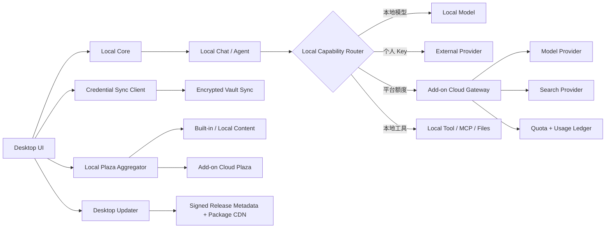

# LazyMind Desktop + Add-on Cloud 可执行改造计划

> 状态：重新规划，替代本文件此前全部方案。  
> 产品目标：Desktop 是完整 LazyMind 主体；Add-on Cloud 是与现有 Core/知识库/Agent 后端解耦的公共能力服务。  
> 容量目标：4 台双路 28 核 Xeon、每台 1024 GB 内存，支持 2000 名在线 Desktop 用户，并以 2000 条同时进行的模型/搜索流式请求作为网关压测与上线目标。  
> 非目标：本计划不改造企业私域的 Docker Compose + 网页端产品，不把 Desktop 的知识库、任务、Agent、Artifact 或聊天历史搬到云端。

---

## 1. 最终产品定义

LazyMind Desktop 始终运行完整 Local Runtime。登录前后，执行位置和业务数据位置都不改变：

```text
未登录 Desktop
  -> Local Runtime
  -> 本地知识库、Agent、任务、Artifact、UI SSE
  -> 本地模型或用户个人 Key

已登录 Desktop
  -> 仍然是同一个 Local Runtime
  -> 增加加密配置同步、平台模型、平台搜索、额度和账单
  -> Agent、工具循环、检索、任务状态和 UI SSE仍在本地
```

Add-on Cloud 不作为 LazyMind 主体后端，不接入现有 Core 业务数据库，也不提供云知识库或云 Agent。它只提供：

- 个人账号和设备；
- 端到端加密的用户配置/密钥备份同步；
- 模型目录和搜索能力目录；
- 平台大账号 Model Router；
- 平台 Search Router；
- 可选的少量无状态 Hosted Tool；
- 配额、预授权、计量、计费和账单；
- Desktop 版本检查、自动更新、公告，以及知识、Skill、Plugin 等公共广场内容的分发。

它明确不提供：

- 企业租户、组织、角色、用户组、邀请和分享；
- Core 知识库、数据集、任务、Chat history 和 Artifact；
- Agent 状态机、Plugin 工作流和本地工具循环；
- 文档解析、Milvus、OpenSearch 和 Evo；
- 用户原始本地文件和本地知识库同步；
- 平台长期 API Key 下发。

服务端可以为了复用账号表而内部使用固定 `platform_tenant_id`，但公共 API、Token 和 UI 均不得出现租户选择。所有公众用户数据以 `user_id` 和 `device_id` 隔离。

---

## 2. 总体架构



系统存在两类完全不同的流：

```text
本地 UI SSE
  Desktop UI -> Local Core -> Local Agent
  生命周期覆盖完整 Agent，永远不进入云端

云能力 Streaming
  Local Agent -> Add-on Cloud -> Model/Search Provider
  生命周期只覆盖当前一次模型或搜索调用
```

当模型返回 `tool_calls` 时：

1. Add-on Cloud 只原样或标准化转发 `tool_calls` 增量；
2. Local Agent 累积完整参数；
3. Local Agent 根据工具声明选择本地工具或云 Hosted Tool；
4. 工具结果回到 Local Agent；
5. Local Agent 发起下一次独立模型请求。

Add-on Cloud 不知道该请求是 Agent 的第几轮，也不保存 Agent 上下文状态。

公共广场是第三类、非执行流：云端只托管公开内容的元数据和签名包，Desktop 下载后交给 Local Runtime 安装、索引和执行。广场下载不改变“所有执行均在 Desktop 本地”的边界。

---

## 3. Desktop 侧改造

## 3.1 单一安装包和登录状态

macOS 和 Windows 各维护一个标准 Desktop 安装包，始终包含：

- Electron Shell；
- Desktop Frontend；
- Local Runtime Manager；
- Local Proxy、Auth、Core、Scan、File Watcher；
- SQLite、Milvus Lite 和本地 segment store；
- Doc、Parse、Chat、Agent 和可选 Evo；
- Python/Node 运行时和 Runtime Manifest。

启动流程保持本地优先：

```text
Electron 启动
  -> 启动 Local Runtime
  -> 加载包内 Frontend
  -> 恢复本地管理员会话
  -> 检查系统钥匙串是否存在 Add-on Cloud Refresh Token
  -> 有 Token：异步刷新公众账号和云能力
  -> 无 Token/刷新失败：继续纯本地使用
```

登录和退出不能重启 Local Runtime，不能删除或迁移本地数据，也不能中断正在运行的本地 Agent。

## 3.2 独立 Public API Client

现有业务请求继续固定访问 Local Proxy。新增独立 Public API Client：

| Client | Base URL | Token | 用途 |
| --- | --- | --- | --- |
| Local API Client | `http://127.0.0.1:<port>` | 本地自动管理员 JWT | Core、Chat、知识库、任务 |
| Public Control Client | `https://api.lazymind.example` | 公众账号 Token | 账号、设备、Vault、OAuth callback relay、目录、额度、账单 |
| Capability Client | `https://gateway.lazymind.example` | 公众账号 Token + Device ID | 模型、搜索、Hosted Tool |

必须分别创建 HTTP Client 和拦截器。云 Token 不得发送给 Local Proxy、个人 Provider URL 或任意 MCP 服务；本地管理员 Token 也不得发送到公众云。

## 3.3 Local Capability Router

在 Local Runtime 增加能力路由层，但不重写 Agent。它将现有动态模型/工具配置解析为统一 Endpoint：

```json
{
  "capability": "llm.chat",
  "source": "personal_direct | platform_gateway | local_model",
  "model": "model-id",
  "base_url": "...",
  "credential_id": "..."
}
```

每种能力独立选择来源：

| 能力 | 可选来源 |
| --- | --- |
| LLM/VLM/Image | 本地模型、个人 Key、平台 Gateway |
| Embedding/Reranker | 本地模型、个人 Key、平台 Gateway |
| Web/Paper Search | 个人 Key、平台 Search Gateway |
| OCR | 本地服务、个人 Key；平台服务后续按需开放 |
| Files/MCP/Database | 默认只在本地执行 |

自动选择优先级：

```text
用户对该能力显式选择的来源
  -> 已配置且可用的个人 Key
  -> 已登录且有额度的平台能力
  -> 可用本地模型
  -> 稳定错误“能力未配置”
```

用户可以为每项能力选择：`自动`、`仅个人 Key`、`仅平台额度` 或 `仅本地模型`。不得因为一个 LLM 配置了个人 Key，就把 Embedding、搜索等所有能力强制切换。

## 3.4 客户端能力声明

Local Runtime 返回：

```http
GET /api/runtime/capabilities
```

```json
{
  "runtime": "desktop-local",
  "agent_location": "local",
  "data_location": "local",
  "cloud_authenticated": true,
  "vault_sync": true,
  "platform_gateway": true,
  "personal_key": true
}
```

前端依据服务端能力展示状态，不再只依赖构建期 `VITE_LAZYMIND_MODE`。

## 3.5 用户自带 OAuth Connector

飞书等允许 loopback callback 的第三方连接采用“应用配置可同步、用户授权按设备隔离”的完全本地模式。Notion 等只接受 HTTPS callback 的 Provider 使用 Add-on Cloud 的一次性 OAuth Callback Relay。两者都不建设 Token Broker 或 Connector Proxy，授权码换 Token、Token 刷新和业务 API 调用始终由 Desktop 完成：

```text
未登录 Desktop
  -> 用户配置自己的 OAuth App
  -> Desktop 本地授权、本地刷新、本地调用

已登录 Desktop
  -> OAuth App 配置经 E2EE Vault 同步
  -> 新设备解密配置后仍需重新 OAuth
  -> 每台设备保存并刷新自己的 Token
  -> 扫描、下载、解析和索引仍全部在本地

只支持 HTTPS callback 的 Provider
  -> Desktop 登录 LazyMind 后发起授权事务
  -> Provider 将临时 code 回调 Add-on Cloud
  -> Desktop 一次性取回 code
  -> Desktop 使用用户 App Secret 在本地换 Token
```

必须拆分两类本地记录，不能把应用配置和设备授权放在同一业务对象中：

```text
oauth_app_profiles                  device_oauth_grants
  profile_id                         grant_id
  provider                           profile_id
  app_id                             device_id
  app_secret_ref                     provider_account_id
  scopes                             access_token_ref
  redirect_uri                       refresh_token_ref
  sync_version                       expires_at / status
```

- `oauth_app_profiles` 属于用户配置；App ID、Scope 可以同步，App Secret 只能以 Vault 端到端密文同步；
- `device_oauth_grants` 属于当前设备，access token 和 refresh token 只进入独立 PR 提供的本地加密存储，永不进入 Vault、日志和诊断包；
- Desktop 自己刷新当前设备的 Token，不存在跨设备刷新锁、Token 版本同步或云端 refresh worker；
- 新设备显示“应用配置已同步、当前设备未授权”，用户完成一次 OAuth 后才可使用；
- 用户退出 LazyMind 云账号不影响当前设备已经取得的本地第三方授权；是否删除本地授权必须是独立且明确的操作；
- 平台官方 OAuth App 的 Client Secret 不得打包或同步给公众 Desktop；该模式只支持用户自建/自带 OAuth App；
- App Secret 轮换通过 Vault 形成新配置版本，但不假定现有授权继续有效；刷新失败时进入 `reauthorization_required`。

OAuth callback 优先使用 Provider 后台预先登记的固定 loopback 地址，例如 `http://127.0.0.1:<fixed-port>/oauth/callback/{provider}`；Local Runtime 只在授权期间监听，严格验证一次性 `state`、Provider、连接 ID 和超时。只有确认 Provider 支持自定义 URI Scheme 时才使用 `lazymind://`。端口占用、redirect URI 不匹配和用户取消必须返回稳定错误。

### 3.5.1 HTTPS OAuth Callback Relay

只接受 HTTPS redirect URI 的 Provider 使用固定云回调，例如：

```text
https://api.lazymind.example/v1/oauth/callback/notion
```

用户必须先登录 LazyMind，且在 Provider 后台把该地址登记到自己创建的 OAuth App。完整流程为：

```text
1. Desktop -> POST /v1/oauth/transactions
2. Cloud 创建 state，绑定 user_id、device_id、provider、profile_id，TTL 5 分钟
3. Desktop 在系统浏览器打开 Provider authorize URL
4. Provider -> Cloud HTTPS callback，携带 code/state 或 error
5. Cloud 验证 state，只把结果写入短期一次性事务
6. Desktop 用设备绑定的 LazyMind Token 轮询事务并 GETDEL 取回 code
7. Desktop 使用用户自己的 client_id/client_secret、code 和完全相同的 redirect_uri 调用 Provider token endpoint
8. Desktop 将 access/refresh token 写入本地加密存储
```

Callback Relay 的边界必须固定：

- 云端不读取或保存用户 App Secret，不调用 Provider token endpoint，不持有 access/refresh token；
- callback code 是敏感的一次性数据，只允许发起事务的 `user_id + device_id` 读取；成功读取即删除，未读取最多保留 5 分钟；
- code 不放入 `lazymind://` URL、浏览器页面、通知、访问日志、Trace 或数据库；短期存储使用 Redis，必要时再做字段级加密；
- 浏览器回调页只显示成功/失败和“返回 LazyMind”，Desktop 通过认证轮询取结果，避免自定义 URI 泄漏 code；
- `state` 至少 256 bit 随机、单次使用并绑定 Provider；拒绝未知 Provider、过期事务、重复 callback 和设备不匹配；
- `redirect_uri` 从服务端 Provider allowlist 读取，不接受客户端任意 URL，避免开放重定向；
- 支持 PKCE 的 Provider 由 Desktop 生成并保管 `code_verifier`，云端只接触授权 URL 中的 challenge；
- Desktop 换 Token 时必须提交授权阶段完全相同的云端 `redirect_uri`；请求从 Desktop 发出与 callback 落在云端并不冲突；
- 用户取消、Provider 返回 error、Desktop 离线、Cloud 重启和 code 过期均有可恢复状态，过期后必须重新授权，不重放旧 code；
- 未登录 LazyMind 时不能新建 HTTPS Relay 授权，但当前设备已有 Token 仍可本地刷新和使用。

Relay 是受认证的有限 OAuth 组件，不是通用 URL 转发服务。第一期只允许代码内配置并验证过的 Provider；每个 Provider 记录 callback 类型、是否需要 PKCE、token endpoint 是否允许 Desktop 调用、refresh token 轮换规则和授权码 TTL。

同一 Provider、同一 OAuth App、同一用户在多设备重复授权后，旧 refresh token 是否继续有效属于 Provider 兼容性条件。每个 Connector 上线前必须通过双设备测试；若 Provider 会撤销旧授权，则产品应明确提示“后授权设备可能使旧设备需要重新授权”，不得通过同步 refresh token 规避。

知识库 Connector 的高频工作全部在 Desktop：目录遍历、分页、限速、429 退避、正文和附件下载、断点、增量游标、解析及本地建索引。默认按连接限制元数据和下载并发，并持久化本地 checkpoint，避免重启后全量重扫。

---

## 4. 端到端加密的配置与密钥同步

## 4.1 同步范围

允许用户选择同步的类型：

- 模型供应商配置；
- 搜索服务配置；
- 加密后的个人 API Key；
- 用户自建 OAuth App 的 App ID、Scope、redirect URI 及加密后的 App Secret；
- 默认模型选择；
- 与云能力相关的非敏感偏好。

上述类型全部做成独立选项，首次启用 Vault 时全部关闭，用户逐项勾选后才生成并上传对应密文记录。不能以“登录即同步”“启用 Vault 即全部同步”或以后新增类型时默认打开代替明确选择。API Key、OAuth App Secret 等含 Secret 的类型还要显示敏感信息提示。

永久禁止同步的类型：

- 知识库、原始文档和索引；
- Chat、任务、Artifact、Trace；
- 第三方 OAuth access token、refresh token、授权码和设备授权状态；
- Connector 扫描游标、下载缓存和知识库导入状态；
- 本地目录和绝对路径；
- 本地数据库连接；
- MCP Server 私有网络地址和凭证；
- Plugin 运行状态。

永久禁止同步的类型不出现在同步设置 UI，也不提供隐藏开关、实验开关或管理 API。Vault 服务维护允许上传的 `record.kind` allowlist，对禁用类型和未知类型直接拒绝，不能只依赖诚实客户端。

同步设置需要区分两个方向：

- **备份选择**：当前设备允许向 Vault 上传哪些类型；
- **恢复选择**：新设备允许把 Vault 中哪些已有类型解密并写入本地。

新设备不能因为云端已有记录就自动恢复全部内容，用户完成 Vault 解锁后先看到类型、记录数量和更新时间，再逐项选择恢复。类型之间有引用时必须显式处理依赖：例如“默认模型选择”引用一个未选择恢复的模型配置时，只恢复偏好草稿并提示补齐配置，不能产生不可用的静默引用。

用户关闭一个已启用类型时，客户端必须询问：

1. 仅停止后续备份，保留云端已有密文；或
2. 停止备份并删除该类型的云端密文。

选择删除时为该类型逐条写 tombstone，防止离线设备重新上传。同步策略保存在当前设备本地设置中；云端只以实际存在的密文记录为事实，不用一份服务端明文偏好替用户自动开启新设备同步。

## 4.2 加密模型

云端不得拥有用户个人 Key 的可解密明文。采用 envelope encryption：

```text
用户创建 Vault 密码或恢复密钥
  -> Argon2id 派生 KEK
  -> 客户端生成随机 DEK
  -> DEK 加密配置和凭证
  -> KEK 包装 DEK
  -> 云端只保存 wrapped DEK、ciphertext、nonce 和版本
```

账号登录密码与 Vault 密码分离。平台重置登录密码不能解密 Vault。新设备恢复需要：

- Vault 恢复密钥；或
- Vault 密码；或
- 已登录旧设备批准并重新包装 DEK。

平台丢失恢复材料时不能替用户恢复用户 Key，UI 必须在启用同步时明确说明。

## 4.3 Vault API

```http
GET    /v1/vault/manifest
GET    /v1/vault/records?cursor=<cursor>
PUT    /v1/vault/records/{record_id}
DELETE /v1/vault/records/{record_id}
POST   /v1/vault/devices/{device_id}:approve
POST   /v1/vault:reset
```

记录结构：

```json
{
  "record_id": "uuid",
  "kind": "model_credential",
  "ciphertext": "base64",
  "nonce": "base64",
  "key_version": 1,
  "revision": 7,
  "updated_by_device": "device-id",
  "updated_at": "server-time",
  "deleted": false
}
```

同步规则：

- `kind` 必须命中服务端和当前客户端共同支持的可同步 allowlist；
- 上传前再次检查当前设备的备份选择，下载后写入本地前再次检查恢复选择；
- 服务端 revision 单调递增；
- 客户端 PUT 携带 `If-Match: <revision>`；
- 冲突返回 409 和最新密文，不尝试服务端合并；
- 客户端解密后按字段比较，默认保留较新修改并让用户确认 Key 冲突；
- 删除使用 tombstone，保留 30 天，防止离线设备复活旧记录；
- 每个账号限制记录数、单条大小和总密文大小；
- 服务端日志不记录 ciphertext 和 Vault 请求体。

---

## 4.4 公共广场、安装与本地内容合并

Add-on Cloud 增加统一 Public Plaza，第一期包含：

- 知识广场：可公开分发的文档包、知识模板和导入清单；
- Skill 广场：复用现有 `skill_market_items`、`skill_market_installs` 和安装接口的能力；
- Plugin 广场：符合现有 Plugin package 格式的签名安装包；
- 后续可按同一协议增加工作流、Prompt、工具和模板，不新增第二套下载机制。

云端负责目录、版本、审核、签名和包分发，不负责安装后的运行状态。公开包存入对象存储并经 CDN 下载；API 只返回元数据、Manifest 和短期下载地址，不能让大文件流量穿过 Catalog Pod。这里的对象存储只保存公开可分发包，是“云端不保存用户业务文件”的明确例外；用户私有知识文件仍只在本地。

### 4.4.1 统一内容身份与去重

每个广场条目必须有不可变的规范身份：

```text
content_uid = <content_type>:<publisher_id>:<package_id>
version     = SemVer
digest      = sha256(package bytes)
```

Desktop 的 Local Plaza Aggregator 同时读取三类来源：内置内容、用户本地内容、云广场目录。合并规则固定如下：

1. 相同 `content_uid` 只展示一张卡片；本地安装状态覆盖到云端最新元数据上；
2. 现有 Skill 优先把 `origin_builtin_skill_uid` 映射为 `content_uid`，并由安装记录保存云端版本和摘要；
3. 其他内容新增通用 `catalog_installs` 来源表，不把云字段侵入各业务主表；
4. 缺少 `content_uid` 的历史包只有在包摘要完全相同时才合并；
5. 名称、标题或标签相同不能作为去重依据，用户自建的同名内容保持独立；
6. 本地内容被用户修改后标记 `modified/forked`，升级不得静默覆盖，可选择保留本地副本、安装新版副本或显式覆盖。

合并后的展示模型至少包含：`content_uid`、类型、来源标记、发布者、可信状态、已安装版本、最新版本、是否可升级、是否本地修改、运行时兼容范围及安装动作。断网时显示上次成功同步的云目录缓存，但只允许安装已完整下载且验签成功的包。

### 4.4.2 包格式与安装边界

所有内容类型共享一个外层 Manifest：

```yaml
schemaVersion: v1
contentUID: skill:official:web-research
type: skill
version: 1.2.0
minDesktopVersion: 0.8.0
runtimeAPIVersion: v1
digest: sha256:...
permissions: [network, local-files-read]
entrypoint: skill.yaml
```

- Skill 和 Plugin 下载后由现有本地安装器解包、校验依赖并注册，执行仍发生在 Local Runtime；
- 知识包下载后导入本地知识库，由 Desktop 重新解析和建索引，不把云端向量索引作为可移植事实；
- 包不得包含发布者密钥、用户路径或私有连接配置；需要凭证时只声明 credential slot，由用户在本地绑定；
- 可执行 Skill/Plugin 安装前显示权限、发布者和风险提示；危险权限需要二次确认；
- 每个版本必须有 SHA-256、平台签名、兼容范围和可撤销状态，Desktop 在安装与升级时均重新验证；
- 第一阶段仅允许平台运营或审核通过的发布者上架，不开放任意用户上传；用户投稿流程在审核、投诉和恶意包响应机制完成后单独立项。

### 4.4.3 广场接口与本地适配层

公共只读接口：

```http
GET /v1/plaza/items?type=knowledge|skill|plugin&cursor=...
GET /v1/plaza/items/{content_uid}
GET /v1/plaza/items/{content_uid}/versions
GET /v1/plaza/items/{content_uid}/versions/{version}/manifest
POST /v1/plaza/items/{content_uid}/versions/{version}:download
GET /v1/plaza/tags?type=skill
GET /v1/plaza/revocations?since=...
```

`:download` 返回短期对象存储/CDN 地址和期望摘要，不代理包正文。安装、卸载和本地修改状态不上传云端；Desktop 用本地 `catalog_installs` 记录 `content_uid`、版本、摘要、安装路径、来源和修改状态。现有 `/api/core/skill-market` 接口先由本地适配层继续提供给 UI，内部合并本地 Skill 与 `/v1/plaza` 结果，避免第一阶段重写现有广场页面和安装逻辑。

云端核心数据对象为 `plaza_items`、`plaza_versions`、`plaza_assets`、`plaza_tags`、`plaza_publishers` 和 `plaza_revocations`。下载事件只记录匿名化运营计数或用户级防滥用事实，不成为 Desktop 安装状态的权威来源。

---

## 4.5 Desktop 自动更新与发布供应链

自动更新属于 Add-on Cloud 的公共分发能力，但控制面和数据面必须分离：

```text
Desktop -> Release API/CDN：读取签名版本 Manifest
Desktop -> Object Storage/CDN：下载安装包或差分包
Desktop 本地：摘要和签名校验、等待安全时机、原子安装、重启验证
```

安装包本体、差分包、blockmap、更新元数据和历史可回滚版本放对象存储/CDN；Control Pod 只维护发布记录、灰度策略和下载授权，不代理大文件。版本检查不要求用户登录，使纯本地和已登录 Desktop 使用同一更新渠道；企业离线发行仍可关闭公网更新并使用离线签名包或企业镜像。

当前仓库已有 macOS DMG、Windows NSIS 打包及 macOS 签名/公证流程，但 `electron-builder` 配置仍为 `--publish never`，没有 `electron-updater/autoUpdater` 接入，Windows `differentialPackage` 也为关闭状态。因此自动更新是新增能力，不能把现有“能生成安装包”等同于“已支持自动更新”。

### 4.5.1 发布物和版本 Manifest

每个平台至少发布：

```text
macOS arm64: 签名并公证的首次安装 DMG + 自动更新 ZIP/元数据
Windows x64: Authenticode 签名的 NSIS installer + blockmap/元数据
共同内容: SHA-256、文件大小、版本、渠道、发布时间、发布说明、最低系统版本
```

Release Manifest 必须包含：

```yaml
schemaVersion: v1
channel: stable
version: 0.9.0
platform: darwin
arch: arm64
runtimeAPIVersion: v2
minUpdaterVersion: 1
minCloudProtocolVersion: v1
rolloutPercentage: 10
mandatoryAfter: null
artifactURL: https://download.lazymind.example/...
sha256: ...
signature: ...
```

- 渠道至少有 `stable`、`beta`，用户默认只使用 stable；
- 发布物路径不可覆盖，版本一旦发布即不可变；撤回通过 Manifest 和 revocation 完成；
- Manifest 使用独立发布签名，不能只依赖 HTTPS；根签名密钥离线保存，在线发布使用可轮换的中间密钥；
- macOS 必须验证 Developer ID、Hardened Runtime 和 notarization；Windows 必须验证 Authenticode；应用内再验证 Manifest 签名和文件摘要；
- CI 生成 SBOM、构建来源、依赖锁文件摘要和发布校验报告，上传前完成恶意软件扫描；
- 正式渠道实行构建与发布分权，至少两人确认或等价的受保护环境审批。

### 4.5.2 灰度、更新时机与回滚

灰度使用服务端稳定哈希 `installation_id + version + channel` 选桶，不能让同一设备反复进出灰度组。`installation_id` 是随机安装标识，不使用硬件指纹，不与公众账号强绑定。

Desktop 更新器必须遵守：

- 后台检查和下载，不在 Agent、解析、索引或 Plugin 正在写数据时强制退出；
- 下载支持断点续传、带宽限制、代理设置和校验失败重试；
- 安装前由 Local Runtime Manager 进入 drain，拒绝新任务并等待或让用户取消当前任务；
- 更新采用原子替换，启动后执行健康检查；失败时回滚二进制，不回滚用户业务数据；
- 数据库迁移前创建可验证的本地备份，迁移必须向前兼容一个发布窗口；不可逆迁移推迟到版本稳定后执行；
- 回滚版本低于当前数据格式时禁止直接启动，并提供恢复/导出指引；
- 普通更新允许稍后安装；只有已确认的高危安全问题才使用 `mandatoryAfter`，且要给出宽限期和离线使用说明；
- 更新失败不能阻止用户继续使用当前健康版本，除非该版本已被安全撤销。

发布流程固定为：

```text
CI 可复现构建 -> 平台签名/公证 -> 测试频道 -> 内部验证
-> stable 1% -> 10% -> 50% -> 100%
-> 每阶段观察崩溃率、启动失败率、下载失败率和本地迁移失败率
```

任一指标越线自动冻结扩量；回滚发布新的签名 Manifest 指向已验证版本，不能覆盖旧文件。对已经执行不可逆数据迁移的客户端，只能发布前向修复版本。

### 4.5.3 更新接口与容量

公开、无需登录的只读接口：

```http
GET /v1/releases/latest?channel=stable&platform=darwin&arch=arm64&current=0.8.0
GET /v1/releases/{version}/manifest?platform=darwin&arch=arm64
GET /v1/releases/revocations?since=...
```

接口返回短缓存元数据或 CDN 重定向。所有安装包下载必须经 CDN，不经过 Ingress 应用 Pod。客户端检查增加 0～6 小时随机抖动，并尊重 `ETag`/`If-None-Match`，防止新版本发布后 2000 台设备同时冲击控制面。Release API 按 100 RPS 峰值设计即可，带宽和存储单独在 CDN/对象存储核算。

云端数据对象增加 `desktop_releases`、`desktop_release_artifacts`、`desktop_release_channels`、`desktop_rollouts` 和 `desktop_release_revocations`。只记录匿名聚合的检查、下载和安装结果；崩溃报告及诊断包必须单独征得用户同意。

## 4.6 其他必须补齐的横切能力

除更新器外，落地前还需要以下公共基础能力，避免各模块分别造轮子：

- **协议兼容**：所有 Desktop 请求携带版本、平台、架构和协议版本；云端声明最低/最高兼容协议，旧客户端收到可理解的升级提示，而不是未知 4xx；
- **签名远程配置**：只用于 Provider 开关、最低版本、限流建议、公告和紧急 kill switch；不能远程下发脚本、任意 URL 或绕过本地权限；配置必须签名并有本地 last-known-good；
- **时间偏差**：鉴权、Vault、OAuth state 和签名校验统一容忍有限时钟偏差，客户端检测系统时间异常并给出修复提示；
- **网络环境**：支持系统代理、企业 TLS 代理提示、IPv4/IPv6、断网恢复和区域 CDN；证书错误不得静默降级 HTTP；
- **可选遥测**：崩溃、性能和安装结果默认最小化并可关闭；Prompt、文件路径、知识内容、Token 和 OAuth code 永不进入遥测；
- **数据生命周期**：为账号、设备、Vault、账单和 OAuth 短期事务分别定义保留、导出、删除和备份恢复目标；账号删除不影响本地数据；
- **支持诊断**：诊断包先在本机展示并脱敏，用户明确确认后上传；支持用 request ID 关联云调用而不上传正文；
- **滥用与成本保护**：注册、OAuth Relay、模型、搜索、广场下载和更新检查分别限流；异常客户端只能影响自己的额度和连接，不能耗尽全局 Provider 配额。

---

## 5. Add-on Cloud 服务拆分

## 5.1 服务清单

| 服务 | 是否有状态 | 职责 |
| --- | --- | --- |
| Public Auth API | 否 | 注册、登录、刷新、退出、账号注销 |
| Device API | 否 | 设备注册、撤销、版本和风险状态 |
| Vault API | 否 | 加密记录同步；看不到明文 |
| OAuth Callback Relay | 短期事务 | 为只支持 HTTPS callback 的 Provider 中继一次性授权码；不换取或刷新 Token |
| Catalog/Plaza API | 否 | 模型、搜索、Hosted Tool、客户端目录，以及广场元数据、版本和下载授权 |
| Release API | 否 | Desktop 版本、渠道、灰度、撤销和签名 Manifest |
| Capability Gateway | 短时流状态 | 模型、搜索和 Hosted Tool 路由 |
| Quota/Billing API | 否 | 余额、套餐、账单、充值结果查询 |
| Usage Worker | 是 | usage 结算、对账、聚合和账单生成 |
| PostgreSQL | 是 | 账号、设备、Vault 密文、目录、账单、usage ledger |
| Redis | 是 | 会话、限流、额度预占、短期幂等和 Provider 熔断 |
| Secret Manager | 是 | 平台 Provider 长期 Key |
| Object Storage + CDN | 是 | 公开广场签名包及 Desktop 安装/更新包；不保存用户私有业务文件 |

不部署 Core、Chat Agent、Document、Scan、Milvus、OpenSearch、Evo 和用户文件存储。

逻辑服务不等于独立微服务。第一阶段只部署三个应用工作负载，避免为 2000 用户过度拆分：

```text
public-control-plane（Python）
  Public Auth / Device / Vault / OAuth Relay / Catalog / Plaza / Release / Billing Query

capability-gateway（Go）
  Model / Search / Hosted Tool Streaming / Provider Router / Usage Capture

usage-worker（Go 或 Python，按现有结算组件选择）
  Usage Settlement / Reconciliation / Statement Aggregation
```

## 5.2 现有 LazyMind 代码复用与隔离策略

Add-on Cloud 不完全重写，也不能把现有 LazyMind 后端原样部署一份。统一原则是：

> 复用经过测试的基础代码和 Provider Driver；新建公众云应用入口、数据模型、Migration 和部署单元；不共享企业业务数据库和 ORM。

### 5.2.1 Python Auth 复用方式

现有 `backend/auth-service` 继续服务企业私域，不改成 Go。公众云第一阶段在 Python 中新增独立 `public-control-plane` App Factory，只注册公众路由。可以提取或复用：

- 密码策略、密码哈希和校验；
- JWT 签发/验签基础封装；
- Refresh Token 随机生成、哈希和 TTL；
- Redis State Store、限流、数据库 Session；
- 错误码、结构化日志和敏感字段过滤。

不得复用或注册：

- tenant、role、group、permission、member、share 和 system-admin 路由；
- 管理员创建用户、批量分配角色和企业 Bootstrap；
- 现有企业 Auth 数据表和 Alembic migration；
- 现有 Cloud OAuth Token 托管、云端刷新和 Connector Proxy 逻辑。

建议目录边界：

```text
backend/auth-service/              # 现有企业 Auth，保持兼容
backend/public-control-plane/      # 新公众应用和独立 migrations
backend/shared/authkit/            # 可选提取的纯认证基础组件
```

如果第一阶段为了减少移动文件而临时共用 Python package，也必须使用两个显式 App Factory 和两套 migration；不能依赖环境变量在运行时隐藏企业路由。Public Auth 增加 JWKS，Gateway 缓存公钥并本地验 JWT，不得为每条 SSE 同步回调 Auth Service。

Public Refresh Token 不能原样停留在简单的 `token_hash -> user_id` 模型，应增加 `session_id`、`device_id`、`token_family_id`、当前/前一 Token Hash、轮换时间和撤销状态，以支持 Rotation、旧 Token 重放检测、单设备撤销和全设备退出。

### 5.2.2 Gateway 与 Provider 复用方式

Capability Gateway 使用 Go，复用现有：

- OpenAI-compatible 请求/响应结构；
- 模型、Embedding、Rerank、搜索 Provider Driver；
- SSE content、reasoning、tool_calls 和 usage 标准化；
- Provider 错误分类、429 退避和客户端取消处理。

不复用 Core Chat Handler、Agent 状态机、知识检索、任务表和现有用户模型配置 ORM。云端新写用户鉴权、Provider Pool、并发槽、额度预占、Usage Ledger、计费幂等、熔断和 Secret Manager 集成。

Provider Driver 必须通过与 Core 无关的接口接收显式配置，禁止 Driver 自己查询 `user_model_provider_groups` 或其他 Core 表。可先在原包外增加 Adapter，再逐步提取共享包，避免一次性搬动影响 Desktop。

### 5.2.3 OAuth、广场和发布能力复用方式

- OAuth 只复用 Provider authorize URL、参数定义、错误规范化和 state 工具；不复用云端 Token 表、Refresh Worker 或 Token Cache；
- Skill Plaza 复用现有 Skill Market 查询、包格式、本地安装器和 UI Adapter；云端目录使用独立 Plaza 表；
- Plugin 复用现有 package 规范和本地执行器，不复用企业发布权限模型；
- Desktop 发布复用现有 DMG、NSIS、macOS 签名/公证脚本；新增 Release API、更新元数据、CDN 发布和客户端 Updater；
- AES-GCM 等加密原语可以复用，但本地设备密钥、用户 Vault Key 和平台 Secret Manager Key 是三个隔离密钥域，禁止共享密钥来源。

### 5.2.4 数据模型解耦和变更传播

Cloud Vault 不同步本地表行，也不导入 Core ORM。必须经过三层模型：

```text
Local Persistence Model
  -> Desktop Sync Adapter
  -> versioned Sync Payload
  -> E2EE encryption
  -> generic Cloud Vault Envelope
```

Cloud 只认识外层：

```json
{
  "record_id": "uuid",
  "kind": "model_provider",
  "payload_schema_version": 2,
  "envelope_version": 1,
  "key_version": 3,
  "ciphertext": "...",
  "nonce": "...",
  "revision": 7
}
```

版本职责：

- `payload_schema_version`：解密后的配置格式，由 Desktop 迁移；
- `envelope_version`：Vault 外层协议，由 Desktop 和 Cloud 共同兼容；
- `key_version`：Vault 加密密钥代次，不表示业务字段版本。

本地 Key 存储增加字段、字段改名、拆表或更换本地密文列时，只修改 Local Persistence 和 Desktop Sync Adapter，Cloud 不跟随迁移。本地新增一个需要同步的字段时，升级 payload schema，Cloud 通常仍不修改。只有新增 `record.kind`、改变 Envelope、调整 allowlist/大小限制或改变云端平台 Key 模型时，才需要 Cloud 变更。

禁止在 Cloud API 或表中出现 `user_model_provider_groups.api_key_ciphertext` 等本地 ORM 字段。禁止让 Cloud 和 Desktop 共用数据库 migration。共享内容通过 OpenAPI、JSON Schema、Provider Driver 接口和协议兼容测试维护，而不是共享业务表结构。

### 5.2.5 复用验收门槛

每个准备复用的模块先列出依赖图，满足以下条件才可直接提取：

- 不读取 Core 全局数据库或企业租户上下文；
- 不依赖本地文件系统、Agent 状态或管理员身份；
- 输入输出可由明确接口表达；
- Secret 由调用者注入且不会使用默认密钥；
- 有覆盖 Desktop 原路径与 Cloud 新路径的契约测试；
- 共享包采用语义版本或同仓库兼容测试，任一侧升级不能静默破坏另一侧。

不满足时先写薄 Adapter，不为了“复用”把企业依赖带进 Cloud，也不为了“解耦”立即重写已经验证的算法和协议代码。

## 5.3 公共账号边界

第一版 Public Auth 只开放：

```http
POST /v1/auth/register
POST /v1/auth/login
POST /v1/auth/refresh
POST /v1/auth/logout
GET  /v1/me
DELETE /v1/me
GET  /v1/devices
POST /v1/devices
DELETE /v1/devices/{device_id}
```

不开放 tenant、organization、role、group、member、ACL 和 share API。JWT 至少包含：

```json
{
  "sub": "user-id",
  "device_id": "device-id",
  "aud": "lazymind-public",
  "scope": ["vault", "capability", "billing"]
}
```

内部固定租户不能作为授权条件；所有查询必须显式带 `user_id` 条件。

## 5.4 Capability Gateway API

优先实现 OpenAI-compatible 子集，复用现有模型适配：

```http
GET  /v1/models
POST /v1/chat/completions
POST /v1/embeddings
POST /v1/rerank
POST /v1/images/generations
POST /v1/search
POST /v1/tools/{tool_name}:invoke
GET  /v1/capabilities
```

模型流使用标准 `text/event-stream`。至少支持：

- `choices[].delta.content`；
- `choices[].delta.reasoning_content`；
- `choices[].delta.tool_calls`；
- `finish_reason`；
- 最终 `usage`；
- LazyMind request ID、provider request ID 和 usage record ID。

搜索首期支持普通 JSON；对于需要逐来源返回的聚合搜索，使用相同 SSE 基础设施返回 `result`、`citation`、`usage` 和 `done` 事件。

请求头：

```http
Authorization: Bearer <short-lived-access-token>
X-LazyMind-Device-ID: <device-id>
X-LazyMind-Request-ID: <uuid>
```

Gateway 必须验证 Token 内 device 与 Header 一致。Request ID 同时作为供应商调用追踪和计费幂等键。

## 5.5 Provider Router

每个能力配置 Provider Pool：

```yaml
logicalModel: platform-default-llm
routes:
  - provider: provider-a
    model: model-a
    weight: 80
    rpm: 1000
    tpm: 20000000
  - provider: provider-b
    model: model-b
    weight: 20
    rpm: 500
    tpm: 10000000
```

路由条件包括：

- 模型能力和上下文长度；
- Provider 健康、RPM、TPM 和活动流；
- 用户套餐和剩余额度；
- 地区、成本和延迟；
- 是否允许 reasoning、tool calls、vision；
- 熔断和恢复探测。

一次请求选定 Provider 后不得在流中途切换。流建立前失败可以选择备用 Provider；已产生输出后失败必须结束当前 usage，再由客户端决定是否用新 Request ID 重试。

## 5.6 隐私边界

Gateway 为完成模型和搜索调用会看到当前请求内容，但默认不持久化：

- Prompt 和消息正文；
- 本地检索片段；
- 图片和附件正文；
- 搜索查询；
- Tool 参数和结果。

默认仅记录：

- 请求/Provider ID；
- 用户、设备和逻辑能力；
- 模型、Token/次数、时长、状态、错误分类和费用；
- 不可逆内容哈希用于幂等或风控时，必须单独评审。

访问日志、APM 和 Trace 必须对 Authorization、Prompt、Tool 参数、Vault ciphertext 和 Provider Key 做结构化过滤。调试采样不得通过普通配置打开正文日志。

---

## 6. 配额、计量与计费

## 6.1 调用生命周期

```text
Authenticate
  -> 检查设备
  -> 计算最大可能费用并预占额度
  -> 获取 Provider 并发槽
  -> 调用 Provider
  -> 流式转发
  -> 获取/估算 usage
  -> 最终结算
  -> 释放未使用预占
```

余额不足必须在调用 Provider 前拒绝。预占失败不能降级为未计费调用。

## 6.2 Usage Ledger

每次调用形成不可变记录：

```json
{
  "request_id": "uuid",
  "provider_request_id": "provider-id",
  "user_id": "user-id",
  "device_id": "device-id",
  "capability": "llm.chat",
  "logical_model": "platform-default-llm",
  "provider_model": "provider/model",
  "input_units": 12000,
  "output_units": 1800,
  "provider_cost": "0.0234",
  "charged_amount": "0.0300",
  "price_version": "2026-07-01",
  "status": "completed",
  "estimated": false
}
```

计量事实优先级：

```text
Provider 最终 usage
  -> Gateway tokenizer/响应计数
  -> 流中断时按已经发送与接收内容估算并标记 estimated
```

客户端上报不能成为计费事实。相同 Request ID 的网络重试只能查询或续接原账单状态，不能再次完整扣费；业务重试必须使用新 Request ID。

## 6.3 取消和断线

- Desktop 主动取消时立即取消上游请求；
- 客户端断开后 Gateway 最多等待 2 秒确认重连，否则取消 Provider；
- Provider 已产生费用时仍按实际 usage 结算；
- 无法获得最终 usage 时写 `aborted + estimated`；
- Usage Worker 定期和 Provider 账单对账；
- 结算失败进入专用重试队列，不阻塞流式响应结束。

## 6.4 限流层次

必须同时具备：

- 单用户活动模型流上限，初始 2；
- 单设备活动流上限，初始 2；
- 用户套餐 RPM/日额度/月额度；
- 搜索单用户 QPS，初始 2；
- Provider/Key 的 RPM、TPM 和活动流；
- 全局活动流上限；
- 登录、刷新、Vault 和账单 API 独立限流；
- 风险用户和设备封禁。

Redis Lua 脚本完成原子令牌桶、并发槽和额度预占；最终账单进入 PostgreSQL。Redis 丢失不能产生无限免费调用：Gateway 在额度状态不确定时 fail closed。

---

## 7. Helm 与四机生产部署

## 7.1 发布物

新增：

```text
deploy/helm/lazymind-addon-cloud/
  Chart.yaml
  values.yaml
  values-production.yaml
  templates/
    ingress.yaml
    public-control-plane-deployment.yaml
    gateway-deployment.yaml
    usage-worker-deployment.yaml
    services.yaml
    hpa.yaml
    pdb.yaml
    network-policy.yaml
    service-monitor.yaml
    migration-job.yaml
```

生产安装：

```bash
helm upgrade --install lazymind-addon-cloud \
  deploy/helm/lazymind-addon-cloud \
  --namespace lazymind-public --create-namespace \
  -f values-production.yaml
```

`docker-compose.yml` 不包含 Add-on Cloud 生产拓扑；可以增加最小开发 Compose 供本地联调，但 Helm 是公共云唯一生产入口。

## 7.2 Ingress

建议使用 Envoy Gateway 或 NGINX Ingress，至少 4 副本并跨四节点：

```text
api.lazymind.example
  /v1/auth/*
  /v1/me
  /v1/devices/*
  /v1/vault/*
  /v1/oauth/transactions/*
  /v1/oauth/callback/*
  /v1/catalog/*
  /v1/plaza/*
  /v1/releases/*
  /v1/billing/*

gateway.lazymind.example
  /v1/models
  /v1/chat/completions
  /v1/embeddings
  /v1/rerank
  /v1/search
  /v1/tools/*
```

Gateway 域名单独配置：

- TLS；
- 禁止响应缓冲；
- HTTP/2 客户端连接；
- 900 秒最大流时长；
- 65 秒无数据超时，Gateway 每 15 秒发送 SSE comment heartbeat；
- 4 MB 默认请求体，图像能力使用受控对象上传或更小独立路由；
- 传播客户端取消；
- 每 Pod 活动连接指标；
- WAF 不记录请求正文。

## 7.3 Kubernetes 资源形态

| 模块 | 资源 | 初始副本 | HPA 指标 |
| --- | --- | ---: | --- |
| Ingress Controller | Deployment | 4 | 连接数、CPU |
| Public Control Plane（Python） | Deployment | 4 | RPS、CPU |
| Capability Gateway | Deployment | 16 | 活动流、出口吞吐、CPU |
| Usage Worker | Deployment | 4 | 队列长度 |
| PostgreSQL | Operator/外部服务 | 3 成员 | 不使用 HPA |
| Redis | Operator/外部服务 | 3 成员 | 不使用 HPA |

所有无状态服务配置：

- PodDisruptionBudget；
- topology spread/anti-affinity；
- readiness、liveness 和 startup probe；
- `terminationGracePeriodSeconds >= 60`；
- preStop 先从就绪端点摘除，再等待活动流完成；
- 非 root、只读 root filesystem 和最小 Linux capabilities；
- NetworkPolicy 只允许 Gateway 访问 Provider 出口和内部账单服务。

## 7.4 四节点资源规划

硬件按每台 56 个物理核心、1024 GB 内存计算，总计 224 核、4096 GB。Add-on Cloud 是网络 I/O 型服务，内存和 CPU 不是主要瓶颈；Provider 配额、出口带宽、连接和计费正确性更关键。

建议布局：

| 节点 | 主要职责 | 初始应用预算 |
| --- | --- | --- |
| Node 1 | Ingress、Public Control Plane、4 个 Gateway、PostgreSQL/Redis 成员 | 40 CPU / 128 GB |
| Node 2 | Ingress、Public Control Plane、4 个 Gateway、PostgreSQL/Redis 成员 | 40 CPU / 128 GB |
| Node 3 | Ingress、Public Control Plane、4 个 Gateway、Usage Worker、PostgreSQL/Redis 成员 | 40 CPU / 160 GB |
| Node 4 | Ingress、Public Control Plane、4 个 Gateway、Usage Worker、监控 | 40 CPU / 160 GB |

至少保留每节点 30% CPU 和 50% 内存给故障迁移、Page Cache、监控和扩容。4 TB 内存不需要全部分配给应用。

## 7.5 2000 并发流容量模型

初始按 16 个 Gateway Pod 规划：

```text
2000 条活动流 / 16 Pod = 125 条/Pod
单 Pod 设计安全上限 = 250 条活动流
集群静态容量 = 4000 条活动流
HPA 最大副本 = 32
```

每条流只保留：

- 上游和下游 socket；
- 小型读写缓冲；
- Request/鉴权/路由元数据；
- 当前 usage 计数器；
- 不保存完整 Agent、知识库或工具状态。

按每流平均 10 KB/s 下行估算：

```text
2000 × 10 KB/s ≈ 20 MB/s ≈ 160 Mbps
```

考虑请求输入、TLS、突发、搜索结果和 3 倍安全系数，集群至少需要稳定 1 Gbps 公网出口；推荐每节点 10 Gbps 内网、集群多出口 NAT IP。实际 Provider token 速率必须通过压测测量。

2000 条连接不等于 Provider 允许 2000 个同时生成。上线前必须取得或聚合足够的平台大账号配额：

- 总活动请求至少 2000；
- 峰值 RPM 按平均请求时长计算；
- TPM 按真实 Prompt 和输出分布计算；
- 搜索 Provider QPS 与日配额；
- 单 Key 并发限制；
- 多 Key 使用必须符合 Provider 服务条款。

Provider 配额不足时 Gateway 必须排队或返回明确繁忙错误，不能用服务器资源充足来宣称业务容量达标。

广场列表和 Manifest 使用 Redis/CDN 缓存；公开包由对象存储/CDN 直出，不占用 2000 条 Gateway SSE 容量。容量验收另加目录 200 RPS、缓存命中率不低于 95%，以及 200 个并发包下载时 API P95 不劣化超过 20%。对象存储容量和 CDN 流量独立核算，不消耗四台机器的本地磁盘与公网出口预算。

## 7.6 PostgreSQL 和 Redis

PostgreSQL：

- 账号、设备和 Vault 元数据普通表；
- Vault ciphertext 单独表，按 user hash 索引；
- usage ledger 按月分区；
- 账单聚合表与不可变 ledger 分离；
- API Pod 使用 PgBouncer，数据库连接数有上限；
- migration 由 Helm Job 单独执行，Pod 不竞争迁移；
- 3 成员高可用和每日备份；Vault 密文也要备份。

Redis：

- 高可用集群或成熟 Operator；
- 限流、并发槽和额度预占分开 key prefix；
- 所有 key 有 TTL；
- 不存永久账单事实；
- Gateway 不直接扫描 key；
- Redis 故障时付费调用 fail closed，账号和账单读取可降级 PostgreSQL。

## 7.7 Secret 与出口

- Provider 大账号只存 Secret Manager/External Secrets；
- Secret 只挂载到 Gateway Namespace 的 ServiceAccount；
- Public Control Plane/Vault API 不能读取 Provider Key；
- Key 轮换不重启全部 Gateway，支持版本化热更新；
- 出口按 Provider 域名控制，禁止任意代理 URL；
- 防止用户通过自定义 base URL 把平台 Key发送到攻击者服务；
- 记录 Key 版本用于成本对账，但日志不记录 Key 内容。

---

## 8. 2000 在线与 2000 SSE 验收标准

## 8.1 明确定义

上线容量承诺定义为：

| 指标 | 目标 |
| --- | ---: |
| 同时在线并保持有效会话 | 2000 用户 |
| 同时活动模型/搜索 SSE | 2000 条 |
| Gateway 接受成功率 | >= 99.9%，不含余额/配额主动拒绝 |
| API 非流式 P95 | < 300 ms |
| Gateway 转发开销 P95 | < 100 ms，不含 Provider 首字节 |
| 取消传播 P95 | < 2 s |
| usage ledger 完整率 | 100% |
| 重复扣费 | 0 |
| 单节点故障后的容量 | 至少继续承载 2000 流，允许短暂重连 |

“2000 SSE”指 Gateway 有 2000 个当前模型/搜索流，不是 2000 个云 Agent。Agent 全在用户电脑。

## 8.2 测试工具和场景

建立可控 Mock Provider，支持：

- 首字节延迟和 token 速率；
- content、reasoning 和 tool_calls 分片；
- 最终 usage；
- 429、500、超时、半流断开；
- 忽略取消的异常 Provider；
- 不同响应体大小。

压测场景：

1. 2000 用户登录并刷新 Token；
2. 2000 条持续 5 分钟的 SSE，正常完成；
3. 1000 条模型流 + 1000 条搜索流；
4. 20% 请求包含 tool_calls；
5. 10% 客户端中途取消；
6. Provider 返回 10% 429；
7. 滚动升级 Gateway；
8. 删除一个 Gateway Pod；
9. 下线任意一个节点；
10. Redis 主节点切换和 PostgreSQL 主库切换；
11. 同一 Request ID 重放；
12. Vault 2000 设备同时增量同步。

每次测试记录：

- 活动连接、连接建立率和重连次数；
- P50/P95/P99 首字节与转发延迟；
- Pod CPU、RSS、Event Loop lag、文件描述符；
- 每节点和公网出口吞吐；
- Redis 延迟、拒绝和槽泄漏；
- PostgreSQL 连接、TPS、锁、WAL 和分区增长；
- Provider 429、熔断、备用路由和取消成功率；
- 预占、结算、退款和账单差异。

真实 Provider 还需做小规模配额验证。Mock 2000 流通过但真实大账号配额不足，不能宣称平台模型支持 2000 同时生成。

---

## 9. 分阶段实施计划

## Phase 0：边界冻结与基线

目标：冻结 Desktop 本地执行边界和 Add-on Cloud 协议。

交付：

- 架构决策记录：云端无 Agent、无知识库、无业务文件；
- 代码复用矩阵：直接复用、Adapter 复用、禁止复用和新写模块；
- 现有 Auth、Provider、OAuth、Skill Market、打包脚本的依赖图；
- 冻结 Local Persistence / Sync Payload / Vault Envelope 三层边界；
- 列出当前模型、搜索、工具配置和 Secret 流向；
- 为现有 Desktop Chat、工具调用、知识库和任务建立回归测试；
- 定义统一 request ID、capability ID 和错误码；
- 构建 Mock Provider 和基础流式压测工具；
- 清查日志、Trace 和诊断包中的 Key/Prompt 泄漏。

退出标准：现有纯本地 Desktop 行为有自动化基线；协议和隐私边界评审通过。

## Phase 1：Desktop 公众账号与双 Client

目标：登录不改变本地运行，只增加独立公众云会话。

交付：

- Public Auth/Device 最小 API；
- Python Public Control Plane 独立 App Factory、数据库和 Alembic migrations；
- 从现有 Auth 提取密码/JWT/Refresh/Redis/限流公共组件，企业路由不进入公众镜像；
- Refresh Token Family、轮换重放检测、设备撤销和 JWKS；
- Go Gateway 本地缓存 JWKS 验签，不同步回调 Public Auth；
- Electron 系统钥匙串保存 Refresh Token；
- Local/Public/Capability 三套 HTTP Client；
- 登录、退出、Token 刷新和设备撤销 UI；
- capabilities 接口和“本地执行、本地存储”标识；
- 退出账号不影响本地任务；
- 离线发行策略关闭所有公众云入口。
- Desktop/Cloud 协议版本、最低兼容版本和签名远程配置骨架；

退出标准：公众镜像不存在 tenant/role/group/permission/admin 路由；公众与企业数据库迁移独立；Gateway 在 Auth 短时不可用时仍可用缓存 JWKS 验证未过期 Token；云 Token 不出现在 Local/第三方请求；登录前后本地数据和进程一致。

## Phase 2：完全本地 OAuth 与 Vault Sync

目标：在复用独立 PR 已完成的本地 Secret 加密存储前提下，为个人 Key 和用户自带 OAuth App 配置提供可选的端到端加密备份；第三方 OAuth 授权始终按设备留在本地。

交付：

- `oauth_app_profiles` 与 `device_oauth_grants` 分离；
- 固定 loopback callback、一次性 state 和本地授权状态机；
- HTTPS Callback Relay、设备绑定的短期事务和一次性 code 领取；
- 第三方 access/refresh token 接入既有本地加密存储及本地刷新；
- 新设备“配置已同步、需要重新授权”流程；
- 飞书等首批 Connector 的双设备重复授权兼容测试；
- Notion 等 HTTPS-only Provider 的回调、Desktop 换 Token、取消、超时、重放和错误中继测试；
- Provider OAuth 兼容矩阵和逐 Provider 上线开关；
- Connector 分页、限流、429 退避、checkpoint 和增量扫描基础组件；
- Vault envelope encryption；
- Manifest、record、冲突、tombstone 和设备批准 API；
- 恢复密钥导出与验证；
- 按类型且默认全关的备份选择、恢复选择、状态、冲突和重置 UI；
- 永久禁止类型不展示选项，并由 Vault `record.kind` allowlist 服务端拒绝；
- 关闭类型时“保留云端密文/删除云端密文”流程和离线设备防复活测试；
- 新设备按类型预览数量和更新时间后选择恢复，不自动全量落地；
- 日志/诊断包 Secret 测试。

退出标准：未明确选择的类型不会上传或恢复；永久禁止类型通过修改客户端也无法写入 Vault；云端数据库泄漏不能解密用户 Key 或 OAuth App Secret；云端不存在第三方 access/refresh token；Relay 授权码仅发起设备可领取且不可重放；新设备可按选择恢复应用配置但必须独立 OAuth；丢失恢复材料时平台无法绕过。

## Phase 3：统一公共广场与本地合并安装

目标：在不改变本地执行边界的前提下，让知识、Skill 和 Plugin 的本地及云端内容合并展示并安全安装。

交付：

- 统一 `content_uid`、Manifest、SemVer、摘要、签名和撤销协议；
- Catalog/Plaza API、对象存储和 CDN 下载授权；
- 复用现有 Skill Market API 和安装器的本地适配层；
- 通用本地 `catalog_installs` 来源记录；
- 内置、本地、云端三源合并与去重；
- 已安装、可升级、本地修改、可信发布者和兼容性 UI；
- Plugin 权限确认、签名校验和撤销阻断；
- 知识包导入后本地重新解析、索引；
- 目录缓存、断网展示和下载失败恢复；
- 去重矩阵、同名不同源、本地修改升级、坏签名、版本不兼容和撤销版本测试。

退出标准：同一 `content_uid` 只展示一次；同名用户内容不误合并；所有云包未经完整验签不能安装；安装后断网仍可在 Local Runtime 使用。

## Phase 3A：Desktop 自动更新与签名发布链

目标：纯本地与已登录 Desktop 均可安全、灰度、可观测地更新，安装包流量不经过应用服务器。

交付：

- Release API、对象存储/CDN 路径和不可变版本 Manifest；
- macOS 自动更新 ZIP、Developer ID、公证和更新元数据；
- Windows NSIS 自动更新包、Authenticode、blockmap 和更新元数据；
- Electron Main Process 更新器及最小 IPC，Renderer 不接触任意下载 URL；
- Manifest 独立签名、离线根密钥、中间发布密钥轮换和撤销列表；
- stable/beta 渠道、稳定灰度分桶、冻结、回滚及紧急安全升级；
- Runtime drain、数据库迁移前备份、启动健康检查和失败恢复；
- ETag、随机检查抖动、断点下载、代理和断网恢复；
- SBOM、构建来源、恶意软件扫描和受保护发布审批；
- 安装/升级/降级/断电/磁盘不足/签名错误/Manifest 重放测试。

退出标准：签名或摘要错误的包无法安装；1% 到 100% 灰度可冻结和回滚；更新失败保留原健康版本和用户数据；2000 客户端同时检查时应用 API 与 Gateway SLO 不受影响。

## Phase 4：Model/Search Gateway 与本地 Capability Router

目标：无个人 Key 的用户可以使用平台模型和搜索，Agent 仍完全本地。

交付：

- 本地 Capability Router 和逐能力来源选择；
- Model、Embedding、Rerank、Search API；
- OpenAI-compatible content/reasoning/tool_calls/usage streaming；
- Provider Pool、健康、熔断、429 退避和备用路由；
- 客户端取消和断线处理；
- 平台 Key Secret Manager；
- 隐私提示和请求来源 UI；
- 端到端测试：模型 tool_calls -> 本地工具 -> 下一轮模型。

退出标准：云端无 Agent 状态；平台 Key 不离开 Gateway；个人 Key 路径完全绕过 Gateway。

## Phase 5：配额、计量和计费

目标：所有平台调用可预授权、可结算、可对账且不重复扣费。

交付：

- Redis 原子限流和额度预占；
- 不可变 usage ledger 和月分区；
- Provider usage/tokenizer/估算三级计量；
- 价格版本、余额、套餐、账单和退款；
- 幂等 Request ID；
- Usage Worker 和 Provider 对账；
- 管理端 Provider 成本、异常和毛利报表；
- 余额不足、流中断和结算失败测试。

退出标准：账单完整率 100%，重复扣费为 0，Provider 对账差异在定义阈值内。

## Phase 6：Helm 四机生产化

目标：Add-on Cloud 在四节点 Kubernetes 上高可用运行。

交付：

- 完整 Helm Chart；
- Ingress、TLS、SSE 和取消传播配置；
- HPA、PDB、反亲和、NetworkPolicy 和 SecurityContext；
- PostgreSQL、Redis、Secret Manager 和备份；
- Plaza 对象存储、CDN、包签名密钥和撤销发布流程；
- Desktop Release CDN、发布签名密钥、渠道灰度和紧急撤销流程；
- migration Job；
- Prometheus/Grafana/日志/Trace 和告警；
- 灰度、滚动升级、回滚和 Secret 轮换手册；
- 单 Pod/单节点/Redis/PostgreSQL 故障演练。

退出标准：任意单节点故障后服务恢复且账单不丢失、不重复。

## Phase 7：2000 在线/2000 流压测与发布

目标：达到第 8 节容量标准。

交付：

- 2000 在线会话测试；
- 2000 Mock Provider SSE 混合测试；
- 搜索、tool_calls、取消、429 和故障注入；
- 真实 Provider 配额与小规模验证；
- 出口带宽和 NAT 端口验证；
- 容量报告、HPA 阈值和最终 Helm values；
- 过载降级和用户提示。
- 目录 200 RPS、200 并发包下载和 CDN 回源测试。
- 2000 Desktop 更新检查风暴、ETag 缓存和安装包 CDN 下载测试；

退出标准：所有第 8.1 节 SLO 达标，真实 Provider 配额覆盖计划售卖容量。

---

## 10. 数据库与公共接口变更摘要

新增主要数据对象：

- `public_users`、`public_refresh_tokens`；
- `public_devices`；
- `vault_manifests`、`vault_records`、`vault_tombstones`；
- `capability_catalog`、`provider_routes`、`provider_key_versions`；
- `wallets`、`quota_reservations`；
- `usage_ledger_YYYY_MM`、`billing_statements`；
- `price_versions`；
- `plaza_items`、`plaza_versions`、`plaza_assets`、`plaza_tags`；
- `plaza_publishers`、`plaza_revocations`。
- `desktop_releases`、`desktop_release_artifacts`、`desktop_release_channels`；
- `desktop_rollouts`、`desktop_release_revocations`。

Desktop 本地新增 `catalog_installs`，仅保存安装来源与版本状态；既有 Skill 数据表继续保留，由适配层建立映射，避免迁移或重写 Skill 主数据。

以上云端对象使用 Add-on Cloud 独立数据库和 migration namespace，不复用 `backend/core` 或企业 `auth-service` 的业务表。共享代码包不得携带 ORM Model 或自动注册企业 migration。

所有用户表必须以 `user_id` 作为查询条件或行级隔离键；不通过客户端提供的 tenant 判断所有权。

新增外部 API 分组：

```text
/v1/auth/*
/v1/me
/v1/devices/*
/v1/vault/*
/v1/oauth/transactions/*
/v1/oauth/callback/*
/v1/catalog/*
/v1/plaza/*
/v1/releases/*
/v1/billing/*
/v1/models
/v1/chat/completions
/v1/embeddings
/v1/rerank
/v1/search
/v1/tools/*
```

所有接口先写 OpenAPI，再实现客户端；Desktop 和云端 CI 检查协议兼容。

---

## 11. 安全和运营检查清单

- 用户个人 Key 只以客户端密文进入 Vault；
- 用户 OAuth App Secret 只以客户端密文进入 Vault，平台官方 OAuth App Secret 不得下发；
- Vault 所有允许类型默认关闭，只有用户逐项选择后才能备份或恢复；永久禁止类型不提供选项且由服务端拒绝；
- 第三方 OAuth access/refresh token 只在当前设备本地加密存储中，禁止同步；
- 第三方 Token 交换、刷新和 API 调用均由 Local Runtime 完成；仅 HTTPS-only Provider 的授权码 callback 可经云端一次性中继；
- OAuth Relay 不记录 code，不接受任意 redirect URL，事务绑定用户和设备并在读取或超时后删除；
- 平台 Key 只存在 Secret Manager 和 Gateway 内存；
- 任意 base URL 不能获得平台 Key；
- Prompt、搜索词、Tool 参数默认不落日志；
- Vault 密文不进入日志和 Trace；
- LazyMind 账号 Refresh Token 只存系统钥匙串和服务端哈希；
- LazyMind 设备撤销后对应账号 Access/Refresh Token 失效，但不远程删除设备本地第三方授权；
- 额度不确定时平台付费调用 fail closed；
- 所有扣费有 request ID、provider ID 和 price version；
- Ingress、Gateway、Redis、PostgreSQL 和 Provider 均有告警；
- 公开状态页区分账号、Vault、模型 Provider 和搜索 Provider；
- 用户可以导出账单、删除公众账号和删除 Vault 密文；
- 删除公众账号不删除 Desktop 本地数据；
- 平台明确告知：使用平台能力时当前请求内容会经过 Add-on Cloud 和第三方 Provider。
- 广场包发布前经过审核、恶意内容扫描、摘要和平台签名；撤销列表可快速下发；
- Skill/Plugin 权限在安装前展示，升级不得扩大权限而不重新确认；
- 知识包只含公开分发内容，云端不接收用户本地知识库的反向同步。
- Desktop Release Manifest、安装包和差分包必须同时通过平台签名、操作系统签名和摘要校验；
- 更新包只从 allowlist CDN 下载，版本路径不可覆盖，灰度异常可冻结但不能远程执行任意代码；
- 数据迁移前创建本地备份，自动更新不得中断正在写入的 Agent、解析或索引任务；

---

## 12. 最终状态

```text
LazyMind Desktop（主体）
  ├── Local Runtime
  ├── Local Core / Knowledge / Agent / Tools / Artifact
  ├── Local UI SSE
  ├── Per-device OAuth + Local Connector / Knowledge Scan
  ├── Personal Key -> Provider
  └── Platform Capability -> Add-on Cloud

LazyMind Add-on Cloud（外挂）
  ├── Public Account + Device
  ├── End-to-End Encrypted Vault Sync
  ├── HTTPS OAuth Callback Relay（仅一次性 code）
  ├── Model/Search/Hosted Tool Gateway
  ├── Quota + Billing + Usage Ledger
  ├── Knowledge / Skill / Plugin Plaza
  └── Signed Desktop Release / Update + Package CDN
```

这个结构把 2000 个 Agent 分散到 2000 台用户设备。四台云服务器不运行 Agent，只维护账号、密文同步、公共广场目录以及最多 2000 条当前模型/搜索调用流；广场包通过对象存储/CDN 分发，不挤占 Gateway。能否真正同时生成 2000 路结果，最终由 Gateway 软件容量、网络出口和模型/搜索供应商大账号配额三者共同决定，并通过 Phase 7 验收后对外承诺。
