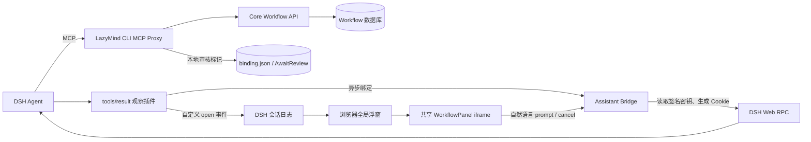
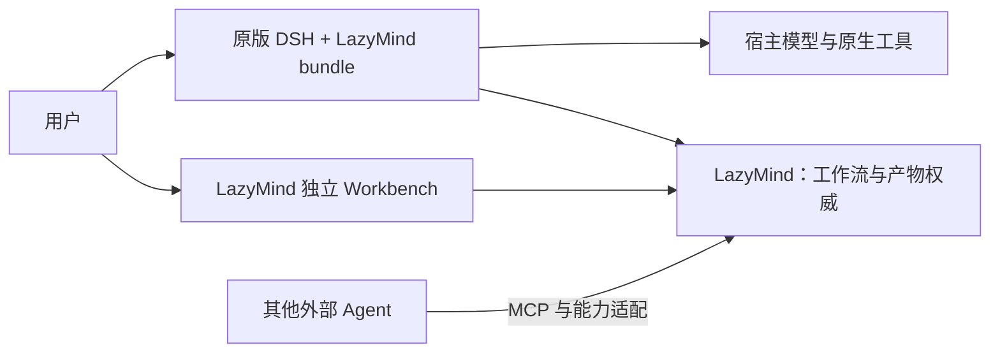
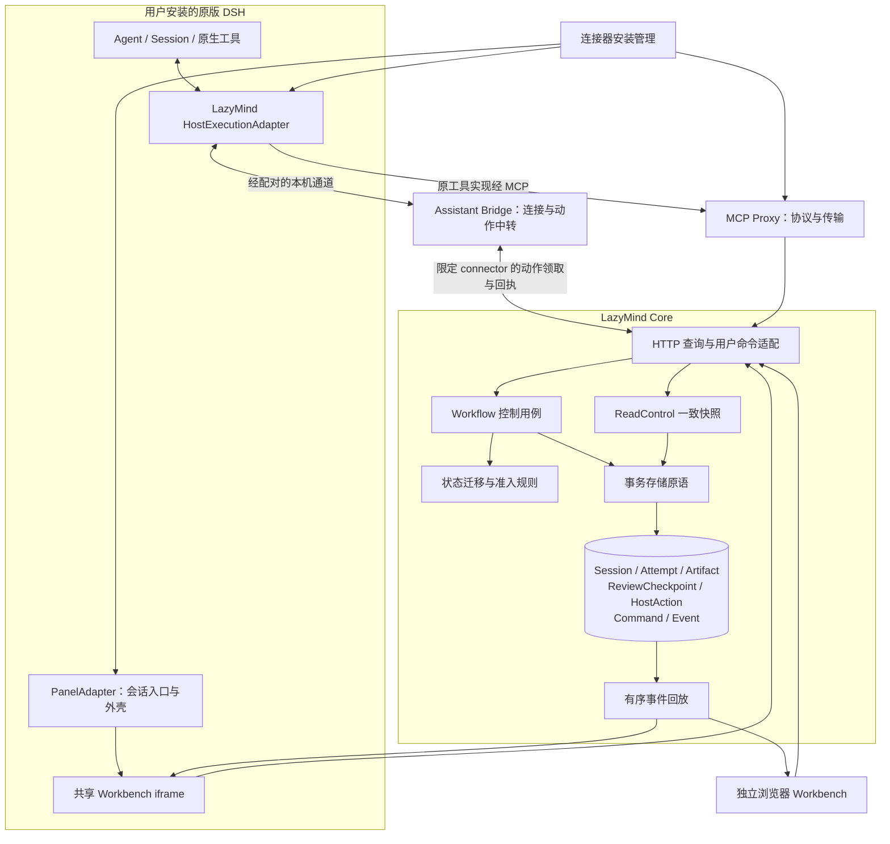
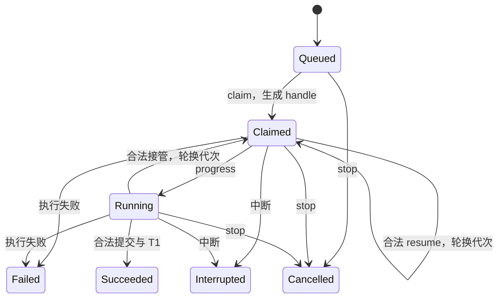
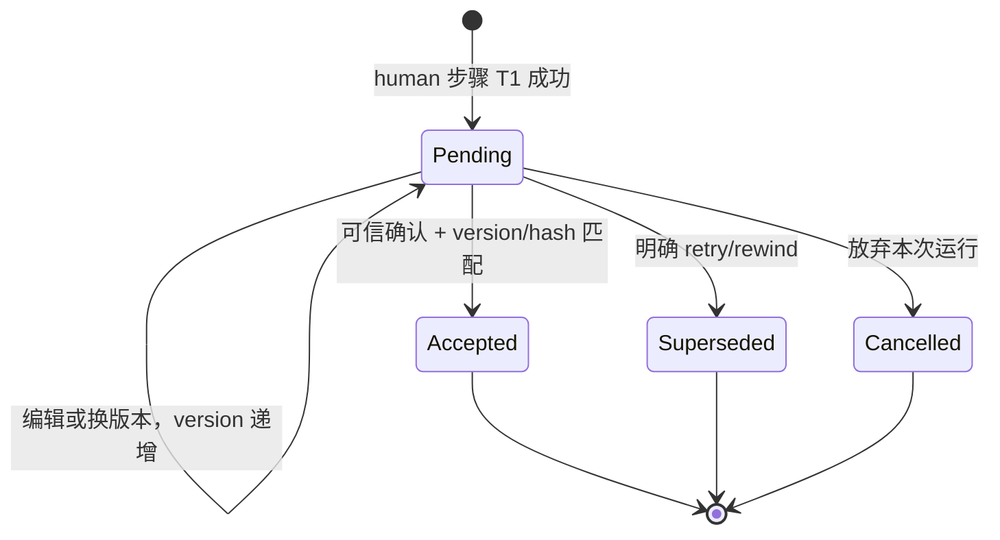
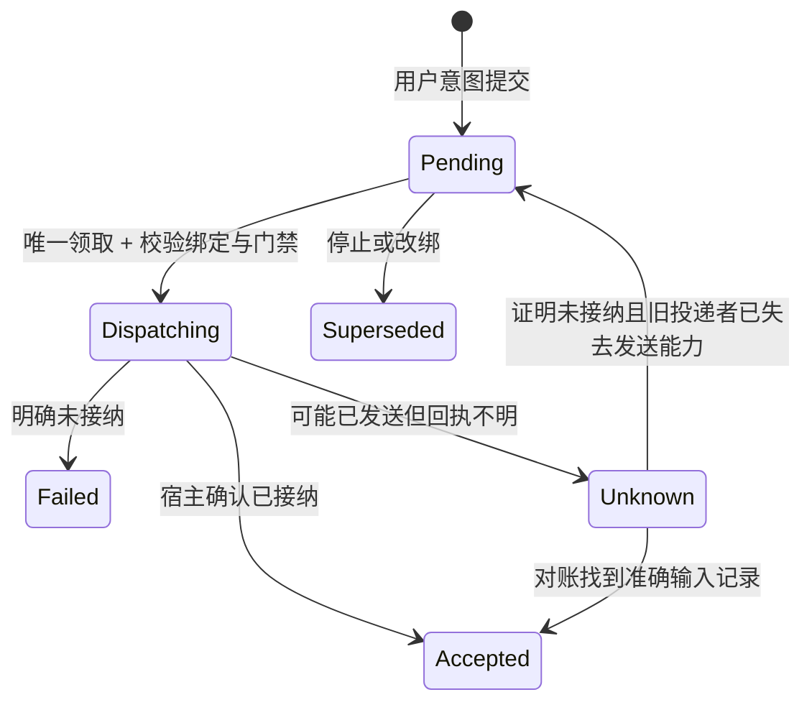
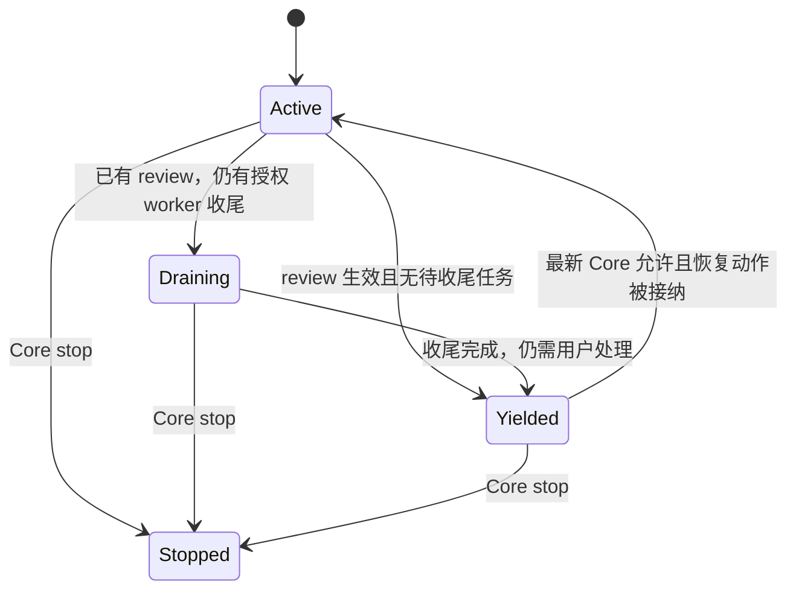
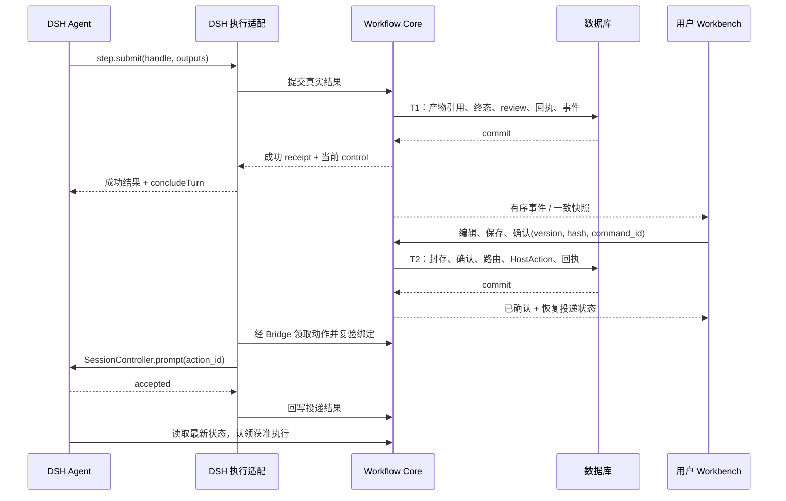

# DSH 工作流交互修复：原始审计与架构推导

> 这是实施前的审计与设计记录。当前落地架构见 [IMPLEMENTATION.md](IMPLEMENTATION.md)，实际测试见 [VALIDATION.md](VALIDATION.md)。下文的“当前”指 PR #698 的审查基线。

> 2026-09-08 · 状态：设计待实施。本文中的“目标”不代表当前实现已经具备。范围是 PR #698 的工作流交互链路，整体服务背景沿用 [仓库架构](../../architecture.md)。

## 1. 基线与结论

| 项目 | 本次核实的事实 |
| --- | --- |
| 上游 | LazyAGI/LazyMind，配置的 upstream URL 仍为其旧仓库名 LazyRAG |
| 最新 main | `bac0dc102775488df19908dbcf4f5fe4e47a084c` |
| PR #698 | OPEN，作者分支 `ADAM-CHENG666/LazyRAG:workflow/DeepSeekHarness_integration` |
| PR HEAD | `b627ab9353cefe6b9036ebcd292595f777f2a03a`；main 是其父提交 |
| 修复工作区 | `tmp/ch-dsh-fix`，分支 `ch/dsh_fix`；从最新 main 创建，再快进引入 PR；本轮未修改产品实现 |
| DSH SDK 分析对象 | 本机已安装的官方 npm 发布包 `0.1.2-rc.1`，与另一会话的全新环境实验相同；不是对未来版本的兼容承诺 |
| 变更规模 | PR 原有 30 个文件，新增 1456 行、删除 143 行，包含提交的 bundle JS |

**保留独立工作流页面、共享产物编辑器、DSH 外部插件、MCP 和会话权限校验。重做业务控制归属与宿主通信边界。** 不能把补导入、改步骤排序、恢复本地布尔值视为完整修复：这些只能处理局部症状。

目标是用户安装原版 DSH 和 LazyMind 后，通过连接配置获得 panel、可靠的步骤后审阅和原会话恢复。无需修改 DSH 源码、给 DSH 提 PR 或让用户编译插件。

## 2. 当前实现：链路与证据

### 2.1 当前运行链路



- 插件观察 `workflow.start` 结果，异步调用 Bridge 绑定，再追加 `lazymind-workflow/open`；没有实现 `concludeTurn()`。[E01]
- 审阅判断在 CLI 中，从按名称排序的 `projection.past` 最后一项推断；本地 JSON 的 `AwaitReview` 决定是否拒绝下一次 begin，读取失败反而放行。[E03][E04]
- panel 的继续、重试、回退是自然语言消息，停止是 DSH cancel；这些动作未形成明确的 Core 审阅确认/恢复业务命令。[E05][E06]
- Bridge 在宿主接受 prompt 前清除审核标记，并忽略保存错误；同时读取 DSH 的私有凭据文件，复刻 Cookie 签名规则。[E07][E08]
- 前端浮窗状态是模块级全局状态，缺少宿主会话隔离；页面先读详情再读投影，事件触发的多次刷新也没有统一版本收敛。[E02][E06]

### 2.2 已证实缺陷与架构缺口

| 问题 | 证据等级 | 对目标架构的要求 |
| --- | --- | --- |
| 控制请求漏导入 `assistantBridgeFetch` | 本轮复跑 prompt/cancel 两例均失败 | 实际控制函数测试必须进入 CI，打包成功不等于类型正确 |
| human 判断用错步骤顺序 | 本轮复跑两种命名顺序均失败 | 使用真实 attempt/step 身份；最终由 Core 返回审阅事实 |
| 宿主拒绝继续后本地门禁已解除 | 本轮复跑 503 场景失败 | 审阅确认与宿主投递分离，不能以网络请求结果回滚或释放业务门禁 |
| 跨进程事件被本地较晚事件越过 | 本轮复跑 remote-then-local 失败 | 通知只负责唤醒，统一按持久化顺序回放 |
| 自定义事件缺失 `ignorable` 导致冷启动失败 | 引用原会话的真实冷启动与单字段对照实验；本轮读取 SDK 核实 | 从标准工具结果恢复展示，不依赖该不可写入的私有事件协议 |
| MCP 安装检测路径错误 | 原会话干净 profile 实验；main 已有缺陷 | 按目标 profile 解析模块，连接器加入正式安装与能力验证 |
| 本地文件承担全局业务门禁 | 代码审计 | 所有 Workflow 写入口共用 Core 准入，文件只保留本机安装/连接信息 |
| 自行生成 DSH 登录 Cookie | 代码审计 | 在 DSH 插件进程内调用公开 SessionController；删除内部认证格式耦合 |
| 绑定异步竞态、缺少可信调用者证明 | 代码审计与推导，未作安全攻击实测 | 控制型运行先建立可信绑定才能 begin；Bridge 用自己的账号查到 run 不等于调用者获授权 |
| revision 可原地变；submit 取服务端最新 lease | 既有 Core 代码审计 | 独立审阅版本/内容快照，调用方 execution_handle，写事务内 fencing |

本轮定向复现总计 **6 个失败断言、6 个通过子用例**：权限矩阵 5 项和 remote-only 1 项通过。失败是审查基线，不是已修复后的测试结果。完整环境报告位于原审查工作区 `tmp/pr-698-clean/validation/REPORT.md`；本轮没有重新启动用户的产品服务。

## 3. 技术栈、入口与运行边界

| 区域 | 已有技术与职责 | 证据 |
| --- | --- | --- |
| Core | Go 1.25、GORM、PostgreSQL/SQLite；Session、Attempt、Artifact、Command、Event、Graph | [Core go.mod](https://github.com/ADAM-CHENG666/LazyRAG/blob/b627ab9353cefe6b9036ebcd292595f777f2a03a/backend/core/go.mod#L1)、[E09][E10] |
| 本地连接器 | Go；MCP Go SDK、Assistant Bridge、本机 profile 与凭据管理 | [CLI go.mod](https://github.com/ADAM-CHENG666/LazyRAG/blob/b627ab9353cefe6b9036ebcd292595f777f2a03a/local/lazymind-cli/go.mod#L1)、[E04][E07] |
| 前端 | React 18、Vite 5、TypeScript、Zustand、共享 WorkflowPanel | [package.json](https://github.com/ADAM-CHENG666/LazyRAG/blob/b627ab9353cefe6b9036ebcd292595f777f2a03a/frontend/package.json#L1)、[E05][E06] |
| DSH 外部插件 | Node Host + 浏览器模块，Cordis；tsdown 产物随源码提交 | [E01][E02][E14] |
| 安装发布 | LazyMind local/desktop；原版 DSH web profile | [E13][E14] |

本次不升级数据库引擎，不改 Auth/Kong、RAG/文档处理服务或 LazyLLM 子模块。现有总体服务部署见仓库架构；本次必须补齐的运行版本表仅涉及 DSH bundle：DSH SDK、Node、打包目标、pnpm 和安装 profile 需要一起验证。当前包只有 tsdown 构建命令，没有独立类型检查和提交的锁文件；不得从 `target: es2024` 推导用户运行时一定兼容。[E14]

## 4. 目标架构：三个平面与两个适配边界

### 4.1 系统上下文



### 4.2 容器与组件



箭头表示调用/数据方向。**编译依赖方向**另作约束：HTTP、MCP 和宿主适配依赖应用契约；应用用例依赖规则和存储端口；业务规则不能导入 DSH、浏览器或连接器文件路径。保留仓库现有 Go 包结构，通过小范围规则模块和事务原语改善边界，不整体搬成一套新的 DDD 目录。

### 4.3 每个组件的功能和能力边界

| 组件 | 负责什么 | 不提供什么保证 |
| --- | --- | --- |
| Workflow 控制用例 | Begin、Finalize、ConfirmReview、Recover、Stop、Continue；权限、事务、幂等 | 不操纵宿主 UI，不直接连接用户的 localhost，不替模型生成步骤结果 |
| 规则模块 | 判断可否开始/结算/确认；生成合法状态迁移；纯输入输出、可独立测试 | 不进行 DB、HTTP、Cookie 或宿主调用 |
| 事务存储 | 原子发布产物引用、attempt 终态、检查点、命令回执和事件；代次与唯一约束 | 不把外部宿主 RPC 包进数据库事务，不把大文件字节写入长事务 |
| MCP Proxy / SDK | 映射输入输出、上传文件、透传 control/receipt/handle，保留兼容字段 | 不自行判断已审核，不保存权威 AwaitReview，不保证外部模型停止无关工具 |
| Assistant Bridge | 配对、安装发现、本机连接生命周期、Core 动作与插件间中转 | 不解析“继续/重试”决定业务，不生成 DSH Cookie，不成为第二个工作流引擎 |
| DSH HostExecutionAdapter | 可信会话绑定；工具成功提交后交还回合；本作用域准入；宿主恢复/取消和对账 | 不批准产物；不能硬杀已启动的任意外部进程；不承诺任意 DSH 版本兼容 |
| PanelAdapter | DSH 会话里的入口、打开/关闭/最小化、当前会话关联 | 关闭面板不是停止；换会话不是改绑；展示能力不等于执行控制能力 |
| 共享 Workbench | 编辑、保存、确认、查看动作状态；依据 Core 返回的可用操作显示按钮 | 不从按钮状态、当前 tab、past 排序推导授权；不直接调用 DSH 内部 RPC |
| 事件回放 | 一致基线、有序更新、断线补齐；通知触发重新读取 | 事件是事实通知，不授予执行权；收到“已确认”不代表宿主已经开新回合 |
| 安装管理 | 定位实际 DSH/profile，安装预编译 bundle、配置 MCP、诊断和卸载自身配置 | 不强制升级 DSH，不替用户初始化模型账号，不修改 DSH 源码 |

### 4.4 领域对象与一致性边界

- `WorkflowSession` 是业务一致性和加锁边界；不要每次加载整个运行历史。每次只加载本命令涉及的当前 attempt、review 和产物引用。
- `Attempt` 保留现有执行身份。一个运行可有多个并行 attempt；每个执行者持有代次绑定的 `execution_handle`。
- `ReviewCheckpoint` 记录“这次步骤完成后的这一份产物，是否获得确认”。不是一个可随意清零的 run 布尔值。
- `ReviewedManifest` 是不可变值：产物身份、实际内容哈希、列表顺序和版本引用。待审编辑递增 review version；接受后封存。
- `HostBinding` 复用运行来源/连接器身份存储并补齐可信绑定字段：provider、connector_instance_id、driver_session_id、executor_session_id、generation、capabilities。它是路由，不是审批。
- `HostAction` 是持久投递意图及其回执；创建意图与相关业务决定同事务，宿主接受结果最终一致。复用 Command/Event，单独区分现有 attempt 调度 Outbox 的类型与用途。

DDD 在此用于确定一致性边界和依赖方向。多个表在同一个运行事务内更新是必要约束；不为套用模式拆成多个服务，也不引入 Kafka、通用审批平台或全量 Event Sourcing。

## 5. 三个状态机与一个宿主控制投影

### 5.1 Attempt：执行事实



终态不原地返回 Running。retry/rewind 建立新 attempt；审阅暂停不把 Succeeded 改成 Interrupted。受控接管条件、lease 和停止状态在同一事务内校验；旧 handle 对真实产物写入和最终结算均失效。终态重复提交只返回已授权的同内容回执，不再次 finalize。

### 5.2 ReviewCheckpoint：审阅事实



| 事件 | 守卫 | 原子结果 |
| --- | --- | --- |
| T1 建立检查点 | 实际成功的 attempt；准入时固定的有效审阅策略 | Pending + 本次 manifest + review version |
| 编辑待审内容 | 当前 review/version 与会话权限匹配 | 更新可编辑 draft，递增 review version |
| 确认 | 可信交互来源、准确 version/hash、有效检查点 | Accepted、封存快照、按确认内容冻结路由 |
| retry/rewind | 明确操作、版本和目标合法 | 只 supersede 相关 checkpoint，创建新的受控 attempt |
| session.stop/resume | 有权限 | 改运行生命周期；不等于人工确认 |

允许多个 pending checkpoint。长期免审偏好影响未来 attempt；“本次确认并以后免审”必须原子确认本次内容并更新未来偏好。

### 5.3 HostAction：投递事实



`Accepted` 只表示进入宿主 inbox，**不表示开始执行，也不表示工作流完成**。DSH `prompt` 的 ACK 仅有 `accepted: true`；`native_turn_id` 不能作为接纳时必填字段。记录 action_id/request_id，后续按标准事件补充 message ID、event seq 和 turn ID。[D02]

DSH 当前实现把 requestId 写入输入来源，但这不能被当作服务端幂等保证。[D03] 使用 Core 唯一动作、单消费者领取、本地配对实例排他与标准日志对账。领取 lease 过期不等于旧进程已不可能发送；没有旧投递者退出/隔离证据和完整历史时，保持 Unknown，不自动重发。

### 5.4 宿主控制投影



该状态用于适配器执行和展示，从 Core 事实与宿主活动推导，不建立另一套可独立放行的持久业务状态。Pending review 阻止新工作，允许此前已授权的 heartbeat、产物提交和合法收尾；用户主动 stop 则关闭工作流准入并使相应执行凭据失效。

## 6. 两个核心事务与端到端时序



**T1 / FinalizeResult。** 大文件先幂等 staging，短事务中锁 Session→attempt→review/产物集合；复验 handle、停止状态、输出和提交摘要；发布有效引用、写终态和检查点、回执、事件。失败不得留下“成功但无检查点”或“旧 worker 污染 selected 产物”。当前 `Complete`、`ArtifactSink.Save`、`FinalizeHostAttempt` 分别提交，需要提取接受同一 tx 的原语。[E09][E10]

**T2 / ConfirmReview。** 同一事务校验可信来源、review version、manifest hash，封存内容、接受审阅、重算冻结路由。只有剩余审阅、并行收尾、运行生命周期和目标绑定满足条件时，`confirm_and_continue` 才创建 HostAction。若只允许确认，明确返回“已确认，尚未恢复”和原因。投递失败不撤销已经成立的确认。

**Continue / Recover / Stop。** Continue 只在合法状态创建唯一动作；Recover 在 Core 先建立新 attempt 并返回准确 execution_id，宿主随后认领该 attempt，不能再次 advance 生成第二个；Stop 在 Core 关闭准入、处理执行代次与未发动作，再投递宿主取消。新增受控 MCP `workflow.step.claim(execution_id)` 对应已有 hosted claim/begin 原语，专门认领 Core 已创建的恢复 attempt，不与新建 begin 混用。

**幂等与回放。** 同 command_id 同内容返回固定 receipt，不同内容冲突；control 每次读当前值，晚到的旧 awaiting_user 回执不能再次暂停已确认的新回合。SQLite 现有 Command 的独立执行后记账分支不满足上述原子性，新用例复用表结构而不复用该调用顺序。[E11]

## 7. DSH 扩展如何实现强控制与稳定 panel

### 7.1 采用发布版公开接口，分层承担控制

1. **工具 execute 包装。** 通过公开 `tools.get/register` 在恰当 Agent scope 包装 LazyMind 工具定义，保留 output、finalize、取消传播和工具身份。调用原实现，消费 Core 的 control；成功结果满足交还条件后调用 `ToolRunContext.concludeTurn()`。`tools/execute` middleware 的参数和 `tools/result` observer 都不是 ToolRunContext，不能强转后调用。[D01]
2. **调用准入。** `tools.guard` 提供作用域内的最终拒绝；它是同步 guard，不能在里面等待网络。权威检查放在 Core 和异步执行/生命周期入口；同步 guard 使用已更新的本回合投影，负责堵住同批调用。首次绑定/重启尚未同步时，受控 Workflow 写操作不放行。
3. **后续轮次。** `agent/pre-step` 核验本 Workflow 自动续轮，覆盖 goal、steering、嵌套 PTC 和排队输入。`concludeTurn` 不会自动丢弃已进入 inbox 的工作。[D04] 只抑制属于受控运行的推进；无关的显式用户任务仍可处理。默认把绑定驱动当作一个 Workflow 的控制作用域，不支持同一回合同时驱动多个需要独立暂停的运行。
4. **宿主动作。** Node 插件调用公开 `ctx.sessionController.prompt/cancel`，由配对 Bridge 递送 Core 的动作；删除 Go 连接器中的 DSH 浏览器 Cookie 签名与私有 RPC 拼装。[D02][E08]
5. **主驱动与 worker。** 原生父会话/委派关系来自宿主公开上下文，不从模型填的 session 字段相信身份。子 Agent conclude 只结束子回合；主驱动仍要收到待审投影并执行对应收尾/交还。

工具包装的同层重名、HMR 重装、MCP 重连和 PTC 传播必须做真实 SDK 契约测试；不能通过 monkey patch 或内部 scheduler 补齐。如果目标发布版无法组合这些公开能力，仅发布 panel + Core 门禁等级。

### 7.2 panel 不再写不可回放的自定义日志事件

- 在标准 `tool/result` 和必要的 `tool/code-dispatch` 结果上注册只读展示投影，提取经过校验的 interaction descriptor；由其恢复入口卡片，不追加 `lazymind-workflow/open`。
- 以 host session + run ID 隔离浮窗状态；同一运行重复结果只保留一个入口，历史回放不重新写绑定或自动发命令。
- 只接受当前配对配置的 LazyMind origin，校验 run ID 与路径；HTTP(S) 合法并不意味着可直接作为可信 iframe origin。
- `workflow.state/session.list` 可以帮助找回运行，但读取不是改绑操作。主驱动绑定必须由显式、可信、版本化命令完成。
- 已经被旧插件写坏的会话日志：新插件无法在宿主拒绝载入前自行修复。提供“检测→备份→预览→仅修复已知事件 envelope→验证冷回放”的维护工具，不在安装时静默批量修改用户日志；这是历史数据恢复项，独立于正常新运行路径。

### 7.3 可信绑定先于执行

新受控 run 初始可显示页面，但 `admission=false / binding_required`。start 包装收到成功回执后，同步通过已配对通道绑定真实 driver，再刷新 control。绑定失败返回成功的创建回执、链接和明确阻断原因，避免模型重试 start 创建另一运行。

配对凭据由连接器生成，限定 connector instance、账户、Core origin、profile 和有效期/轮换；只供插件进程使用。不要把 DSH 密钥、长期 Core token 放进 URL、MCP 结果、iframe postMessage 或浏览器持久存储。Core 的确认 API 使用可信交互权限；仅填写 `actor=human` 或提供一个 Origin header 不构成人类确认。

## 8. 共享 Workbench 与协议

### 8.1 替换自然语言控制接口

`WorkflowPanel` 保留现有编辑器和布局，新增类型化操作入口。control.v1 运行必须调用类型化控制服务；旧 `onSendMessage` 仅在明确 legacy 模式保留，不能成为新运行的隐式降级。

| 用户操作 | 业务命令 | 宿主动作 |
| --- | --- | --- |
| 保存草稿 | UpdateReviewDraft(expected_review_version) | 无 |
| 确认 | ConfirmReview(version, manifest_hash) | 无 |
| 确认并继续 | ConfirmReviewAndContinue，同一业务事务 | 条件满足后创建 continue |
| 重试/回退 | Recover(step_id, expected_state_version) | 认领已经创建的 execution_id |
| 继续 | Continue，重验当前状态与绑定 | 唯一 continue 动作 |
| 停止 | StopRun | 取消当前绑定宿主活动；ACK 不代表所有外部副作用已撤销 |
| 关闭/最小化 | 本地视图状态 | 无 |

按钮先 flush 草稿；保存失败不发送业务命令。重复点击复用同一次操作的 command_id；超时按该 ID 查询结果，不能每次生成新的 UUID 盲重试。详情、图投影、reviews、delivery 和 available_actions 由一次 ReadControl 快照返回；多个请求只接受最新版本，页面卸载后不回写，切换运行取消旧请求。

### 8.2 建议的控制结果契约

```json
{
  "protocol": "workflow.control.v1",
  "receipt": {"command_id": "submit_1", "execution_id": "attempt_1"},
  "control": {
    "session_id": "run_1",
    "state_version": 24,
    "continuation": "awaiting_user",
    "admission": {"can_begin": false, "reason": "review_pending"},
    "reviews": [{"id": "review_1", "version": 3, "status": "pending", "manifest_hash": "sha256:example"}],
    "binding": {"provider": "deepseek-harness", "generation": 2},
    "delivery": null,
    "available_actions": ["save", "confirm", "confirm_and_continue", "retry", "stop"]
  }
}
```

这是 LazyMind 自有契约，不是 MCP 标准。JSON 只示意一个已无并行收尾、绑定有效的待审运行；available_actions 必须由当前事实计算，不能照抄静态列表。Go CLI、Python SDK、OpenAPI、前端和 bundle 同批更新，不静默丢字段。执行凭据只在需要执行的接口返回，panel 无须获得 handle。

错误分类至少包含：`REVIEW_PENDING`、`REVIEW_VERSION_CONFLICT`、`EXECUTION_FENCED`、`BINDING_REQUIRED`、`BINDING_STALE`、`COMMAND_CONFLICT`、`DELIVERY_UNKNOWN`。human 等待是成功结果；业务命令冲突、业务确认成功但投递失败、以及模型执行失败要在 UI 分别展示。

## 9. 事件、数据库与历史兼容

- 本地 pub/sub 只唤醒同一个 replay 循环；定时器也调用这个循环，不直接推送更大 ID 后跳过数据库中的早期事件。[E12]
- 回放循环排空批次，成功发送后才推进游标；断线恢复以持久游标补齐。初始快照与游标取自同一一致读视图。
- **不能默认自增 ID 等于提交顺序。** 同一运行的事件写入在 Session 事务锁内分配 ID 并提交；并发的产物、确认、动作回执都进入同一规则，验证“先拿小 ID 后提交”的交错不会丢失可见事件。无需要求不同 Session 的全局 ID 连续。
- review-aware 写入覆盖人工 draft、版本选择、列表增删/排序、文件替换及内部执行器；accepted 快照不会被后来的原地编辑覆盖。[E10]
- PostgreSQL 行锁/CAS 与 SQLite 短事务/CAS/唯一约束分别验证；进程 mutex 不代替数据库原子性。
- schema 先扩展，所有受控写节点升级后才启用 control.v1；无法隔离旧 binary 时，不允许新旧写者混用受控 Session。legacy 运行不自动补造审阅事实。
- 回滚可停止新建受控运行、关闭宿主适配并保留链接；已有受控运行的 Core 门禁与存储仍需保留。新迁移遵守 [迁移规则](https://github.com/ADAM-CHENG666/LazyRAG/blob/b627ab9353cefe6b9036ebcd292595f777f2a03a/backend/core/migrations/AGENTS.md)，保留旧数据并验证 dev/aggregate、up/down、PG/SQLite 等价。

## 10. 跨宿主扩展：独立能力而非一个支持开关

| 能力 | dsh-fix 的交付目标 | 普通 MCP / 未来适配 |
| --- | --- | --- |
| workflow 调用、结构化状态、链接 | 支持 | 通用基线 |
| 原生 panel 容器 | 通过 bundle，需契约测试 | Codex/WorkBuddy 逐版本探测；没有容器则独立 Web |
| 可信当前会话身份 | 插件上下文 + 配对 | 不能从模型自报字段推导 |
| 正常结束当前回合 | execute 的 concludeTurn + guard/pre-step | 无公开能力则不宣称支持 |
| 恢复指定原会话 | 公开 SessionController + 持久动作 | 深链接只能打开页面，不等于恢复 Agent |
| 动作对账 | 标准消息来源 requestId + 完整历史/队列 | 缺能力时 Unknown 交给明确人工恢复 |
| 用户确认 | 共享可信 UI | MCP App 回调只有来源可验证才可直达确认，否则跳授权页面 |

本 PR 实现 dsh 适配与能力契约，不同时实现 Codex/WorkBuddy 全套原生控制。MCP Apps、原生面板、回合停止、原会话恢复是四种不同能力；不能互相推出。Core 状态机、Workbench 和业务命令应可直接复用。

## 11. 设计决策记录

| 决策 | 选择 | 放弃的替代方案与原因 |
| --- | --- | --- |
| 审阅权威 | Core 持久 checkpoint | 本地 AwaitReview：多入口绕过、文件丢失、并发清除 |
| 确认与恢复 | 两类状态、事务内投递意图、事务外宿主调用 | 网络失败恢复布尔值：覆盖并发新审阅，无法解释 ACK 丢失 |
| panel 重用 | 独立 Workbench + 薄容器 | 每宿主重写编辑器：业务漂移和重复维护 |
| 宿主控制 | 插件内公开 API | 外部复制 Cookie 与内部 RPC：身份和版本耦合 |
| 展示恢复 | 标准持久事件投影 | 新增不可写入兼容标记的自定义事件：冷启动拒绝整段日志 |
| 分层方式 | 小规则模块、现有包内用例、窄适配端口 | 全库 DDD 重排/微服务/CQRS 数据库：没有本次需求支持 |
| 发布策略 | 分能力启用，未知关闭强控制 | “能打开 panel 就已集成”：掩盖控制与恢复缺口 |

## 12. 信心与验证边界

| 结论区域 | 级别 | 说明 |
| --- | --- | --- |
| 基线、PR 来源与差异 | 高 | 本轮 fetch 和 GitHub API 核实 |
| 4 类已复现缺陷 | 高 | 本轮重新执行既有定向测试 |
| DSH 冷回放缺陷 | 高，历史实验 | 原会话真实干净环境对照；本轮读取原报告与 SDK |
| Core 事务、revision、fencing 风险 | 代码事实与推导 | 明确代码位置；并发故障注入列入实施门槛 |
| 公开 SDK 提供的接口 | 高，指定版本 | 阅读本机官方发布包类型与实现 |
| 强控制组合、对账与所有宿主能力 | 待验证 | 有接口不等于整个组合已可靠工作；见实施计划 P1/P4/P7 |
| 远端 CI 是否阻止合并 | 未验证 | 当前 workflow 还不覆盖作者目标分支；管理员配置独立于代码 |

## 13. 源码证据索引

- **E01** [DSH Host 插件](https://github.com/ADAM-CHENG666/LazyRAG/blob/b627ab9353cefe6b9036ebcd292595f777f2a03a/integrations/dsh-workflow/src/index.ts#L12)：URL 提取、异步绑定、自定义 append。
- **E02** [DSH 浏览器插件](https://github.com/ADAM-CHENG666/LazyRAG/blob/b627ab9353cefe6b9036ebcd292595f777f2a03a/integrations/dsh-workflow/src/client/index.tsx#L18)：事件投影、全局 WindowState、iframe 与 slots。
- **E03** [CLI AwaitingReview](https://github.com/ADAM-CHENG666/LazyRAG/blob/b627ab9353cefe6b9036ebcd292595f777f2a03a/local/lazymind-cli/internal/workflowmcp/client.go#L523)：按 past 最后一项推导人工审核。
- **E04** [MCP Bridge](https://github.com/ADAM-CHENG666/LazyRAG/blob/b627ab9353cefe6b9036ebcd292595f777f2a03a/local/lazymind-cli/internal/mcpbridge/bridge.go#L107)：本地门禁与 after-submit 记账。
- **E05** [WorkflowPanel 操作](https://github.com/ADAM-CHENG666/LazyRAG/blob/b627ab9353cefe6b9036ebcd292595f777f2a03a/frontend/src/modules/chat/components/WorkflowPanel/index.tsx#L1905)：flush、继续、偏好、重试与回退的自然语言回调。
- **E06** [独立页面](https://github.com/ADAM-CHENG666/LazyRAG/blob/b627ab9353cefe6b9036ebcd292595f777f2a03a/frontend/src/modules/chat/pages/workflowRun/index.tsx#L19)、[加载器](https://github.com/ADAM-CHENG666/LazyRAG/blob/b627ab9353cefe6b9036ebcd292595f777f2a03a/frontend/src/modules/chat/pages/workflowRun/loadRun.ts#L32)、[控制请求](https://github.com/ADAM-CHENG666/LazyRAG/blob/b627ab9353cefe6b9036ebcd292595f777f2a03a/frontend/src/runtime/desktopBridge.ts#L284)。
- **E07** [Bridge 控制入口](https://github.com/ADAM-CHENG666/LazyRAG/blob/b627ab9353cefe6b9036ebcd292595f777f2a03a/local/lazymind-cli/internal/assistantbridge/workflow_control.go#L17)、[绑定入口](https://github.com/ADAM-CHENG666/LazyRAG/blob/b627ab9353cefe6b9036ebcd292595f777f2a03a/local/lazymind-cli/internal/assistantbridge/workflow_binding.go#L17)。
- **E08** [DSH Cookie 实现](https://github.com/ADAM-CHENG666/LazyRAG/blob/b627ab9353cefe6b9036ebcd292595f777f2a03a/local/lazymind-cli/internal/workflowcontrol/dsh_auth.go#L54)、[宿主请求转发](https://github.com/ADAM-CHENG666/LazyRAG/blob/b627ab9353cefe6b9036ebcd292595f777f2a03a/local/lazymind-cli/internal/workflowcontrol/control.go#L200)。
- **E09** [Hosted Submit](https://github.com/ADAM-CHENG666/LazyRAG/blob/b627ab9353cefe6b9036ebcd292595f777f2a03a/backend/core/workflow/hosted/service.go#L150)、[Attempt claim](https://github.com/ADAM-CHENG666/LazyRAG/blob/b627ab9353cefe6b9036ebcd292595f777f2a03a/backend/core/workflow/attempt/service.go#L199)、[Finalize](https://github.com/ADAM-CHENG666/LazyRAG/blob/b627ab9353cefe6b9036ebcd292595f777f2a03a/backend/core/workflow/runtime_projection.go#L318)。
- **E10** [ArtifactSink](https://github.com/ADAM-CHENG666/LazyRAG/blob/b627ab9353cefe6b9036ebcd292595f777f2a03a/backend/core/workflow/executor/artifact_sink.go#L75)、[原地更新 human artifact](https://github.com/ADAM-CHENG666/LazyRAG/blob/b627ab9353cefe6b9036ebcd292595f777f2a03a/backend/core/workflow/store.go#L1115)。
- **E11** [Command 的 SQLite 分支](https://github.com/ADAM-CHENG666/LazyRAG/blob/b627ab9353cefe6b9036ebcd292595f777f2a03a/backend/core/workflow/store/repository.go#L924)。
- **E12** [SSE Handler](https://github.com/ADAM-CHENG666/LazyRAG/blob/b627ab9353cefe6b9036ebcd292595f777f2a03a/backend/core/workflow/stream/handler.go#L80)。
- **E13** [DSH 安装检测](https://github.com/ADAM-CHENG666/LazyRAG/blob/b627ab9353cefe6b9036ebcd292595f777f2a03a/local/lazymind-cli/internal/adapters/mcpclient/adapter.go#L192)。
- **E14** [bundle manifest](https://github.com/ADAM-CHENG666/LazyRAG/blob/b627ab9353cefe6b9036ebcd292595f777f2a03a/integrations/dsh-workflow/package.json#L1)、[构建配置](https://github.com/ADAM-CHENG666/LazyRAG/blob/b627ab9353cefe6b9036ebcd292595f777f2a03a/integrations/dsh-workflow/tsdown.config.ts#L10)。
- **D01** 官方 npm `@deepseek-ai/dsh-tools@0.1.2-rc.1` 的 `lib/types/index.d.ts`：ToolDefinition.execute 119、ToolRunContext 284、guard 621、get 656、register 602。当前本机来源：`~/.npm/_npx/2f3a729d991ac520/node_modules/@deepseek-ai/dsh-tools`。
- **D02** 同版本 `dsh-api-session-controller/lib/types/index.d.ts` 的 prompt 127、cancel 145、page 152、follow 159；`types.d.ts` 的 ACK 294、标准历史 397、队列 rpcId 439。
- **D03** 同版本 `dsh-api-session-controller/lib/index.js` 的 prompt 731：requestId 进入 source.rpcId，再创建消息并 followup。
- **D04** 同版本 `dsh-agent/lib/types/runtime-types.d.ts` 的 pre-step 239、turn-stopping 293；conclude 不丢弃已提交 inbox 工作。
