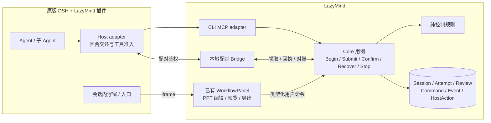
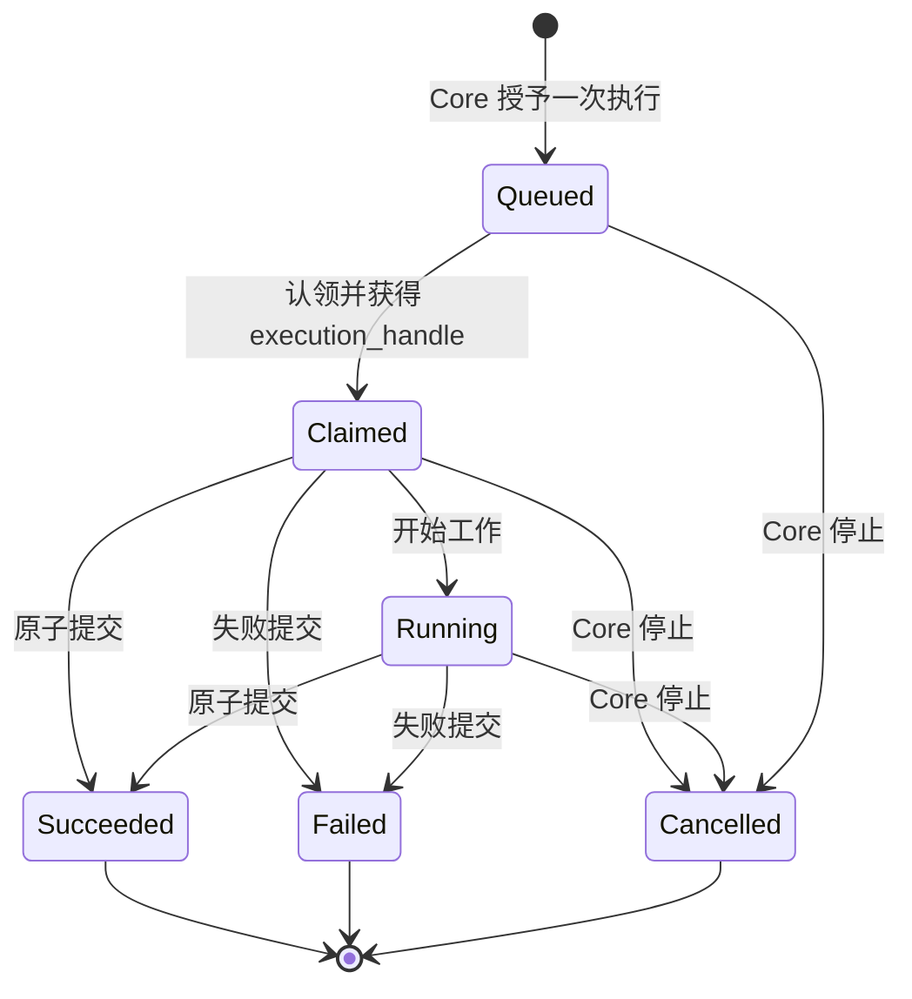
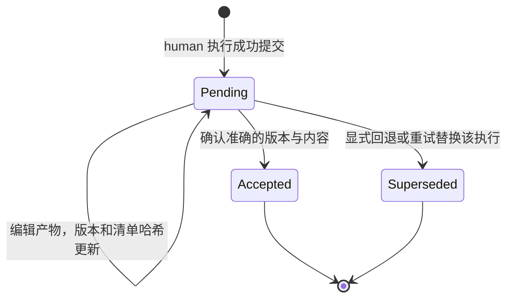
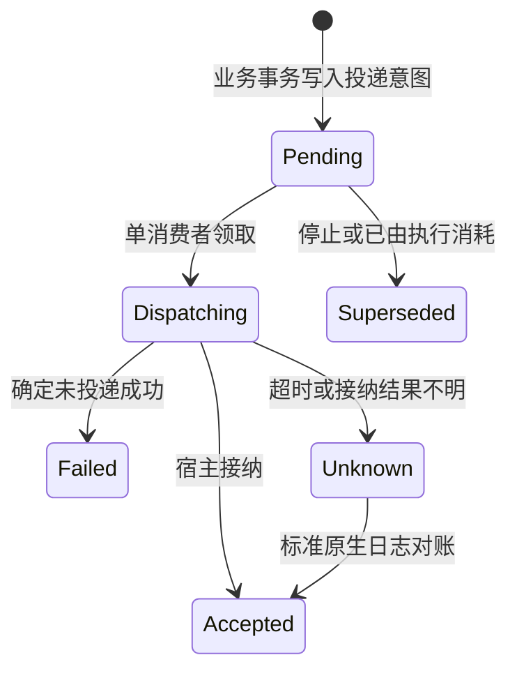
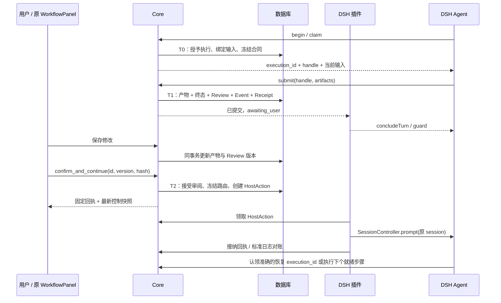
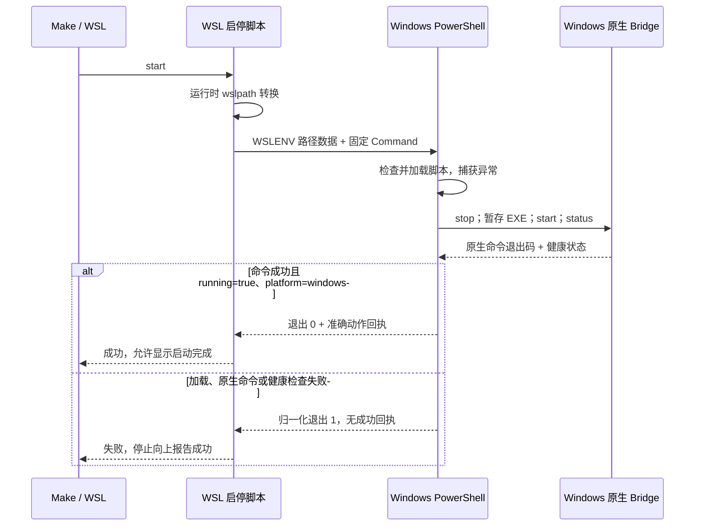

# DSH 工作流交互：修复后的实现架构

本文件描述 `ch/dsh_fix` 的实际实现。原始问题、方案推导见 [ARCHITECTURE.md](ARCHITECTURE.md)，验收结果见 [VALIDATION.md](VALIDATION.md)。修复 PR 以 PR #698 的作者分支为 base。

## 1. 系统结构与责任

用户安装原版 DSH 和 LazyMind 后，通过 LazyMind 的连接配置安装预编译插件。DSH 源码不需要修改。界面复用已有 `WorkflowPanel`、PPT 缩略图、Markdown 编辑器、幻灯片预览和导出组件。

| 部分 | 实现位置 | 功能与边界 |
| --- | --- | --- |
| 领域规则 | `backend/core/workflow/controlpolicy` | 计算能否开始新执行、是否等待审阅。无 HTTP、ORM、宿主依赖。 |
| Core 控制用例 | `workflow/control.go` | 用户确认、开始、重试、回退、停止、恢复；事务、版本检查和幂等回执。不会调用 DSH。 |
| 控制存储 | `workflow/controlstore` | Session 行锁、检查点、内容清单、执行凭证校验、当前控制快照。 |
| 外部执行入口 | `workflow/hosted` | 认领已授予的执行、原子提交产物和终态。业务上 human 是提交后的审阅。 |
| 执行合同 | `workflow/executor/input_snapshot.go` | 在已有 outbox 中冻结输入版本、内容和列表顺序；避免外部模型沿用旧对话里的材料。 |
| 宿主投递 | `workflow/control_host.go` | 可信驱动绑定、唯一动作、投递租约、状态回执。接纳不等于执行完成。 |
| MCP adapter | `local/lazymind-cli/internal/workflowmcp` | 将中立协议转换为工具；转交 execution_handle、回执和最新 control；不提供人工确认工具。 |
| Bridge | `internal/assistantbridge/workflow_host.go` | 验证账号及 profile 配对，转发 Core 协议；不读取 DSH 私有登录密钥。 |
| DSH host adapter | `integrations/dsh-workflow/src/host.ts` | 使用发布版公共 API，结束当前回合、守卫后续调用、恢复原驱动会话、投递对账。 |
| DSH view adapter | `src/client` | 从标准事件恢复入口与浮窗；按当前 DSH 会话和 run 隔离；关闭浮窗不停止工作流。 |
| 共享界面 | `frontend/.../WorkflowPanel` | 原有编辑、预览、版本和导出；控制按钮调用 Core。独立 run 页面只装配数据和操作回调。 |

没有新增微服务、消息中间件或单独的审批数据库。复用原来的 Session、Attempt、Artifact、Command、Event 和 Outbox，只新增 ReviewCheckpoint、HostAction 及必要字段。

## 2. 四种状态不能混为一个布尔值

### 执行事实

终态不原地改回 Running。retry/rewind 创建新 attempt；取消的 attempt 可以通过明确恢复命令重试。旧 execution_handle 在真实写入边界失效，恢复整个工作流也不会使它重新生效。

### 审阅事实

每个检查点关联一个 execution。清单包含选中 revision ID、值哈希、列表成员和顺序。确认检查 review version、manifest hash 和当前必需产物；不能确认已被删空的必需输出。

接受审阅后，确认过的材料不能原地改变。已被下游输入绑定引用的版本也不能原地覆盖。再次生成应走恢复命令；历史版本保留用于追溯。

### 宿主投递事实

`consumed_at` 独立记录继续动作是否已被执行授予/认领消耗，处理“执行先发生，接纳回执后到达”的竞态。它不等于整个工作流完成。

DSH 的 requestId 只是对账标识，不作为宿主的幂等承诺。投递使用 Core 唯一动作、排他领取和 profile 进程锁。租约过期转 Unknown，不自动重发不确定的继续请求。取消可幂等对账，且只针对对应的工作流驱动。

### 对外控制快照

| continuation | 含义 |
| --- | --- |
| `binding_required` | 需要插件完成原会话绑定；不允许新执行。 |
| `continue` | 可按图继续；仍需 Core 对目标步骤和版本进行检查。 |
| `draining` | 有待审阅检查点和已授权执行；仅允许已有执行收尾。 |
| `awaiting_user` | 已交还用户，等待审阅或控制操作。 |
| `stopped` | 关闭执行准入，旧执行已被撤销。 |
| `completed` / `failed` | 业务终态；由 Core 判定。 |

`review_after_submit` 明确告诉宿主：human 步骤已获得本次执行授权，审阅发生在成功提交之后。UI 也使用 control 显示执行中/待审阅，不从节点的 human 标签推断当前是否暂停。

## 3. 事务与输入、产物一致性

- **T0** 在授予事务中冻结输入，保存到已有 outbox；小文本/JSON 直接随合同提供，单项最多 16 KiB、总计 64 KiB，文件和更大内容保留精确读取引用。顺序也是快照的一部分。
- **T1** 要么同时提交产物、执行终态、检查点和回执，要么全部回滚。文件先落入私有 staging/托管副本，回滚时清理。相同终态重放返回固定回执和当前 control，不重新 finalize。
- **T2** 只确认用户看到的准确材料。保存改变了检查点时，需要界面刷新后重新确认，不能静默批准更新后的内容。确认成功而投递失败不会撤销确认。
- **恢复** 清除被替换产物的当前选择及排序成员，保留历史字节；当前预览和导出不混入 stale 页。partial selector 继续使用明确的列表项身份。
- **停止** 先在 Core 撤销准入、lease 和未发意图，再请求宿主取消。Resume 只恢复生命周期；不会批准未决审阅。
- **PPT 导出** 复用原浏览器截图与导出组件；隐藏 iframe 的等待有界，兼容 CSS 不影响截图工具自身的外层 SVG。
- **事件** 订阅通知只是唤醒；客户端游标来自数据库顺序回放，不能直接跳到最新本地事件。初始快照和游标在同一个一致读事务中取得。

## 4. 公开协议

| 用途 | 路径 / 工具 |
| --- | --- |
| 能力与数据库就绪 | `GET /workflow-control/capabilities` |
| 一致的界面快照 | `GET /workflow-sessions/{id}/control` |
| 用户操作 | `POST /workflow-sessions/{id}/control` |
| 执行授予 / 撤销 | `POST .../executions:begin`、`POST .../executions:stop` |
| 宿主绑定 | `POST .../host-binding` |
| 投递领取与对账 | `/workflow-host-actions`、`/{id}:claim`、`/{id}:settle` |
| MCP 执行 | `workflow.step.begin`、`workflow.step.claim`、`workflow.step.resume`、`workflow.step.submit` |

用户命令包含 `command_id`、类型及必要的预期版本；确认另带 `review_id / review_version / manifest_hash`。恢复返回准确 execution_id，Agent 认领它，不再 advance 生成第二份工作。

用户控制入口复用应用登录和会话权限，并拒绝 MCP invocation 来源；MCP 不接受模型声称自己是“用户”的 actor 字段。配对密钥只用于 Bridge/宿主通信。**同一 OS 用户下、能够任意读取本地文件或直接调用用户 API 的恶意进程，不在这一隔离保证内。** execution_handle 作为工具协议数据会保留在宿主原始执行记录中，不能当作物理用户身份凭证。

OpenAPI 从 Go 路由及类型注册表生成；前端生成客户端和缓存指纹随本 PR 一起更新。

## 5. 安装、升级与历史兼容

1. 先发布包含迁移的 Core、对应前端和 CLI。SQLite/PostgreSQL 的 dev 和当前版本 aggregate 均已更新。
2. 用户在 LazyMind 中连接 DSH。连接器通过官方 DSH plugin 命令安装 MCP 依赖与预编译包，保留其他配置，写入 profile 的用户配置层和私有配对文件。
3. 重启 DSH 激活更新。连接状态说明“已配置”，不虚报正在运行或已恢复。
4. Disconnect 撤销该配对并禁用本插件，移除本连接器拥有的 MCP 项；重新连接同账号、同 profile 可恢复原配对。
5. 旧运行不凭空补审批事实；不支持的宿主版本回退为普通 MCP/链接能力。新强控制运行遇到缺失绑定或不可用状态会阻止推进。
6. 旧插件写坏的自定义事件必须单独处理：`lazymind internal agent deepseek-harness repair-log --file ...` 默认只预览；停掉 DSH 后显式 `--apply --offline`，自动备份、定点修复并保留其他记录。安装不批量修改历史。

### Windows / WSL Bridge 启停边界

该适配只负责宿主进程启动，不承担工作流审批或 DSH 回合控制。Make 只派发动作；WSL 脚本负责路径转换、互操作数据传递和回执校验；PowerShell 负责 Windows 用户目录下的暂存及原生命令的错误与健康校验；已有 Go CLI 负责进程启停、端口等待和可执行文件身份检查。停止动作优先使用已暂存的 EXE，失败必须向上传递；没有可用 EXE 时保持原有的幂等空操作。UNC 路径不再进入 Make 展开的 shell 源码，完整 Windows 失败码在返回 WSL 前被归一化，缺少成功回执同样视为失败。

## 6. 扩展能力边界

- 本次真实宿主验收范围是 macOS arm64、Node 24、DSH `0.1.2-rc.1`；其他 DSH 版本和平台需通过契约及安装测试后再扩大支持承诺。
- Codex、WorkBuddy 等可复用 Core 状态、MCP 合同、输入快照和完整 WorkflowPanel。原生 panel、结束回合、定位原会话、可靠投递分别由对应 Host adapter 证明。
- 不支持 panel 的宿主仍能打开同一个 run 链接。单靠 MCP 服务端不能让任意外部 Agent 停止整个回合；Core 只能保证自己的工作流不越过审阅和撤销边界。
- 同一驱动回合默认只驱动一个需要独立暂停的工作流；子 Agent 可以完成已获授权的工作，并返回其 SDK 要求的 structured output。
- 取消是宿主公开 API 的协作取消，不承诺硬杀任意外部进程。外部 URL 产物冻结的是引用，不宣称冻结第三方服务上的内容。
- CI 已加入该作者分支的触发规则；fork 的 Actions 授权和 required checks 仍由仓库维护者管理。
