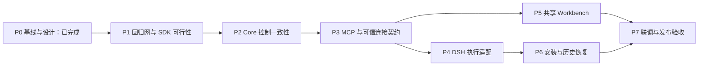

# ch/dsh_fix：修复与完善任务计划

> 2026-09-08 · 实施前任务分解。修复已实施，PPT 正常界面及恢复验收已完成；实际架构与状态见 [IMPLEMENTATION.md](IMPLEMENTATION.md) 和 [VALIDATION.md](VALIDATION.md)。现状与目标详见 [ARCHITECTURE.md](ARCHITECTURE.md)。本计划是 PR #698 的定向完善，不是全仓库现代化。

## 1. 交付目标与 PR 关系

保留 PR 已建立的独立 run 页面、共享编辑器和 DSH 插件基础，完成三个闭环：**可信绑定→执行→步骤后审阅；保存→确认→原会话恢复；停止/重试/断线/重启后的状态收敛。** 业务权威回到 Core，DSH 内部认证耦合从连接器移除。

- 上游 main：`bac0dc102775488df19908dbcf4f5fe4e47a084c`。
- PR #698：`b627ab9353cefe6b9036ebcd292595f777f2a03a`，一个提交，当前 OPEN。
- 已创建 `ch/dsh_fix`：先从最新 main 创建，再 `--ff-only` 引入 PR。现在和作者 PR HEAD 的产品代码一致，没有额外 merge commit。
- 按用户“给这个分支提交修复 PR”的意图，预定 head 为自己 fork 的 `ch/dsh_fix`，base 为作者 fork 的 `workflow/DeepSeekHarness_integration`。实施完成后发布前再次核实两端 SHA；本轮没有 push 或创建 PR。
- 按用户指定的一条修复分支组织有顺序的工作包/提交，不为每一阶段新开分支、相互堆叠 PR。作者合并修复后，原 #698 会携带修复进入上游评审。
- 当前 branch 自动跟踪 `upstream/main`，仅用于基线比较；发布必须显式指定自己的 fork 和目标分支，不能默认推送到 upstream/main。

## 2. 当前可运行程度与安全策略

采用 skill 的“先刻画、再逐段修复”策略。系统可以运行，已有有效测试与真实联调记录；没有依据整套重写或为了建立基线复活无关服务。

本轮有边界的可行性探查：复用原审查工作区中同 PR SHA 的既有复现测试，重新执行 CLI/Bridge、Core stream/facade、前端控制函数。测试可运行，6 个缺陷断言失败，6 个权限/远端单写子用例通过。DSH 冷启动和真实模型闭环沿用原会话已记录的实验，本轮没有重新操作用户服务。[VALIDATION.md](VALIDATION.md)

| 组件 | 本次掌握的依据 | 当前安全水平 | 正式可测试里程碑 |
| --- | --- | --- | --- |
| Core Workflow | Go runner 与隔离 SQLite/HTTP 测试可运行；PG 全矩阵本轮未跑 | L2：有行为与失败证据；不声称本分支 CI 已绿 | P1 建立受影响包 CI，P2 加 PG/SQLite 事务和迁移测试 |
| CLI / Bridge | 复现审核误判与错误清除；既有 Go CI 有 connector job | 局部 L3 基础可复用，修复门槛尚未通过 | P1 固化用例与目标分支 CI；P3 新协议契约通过 |
| Workbench | Vitest 可跑；漏导入确定失败；原审查有既有 8 项基线失败 | L2；完整前端类型检查不能以 scoped typecheck 代替 | P1 将本次变更范围纳入类型检查与实际 Vitest |
| DSH bundle | 既有真实服务可加载；SDK API 可读；缺锁文件/正式类型检查 | L2：SDK/真实回放证据；强控制组合尚未证明 | P1 独立锁文件、真实 SDK 类型与最小执行契约进入 CI |
| 安装/恢复 | 干净 profile 的历史对照实验 | L2，跨平台新安装尚未证明 | P6/P7 干净机器与重启验收 |

L4 目标是相关范围的 lint、unit、contract、integration/e2e 在 CI 通过；不以“本机 mock 通过”替代。严格的 Testability Milestone 还要求锁定依赖、受支持的运行时、构建成功和至少一个有意义测试在 CI 通过，因此不能把本轮本地成功宣称为全部组件已经越过该里程碑。

**CI 里程碑是 P1。** 已有 `.github/workflows/ci.yml` 的 PR base 过滤仅覆盖 main/master/dev，且前端 job 运行 `tests/frontend`，未等同于本次 React/Vitest 范围；默认 `typecheck` 只检查两份 ChatConfig 文件。新增范围明确的 DSH workflow gate，覆盖作者目标分支和上游 main。[CI](../../../.github/workflows/ci.yml#L4)、[tsconfig](../../../frontend/tsconfig.mcp.json#L9)

将 workflow 设为 required check / branch protection，以及作者 fork 首次贡献 Actions 授权，是维护者的平台配置动作；本轮未操作，也不把“有 workflow 文件”标为“已阻止错误合并”。

## 3. 工作包依赖与规模

这些是同一修复 PR 的逻辑提交顺序；图中的可独立验证部分不代表授权自动启动多 Agent。规模用于表达不确定性，不是人日承诺。

| 工作包 | 规模 | 核心产出 | 阻止进入下一阶段的条件 |
| --- | --- | --- | --- |
| P0 | S | 基线、现状图、目标状态机、缺陷清单 | 已完成本轮范围 |
| P1 | M | 回归测试、bundle 锁定、SDK 能力实验证据、CI gate | 当前 SDK 无法实现目标强控制组合，或发布检查仍漏掉修改文件 |
| P2 | L | checkpoint/manifest/HostAction、T1/T2、统一准入和事件顺序 | 任意入口绕过门禁、旧执行者可写入、并发确认/提交出现半状态 |
| P3 | M | 通用 MCP/HTTP/SDK 与配对协议 | 字段丢失、重复 begin、绑定未验证即可执行 |
| P4 | L | 正常交还、同批/PTC/goal 阻断、原会话恢复与对账 | 当前回合仍越过 human；Unknown 会盲重发；错误影响无关会话 |
| P5 | M | 类型化用户动作、统一快照、隔离 panel 状态 | 保存失败仍继续，或点击按钮仍把自然语言当权威命令 |
| P6 | M | 一键安装、诊断、卸载与历史坏日志恢复路径 | 用户仍须编译插件/手改 DSH；冷启动仍丢会话 |
| P7 | M/L | 干净环境闭环、故障矩阵、兼容与 PR 交付材料 | 任何声称支持的能力缺少对应真实证据 |

## 4. P0：基线与设计（本轮完成）

- [x] 读取“拉取并测试 PR 698”会话及两轮报告。
- [x] 刷新 main/PR 并核实合并关系，在独立 worktree 创建指定分支。
- [x] 复跑已有定向用例；记录已验证与仅代码推导的区别。
- [x] 阅读 DSH 指定发布版工具、生命周期与 SessionController 的公开类型/实现。
- [x] 形成三个业务状态机、宿主投影、责任边界、事务与降级规则。

产出只是计划。现阶段没有宣布修复成功，也没有修改产品代码或停止现有服务。

## 5. P1：先建立能发现这些错误的验证入口

**Regime：从部分可测试到明确可测试；目标 L3，P7 升至 L4。**

### 任务

- 将原审查中 6 个失败断言整理为正式行为回归测试，去掉对临时目录和手工服务的依赖；预期故障先保留为阶段记录，不把红测试作为最终合并状态。
- 修复漏导入，覆盖真实 `workflowRunControl` 的 prompt/cancel 调用，不以构建替代类型检查。
- bundle 明确 TypeScript、React types、实际 DSH SDK、Node 和包管理器依赖，提交锁文件；新增 `typecheck` 与契约测试脚本。
- 新测试环境首先使用本轮已观察到的 Node 24 系列、pnpm 10 和 DSH `0.1.2-rc.1`。锁定精确已验证组合；扩大版本矩阵必须有实测依据，不修改用户全局 DSH 或强制升级。
- 用真实 SDK + 固定 MCP 结果验证：scoped get/register 包装、原 output/finalize 保留、concludeTurn、同步 guard、pre-step、PTC 嵌套、插件卸载/重载、SessionController prompt/cancel、标准日志回放。
- 不写自定义 `lazymind-workflow/open`；从标准工具结果构建展示节点，并先验证冷启动恢复。
- 新增范围明确的 CI workflow，覆盖修复 PR 的实际 base；对比完整 typecheck 的基线诊断，同时让本次改动范围零新增错误。

### 已作决定

不靠版本号推测能力，不修补 DSH 源码，不使用 `as any` 访问内部 scheduler。标准结果投影是选定的 panel 恢复方式。DSH Cookie 复刻被删除，而不是继续补它的版本兼容逻辑。

### 退出条件

- [ ] 新锁文件可干净安装，插件构建、类型检查和至少一个真实 SDK 行为测试在 CI 通过。
- [ ] 缺失函数/API 错用可被提交前检查发现。
- [ ] SDK 能力矩阵有实际结果；若强控制组合不成立，明确降低该版本的发布等级，Core 门禁和 panel 路线继续。
- [ ] 不再向新 DSH 会话写入有问题的自定义事件。

残余风险：Core 审阅尚非全局权威、真实投递可靠性尚未闭环；这一步不得单独宣称整项完成。

## 6. P2：Core 成为统一业务权威

**Regime：P1 后测试驱动；目标 L3→L4 的数据库/协议范围。**

### 任务

1. 明确受控运行版本和统一准入函数；所有开始、自动推进、retry/rewind、resume、内部执行器入口对受控 Session 共用它。查询投影复用规则，但实际命令必须在事务中重算。
2. 增加 ReviewCheckpoint、HostAction 和必要绑定/版本字段；复用 Session、Attempt、Artifact、Command、Event。按运行锁定当前相关行，不加载整个历史聚合。
3. 将 `ArtifactSink.Save`、`Attempts.Complete/Fail/Cancel`、`FinalizeHostAttempt` 提取为可组合的事务内原语；实现 T1。大文件先 staging，事务只发布引用，失败文件按引用状态清理。
4. begin/claim/resume 下发 opaque execution_handle；在真实写入事务和终态提交都验证代次，禁止服务端拿最新 lease 代替调用者证明身份。
5. 所有待审材料编辑进入 review-aware 写入：真实内容 hash、列表顺序、文件身份、选中版本均进入 manifest；accepted 快照不可原地改变。
6. 实现 T2 和类型化 Confirm/Continue/Recover/Stop；恢复先创建新 attempt，返回准确 execution_id，后续仅认领它。确认与未来免审偏好按明确语义处理。
7. 固定历史 receipt 与当前 control 分离；同键同内容重放、不同内容冲突，已终态 attempt 不重复 finalize。
8. 统一事件回放：本地通知和轮询只唤醒 DB replay；同一运行事件在 Session 锁内分配和提交，验证自增 ID 与提交交错；基线和 cursor 同一一致快照。
9. 增量迁移与已存在 aggregate 一起更新，遵守 PG/SQLite、up/down、dev/aggregate 等价和存量数据保护规则。

### 退出条件

- [ ] 直接 Core API、CLI、MCP、内部执行器均不能绕过待审状态。
- [ ] human 在当前步骤成功提交之后等待；auto 不误停；最后一步仍需必要 review 解决后才业务 completed。
- [ ] 并行已授权 worker 可收尾；新工作被阻止；用户 stop 与 human 等待语义不同。
- [ ] T1/T2 每个写入断点失败都不产生半提交。
- [ ] 旧 handle、重复 submit、并发确认/编辑/停止/接管均有跨连接测试。
- [ ] PostgreSQL 与 SQLite 的迁移和并发测试通过；不能只使用 AutoMigrate 证明 schema 正确。
- [ ] 事件顺序、分页排空、断线补齐、快照一致性和乱序提交测试通过。

残余风险：宿主还未可靠响应控制；受控 Session 默认不向用户开放。

## 7. P3：MCP 与可信绑定协议

**Regime：可测试；目标 L3。**

### 任务

- Go CLI、Python SDK、MCP 工具、HTTP/OpenAPI、前端类型同批透传 control、receipt、execution_handle 和错误码。
- 新增 `workflow.step.claim(execution_id)`，用于认领恢复命令已创建的 attempt；begin 仍用于创建一次新执行。两者都调用同一准入和 claim 规则。
- 删除作为权威的 `AwaitingReview(past)`、本地 `AwaitReview` 和 fail-open begin 检查；迁移期间仅对明确 legacy 运行维持旧兼容，不对受控运行提供裸绕过入口。
- 连接器建立配对的插件通道，限定账户、Core origin、connector instance、DSH profile；绑定主驱动与 worker，记录 generation。查询状态不改绑，换 panel 不抢占驱动。
- 强控制 start 成功后，在同步可信绑定完成前禁止 begin；绑定失败返回成功创建 receipt + 链接 + 阻断原因。
- 定义插件拉取/领取 HostAction 与回执的通用 wire contract；Bridge 不持有业务审批状态，也不再调用私有 DSH Web RPC。
- 认证路由分为：浏览器用户命令、插件配对/动作、MCP 执行、只读查询/健康。每类使用自己的权限与验证；不能把无 Origin 的本地请求自动视为已配对宿主。

### 退出条件

- [ ] 所有 SDK 契约快照一致，旧客户端在新受控运行上明确拒绝，不静默丢字段或绕过。
- [ ] 同一次 start 结果被重放不会重复创建、重复改绑或清除 review。
- [ ] 两个 profile、两位账户、同机多个 DSH、错误来源和陈旧 binding_generation 均被正确隔离。
- [ ] 模型自报 human 或 session ID 不能代替可信用户决定/宿主身份。

## 8. P4：DSH 正常交还、恢复与对账

**Regime：SDK 已跨过 P1 可测试线；目标 L4 的宿主控制范围。**

### 任务

- Node Host 插件包装真实 LazyMind ToolDefinition.execute；成功提交后以准确 control 决定 concludeTurn，不能在 begin 时提前结束步骤。
- guard/pre-step 覆盖同批调用、PTC、goal、排队继续和重启后首个调用；同步 guard 只读取已同步投影，网络检查在异步入口完成。
- 绑定工作流控制作用域；允许已有 worker 收尾，主驱动获得待审事实；没有可信委派关系时不宣称支持子 Agent 强控制。
- HostAction 由唯一已配对插件领取并调用公开 SessionController；支持停止取消，但不误删无关用户排队输入。
- request_id 固定为 action_id；Accepted 只表示接纳。查询标准输入来源/队列 rpcId 进行对账，不靠自然语言正文搜索判断执行过。
- 对账只在完整历史和旧投递者已失去发送能力时可证明未接纳；否则保持 Unknown 并暴露人工恢复入口，避免重复开回合。
- 插件 dispose/HMR/MCP 重连时清理作用域贡献与订阅，防止重复包装、重复投递和内存泄漏。

### 退出条件

- [ ] human 提交产生成功工具结果，主驱动在规定边界结束，没有把成功伪装成失败。
- [ ] 一个工具批次内 submit 后的越界推进被阻断；PTC 内同样成立。
- [ ] goal/队列不能在待审期间自行重新推进；无关显式用户请求不被全局封锁。
- [ ] 重复点击、Bridge 重启、DSH 重启、请求已接纳但 ACK 丢失、动作过期/改绑等场景无盲重发。
- [ ] 重试认领准确的新 execution_id；停止先关闭 Core 准入，宿主取消无法撤销已发生的外部副作用这一边界明确可见。

## 9. P5：共享 Workbench 与面板体验

**Regime：可测试；目标 L4 的用户操作范围。**

### 任务

- 将 WorkflowPanel footer 的自然语言回调替换为可注入的类型化 `WorkflowActions`；保留现有编辑器，不整体重写两千行组件。
- ReadControl 一次返回界面需要的事实；刷新串行或取消前次请求，按 state_version 收敛，禁止旧响应覆盖新状态。
- 页面按 Core origin + account + run 缓存；DSH 外壳按 host session + run 隔离。切换会话、关闭浮窗、重启回放互不冒认驱动。
- 保存失败不确认，确认失败不恢复；明确展示“待审”“已确认/待投递”“已接纳”“回执未知”“宿主离线”。重复操作复用 command_id 并按 ID 查询结果。
- 并行收尾期间可保存/确认已完成产物；只有满足全部恢复条件时才允许创建新继续动作，不保存前端隐式未来恢复布尔值。
- 校验 iframe origin 和路径，标准结果投影可恢复卡片；展示、跳转和绑定互相独立。

### 退出条件

- [ ] panel 与独立网页调用相同业务命令，保存和路由选择使用准确审阅快照。
- [ ] 双击、保存失败、页面切换、刷新乱序、多个 panel、陈旧版本冲突均有 UI 行为测试。
- [ ] DSH 冷启动后旧标准结果可以恢复入口；关闭/最小化不会发送 stop。
- [ ] 日常按钮不要求模型理解某个中文/英文命令短语才成立。

## 10. P6：安装、诊断与历史数据恢复

**Regime：本机可测试到跨平台可测试；目标 L3，P7 关闭残余风险。**

- 连接器安装预编译 tarball，定位实际 DSH_HOME/profile 与模块解析路径；修复 main 已有的 profiles/node_modules 路径误判。
- 随 LazyMind 发布 bundle，独立校验 MCP、panel、控制、绑定、投递通道；未知版本保留链接和 Core 门禁，准确显示降级原因。
- 不覆盖用户自有 MCP/plugin 配置；记录本组件的配置归属，卸载只撤销本组件贡献；不强制更新用户 DSH。
- 检测旧 `lazymind-workflow/open` 无 ignorable 的坏日志，提供备份/预览/定点修复工具和恢复原件步骤；用户主动执行修复，安装流程不批量改历史。
- 保留现有 profile/模型登录，不把接入健康与模型凭据是否有效混为同一检测。

退出：干净机器只需安装 LazyMind、连接配置，插件由连接器交付；升级/卸载/重装不破坏原有配置；历史坏日志恢复有可逆证据，正常新日志不产生该问题。

## 11. P7：最终联调、兼容与提交

**Regime：全部交付组件可测试；目标 L4。**

使用独立端口、空运行 DB、独立 connector home、DSH profile 和会话，保持构建 SHA、SDK 版本、bundle hash 可追踪。先固定响应自动跑完整链路，再补真实模型验收；浏览器刷新不能代替服务冷启动。

| 场景组 | 必须验证的结果 |
| --- | --- |
| auto / human / 最后一步 | auto 连续推进；human 提交后待审；最后一步确认后才业务完成 |
| 审阅编辑 | 文本、列表排序、文件替换、选中版本改变；旧确认被拒绝，路由基于封存材料 |
| 执行并发 | 多 worker 收尾、旧执行者迟到、stop 与 submit、retry 与旧 checkpoint 并发 |
| 投递不确定性 | 发送前失败、接纳后丢 ACK、旧派发者恢复、进程重启、改绑；不重复恢复 |
| 权限与绑定 | 错误账户、错误 origin、错误 profile、伪造 session/human、自定义服务器名 |
| UI 生命周期 | 双击、路由切换、多 panel、HMR、最小化/关闭、独立页面与嵌入页面一致 |
| 数据兼容 | PG/SQLite up/down、dev/aggregate 等价、legacy 保留、新旧写者隔离 |
| 分发 | 无开发依赖机器安装/更新/卸载；无需 dsh 源码改动或用户编译 |
| 受控降级 | 只支持 MCP 的宿主能读链接并受 Core 门禁保护；不冒充具有原生强控制 |

提交前比较作者最新 HEAD 与 main：如果作者改了同一实现，先融合再复跑相关门槛；如果 main 前进且需合入，明确列出基线差异，避免修复 PR 暗中夹带无关 main 更新。原 #698 合并上游前是集成点，不能把修复 fork 当作新的长期主干。

## 12. 已验证命令与待新增检查

以下现有命令来自 manifest、Makefile、CI 或原审查复现；**不是声称已全量运行**。实施新增命令必须在 P1 创建脚本后，才标记为可执行。

| 目录 | 现有命令 | 用途/证据 |
| --- | --- | --- |
| frontend | `pnpm install --frozen-lockfile` | pnpm 10、已提交锁文件；[manifest](../../../frontend/package.json#L1) |
| frontend | `pnpm test` / `pnpm exec vitest run <file>` | 实际 React 单测与指定文件 |
| frontend | `pnpm run typecheck:all` | 完整 TS；记录既有诊断，不接受新增错误 |
| frontend | `pnpm run typecheck` | 当前仅 scoped 配置，不能单独用于本次 gate |
| frontend | `pnpm run build` / `pnpm run lint` | Vite、ESLint；build 前检查 OpenAPI stale |
| frontend | `pnpm run gen:openapi:check` | 生成客户端一致性 |
| local/lazymind-cli | `go test ./... -count=1` | connector 全模块；CI 已有对应 job |
| backend/core | `go test ./workflow/... -count=1` | workflow 相关 Go 包 |
| backend/core | `go test ./migrate -run '^TestRepositorySQLiteReleaseAndDevPathsMatch$' -count=1` | SQLite release/dev 等价 |
| repo root | `bash scripts/test_migration_upgrade.sh upstream/main` | PostgreSQL 迁移路径；需要隔离测试 DB 配置 |
| repo root | `make lint` | Go 格式、Python、依赖边界、workflow 命名、迁移不可变检查 |
| integrations/dsh-workflow | `pnpm run bundle` | 现有仅构建；不能当作 SDK 类型验证 |
| repo root | `git diff --check` | 差异空白检查 |

P1 待新增并固化：bundle `typecheck`、真实 SDK contract、受影响前端类型检查配置、DSH 冷回放/控制集成、依赖边界检查。P2 待新增：T1/T2 故障注入、并发 fencing 和真实双数据库控制用例。不要在计划里用尚不存在的脚本假装已有测试能力。

本机环境为 Node `24.14.0`、pnpm `10.0.0`、Go `1.26.5`；当前仓库 Go 构建/CI 为 `1.25.11`，前端 Docker 构建 Node 22，而已有 CI 部分为 Node 20。P1 为 DSH 新 gate 固定实际测试组合，并在仓库指定 Go 版本验证；不把本机较新 Go 的通过当作部署兼容证据。本次未做全仓库依赖 EOL 扫描，也不据版本印象宣称依赖已停止维护。

## 13. 修改范围映射

| 区域 | 保留/修改/删除 | 原因 |
| --- | --- | --- |
| `backend/core/workflow` | 修改控制、结算、准入、读投影；新增审阅/动作规则与事务原语 | 多入口统一权威，T1/T2 与三状态机 |
| `workflow/attempt`、`hosted`、`executor` | 修改 handle、claim、终态和真实产物写入 | 防重复、旧执行者、半提交 |
| ORM / migrations | 增量扩展并更新已有 aggregate | checkpoint、投递和必要绑定字段持久化 |
| `workflow/stream/handler.go` / event append | 修改统一有序回放和写序约束 | 跨进程和提交交错完整性 |
| `workflowmcp` / OpenAPI / Python SDK | 修改类型和传输，新增准确 claim | 各入口语义一致 |
| `mcpbridge` | 删除本地审核权威回调 | 不再依赖连接器文件控制业务 |
| `assistantbridge` / `workflowcontrol` | 保留连接服务，改为配对与动作中转 | 不再自然语言决策、私有 RPC 与内部签名 |
| `workflowcontrol/dsh_auth.go` | 删除 DSH 私有 Cookie 生成路径及相应用法 | 插件内公开 API 替代 |
| `integrations/dsh-workflow` | 保留 bundle 外壳，重做标准结果投影与执行适配 | 冷回放、正常交还、对账、作用域隔离 |
| `WorkflowPanel` / `workflowRun` / runtime | 保留编辑器，修改类型化动作、快照、状态隔离 | 共享交互正确性 |
| `adapters/mcpclient` / 发布脚本 | 修复 profile 检测，安装 bundle 与分能力诊断 | 安装后即可使用 |
| CI / README / 架构与计划 | 同步更新命令、能力矩阵和验收证据 | 防止“代码改了，说明仍是手工 preview” |

## 14. 风险、回滚和范围裁剪

| 风险 | 关闭阶段 | 处理 |
| --- | --- | --- |
| 当前 SDK 公开接口不能可靠组合 | P1/P4 | 关闭该版本强控制等级；可用 panel + Core 门禁明确交付，不写内部补丁 |
| ACK 丢失无法证明是否接纳 | P4/P7 | Unknown 保留，禁止自动重复投递；给准确对账/人工恢复流程 |
| 旧 Core 可写入新受控运行 | P2/P7 | 所有写节点升级或路由隔离后启用；不能仅加客户端 feature flag |
| 已确认材料被旧编辑 API 修改 | P2/P5 | 全部相关写入口 review-aware，封存内容不可变 |
| 历史 DSH 日志在插件运行前即失败 | P6 | 单独维护工具，备份与定点修复，不静默覆盖日志 |
| 老前端测试/类型诊断噪声 | P1 | 固定基线与明确变更 gate；不为节省时间关闭本次检查 |
| 目标 fork CI 不运行/不强制 | P1/发布前 | 更新触发范围，维护者确认 Actions 与 required checks |

部署顺序：扩展 schema→部署所有写路径→部署协议/连接器/bundle/页面→能力探测→仅新 Session 开启。回滚关闭新建和强控制入口，保留受控 Session 的 Core 门禁及持久事实；不得删除仍在使用的 checkpoint/schema 或回退到忽略门禁的 writer。

**本次删除（dropped）**：本地布尔值审批、私有 Cookie 签名、自定义不可回放 open 事件、依赖模型解析自然语言才能成立的受控操作。

**后续扩展（deferred）**：Codex/WorkBuddy 原生面板与执行适配、跨机器迁移活动驱动、复杂多驱动协作。当前只提供通用协议与能力边界，不为未来宿主建设尚无验证对象的大而全插件框架。

**明确不做**：DSH 源码补丁、完整 Workflow 引擎重写、全库 DDD 目录迁移、新消息中间件、数据库引擎大版本升级。没有计划引入临时 permit-all 或绕过认证的过渡态。

## 15. 按迁移风险清单审查后的决定

- H1：删除 AwaitReview/自定义事件/私有认证时，枚举全部调用者、生成 lib、配置和测试；不只删一个文件。
- H2：不做框架大版本迁移；SDK 接口变动集中由 adapter 契约验证。
- H3：DSH 新 gate、Node、打包 target、锁文件、发布包一同检查；不顺带升级全仓运行时。
- H4：浏览器交互、MCP 执行、配对插件、只读/健康四类请求分别设计权限；已纳入 P3。
- H5：不升级 DB 引擎；只做有 up/down 和存量验证的 schema 扩展。
- H6：不引入临时弱认证；没有为了“先跑通”而保留的关闭检查或放行绕过。
- H7：按用户要求一个修复分支，base 为作者分支；其后原 #698 才是回到上游 main 的集成点。
- H8：修改拓扑、命令、接口或能力等级时，同时更新 README、本文与执行说明。

## 16. 仍需外部执行时确认的事项

没有阻止本轮完成设计的产品选择。后续发布时需要维护者确认修复 PR 目标仍是原作者分支、为该 fork Actions 授权并设置需要的 required checks。支持哪些 DSH 版本由 P1/P7 的实际契约结果决定，不以测试尚未完成的版本作为承诺。
