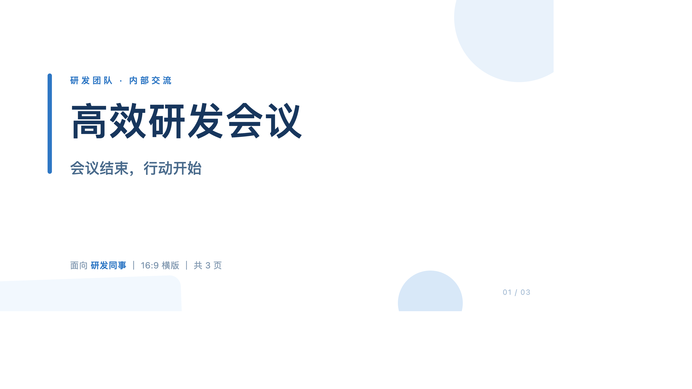
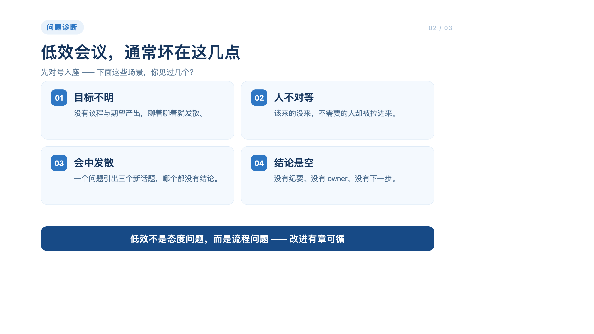
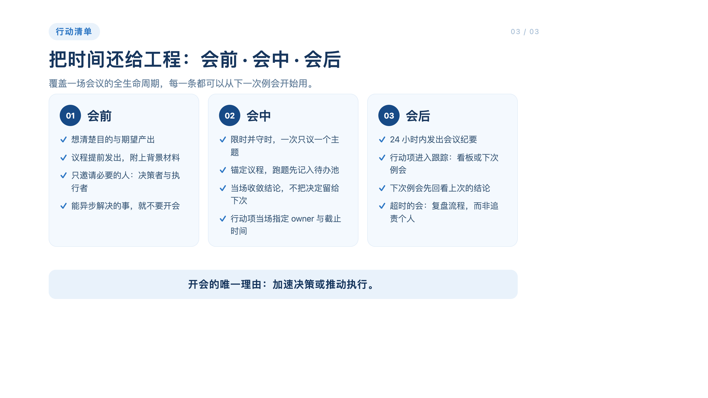

# 实现与验收记录

**结果：DSH + PPT workflow 的正常界面验收通过。** 测试时间为 2026-09-08 至 2026-09-09。对应原始 PR #698，原始 SHA `b627ab9353cefe6b9036ebcd292595f777f2a03a`。当前架构见 [IMPLEMENTATION.md](IMPLEMENTATION.md)。

## 1. 最终产品验收

使用独立运行目录、最初为空的应用数据库、新建 DSH profile 和真实 DeepSeek 模型。仅复用模型配置与第三方运行依赖，不复用原用户的应用数据库或 DSH 历史。

最终验收另建 DSH 会话和 PPT 运行，输入普通业务需求：3 页中文“高效研发会议”，面向研发同事，蓝白风格，关闭 AI 背景图。通过 DSH 的正常选项选择新建；之后仅使用产品界面的编辑、保存、确认、重新生成和导出功能，没有向 Agent 追加修复性指令，也没有直接修改运行数据库使测试通过。

- Workflow：`ppt-workflow`
- 最终 run：`mcp-46eaebad3dea63d45e2b35bbdb08085e`
- 原生 DSH session：`session-6667cdc5-4a86-42ae-b280-02d5713cbf9c`
- 实测组合：macOS arm64、Node 24.14.0、pnpm 10.0.0、原版 DSH 0.1.2-rc.1；Core/CLI 另用仓库指定 Go 1.25.11 验证。

| 步骤 | 实际结果 |
| --- | --- |
| 通过 LazyMind 连接 DSH | 官方 plugin 安装流程完成预编译包、MCP 配置及配对，无 DSH 源码修改。 |
| 自动步骤 | 分析、大纲正常提交；依据工作流条件跳过不需要的素材和背景图分支。 |
| 每页提示词 human 步骤 | 3 个提示词提交后 DSH 交还回合，Core 出现 pending review，界面显示待审阅。 |
| 编辑与保存 | 在原 Markdown 编辑器把第一页副标题改为“会议结束，行动开始”，保存更新审阅版本。 |
| 确认并继续 | 原 DSH 会话收到动作；生成步骤的执行合同包含已确认的准确文本和列表顺序。 |
| 生成 PPT | 实际生成 3 页 HTML 与 3 份讲稿；预览包含修改后的副标题。 |
| 重新生成 | 通过原面板重新生成一次；旧执行/产物变为 stale，当前仍为 3 页，排序中不混入旧页。 |
| 最终确认 | Core 及原面板均进入 completed，审阅后产物转为只读。 |
| 导出 | 使用原有“图片版 PPTX”导出；ZIP 完整性通过，3 个 slide、3 个 notes、3 张页面图像；逐页查看确认均有正确内容。 |

导出文件大小 **1,011,226 字节**，SHA-256：

`f9ef3b558ca49ba023ad4a272693f06e597b7faf10836367621e5a2994b9a49a`

测试浏览器由此前的自动化会话管理，下载目录按 GUID 命名。验收副本与浏览器下载的原文件逐字节一致；没有通过脚本重建或修改 PPT 来替代产品导出。

证据：[运行与检查点](evidence/ppt-run.json)、[导出结构及哈希](evidence/ppt-export.json)。以下图片直接从该浏览器导出的 PPTX 中提取：

## 2. 同一隔离环境中的恢复与故障验收

前置恢复场景使用另一个 PPT run：`mcp-f21f592d148293778b3ced62c1f8048e`，与最终主流程分开记录。

| 场景 | 结果 |
| --- | --- |
| 生成中点击停止 | DSH 原会话停止生成，Core attempt 变为 cancelled，凭证被撤销。 |
| 停止后的迟到提交 | 通过真实 MCP 提交旧执行，返回 `SESSION_STOPPED`，该旧执行新增产物为 0。 |
| 恢复后的旧凭证提交 | 返回 `EXECUTION_FENCED`，旧凭证未因恢复重新生效，新增产物仍为 0。 |
| 从取消状态重试 | 修复入口规则后成功；每个控制命令只生成一份 replacement attempt，宿主认领该准确 ID。 |
| Core 与 DSH 冷启动 | 原待审检查点 ID、版本、manifest hash 完全相同；原会话可读取，标准结果恢复同一个 panel。 |
| 幂等与 Unknown | 自动测试验证重复命令固定回执、冲突请求拒绝、投递租约过期不重发、用原生事件回执对账。 |

## 3. 实测发现的问题均修入代码

- DSH 的实际 MCP 工具名带 12 位哈希后缀，已修正识别及契约用例。
- human 执行授权与后置审阅混淆，已增加明确的合同字段并改用 Core control 显示状态。
- 原文本组件把裸字符串显示成 JSON，引号和换行已在共享组件内修正。
- 已审阅输入只有引用，外部模型可能沿用旧上下文；已在原 outbox 中冻结当前值、版本与顺序。
- 取消状态可重试的投影与执行入口不一致，已统一；已接纳的取消不再永久禁用恢复按钮。
- 回退后的旧页混入当前展示/导出，已修正有效版本筛选和排序成员清理。
- 原导出等待隐藏 iframe 的 rAF 而挂起，已增加有界等待和清理。
- 原兼容 CSS 会隐藏 html-to-image 生成的外层 foreignObject，已限定到源页面内部。修复后重新通过产品按钮导出，逐页图像验收通过。

## 4. 自动检查

| 检查 | 结果 |
| --- | --- |
| Core：`go test ./workflow/... -count=1`，Go 1.25.11 | 通过 |
| Core OpenAPI 路由覆盖及新增协议契约 | 通过 |
| SQLite/PostgreSQL：fresh、upgrade、dev/release 等价、down 路径 | 通过 |
| PostgreSQL：绑定、投递、停止恢复、幂等 replacement | 通过 |
| CLI：`go test ./... -count=1`，Go 1.25.11 | 通过 |
| DSH：精确版本 SDK `typecheck`、15 个契约/组件测试、bundle | 通过 |
| 前端：控制 4、共享文本编辑 1、既有审批 2、导出回归 5 | 通过，共 12 个 |
| Python workflow SDK | 通过，12 个测试 |
| 前端生产构建、OpenAPI 生成缓存一致性 | 通过 |
| 全量 TypeScript 相同依赖对照 | 零新增诊断；原始分支仍有既有错误，不宣称全仓 TS 绿灯。 |
| 既有 Writer 文档测试 | 原始分支及修复分支均有相同的 2 个失败，本次未更改相邻 Writer 行为以掩盖。 |
| 新 CI | 已提供面向作者分支的工作流；远端 Actions 授权和运行状态以 GitHub 为准。 |

本次不宣称 Windows/Linux 的完整桌面联调、其他 DSH 版本、Codex/WorkBuddy 原生 panel 或可编辑 PPTX 导出已通过实测。图片版 PPTX 是本轮明确验收的导出方式。
