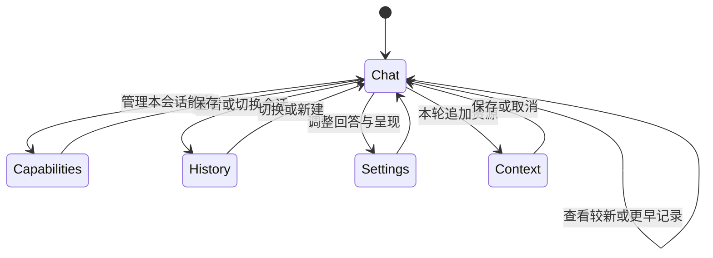
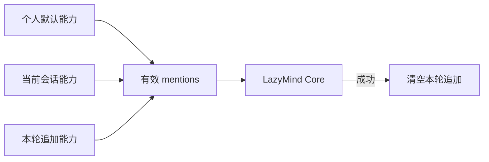
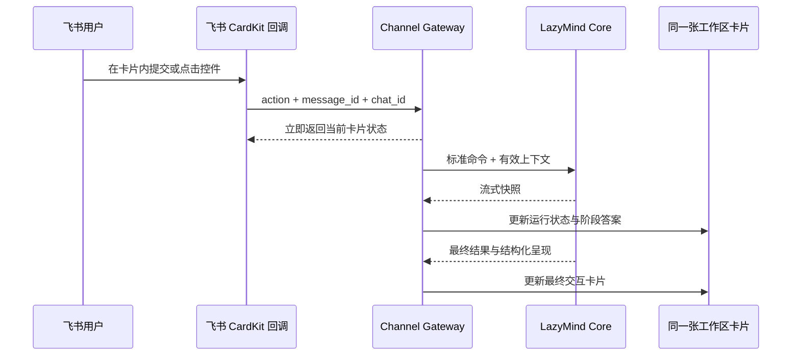

# 飞书 CardKit 单卡工作区

## 范围与验收

本方案只调整飞书私聊交互。LazyMind Web、Core 资源语义和其他渠道不在
修改范围内。目标是在一张 CardKit JSON 2.0 卡片中完成原型
`lazymind-cardkit-v2-prototype.html` 的交互：

1. 首条私聊即创建工作区卡片；后续状态、流式回答和结果均更新同一消息。
2. 对话、能力、历史、设置四个主页面可往返，页面切换不丢当前任务。
3. 对话在卡片内提交；最近记录每页显示 3 轮，可查看较新或更早记录。
4. 历史页切换会话后，对话页同步恢复目标会话的文本与能力上下文。
5. 个人、会话和本轮三层能力上下文均有明确选中反馈。
6. Ask、任务、图片、文件、产物、引用和流式状态继续复用同一卡片。
7. 卡片失效时只创建一张替代工作区卡片。
8. 全量文件、类、函数、导入、继承和可解析调用图均可渲染且无环。

## 产品状态

## 对话输入与历史记录决策

飞书原生输入框发出的用户消息属于用户消息，机器人只能撤回自己发送的
消息，因此无法可靠实现“使用底部输入框、但不在消息流中追加用户气泡”。
平台限制见[飞书撤回消息接口](https://open.feishu.cn/document/server-docs/im-v1/message/delete?lang=zh-CN)，
卡片表单能力见[飞书输入框组件](https://open.feishu.cn/document/feishu-cards/card-components/interactive-components/input)。
本实现采用卡片内表单：

- 多行输入框自动扩展，提交后转成标准 `chat` 命令；
- 卡片运行中禁用提交，Ask 等待时只保留 Ask 回答控件；
- 当前完成轮次在下一轮开始前归档；
- 每页显示 3 轮，先浏览本地页，再通过 Core 游标加载更早记录；
- 卡片状态最多保留最近 60 轮，避免工作区状态无限增长；
- 相同文本的重复对话不会被错误去重。

CardKit 没有可编程的卡片内部滚动容器，所以历史记录采用卡片内分页，
不依赖飞书消息流向下堆叠。

## 原型功能对应

- **对话：** 当前会话、运行/完成状态、可折叠执行摘要、回答、来源、图片、
  卡片输入、本轮追加资源和历史记录分页。
- **能力：** 知识库、Skill、Workflow、Tool 的直接选择；超过概览容量后按分类
  分页管理；Workflow 自动/确认、SubAgent、个性化和应用到本会话。
- **历史：** 最近会话切换、新会话面板、空白/继承能力模式，以及目标会话
  最近记录与能力上下文恢复。
- **设置：** 回答深度、输出语言、执行摘要、完成后折叠、来源、结果标记、
  返回时恢复页面，以及需要确认的维护动作。
- **高级结果：** Ask、任务、图片、文件、产物、引用和流式状态保留在统一
  工作区契约内。

能力概览每组最多显示 6 项，`管理全部` 每页显示 10 项，确保所有资源都可
访问且卡片体积保持在飞书限制内。Prompt 采用一键直接发送，不覆盖卡片输入。

## 上下文语义

- 会话能力按 LazyMind 会话 ID 保存，切换历史会话后重新计算。
- 本轮追加只在 Core 成功接收一轮后消费。
- 本轮追加沿用 provider-neutral 的自然语言能力命令；飞书适配器不再维护
  一套独立的“清空本轮资源”按钮或事务旁路。
- 知识库、Skill、Workflow、Tool 和会话继续使用 Core 的 `mentions` 契约。
- 最多激活一个 Workflow 和三个会话引用，与 Core 校验一致。

## 传输路径

历史选择使用独立的 `history.switch` 工作区动作。它不复用旧聊天操作标识，
目标会话返回后会原子替换标题、最近记录和能力上下文，从而避免“历史页已选中、
对话页仍停留在旧会话”的状态竞争。

## 结构与验证

`tools/feishu_architecture.py` 是唯一结构清单生成器。它从源码生成：

- 全部纳入范围的文件；
- 全部类、函数和方法；
- 文件导入、类继承和可解析调用关系；
- 分页 Mermaid 图以及三类环检测结果。

正式交付记录写入本文件前，必须同时满足：聚焦回归通过、正式容器健康、真实
LazyMind Core 调用通过、真实飞书既有绑定消息接受卡片更新、原卡片恢复、日志
无卡片更新错误，以及最终全量 Mermaid 逐图可视检查通过。

## 2026-08-06 真实服务验收

- 正式 Compose 网关使用当前源码重建，容器内 54 项飞书回归全部通过，服务
  健康检查为 `healthy`，飞书 WebSocket 已连接。
- 真实 LazyMind Core 返回 6 轮目标会话记录；不是测试桩或伪造数据。
- 真实飞书既有绑定消息连续接受 4 次更新：卡片输入、第二页历史、历史会话
  选择、切换后对话；载荷分别为 6395、6078、6487、6395 字节。
- 四次更新都使用同一个 `message_id`，没有创建测试卡片；验收结束后原卡片
  已恢复，数据库工作区状态逐字段比较保持不变。
- 验收后网关日志没有 warning、error 或卡片更新失败记录。
