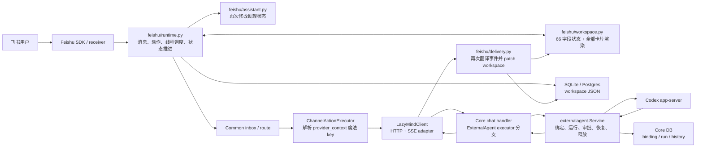
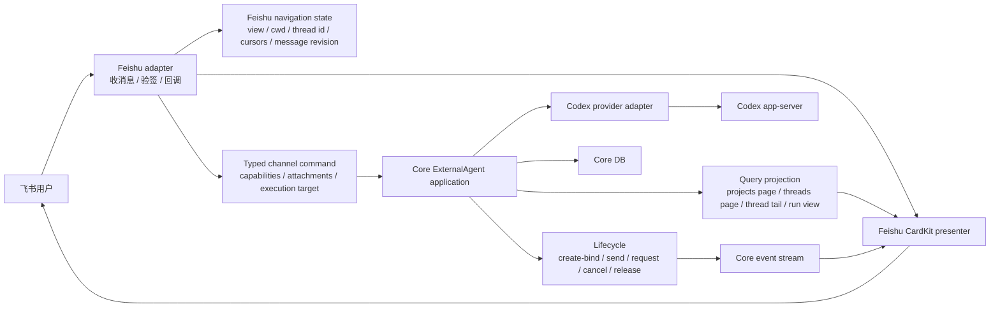

# 飞书 × ExternalAgent × Route 架构诊断

> 状态：等待架构方案审批；本文件不代表已开始结构性重构。
>
> 范围：`channel-gateway`、Core `externalagent`、ExternalAgent chat route、当前 PR 涉及的 Workflow 路由。LazyMind 其他功能不在本次诊断范围内。

## 1. 仓库与证据基线

- 仓库：`LazyAGI/LazyRAG`（当前工作副本同时配置 fork `chenhao0205/LazyRAG`）
- 分支：`ch/feishu_update`
- 基线提交：`69d9b677057fdccbbc3f1df7845576a8cc9377e6`（`merge main`）
- 当前工作树：已有大量未提交的本 PR 修改；诊断没有覆盖或丢弃它们。
- 聚焦扫描结果：
  - `backend/channel-gateway`：48 个代码文件，27,714 行非空代码，0 个静态 import 环，13 个超大文件。
  - `backend/core/externalagent`：5 个代码文件，3,056 行非空代码；`service.go` 单文件 1,686 行非空代码。
  - 飞书目录中：`workspace.py` 3,528 行、`runtime.py` 2,472 行、`delivery.py` 1,233 行。
- 验证现状：
  - `core-dev` 容器内 `go test ./externalagent ./chat` 通过。
  - `git diff --check` 通过。
  - 全仓 Workflow 命名检查失败，共 315 个违规，集中在生成的 OpenAPI 文档；本诊断范围的脚本检查虽通过，但仍存在脚本没有识别到的裸 `plugin` 用户文案，说明门禁自身也有盲区。
  - `channel-gateway` 没有自动化测试文件，也没有进入当前 CI 的 Python 测试步骤。

## 2. 结论

当前实现完成了若干功能修复和文件内整理，但**没有完成架构重设计**。主要问题不是“文件太大”，而是：

1. Core 已经持有 ExternalAgent 的权威运行状态，飞书侧又持久化并推进了一套近似相同的状态机。
2. `provider_context: dict[str, Any]` 被当成跨层语义总线，Common route 依靠魔法 key 推断飞书能力和 ExternalAgent 执行目标。
3. 一个飞书助理动作同时穿过渲染、运行时、状态 helper、Core port、HTTP adapter、Core HTTP、Core service、Codex client；其中多层不只是转发，还重复解释和修改状态。
4. 因为状态所有权没有改变，把 helper 搬到 `assistant.py` 或 CardKit primitive 搬到 `cardkit.py` 只能改善文件布局，不能消除并行状态机、竞态和改动扩散。

判断：**架构门禁不通过，禁止继续以“大文件拆分”为主线重构。**

## 3. 当前架构



这张图没有 import 环，不等于架构健康。真正的环是**状态反馈环**：Core 事件被飞书翻译成 workspace 副本，后续动作又依据这个副本决定是否可以调用 Core。

## 4. 关键诊断

### P0 — 飞书持有并行的 ExternalAgent 状态机

`FeishuWorkspaceState` 有 66 个字段，其中 27 个是 `assistant_*`；除项目列表和线程列表外，其余 25 个助理字段都会写入 workspace JSON。它们包括：

- Core 身份：`assistant_conversation_id`、选中 thread id；
- Core thread 投影：标题、来源、cwd、更新时间、available、created/controlled；
- Core run 投影：`run_status`、pending request、answer/thinking/status；
- Core history 投影：turns、offset、total；
- 飞书导航：mode、project cwd、页码、cursor stack。

只有最后一类属于渠道状态。其余都可以从 Core 的 thread、binding、run snapshot 和事件恢复。

证据：

- 状态定义与序列化：[workspace.py](../../backend/channel-gateway/channel_gateway/feishu/workspace.py#L187)、[workspace.py](../../backend/channel-gateway/channel_gateway/feishu/workspace.py#L442)
- runtime 预修改状态、开后台线程、执行远程动作、再次保存：[runtime.py](../../backend/channel-gateway/channel_gateway/feishu/runtime.py#L739)、[runtime.py](../../backend/channel-gateway/channel_gateway/feishu/runtime.py#L839)
- helper 再次实现 thread/snapshot 状态转换：[assistant.py](../../backend/channel-gateway/channel_gateway/feishu/assistant.py#L179)、[assistant.py](../../backend/channel-gateway/channel_gateway/feishu/assistant.py#L247)
- delivery 第三次把 SSE 事件翻译为 workspace patch：[delivery.py](../../backend/channel-gateway/channel_gateway/feishu/delivery.py#L78)、[delivery.py](../../backend/channel-gateway/channel_gateway/feishu/delivery.py#L380)
- renderer 第四次根据本地 run/pending/readonly 状态决定交互：[workspace.py](../../backend/channel-gateway/channel_gateway/feishu/workspace.py#L2942)

直接后果：

- Core 与 workspace 任一更新先后不同，卡片就可能暂时显示错误的可写性、审批、取消或释放状态。
- revision 只保护部分 runtime 后台动作，delivery 的流式 patch 是另一条并发写路径。
- 重启恢复必须同时让 Core run、Core binding、workspace JSON 和 Feishu 卡片四者重新一致。

### P0 — `provider_context` 是无类型的跨层协议

`InboundEnvelope` 和 `ClaimedInbound` 只声明 `provider_context: dict[str, Any]`，但其中承载了 `workspace_state`、`workspace_resources`、`external_agent_binding`、`chat_inputs`、`workspace_surface`、`command_action` 等业务语义。

Common route 当前通过“是否存在 `workspace_resources`”推断要加载 Workflow/Tool catalog，并据此改变 workflow mode；Action executor 又从相同字典拼 ExternalAgent executor。

证据：

- 无类型通道上下文：[channel.py](../../backend/channel-gateway/channel_gateway/common/domain/channel.py#L75)、[channel.py](../../backend/channel-gateway/channel_gateway/common/domain/channel.py#L101)
- route 通过魔法 key 推断能力：[routing.py](../../backend/channel-gateway/channel_gateway/common/application/routing.py#L259)
- action executor 解析 workspace 与 external binding：[actions.py](../../backend/channel-gateway/channel_gateway/common/application/actions.py#L90)、[actions.py](../../backend/channel-gateway/channel_gateway/common/application/actions.py#L364)、[actions.py](../../backend/channel-gateway/channel_gateway/common/application/actions.py#L421)

这比 `provider == 'feishu'` 特判隐蔽，但没有真正解耦：Common application 仍然知道飞书 workspace 的内部 key，只是把显式渠道名换成了鸭子类型判断。

### P0 — Core 的 aggregate 边界也被拆开

Core `externalagent.Service` 已经是权威状态所有者：它维护 active run、pending request、provider subscription、DB run/binding，并在 terminal event 前完成 unsubscribe release barrier。

但 attach/bind conversation 的 HTTP 入口在 `chat` package，list/read/snapshot/interrupt/release/respond 在 `externalagent` package，实际发送又复用通用 `/conversations:chat` 的 executor 特判。这导致“ExternalAgent 会话”横跨两个应用服务边界。

证据：

- Core 权威状态：[service.go](../../backend/core/externalagent/service.go#L178)
- terminal release barrier：[service.go](../../backend/core/externalagent/service.go#L1460)
- ExternalAgent chat 特判：[conversation.go](../../backend/core/chat/conversation.go#L107)、[conversation.go](../../backend/core/chat/conversation.go#L255)
- binding handler 位于 chat package：[external_agent.go](../../backend/core/chat/external_agent.go#L213)
- 路由把 binding 与其余 ExternalAgent 命令分开：[routes.go](../../backend/core/routes.go#L259)

目标不是新建更多 service/interface，而是让一个 Core 应用边界完整拥有：选择/绑定、执行、审批、取消、terminal、释放和查询投影。

### P1 — 项目投影每次刷新最多扫描 10,000 个 Codex thread

`ListProjects` 每次请求循环最多 100 页，每页 100 个 thread；飞书拿到全量项目后再做本地页码切片。

证据：[service.go](../../backend/core/externalagent/service.go#L261)、[workspace.py](../../backend/channel-gateway/channel_gateway/feishu/workspace.py#L2657)

虽然当前实现已按 actor 过滤 `BoundByOther`，但这仍然有延迟、资源占用和卡片刷新放大问题。项目投影应由 Core 做有界分页与缓存/索引，飞书只传 cursor。

### P1 — Core `service.go` 是多职责模块，但现在不应先拆文件

`service.go` 同时包含：thread/project 查询、binding、run 创建、恢复、事件消费、fork、history、审批、interrupt、release。它确实需要按应用职责收敛，但如果先拆文件，仍然只是移动 1,700 行代码。

正确顺序是：先把 Gateway 的重复状态删除并确定 Core 唯一所有权；再依据已经形成的 query/command/provider 边界决定是否拆分 Core 内部文件。

### P1 — Workflow 名称迁移的门禁不可信

积极部分：`channel-gateway` 当前 Python 源码已无 `plugin` 标识，`ResourceType`、settings 与 mention 都已使用 `workflow`。

仍需修复：

- Core route 流程仍返回“plugin mention/session”用户文案：[conversation.go](../../backend/core/chat/conversation.go#L306)
- 命名检查脚本声称裸 `plugin` 不允许，但正则实际上只识别 `plugin_`、`plugin-`、`PluginXxx`、`pluginXxx`，因此上述文案未被发现。
- 全仓检查被未重新生成/未迁移的 OpenAPI JSON 阻断，共 315 项。

结论：不能把“脚本通过某个子目录”当作迁移完成；需要修正检查器、改源代码、重新生成 OpenAPI，再以零违规为准。物理数据库表名是否保留，应只遵循主分支已经确定的持久化约束，不在飞书层做兼容。

### P1 — 没有可支撑删除的 Gateway oracle

Core 的 `externalagent` 与 `chat` 测试通过，但 channel-gateway 没有对应测试，也没有 CI 任务。当前真实服务手测提供了重要证据，却没有形成可重复、可比较的 trace oracle。

在删除并行状态机前，必须先固化真实链路验收：项目分页、thread tail、两轮续接、同卡 streaming、四类 request、cancel、terminal release、进程恢复、双用户隔离，并保留 Core conversation/run/thread/request id 与 Feishu message id。

### P2 — 当前 API 形状制造额外读取与状态复制

- 打开 thread 为获取最后一页，需要先读 total，再读一次末页：[runtime.py](../../backend/channel-gateway/channel_gateway/feishu/runtime.py#L1172)
- stream 完成后 delivery 又重复同样的“先 probe total、再读末页”逻辑：[delivery.py](../../backend/channel-gateway/channel_gateway/feishu/delivery.py#L284)
- “新建会话”按钮只建立本地 draft，第一次输入时才真正创建 Codex thread：[assistant.py](../../backend/channel-gateway/channel_gateway/feishu/assistant.py#L146)、[runtime.py](../../backend/channel-gateway/channel_gateway/feishu/runtime.py#L537)
- 创建失败文案仍写成“创建 ChatGPT 对话失败”：[runtime.py](../../backend/channel-gateway/channel_gateway/feishu/runtime.py#L546)

Core 应直接支持 `tail`/末页读取；新建按钮应直接创建并返回可选中的真实 thread，而不是让 Gateway 持有“尚不存在的 ExternalAgent 会话”。

## 5. 应保留的实现

以下能力方向正确，不应在架构重构中推倒重写：

- Core 使用 Codex 原生 `cwd` 精确过滤 thread。
- Core 区分 `created_by_lazymind` 与 `controlled_by_lazymind`。
- terminal event 在 release barrier 之后广播，失败会显式返回 `control_release=failed`。
- Core 支持 command、file change、permissions、user input 四类请求及 actor 校验。
- Workflow UI 文案已改为“分步确认”，明确说明不是首步执行前确认。
- Common application 已移除显式 `provider == 'feishu'` 分支。
- CardKit primitive 统一是合理的呈现层收敛，但它不是架构重构本身。

## 6. 目标架构原则

1. **Core 是唯一业务真相。** Thread、binding、run、pending request、control/release、native turns 都只由 Core/Provider 持有。
2. **Gateway 只持渠道状态。** 只保存导航选择、cursor、UI preference、Feishu message id/revision；不保存 Core 运行副本。
3. **查询与命令分开。** Core 提供 channel-neutral view DTO；Gateway 将用户动作翻译为 Core command，再重新查询/订阅 view。
4. **Common 不识别 Feishu 魔法 key。** Provider adapter 在入口处构造有类型的 capability selection、attachments、execution target。
5. **新增抽象必须立即删除旧实现。** 不保留新旧状态机并行，也不做 plugin 兼容层。

## 7. 推荐目标架构



目标依赖方向是单向的：

```text
Feishu transport → typed channel command/navigation → Core application → Codex adapter
Core query/event DTO → Feishu presenter → CardKit
```

目标 Gateway 不再拥有 `run_status`、pending request、thread metadata、conversation binding、turns、control flags。它只拥有“用户正在看哪里”和“更新哪张飞书卡片”。

## 8. 可选方案（需要明确审批）

### 方案 A：原地精简，不改所有权

- DX 改善：低；减少重复 helper、文案和少量状态字段。
- 精简收益：低；无法删除 workspace run/thread/pending 副本。
- 改什么：修复命名、重复读取、错误文案，继续使用现有状态机。
- 不改什么：Core/Gateway 所有权、`provider_context` 协议、运行时并发模型。
- 所需 oracle：现有 Core 测试 + 真实 Feishu smoke。
- 风险/回滚：风险最低，可逐文件回滚。
- 适用：只允许小修、短期必须合并时。
- 结论：**不能满足本次“架构重新设计”要求。**

### 方案 B：Gateway 内做 Feature Slice

- DX 改善：中；把助理 action/state/presenter 放到一个 feature 边界，减少 runtime/workspace 的扩散。
- 精简收益：中低；可以删除一些跨文件 helper，但仍保留 Core 状态副本。
- 改什么：Gateway 内部按 assistant feature 收口；Common 使用 typed context。
- 不改什么：Core API 与 Gateway 的 session/run 状态所有权。
- 所需 oracle：真实 Feishu trace + Gateway contract 测试。
- 风险/回滚：中等；可按 feature 门面回滚。
- 适用：Core 本轮绝对不能改时。
- 结论：比当前好，但仍属于“更有组织地维护重复状态”。

### 方案 C：Core 唯一状态 + Thin Feishu Adapter（推荐）

- DX 改善：高；状态问题只在 Core 调试，渠道只处理输入与呈现。
- 精简收益：高；可删除 25 个持久化助理派生字段，以及 `apply_thread`、`apply_snapshot`、SSE→workspace patch、完成后 history 双读等整条重复链。
- 改什么：
  1. Core 提供分页 project/thread/tail/run view；create 在按钮动作时真实发生。
  2. Core ExternalAgent 应用边界完整拥有 bind/send/request/cancel/release。
  3. Common 使用 typed execution/capability context。
  4. Gateway workspace 仅保留 navigation/UI/message revision。
- 不改什么：Codex app-server 协议、Core DB binding/run 语义、Feishu CardKit 视觉、普通 LazyMind chat。
- 所需 oracle：先建立真实服务 trace oracle；Core contract test 作为补充，不能替代真实 Feishu/Codex 验收。
- 风险/回滚：主要风险是流式卡片与重启恢复；按 query、command、删除副本三个阶段提交，每阶段可独立回滚。
- 适用：当前需求——真正重设架构并以净删除收尾。

**推荐审批方案 C。**

## 9. 方案 C 的执行门禁

只有在用户明确批准方案 C 后，才开始结构性修改。

1. 真实 oracle：把现有手测步骤固化为可重复运行的 trace，记录所有跨服务 id 和时间戳。
2. Typed boundary：先消除 Common 对 `provider_context` 魔法 key 的业务判断，同时修复 Workflow 命名门禁。
3. Core projection：实现有界 project 分页、thread tail、canonical run view；真实服务验证前后结果一致。
4. Thin adapter：逐项删除 workspace 中的 Core 派生字段和 mutator；每删除一组就跑真实 trace。
5. 收尾：只在所有权已稳定后整理 Core 内部职责；目标是净删除，不以新增目录/接口数量为成绩。
6. 最终验收：Core 测试、Workflow 命名零违规、真实 Feishu/Codex 全流程、Mermaid 依赖图视觉检查全部通过。

## 10. 信心与未知项

- 高信心：并行状态机、无类型 context、项目全量扫描、Gateway 测试缺失、Workflow 门禁盲区均有直接代码证据。
- 中信心：方案 C 能显著净删 Gateway 代码；精确删除行数必须在真实 oracle 建立后再量化，当前不做虚假估算。
- 尚未验证：真实 Feishu 移动端恢复、permissions 请求的自然触发、进程重启后的 pending request 恢复。这些必须进入方案 C 的真实验收，而不能以单元测试替代。
