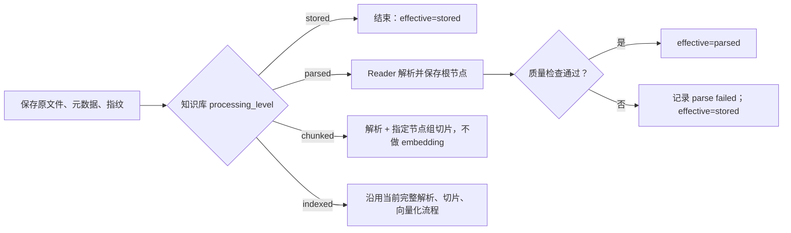

# 知识库分级处理与按需读取改造计划

> 状态：设计方案，暂不实现  
> 目标：在不破坏现有知识库行为的前提下，让知识库可以作为普通资料库使用，并按需升级为可解析、可搜索或可向量检索的知识库。  
> 改造原则：优先修改 Core、Frontend、Chat；复用 LazyLLM 现有能力，仅在“只切片、不向量化”无法安全落地时对 LazyLLM 做一个向后兼容的小扩展。

## 1. 结论

该能力适合实现，但不应只给知识库或文档增加一个可变枚举。推荐同时保存两类状态：

1. **知识库目标级别 `processing_level`**：用户选择的全局工作模式，取值为 `stored`、`parsed`、`chunked`、`indexed`。
2. **文档各阶段实际状态**：分别记录解析、切片、索引是否未开始、执行中、成功、失败或已过期，据此计算文档的 `effective_level`。

这样可以表达“知识库目标是 indexed，但某个扫描 PDF 因 OCR 缺失仍停留在 stored”，也可以支持升级补齐、降级保留产物、失败重试和配置变化后的增量重建。单一文档状态枚举无法可靠表达这些情况。

本方案判断：

- `stored`、`parsed`、`indexed` 可大量复用现有能力。
- `chunked` 必须作为独立级别。切片结果是全文搜索和父子段读取的基础，但不等同于向量索引。
- Core 当前在上传和创建任务前强制检查 `embed_main`，需要把检查下移到真正进入 `indexed` 的操作。
- LazyLLM 已支持指定节点组、`slice_missing` 和 `reembed`；但现有 `lazy_mode` 是节点组配置，不适合充当每个知识库的处理级别。
- “切片但不生成 embedding”建议先做一次技术验证；如果现有存储链路不能安全接受无向量节点，只需给 LazyLLM 增加一个默认关闭的任务级 `skip_embedding` 参数。
- 按需读取应复用 Core 的同一套文档物化服务。不要让 Core 的 `read` 再通过 HTTP/MCP 回调自己；MCP 和 Chat 都应作为适配层调用该服务。

## 2. 级别语义和能力矩阵

### 2.1 知识库全局级别

| 级别 | 必须持久化的产物 | 是否需要 embedding | 对外能力 |
| --- | --- | --- | --- |
| `stored` | 原文件、基础元数据、内容指纹 | 否 | `list`、`read`；首次读取可触发解析并缓存 |
| `parsed` | 以上 + reader 解析结果/根节点 | 否 | `list`、`read` |
| `chunked` | 以上 + 切片及切片元数据 | 否 | `list`、`read`、`search`（文档库全文/关键词检索） |
| `indexed` | 以上 + embedding 与向量索引 | 是 | `list`、`read`、`search`、`retrieve`（语义检索） |

这里的 `search` 与 `retrieve` 必须在接口和产品文案中明确区分：

- `search`：基于切片存储做关键词、全文或 BM25 类检索，不依赖 embedding。
- `retrieve`：基于 embedding 的语义召回，可叠加 reranker。

为保持兼容，现有 `knowledge.search` 和 Chat `kb_search` 暂时保留原来的向量检索语义；新接口先增加明确命名，稳定后再考虑统一命名。

### 2.2 全局目标与文档实际状态

`processing_level` 是知识库的全局配置，不在第一版提供“单个文档目标级别”。每个文档只记录实际完成度和失败信息：

```text
parse_status:  pending | running | succeeded | failed | stale
chunk_status:  pending | running | succeeded | failed | stale
index_status:  pending | running | succeeded | failed | stale
effective_level: 由以上状态与产物是否存在计算，不作为唯一事实源
```

计算规则：

- 原文件存在：至少为 `stored`。
- `parse_status=succeeded`：至少为 `parsed`。
- 解析成功且 `chunk_status=succeeded`：至少为 `chunked`。
- 前述成功且 `index_status=succeeded`：为 `indexed`。
- 上游失败时，下游不得标记成功；旧产物可以保留，但若其输入指纹不匹配则标记为 `stale`，不能参与默认检索。

处理失败不改变知识库的全局目标。例如目标为 `indexed`，扫描 PDF 解析失败时，文档的 `effective_level` 仍为 `stored`，UI 同时展示失败原因和知识库目标。

### 2.3 过渡期能力

知识库升级期间不必阻塞全部使用：

- `list`、`read` 始终可用。
- 目标级别达到 `chunked` 后开放 `search`，但只检索切片成功且未过期的文档。
- 目标级别达到 `indexed` 后开放 `retrieve`，但只召回索引成功且未过期的文档。
- 响应附带 `coverage`（可用文档数、总文档数、失败/处理中数量），避免算法误以为结果覆盖完整知识库。

## 3. 现有能力复用评估

### 3.1 可以直接复用

#### LazyLLM

- reader 加载原文件并生成根节点，可作为 `parsed` 产物。
- `ng_names` 可限定本次处理的节点组。
- `slice_missing` 可用于升级时只补缺失切片。
- `reembed` 可用于已有切片的向量化或 embedding 配置变更后的重建。
- 节点组、父子节点和 segment store 可作为 `chunked` 的存储与读取基础。
- segment store 的关键词检索能力可支撑 `search`。
- 现有完整 add-doc 流程可继续作为 `indexed` 的兼容快路径。

#### Core

- 原文件上传、下载、文档列表、内容读取、任务与异步任务框架可以复用。
- 已有文档重解析接口和 `ReparseGroups/ng_names` 数据通路可复用。
- 已有 MCP 工具 `knowledge.document.list`、`knowledge.document.get`、`knowledge.search` 可保留并扩展。
- 模型 readiness 检查可以复用，只需从“所有上传前置条件”调整为“目标动作所需能力检查”。

#### Chat

- `KBToolkit` 的知识库列表、文档列表、关键词查询、父子节点读取能力可以复用。
- 现有向量 `kb_search` 保持行为不变，作为兼容接口继续工作。

### 3.2 需要增强

#### Core（主要改造面）

- 数据集增加全局 `processing_level`、过渡状态和配置版本。
- 文档增加阶段状态、错误、产物指纹和版本。
- 上传流程根据知识库目标选择只存储、解析、切片或完整索引。
- 新增统一的 `read/materialize` 编排：无解析缓存时按需解析、等待、缓存后返回。
- 新增级别切换、升级补齐、手动清理和处理覆盖率接口。
- 将 embedding 限制从上传入口移到索引入口。
- 增加 reader/OCR 预检和解析质量判定。

#### Frontend

- 创建知识库时选择默认处理级别。
- 只在选择 `indexed` 时强制要求 embedding。
- 无 MinerU/PaddleOCR 时展示风险确认；接受后使用内置 PDF reader。
- 知识库详情展示目标级别、过渡进度、文档有效级别和各阶段错误。
- 支持切换级别、重试失败项和手动清理保留产物。

#### Chat

- 给 `KBToolkit` 增加通用文档 `read`。
- 增加不依赖 embedding 的文本 `search`，并把语义 `retrieve` 暴露为清晰能力。
- 根据 Core 返回的能力矩阵选择工具；不再因缺少 embedding 判定整个知识库不可用。

### 3.3 不能直接复用、需要新增

- 知识库目标级别与文档分阶段状态模型。
- 按需读取的并发合并、等待和失败语义。
- 解析/切片/索引产物的配置指纹与过期判断。
- 降级后的显式清理操作。
- 解析质量门槛，特别是扫描 PDF 在无 OCR 时的可解释失败。
- `search` 与 `retrieve` 的新能力声明及覆盖率返回。

## 4. 推荐数据模型

### 4.1 知识库字段

建议在数据集表增加可查询字段，不把核心状态只塞进 `Ext`：

```text
processing_level          stored | parsed | chunked | indexed
processing_revision       integer，级别/算法配置每次有效变更递增
transition_status         idle | upgrading | completed_with_errors
reader_fallback_accepted  boolean
processing_config         json，reader、切片算法、索引配置的稳定引用
```

如果希望进一步减少第一版迁移字段，`processing_config` 可先复用现有数据集扩展配置，但 `processing_level` 必须是独立、可索引字段。

### 4.2 文档处理状态表

推荐新增 `document_processing_states`，而不是把多个热查询状态放进文档 `Ext`：

```text
dataset_id, document_id
parse_status, chunk_status, index_status
parse_error_code, parse_error_message
chunk_error_code, chunk_error_message
index_error_code, index_error_message
source_fingerprint
parse_fingerprint, chunk_fingerprint, index_fingerprint
parser_version, chunker_version, embedding_version
parse_artifact_ref, chunk_artifact_ref, index_artifact_ref
revision, updated_at
```

指纹至少包含：

- `source_fingerprint`：文件内容哈希；不要只用文件名、URL 或外部论文 ID。
- `parse_fingerprint`：源文件指纹 + reader 类型/版本 + OCR 配置版本。
- `chunk_fingerprint`：解析指纹 + 节点组/切片算法配置版本。
- `index_fingerprint`：切片指纹 + embedding 模型标识、维度和关键参数。

状态更新采用 CAS/乐观锁或唯一幂等键，避免多次读取同时触发重复解析。

## 5. 处理与状态切换流程

### 5.1 新文档入库



建议保留 `indexed` 的现有完整流程作为首期兼容路径，减少对稳定路径的影响。

### 5.2 升级

- `stored -> parsed`：运行 reader，只保存解析根节点。
- `parsed -> chunked`：对解析成功的文档执行选定节点组切片；使用 `slice_missing` 补齐。
- `chunked -> indexed`：先检查 `embed_main`，对现有切片执行 `reembed`。
- `stored -> indexed`：可直接走当前完整处理流程；已有中间产物则查漏补缺。

升级是异步知识库任务。任务按文档幂等执行，失败不回滚其他成功文档，最终状态可为 `completed_with_errors`。

### 5.3 降级

降级只改变知识库的能力上限，不删除产物：

- `indexed -> chunked` 后禁止新的向量 `retrieve`，但保留向量数据。
- `chunked -> parsed` 后禁止 `search`，但保留切片。
- `parsed -> stored` 后默认读取仍可使用已有解析缓存；知识库目标只表示不再主动预处理。为避免概念混乱，UI 应显示“已保留缓存”，而不是假装产物不存在。

若要求降级后严格按目标屏蔽缓存，也只屏蔽对外能力，不修改文档事实状态。文档 `effective_level` 仍可高于知识库 `processing_level`。

### 5.4 手动清理

清理必须独立于级别切换，并二次确认：

- 清理索引：删除向量索引/embedding，保留切片。
- 清理切片：删除派生节点组，保留解析结果。
- 清理解析缓存：删除解析根节点/文本缓存，保留原文件和元数据。

默认清理范围是“当前知识库中高于目标级别的产物”，接口支持 dry-run 返回预计文档数和空间占用。清理失败应可重试，不得删除原文件。

## 6. Reader、OCR 与失败策略

### 6.1 创建和切换时预检

- `stored`：不检查 reader、OCR 或 embedding。
- `parsed`、`chunked`：检查可用 reader。未配置 MinerU/PaddleOCR 时，不阻止创建，但必须显示风险确认。
- `indexed`：除上述 reader 风险确认外，必须检查 `embed_main`；未配置则禁止创建或切换到 `indexed`。

建议返回结构化预检结果，而不是由前端拼接规则：

```json
{
  "allowed": true,
  "blocking": [],
  "warnings": [
    {
      "code": "OCR_PROVIDER_NOT_CONFIGURED",
      "fallback": "builtin_pdf_reader",
      "message": "扫描版或图片型 PDF 可能无法获得可靠文本。"
    }
  ]
}
```

用户确认后提交 `reader_fallback_accepted=true`。这个确认记录在知识库配置及审计日志中，后续批量升级不重复弹窗，配置改变后可重新提示。

### 6.2 内置 PDF reader 降级

无 MinerU/PaddleOCR 时使用内置 PDF reader，但需要质量门槛：

- 页数大于零但提取文本为空。
- 单页平均可见字符数明显过低。
- 页面以图片对象为主且几乎无文本层。
- reader 返回明确的 encrypted、unsupported 或 corrupted 错误。

满足强失败条件时：

- `parse_status=failed`。
- 错误码优先使用 `OCR_REQUIRED`、`PDF_ENCRYPTED`、`UNSUPPORTED_FORMAT`、`PARSE_EMPTY_OUTPUT` 等稳定枚举。
- 文档 `effective_level=stored`。
- 原文件、元数据和指纹仍可 list、download；`read` 返回可解释错误和配置入口，不写入空解析结果。

质量阈值只用于判断“不可用”，不能把普通短论文、封面或图表多的 PDF 误判为失败，因此需要真实样本回归集。

## 7. 按需 read 的统一实现

### 7.1 推荐调用边界

新增 Core 内部 `DocumentMaterializationService.Read`（名称可调整）：

1. 校验用户对知识库和文档的读取权限。
2. 文本原文件可安全直读时直接返回。
3. 若存在有效解析产物，读取解析结果。
4. 若只有原文件，使用 `(document_id, parse_fingerprint)` 作为幂等键创建或复用解析任务。
5. 在限定超时内等待任务完成；成功后读取缓存并更新阶段状态。
6. 失败或超时返回结构化状态；后台任务可继续，调用方可以轮询。

MCP `knowledge.document.get`、Core HTTP content/read 接口和 Chat `KBToolkit.read` 都调用这一个服务。这样可以实现用户希望的“read 时解析并缓存”，同时避免内部通过 MCP 环回调用造成鉴权、超时、追踪和循环依赖问题。

### 7.2 同步等待约束

- 小文本或已有缓存可同步返回。
- PDF 解析可能较慢，服务端等待设置有限超时，例如 30 秒；超时返回 `202/process_id` 或工具层的 `processing` 状态。
- 同一文档的并发 read 合并到同一任务。
- Chat 工具可以在单次工具预算允许时轮询等待；超过预算后明确告知仍在处理，不能无限占用请求。

### 7.3 Read 不隐式升级知识库目标

`stored` 知识库中的一次 read 可以令该文档实际达到 `parsed` 并保留缓存，但不会把知识库全局 `processing_level` 改为 `parsed`。这是“按需缓存”而不是“修改默认行为”。

## 8. 各模块最小改造清单

### 8.1 Core（必须）

预计涉及：

- `backend/core/common/orm/dataset_models.go`：知识库级别字段。
- `backend/core/common/orm/document.go` 或新 ORM 文件：阶段状态表与查询模型。
- `backend/core/migrations/...`：增量迁移、已有数据回填。
- `backend/core/doc/document.go`、`backend/core/doc/task.go`：移除上传级 embedding 硬门槛，改为按目标检查和调度。
- `backend/core/doc/task_external.go`：add 请求透传 `ng_names`；若 LazyLLM 增强则透传 `skip_embedding`。
- `backend/core/doc/document_service.go`：接入统一 materialize/read 服务。
- `backend/core/capability/internal/coreadapter/document.go`、`backend/core/capability/mcp/server.go`：复用按需读取并扩充能力声明。

新增 API 建议：

```text
POST /datasets/processing/preflight
PATCH /datasets/{id}/processing-level
GET   /datasets/{id}/processing-status
POST  /datasets/{id}/processing/retry
POST  /datasets/{id}/processing/cleanup:preview
POST  /datasets/{id}/processing/cleanup
GET   /datasets/{id}/documents/{doc}:read
POST  /datasets/{id}/documents/{doc}:materialize   # 可选，供显式预热
```

创建、详情、文档列表响应增量增加：

```text
processing_level
capabilities: {list, read, search, retrieve}
coverage
document.effective_level
document.stage_statuses
document.processing_error
```

### 8.2 Frontend（必须）

预计涉及：

- `frontend/src/modules/knowledge/components/CreateKnowledgeBaseModal/index.tsx`：级别选择、模型/OCR 预检和风险确认。
- `frontend/src/modules/knowledge/pages/list/index.tsx`：删除进入知识库前统一检查 embedding 的逻辑。
- `frontend/src/modules/knowledge/pages/detail/index.tsx`：删除详情页统一 embedding 门槛，新增级别切换入口。
- 知识库详情相关组件：状态、覆盖率、失败原因、升级进度、重试和清理 UI。
- 中英文 i18n 与 API 类型/客户端生成代码。

交互建议：

- 默认仍选 `indexed`，保证老用户体验不变。
- 四级选择明确展示资源成本和能力差异。
- `indexed` 无 embedding 时按钮禁用并提供模型配置入口。
- 缺 OCR 时用可确认警告，不把 MinerU/PaddleOCR 描述成所有 PDF 的硬依赖。
- 切换级别时明确提示“降级不会自动释放空间”。

### 8.3 Chat（必须）

预计涉及：

- `algorithm/lazymind/chat/engine/tools/kb.py`：新增 `read_document`、文本 `search` 和语义 `retrieve` 能力。
- `algorithm/lazymind/chat/engine/tools/lazy_kb.py`：保持 lazy shim 接口一致。
- 工具注册和提示词：根据 Core capabilities 决定可调用工具。

兼容策略：

- 保留 `kb_search` 的现有参数和向量语义，内部可逐步委托给 `retrieve`。
- 新增 `kb_text_search` 或等价清晰命名，避免直接改变旧工具含义。
- `read_document` 调 Core 的 read API，不直接依赖 LazyLLM 数据库或解析服务。

### 8.4 Algo/LazyLLM（条件性最小改造）

先验证以下链路：

1. `ng_names=[]` 是否稳定地产生并持久化根节点，而不创建派生节点组。
2. segment store 是否能保存无 embedding 的切片，而不会向 vector/hybrid store 写入非法空向量。
3. 后续 `reembed` 是否能对这些现存切片完整补向量。

若验证通过，LazyLLM 不改，只由 Core 组合现有参数。

若第 2 项不通过，做唯一推荐的 LazyLLM 扩展：

```text
AddDocRequest.skip_embedding: bool = false
```

执行时只对本任务选中的节点组跳过 embedding，并把节点写入 segment store；后续 `reembed` 补齐向量。默认值为 `false`，现有调用和行为完全不变。不要通过动态修改节点组 `lazy_mode` 实现知识库级 `chunked`，因为节点组配置可能被多个知识库共享，会产生跨知识库副作用。

无需把状态机搬进 LazyLLM：知识库目标、权限、预检、升级编排和用户可见状态都归 Core 管理。

## 9. 前向兼容与迁移

### 9.1 旧数据

- 迁移后所有已有知识库默认 `processing_level=indexed`。
- 已成功完成当前解析任务且存在节点/向量的文档，回填为三个阶段成功。
- 无法可靠推断时不批量重算：根据现有任务、节点组和向量存在性保守回填，并由后台 reconcile 修正。
- 服务代码读取到空 `processing_level` 时按 `indexed` 解释，支持滚动发布期间新旧实例共存。

### 9.2 旧客户端和 API

- 创建知识库不传 `processing_level` 时默认为 `indexed`。
- 现有上传、重解析和向量搜索字段不删除、不改语义。
- 新字段均为 additive；新错误使用新 code，但保留当前 HTTP 状态和通用错误结构。
- 旧版前端仍会遇到 indexed 的模型检查与完整处理路径，不会无意创建低级别知识库。

### 9.3 产物版本变化

- reader、切片配置或 embedding 模型变化时只把受影响的阶段及下游标为 `stale`。
- 旧产物暂时保留，升级任务成功后原子切换有效版本，再异步清理旧版本。
- embedding 维度变化必须建立新索引版本，不能覆盖写入旧索引。

## 10. 实施阶段

### Phase 0：验证 LazyLLM 边界

- 为 parsed 验证 reader-only/root-only 请求。
- 为 chunked 验证 segment-only 写入、关键词查询和后续 reembed。
- 用文本 PDF、扫描 PDF、图片型 PDF、短文档和损坏 PDF 建立回归样本。
- 输出是否需要 `skip_embedding` 的明确结论。

交付门槛：证明四级产物可以区分，且 chunked 不调用 embedding 模型。

### Phase 1：数据模型与兼容底座

- 增量迁移、旧数据默认 indexed。
- 增加状态服务、指纹计算、capabilities 与 coverage。
- 保持现有上传和检索路径不变，先只做只读展示和 feature flag。

### Phase 2：stored / parsed 与按需 read

- 创建时支持 `stored`、`parsed`。
- 上传解除 embedding 强制依赖。
- 实现统一 materialize/read、并发任务合并、缓存和失败状态。
- 接入 MCP 与 Chat read。

### Phase 3：chunked / indexed 分离

- 实现只切片流程和文本 search。
- indexed 升级检查 embedding 并 reembed。
- 现有 `kb_search`/`knowledge.search` 保持向量兼容。

### Phase 4：切换、补齐与清理

- 全局升级任务、查漏补缺、失败重试、覆盖率。
- 降级能力屏蔽但保留产物。
- 清理预览、清理执行和空间统计。

### Phase 5：灰度与默认策略调整

- 先对新建知识库灰度，旧知识库不自动改行为。
- 观测解析成功率、按需读取耗时、重复任务率、索引覆盖率和存储增长。
- 稳定后再决定新建知识库默认仍为 indexed，还是按产品策略改为 stored/parsed；API 兼容默认继续保持 indexed。

## 11. 测试与验收标准

### 11.1 核心场景

- 无 embedding 时可以创建和使用 stored、parsed、chunked；不能创建或切换为 indexed。
- 无 MinerU/PaddleOCR 时风险确认后可创建；文本 PDF 使用内置 reader 正常解析。
- 扫描 PDF 无可用 OCR 且内置 reader 无有效输出时，解析失败，文档仍为 stored，原文件可下载。
- stored 文档首次 read 只触发一个解析任务；成功后缓存且文档有效级别变为 parsed。
- chunked 能做文本 search，调用链不加载 embedding 配置。
- indexed 保持当前语义检索结果和现有 API 行为。
- 降级不删除任何产物；重新升级时有效产物被复用。
- 手动清理按层删除，不误删原文件或低层产物。
- 部分文档失败时其余文档可用，search/retrieve 返回准确 coverage。

### 11.2 兼容测试

- 升级前创建的知识库迁移后仍可上传、解析、向量检索。
- 老客户端不传新字段时行为与当前版本一致。
- 老 `kb_search` 和 `knowledge.search` 的输入输出契约不变。
- Core 新版搭配未增强的 LazyLLM 时，除 chunked feature flag 外其余级别可正常工作。
- 滚动升级中空字段、旧任务和重复回调不会破坏状态。

### 11.3 非功能指标

- 按需 read 任务幂等，重复并发只执行一次实际解析。
- 状态变化可审计，错误码稳定且不泄露本地路径/模型密钥。
- 大知识库升级可暂停、重试，单文档失败不阻断整个队列。
- 清理操作支持 dry-run、权限校验和可观测日志。

## 12. 风险与控制

| 风险 | 控制措施 |
| --- | --- |
| 用单一状态覆盖失败、过期和缓存保留，导致状态失真 | 全局目标与分阶段实际状态分离 |
| 动态修改 LazyLLM `lazy_mode` 影响共享节点组 | 不用它承载知识库级别；必要时增加任务级 `skip_embedding` |
| read 同步等待 PDF 解析导致超时 | 有限等待 + 异步 process id + 并发合并 |
| 无 OCR 时静默得到空文本 | 解析质量检查、稳定错误码、保留 stored |
| 降级误删昂贵产物 | 切换与清理分离，清理先 preview 后确认 |
| 旧知识库升级后不可用 | 空字段按 indexed、增量迁移、保留现有完整处理快路径 |
| search/retrieve 在部分完成时结果不完整 | 返回 coverage 与排除原因 |

## 13. 最小落地范围建议

第一批上线范围建议为：

1. Core 增加知识库目标级别和文档阶段状态。
2. 把 embedding 检查移动到 indexed 创建、切换和索引任务。
3. 上线 stored、parsed、indexed；实现按需 read 和 OCR 降级失败语义。
4. 完成 LazyLLM Phase 0 验证后再打开 chunked；必要时只增加 `skip_embedding=false` 这一项向后兼容参数。
5. Frontend 完成创建选择、预检警告、状态展示和级别切换。
6. Chat 增加 read，并在 chunked 上线时增加文本 search；保留现有向量工具不变。

该顺序可以先解除“没有向量模型就不能使用知识库”的限制，同时避免为了四级状态一次性改写现有稳定的 indexed 链路。最终架构仍完整支持 stored、parsed、chunked、indexed 四级，不需要后续推翻数据模型。
