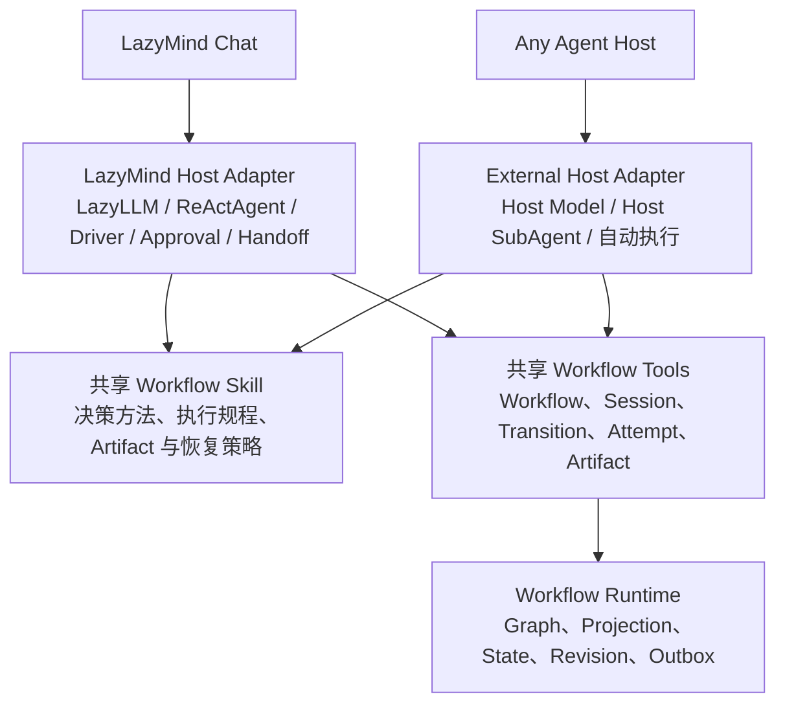
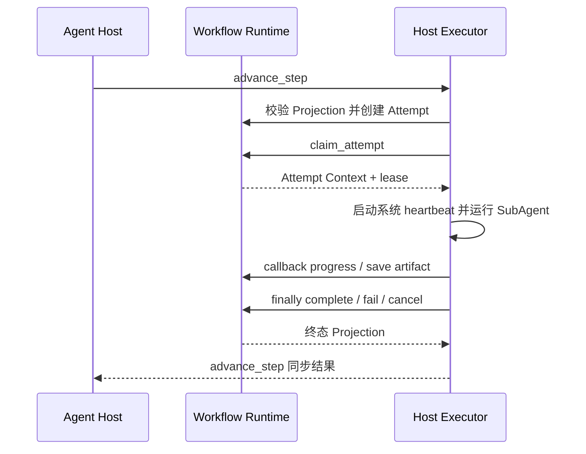

# LazyMind 与 Codex 共享 Workflow Agent Kit 改造方案

## 1. 背景与目标

LazyMind 当前已经具备从 Skill 生成 Workflow、由 ChatAgent 和 SubAgent 执行 Workflow、由状态机监管步骤推进、保存和修改 Artifact、展示执行过程等能力。这些能力目前由 `algorithm/chat` 与 Core 共同完成，其中 `algorithm/chat` 同时承担模型调用、ReAct Agent、Workflow 决策规则和部分 Runtime adapter，Core 则承担对话产品后端、Workflow 权威状态、任务调度、Artifact 持久化和前端接口。

本次改造的目标不是让 Codex 调用 LazyMind Chat，再由 LazyMind Chat 调用另一套模型，而是将 LazyMind Chat 视为一个独立的 Agent Host，将 Workflow、知识库、文件和 Artifact 等能力视为可被多个 Agent Host 使用的基础设施。改造完成后，LazyMind Chat 与 Codex 应当分别使用自己的模型和 Agent 执行引擎，同时读取同一套 Workflow 决策 Skill，并通过同一组中立工具操作同一个 Workflow Runtime。

整体改造分为两个阶段。第一阶段先在 LazyMind 内部完成职责拆分，让 LazyMind Chat 成为共享能力的第一个正式使用方，并确保现有产品行为保持不变；第二阶段再为 Codex 提供 Skill 和工具适配，使 Codex 使用自己的模型、SubAgent 和费用执行相同的 Workflow。

## 2. 核心设计

### 2.1 总体架构

目标架构由四个稳定层次组成：共享 Workflow Skill 描述 Agent 应当如何发现、启动、执行、验收和恢复 Workflow；共享 Workflow Tools 为 Agent 提供中立且稳定的操作接口；Workflow Runtime 负责状态机、Session、Attempt、Artifact、版本、幂等和恢复等确定性能力；Host Adapter 将公共规则与工具映射到 LazyMind 或 Codex 各自的模型、Agent Loop、SubAgent、交互和事件机制。



共享层不负责模型选择，不包含 LazyMind 或 Codex 的模型配置，也不假设某一种 Agent Loop。LazyMind 和 Codex 可以根据自身能力采用不同的交互与调度策略，但对 Workflow、状态机、步骤、Attempt 和 Artifact 的业务语义必须保持一致。

### 2.2 职责边界

| 层次 | 负责内容 | 不负责内容 |
|---|---|---|
| 共享 Workflow Skill | Workflow 发现与预检方法、步骤选择原则、并行策略、验收规则、重新执行目标与 resume 决策、Artifact 操作规范、Skill to Workflow 生成规程 | 状态落库、并发控制、真实取消、模型和 Agent 实现 |
| Workflow Tools | 定义 Workflow、Session、Transition、Attempt、Artifact 和 Authoring 的稳定 schema；由 Runtime facade 执行短事务 command，由 Host binding 组合 Executor Supervisor | 自行决定何时调用工具、在 Runtime 内运行 LLM、实现产品 UI |
| Workflow Runtime | Graph 编译与投影、Session 和 Attempt 状态、transition 校验、版本、Artifact revision、幂等、Outbox、停止与恢复 | 理解用户自然语言、选择模型、运行 ReAct 或评价生成质量 |
| Host Adapter | 加载共享 Skill、注入 Host 策略、注册工具、运行主 Agent 和 SubAgent、处理交互、审批、handoff 和事件展示 | 绕过 Runtime 修改状态或重新实现状态机 |

Core 中现有 `plugin/graphengine`、Plugin Session、transition、projection、Artifact revision 和 Plugin version 能力应迁移并重命名为 `workflow/graphengine`、Workflow Session 和 Workflow version，再继续作为 Workflow Runtime 的基础。`algorithm/chat` 中关于用户意图理解、步骤选择、验收和恢复的公共规则应迁入共享 Skill；LazyLLM 模型初始化、ReActAgent、DriverAgent、stop-tool、handoff、synthetic turn 和 SSE 翻译则保留在 LazyMind Host Adapter。

#### 2.2.1 强制工程准则与契约优先级

本方案中的架构描述不能作为自由实现空间。发生冲突时，执行者必须按“Runtime invariant → 版本化 Tool/Event Contract → Host Profile → 共享 Skill policy → Agent 当前判断”的优先级处理。Runtime 拒绝的操作不得通过旧接口、Host 本地状态或直接写表绕过；所有状态写入必须经过带 `command_id` 和 `expected_state_version` 的 Runtime command；成功事务必须原子写入持久 Workflow Event，需要外部执行或投递时同时写 Outbox；Executor 不得直接修改 Session 或 Step 状态；兼容层不得产生新的业务语义。

以下文件是本计划的规范性组成部分，而不是可选参考：

- [`contracts/runtime-contract.md`](contracts/runtime-contract.md)：状态机、并发、`advance_step`、Attempt lease、Artifact lineage、停止与恢复的不变量。
- [`contracts/tool-event-contract.md`](contracts/tool-event-contract.md)：公共工具、错误 envelope、Workflow Event Stream、版本和兼容规则。
- [`contracts/attempt-resource-contract.md`](contracts/attempt-resource-contract.md)：Attempt Context、Host Attachment、Input Resource、Input Binding 和 Artifact 边界。
- [`contracts/database-migration-contract.md`](contracts/database-migration-contract.md)：旧 `plugin_*` schema 复用、增量表列、滚动发布、schema capability 和前向兼容规则。
- [`contracts/host-adapter-contract.md`](contracts/host-adapter-contract.md)：Agent-facing 工具绑定、Executor Supervisor、Host SubAgent 调用、Profile 和 capability mapping。
- [`execution-guardrails.md`](execution-guardrails.md)：保持 15 个 PR 不变时，每个 PR 的入口、交付物、退出条件、切流和回滚要求。

主计划描述目标和阶段；上述契约定义不可自由发挥的行为；执行护栏定义如何安全落地。如果实现需要改变规范性契约，必须先更新契约并说明兼容和迁移影响，不能在某个 Host Adapter 中形成隐式事实标准。

### 2.3 命名迁移与数据库兼容

新机制统一命名为 Workflow。对外 API、Tool Protocol、事件、错误码、配置文件、目录、Python 模块与类型、Go package 与类型、前端组件和用户可见文案都不得再引入新的 `plugin` 命名。例如 `list_plugins`、`trigger_plugin`、`PluginSession`、`plugin_manager.py`、`plugin.yaml` 和 `PluginPanel` 应分别迁移为 `list_workflows`、`start_workflow`、`WorkflowSession`、`workflow_manager.py`、`workflow.yaml` 和 `WorkflowPanel`。兼容期如需保留旧 API，只能作为有明确删除期限的薄适配层，内部立即转换到 Workflow 领域对象。

数据库物理命名暂不纳入本轮重命名：既有 `plugin_*` 表、`plugin_id`、`plugin_ref`、`plugin_session_id` 等字段及历史 migration 继续保留，避免一次性迁移数据。Go ORM 使用 `gorm:"column:plugin_*"` 将旧列映射到 `Workflow*` 字段；Python repository/SQL 使用 `AS workflow_*`、row mapper 或 schema alias 映射到 Workflow 领域模型。原始数据库字段名只允许出现在 ORM tag、SQL 和 persistence adapter 中，不得泄漏到 handler、service、client、tool payload、事件或 Agent Context。

完整架构仍需补充 Host 中立引用、Attempt lease/fencing、preparation、可重放事件、通用 Outbox 和 Input Resource binding。所有变化必须遵守前向兼容的 expand-only 原则：本轮只新增表、带安全默认值的列和索引，不 rename/drop 旧结构，不改变旧字段语义，不要求 schema 回滚。`plugin_sessions.conversation_id` 保持现有非空约束；没有 LazyMind Conversation 的 Codex/定时 Session 写空字符串，并使用新增 `origin_host/origin_ref` 表达来源。新旧进程在滚动发布期间必须可共存，新能力只在 schema capability 检测成功后通过 feature flag 启用。详细目标 schema、部署顺序、backfill 和回滚 gate 见 [`contracts/database-migration-contract.md`](contracts/database-migration-contract.md)。

### 2.4 共享 Skill 与 Host 差异

共享 Skill 应定义一条完整而稳定的 Agent 工作流：Agent 先搜索适用 Workflow，读取轻量元数据并完成启动前检查；Runtime 创建 Session 后，Agent 每次都以最新权威 projection 为依据选择 Ready step；步骤由当前 Host 的执行器完成，Executor Supervisor 负责持久化并校验 required Artifact；步骤结束后，Agent 根据 acceptance criteria、用户要求和当前产物决定继续、重新执行目标步骤、等待或完成。Host 可以通过 `get_workflow_state` 或可恢复的 Workflow Event Stream 获得最新 projection，发现 state version 缺口时必须重新同步快照，不在 Agent 内部维护另一套状态机，也不得在每个事件后无条件重复查询。

共享 Skill 不直接写死 `ask_user`、`stop_tool`、`create_subagent` 或 Codex 协作工具等 Host 专属名称，而是读取 Host Profile 中声明的能力和策略。公共规则相同，具体交互方式允许不同。`advance_step` 与 `advance_step_and_hand_off` 都属于公共 Workflow Tool Protocol，因此共享 Skill 可以定义两者的选择准则；Host Profile 决定当前 Host 是否选择 handoff。LazyMind Profile 在审批、Driver、auto/dynamic 异步推进场景选择 `advance_step_and_hand_off`，Codex Profile 明确始终选择 `advance_step`。

建议采用以下目录结构：

```text
workflow-agent-kit/
├── SKILL.md
├── references/
│   ├── lifecycle.md
│   ├── decision-policy.md
│   ├── execution-policy.md
│   ├── artifact-policy.md
│   ├── recovery-policy.md
│   ├── skill-to-workflow.md
│   └── tool-contracts.md
├── profiles/
│   ├── default.yaml
│   ├── lazymind.yaml
│   └── codex.yaml
└── adapters/
    ├── lazymind.md
    └── codex.md
```

`SKILL.md` 只保留所有 Host 都必须遵守的主流程和不变量，较长的决策规则放入 `references`，Host Profile 只表达差异，不复制公共流程。LazyMind 与 Codex 应从同一个版本化 Skill 包读取公共内容，避免维护两套逐渐漂移的提示词。

### 2.5 LazyMind 与 Codex 的差异策略

LazyMind 可以保留面向产品体验的深度定制。它可以继续启用启动前审批、步骤级确认、stop-tool、DriverAgent、SubAgent handoff、synthetic turn、SSE 实时展示、动态模式和自动模式；这些能力由 LazyMind Profile 和 Host Adapter 实现，不进入公共 Runtime 的状态判断。

Codex 第一阶段不强求复刻 LazyMind 的每一种交互。为了降低接入复杂度，Codex 默认采用全自动执行：当 Workflow 已明确匹配且运行信息充分时，Codex 自动启动 Session、执行所有 Ready step、保存 Artifact、完成验收并推进到终态；只有 Runtime 拒绝、缺少无法合理推断的必要信息、存在高风险外部操作或执行失败无法恢复时才停下来询问用户。Codex 可以使用原生 SubAgent 执行步骤，并通过普通进度消息展示状态，不要求实现 LazyMind 的 stop-tool、synthetic turn 或专用审批 UI。

建议用 Profile 表达两者差异：

| 策略 | LazyMind 默认 | Codex 初期默认 |
|---|---|---|
| 启动前审批 | 可按 Workflow 或用户设置开启 | 关闭，满足条件后自动启动 |
| 步骤推进 | 同步 `advance_step`；审批、Driver 和异步模式选择标准 handoff 工具 `advance_step_and_hand_off` | Profile 明确只选择同步 `advance_step`，自动执行全部 Ready step |
| 步骤执行器 | LazyMind SubAgent | Codex 原生 SubAgent |
| 结果验收 | 可启用 DriverAgent | 主 Agent 验收或 Codex review SubAgent |
| Handoff | 支持结束当前 turn 并由事件重新唤醒 | 默认在当前任务中持续推进 |
| Stop | stop-tool 联动 Attempt 和 Session | 调用 Runtime stop；无专用 UI 时由 Agent 响应用户中止 |
| 结果回传 | 支持 synthetic turn 和 SSE | 工具结果、任务状态和进度消息 |
| 结果展示 | 可编辑 Workflow Panel、状态图和 Artifact 操作 | 只读 Workflow 状态图、步骤执行信息和 Artifact 下载，不提供可编辑 Panel |

Host Profile 可以覆盖执行器选择、最大并行数、是否启用 Reviewer、审批方式、handoff 时机、停止策略、结果回传方式、状态展示和自动推进策略，但不得覆盖 Runtime 的 graph readiness、required outputs、state version、权限、幂等、Artifact lineage 和 stale 传播等不变量。

### 2.6 Tool Protocol

公共 Tool Protocol 应面向 Agent 的业务操作设计，而不是直接暴露数据库表或内部状态机事实。工具返回结构化数据和稳定错误码，LazyMind 可以把它们注册为 LazyLLM tools，Codex 可以通过后续的工具连接或 MCP adapter 调用。

| 领域 | 第一版工具 | 说明 |
|---|---|---|
| Workflow Discovery | `list_workflows`、`get_workflow` | 返回有权访问且已启用的 Workflow 及其固定 revision 元数据 |
| Session Lifecycle | `prepare_workflow`、`start_workflow`、`get_workflow_state`、`stop_workflow`、`resume_workflow` | `prepare_workflow` 完成 revision 固定、权限与必要输入检查并返回短期 preparation，但不创建 Session；`start_workflow` 使用有效 preparation 正式创建并启动 Workflow Session |
| Transition | `get_ready_steps`、`advance_step`、`advance_step_and_hand_off` | 两个 advance 工具共享同一 transition；Agent 只选择目标步骤，Runtime 自动解析内部 `execute`、`retry` 或 `rewind`。`advance_step` 同步等待终态，`advance_step_and_hand_off` 在可靠接管后返回 handoff acknowledgement |
| Attempt Execution（Executor-only） | `claim_attempt`、`get_attempt_context`、`report_attempt_progress`、`save_artifact`、`complete_attempt`、`fail_attempt`、`cancel_attempt` | 由 Host Adapter 的确定性 Executor Supervisor 调用，不暴露给模型自行决定是否调用；解耦 Workflow Attempt 与具体 Agent Executor |
| Artifact | `list_artifacts`、`read_artifact`、`patch_artifact` | Agent 使用 `patch_artifact` 自主修订既有 Artifact；步骤输出由 Supervisor 使用 Executor-only `save_artifact` 提交；用户在 LazyMind Panel 的手工编辑走产品侧 human revision 接口，不调用模型工具 |
| Workflow Authoring | `get_skill_conversion_context`、`create_workflow_draft`、`update_workflow_draft_file`、`validate_workflow_draft`、`get_workflow_diagnostics`、`publish_workflow` | 支持 LazyMind 或 Codex 使用自己的模型完成 Skill to Workflow |

内部的 route fact、attempt input binding、slot revision、outbox 和 state version 更新不应作为模型工具暴露。Agent 只能通过上述业务操作改变 Workflow，Runtime 在工具内部完成事务、校验和状态更新。

`advance_step` 是唯一面向 Agent 的步骤执行工具，不再公开 `retry_step` 或 `rewind_step`。当目标步骤没有有效 Attempt 时，Runtime 将其解析为首次 `execute`；当有效 Attempt 为 failed 或 interrupted 时解析为 `retry`；当有效 Attempt 为 succeeded 时解析为 `rewind`。工具响应必须返回 `resolved_operation`，使 Host 能解释实际动作。三个内部动作仍保留各自的不变量、权限与审计语义：特别是 `rewind` 必须传播下游 Attempt 和 Artifact stale，`retry` 只能使失败或中断的 Attempt 失效。工具合并不得弱化这些 Runtime 校验。

模型调用步骤推进工具后，后续 Attempt 生命周期不得依赖模型继续记得调用工具。Host Adapter 必须用确定性 Executor Supervisor 包裹完整执行：事务性创建 Attempt、claim、启动系统 heartbeat、运行 SubAgent、从执行器 callback 转发进度、持久化结构化输出、校验 required Artifact，并在 `defer/finally` 中写入 complete/fail/cancel。`advance_step` 与 `advance_step_and_hand_off` 都是公共 Tool Protocol 的标准工具并调用同一个 Runtime command 和 Supervisor；差异只在等待策略。同步工具在步骤终态后返回，handoff 工具在 Attempt 已持久化且 Supervisor 已可靠接管后返回 acknowledgement。LazyMind Profile 可选择两者，Codex Profile 明确只选择同步 `advance_step`。

### 2.7 Attempt 与 Executor 解耦

当前 Core 在 transition 被接受后直接调用 `algorithm/chat` 的 `/api/subagent/run`，这使 Workflow Runtime 默认绑定 LazyMind SubAgent。改造后，Runtime 只创建可执行的 Workflow Attempt，具体 Agent Host 通过 claim/report 协议领取并执行 Attempt。



Attempt Context 应包含步骤目标、acceptance criteria、允许使用的能力声明、固定的 Input Resource/Artifact revision、required outputs、当前意图约束、Runtime 已解析的 operation 和 partial selector，但不得包含 Host 原始附件引用、`llm_config`、模型 API key、LazyLLM sid、本地绝对路径或其他 Host 私有状态。

LazyMind 第一阶段提供自己的 `HostExecutor` 实现，把 Attempt Context 转换成现有 SubAgentContext 和 AgentRunPlan，并由 Supervisor 可靠回报生命周期。其他 Agent Host 接入时实现同一公共 `HostExecutor`，用 Host 原生 SubAgent 执行同一份 Attempt Context。模型只负责选择目标步骤和生成步骤内容，不负责维持 heartbeat、选择终态或保证状态回报；这些职责属于可测试的 Host Adapter 代码。这样 Runtime 不关心执行者使用哪一种模型，其他 Host 也不需要配置 LazyMind 模型。

Codex 的 `advance_step` 是一个同步的 Agent-facing 工具调用，但内部不是单个数据库事务：它先提交短事务使流程可靠进入 queued/running，再由 Supervisor 执行长时间 SubAgent，并在执行期间用独立 timer/callback 持续 heartbeat 和 progress，最后提交终态事务后返回模型。即使工具连接被取消或 Codex 进程硬崩溃，lease reaper 也必须在超时后将 Attempt 标记为 interrupted/recoverable；不能让状态永久停在 running。Runtime 只信任带 lease/fencing 的协议事实，并通过 Workflow Event Stream 发布状态。

### 2.8 Stop、Handoff 与审批

停止需要区分 Agent turn、Attempt 和 Workflow 三个层次。LazyMind stop-tool 可以立即结束当前 Agent turn，但实际执行中的任务还必须调用 `cancel_attempt`，整个 Workflow 停止则必须调用 `stop_workflow`；Runtime 应保留已经保存的部分 Artifact，将 Session 置为可恢复状态，并阻止新 Attempt 继续派发。Codex 没有相同 stop-tool 时，可以在收到用户中止要求后直接调用 `stop_workflow`，并等待运行中的 Codex SubAgent结束或被取消。

Handoff 是公共工具支持、由 Host Profile 选择的调度策略，不是状态机 transition。LazyMind 可通过 `advance_step_and_hand_off` 在 Runtime 已接受 transition、Attempt 已持久化且 Executor Supervisor 已取得可靠执行责任后结束当前 turn，并在任务终态时通过 synthetic turn 或事件重新唤醒 ChatAgent；如果可靠接管失败，该工具必须返回失败且不得 handoff。Codex Profile 不选择该工具，在同步 `advance_step` 中等待 SubAgent 终态并自动推进。Runtime 只记录 Attempt 状态和结果，不把 handoff 写入 graph 或领域状态。

审批同样属于 Host Policy。Workflow 可以声明风险或建议审批点，但 LazyMind 可以在这些位置调用 `ask_user` 或 stop-tool 暂停，Codex 初期则可以仅对高风险外部操作保留平台级审批，其余 Workflow 自动执行。无论 Host 是否展示审批，Runtime 的权限和安全检查都必须强制执行。

### 2.9 Skill to Workflow

Skill to Workflow 需要拆成“Agent 生成”和“确定性基础设施”两部分。固定 Skill revision、读取完整 Skill package、coverage ledger、脚本 AST 扫描、工具目录、Workflow draft、graph compile、diagnostics、版本和发布属于基础设施；判断 Skill 是否可转换、提取候选流程、设计步骤和 Material、生成 scenario 和修复草稿属于共享 Skill 指导下的 Agent 工作。

LazyMind 可以继续使用自己的模型完成生成，Codex 则使用 Codex 模型生成相同的 Workflow 文件，双方最终都调用同一组 Authoring Tools 做校验和发布。Runtime facade 和 Authoring Tools 不调用模型，也不接受模型配置；模型执行仅发生在 Host Executor Adapter，因此 Codex 接入只消耗 Codex 的模型费用。

### 2.10 Workflow Event Stream 与 Panel

Workflow Panel 的正常刷新必须使用独立于 Chat SSE 的 Workflow Event Stream，不得依赖轮询，也不得在每条事件后重新查询完整状态。连接首包返回 `workflow.snapshot`，后续事件携带可直接归并到 projection 的 `workflow.patch`、`step.patch`、`attempt.patch`、`artifact.upsert` 等增量；持久事件使用 session 内单调 cursor，断线通过 `Last-Event-ID` 重放，无法补齐时返回新 snapshot。高频 `attempt.progress` 可以合并，但 transition、Artifact revision 和终态事件必须立即发送且可恢复。

Chat 与 Workflow 在领域上使用不同事件流；现有 LazyMind 组合页面可以由 gateway 聚合到一条物理 SSE。LazyMind 对话内 Panel、独立 Workflow 页面和任务中心缩略卡片必须复用同一 projection reducer。Codex v1 不接入 LazyMind Chat、不创建或同步 LazyMind Conversation，也不使用可编辑 Workflow Panel；Codex 通过 `status_url` 打开只读 Workflow Status View，仅展示状态图、步骤/Attempt 信息和 Artifact 下载。Status View 不包含右侧 Chat、用户手工编辑 Artifact、审批或 handoff 操作；Codex Agent 仍可在任务中调用 `patch_artifact` 自主修订。

### 2.11 Attachment、Input Resource 与 Artifact

LazyMind 和 Codex 分别负责本 Host 的附件上传、文件选择和权限确认，但 Host Attachment 不能直接进入 Runtime。Host Adapter 必须先将其导入或登记为带稳定 `resource_id`、revision 和 content hash 的 Input Resource；`prepare_workflow` 只接受中立资源引用，`start_workflow` 固定 Input Snapshot，Attempt Context 使用短期 capability 读取。Workflow 输出继续通过 Artifact Tools 管理 producer、slot、revision、selected 和 stale。第一版不增加 Agent-facing Attachment Tools；附件导入属于 Host File Adapter，输入替换以后续版本化 Runtime command 完成。

### 2.12 第一阶段非目标

第一阶段不重命名既有数据库物理表、列和历史 migration，不接入或同步 Codex 与 LazyMind Chat，不为 Codex 创建 LazyMind Conversation，不把模型 reasoning 写入 Runtime，不为 Codex 提供可编辑 Workflow Panel 或用户手工编辑入口，不让 Runtime 调用或选择模型，不建设任意第三方 Host marketplace，也不保证不同 Host 生成字节级相同的 Artifact。Codex Agent 仍可通过公共 `patch_artifact` 自主修订 Artifact。除主计划明确列出并受 feature flag 控制的变化外，不改变现有 LazyMind 用户交互。

## 3. 第一阶段：重构 LazyMind

第一阶段的目标是在不改变用户体验的前提下，将公共 Workflow 决策、工具协议和 Runtime 从 LazyMind Chat 中分离出来。完成后，LazyMind Chat 应成为共享 Workflow Agent Kit 的第一个 Host，现有 Workflow Panel、审批、Driver、handoff、SSE、Artifact 编辑和恢复能力继续工作。

### 3.1 阶段一：冻结现有行为和公共契约

首先建立可比较的行为基线，覆盖串行和并行 Workflow、choice route、启动前补充信息、自动与动态推进、retry、rewind、partial retry、中断继续、Artifact 修改、Workflow revision 固定、停止和服务重启恢复。每个场景保存输入、projection、Attempt、Artifact revision 和事件序列，作为后续重构的 golden fixture。

同时整理现有 `algorithm/chat` 中的 Workflow 相关函数，将其逐项标记为公共决策规则、LazyMind Host 策略、Runtime 不变量、工具 adapter 或模型执行逻辑。该清单是迁移和删除重复 prompt 的依据。

本阶段交付版本化 Tool Contract、Event Contract、Attempt Context/Input Resource schema、稳定错误码、状态决策表和 golden tests；完成标准不是笼统的“已有测试”，而是 Go handler、Python client 和 fixture reader 能消费同一组契约，golden fixture 能重建 projection、Attempt、Artifact revision 和事件序列，后续任何阶段都可用相同 fixture 比较重构前后结果。具体退出条件见 [`execution-guardrails.md`](execution-guardrails.md) 的 PR 1。

### 3.2 阶段二：建立共享 Skill Policy Pack

在不改变生产调用链的情况下创建版本化的 `workflow-agent-kit` Skill 包，将 Workflow 发现、preflight、projection 驱动、步骤选择、并行、验收、重新执行目标与 resume、Artifact 和 Skill to Workflow 规则迁入公共 Skill，并建立 `lazymind.yaml` 与 `codex.yaml` Profile。Skill 只指导 Agent 何时重新执行哪个目标步骤，不要求 Agent 在 retry 与 rewind 之间选择；具体操作由 Runtime 在 `advance_step` 内解析。

初期由现有 LazyMind prompt 继续生效，共享 Skill 以 shadow mode 加载并输出决策 trace，用于比较两套规则是否一致。规则验证稳定后，再逐段删除 `workflow_manager.py`、SubAgent prompt 和 Driver prompt 中重复的公共说明，只保留 LazyMind 特有策略和必要的角色提示，避免模型同时收到两套相互冲突的指令。

本阶段完成标准是公共规则只有一份权威来源，LazyMind Profile 能明确表达审批、stop-tool、handoff、Driver、SSE 和自动推进差异，且现有 golden scenarios 的决策结果不发生非预期变化。

### 3.3 阶段三：建立 Agent-neutral Workflow Client

Core 对外提供第一版公共 Tool Protocol，并为现有 internal handler 建立稳定 facade。随后在 `algorithm/chat` 中增加统一的 Workflow Client，将 Workflow 查询、Session 启动、projection、transition 和 Artifact 操作集中到一个 adapter，替换 `workflow_manager.py` 中的手工 HTTP payload 和对 Workflow 数据表的直接访问。

公共请求删除 `llm_config`、`tool_config`、LazyLLM sid 和其他模型配置，统一使用中立的 actor、conversation reference、turn reference 和 execution disposition。LazyMind 私有上下文只在 Host Adapter 内保留，不进入 Runtime 的领域模型。

本阶段完成标准是 `algorithm/chat` 不再自行拼装 Core internal transition 请求，不再直接查询 Workflow Session、Step 和 Artifact 数据表，所有 Workflow 操作都通过公共 Client 完成。

### 3.4 阶段四：拆分 Workflow Attempt 与 LazyMind Executor

Core 将 transition accepted 后直接调用 `/api/subagent/run` 的模式改为创建 queued Attempt，并提供 claim、heartbeat、progress、artifact、complete、fail 和 cancel 协议。为兼容现有行为，先实现 `LazyMindExecutor`，由它领取 Attempt、构造现有 AgentRunPlan、运行 LazyMind SubAgent，并把流式事件回报 Runtime。

迁移期间可以保留旧 `/api/subagent/run` 作为 compatibility adapter，但新的 Runtime 代码不得依赖该固定 endpoint。Outbox 保存的是可重新领取的 Attempt 或派发事件，而不是只能由 LazyMind 算法服务理解的 RunRequest。

本阶段完成标准是 FakeExecutor 可以在没有 `algorithm/chat` 的情况下驱动测试 Workflow，LazyMindExecutor 可以完整复现现有步骤执行，算法服务暂时不可用时 Attempt 保持 queued 或 recoverable，而不是被错误标记为失败。

### 3.5 阶段五：收敛 algorithm/chat

完成 Executor 解耦后，对 `algorithm/chat` 做最终职责收敛。LazyMind Chat 只保留模型初始化、主 Agent、LazyMind SubAgent、DriverAgent、Host Profile、stop-tool、handoff、synthetic turn、SSE 翻译和产品交互；公共 Workflow 决策从共享 Skill加载，状态和 Artifact 操作全部通过 Workflow Client。

建议将现有 Workflow 代码重组为 `workflow/tools.py`、`workflow/preflight.py`、`workflow/decision_policy.py`、`workflow/executor.py`、`workflow/reviewer.py` 和 `workflow/prompt_context.py`。这里的模块仍属于 LazyMind Host Adapter，不得重新实现 Runtime graph 或直接写 Workflow 表。

本阶段完成标准是 Workflow Runtime 不 import 或调用 `algorithm/chat`，`algorithm/chat` 也不以数据库为旁路修改 Workflow 状态；关闭 LazyMind Driver 或改变 handoff 策略只影响 Host 行为，不影响 Runtime projection 和 Artifact lineage。

### 3.6 阶段六：拆分 Skill to Workflow

将现有 Skill to Workflow staged generation 改造成通用 Authoring Job。Core 固定 Skill revision、生成完整 package context、提供工具映射和确定性 diagnostics；LazyMind Generator 根据共享 Skill 生成或修复 Workflow draft，然后通过 Authoring Tools 提交文件、校验和发布。

模型生成接口与确定性校验接口必须分开，使测试 fixture 或其他 Agent Host 能直接提交生成结果，而无需经过 LazyMind 模型。现有脚本扫描、安全检查、revision、tree hash 和发布门禁继续由 Core 执行。

本阶段完成标准是同一个固定 Skill revision 可以由 LazyMind 模型或静态 fixture 生成 Workflow，二者走完全相同的 diagnostics 和发布流程，Authoring Tools 中不存在隐式模型调用。

### 3.7 第一阶段验收条件

只有满足以下条件后才开始 Codex 接入：

1. Workflow Runtime 的请求和持久化模型中不再包含 LazyMind 模型配置。
2. Core 不再固定调用 `algorithm/chat` 的 SubAgent endpoint，而是通过 Executor 协议运行 Attempt。
3. LazyMind Chat 通过公共 Skill 和 Workflow Client 完成所有 Workflow 操作，不直接读写 Workflow 表。
4. FakeExecutor 能跑通串行、并行、retry、rewind、resume 和 Artifact 修改测试。
5. LazyMind 的审批、stop-tool、handoff、Driver、synthetic turn、SSE 和 Workflow Panel 行为通过回归测试。
6. Skill to Workflow 的模型生成和确定性基础设施已经分离。
7. 重构前建立的 golden scenarios 全部通过。
8. Python 与 Go 的业务层、公共接口和工具名只使用 Workflow；旧 `plugin_*` 数据库字段仅存在于 SQL/ORM/persistence adapter，并有映射测试保证读写兼容。
9. Attempt claim 使用 lease 与 fencing，Executor 崩溃、过期重领和终态竞争通过 Runtime contract tests。
10. Workflow Event Stream 可以用 snapshot 加增量事件恢复 projection，独立 Panel 无需轮询或逐事件重新查询。
11. LazyMind Attachment 已通过 Host Adapter 转为固定 Input Resource，Attempt Context 不含 Host 私有路径、token 或模型配置。
12. 数据库迁移全部为前向兼容 expand migration；旧 binary 可在扩展后的 schema 上继续运行，新 binary 可读取未 backfill 的旧数据，应用回滚不要求回滚 schema。

## 4. 第二阶段：接入 Codex

第二阶段的目标是让 Codex 成为第二个 Agent Host。Codex 读取与 LazyMind 相同版本的共享 Skill，通过相同的 Workflow Tools 操作 Runtime，但使用 Codex 自己的模型、SubAgent、文件系统和费用。

### 4.1 阶段一：只读工具与 Skill 验证

先向 Codex 提供 `list_workflows`、`get_workflow`、`get_workflow_state`、`list_artifacts` 和 `read_artifact`，验证权限、Workflow revision、返回结构、Skill 触发和上下文大小。此时 Codex 不创建 Session，也不修改 Runtime 状态。

完成标准是 Codex 可以根据用户请求找到合适的 Workflow，解释 Workflow 结构，并正确读取已有 Session 和 Artifact。

### 4.2 阶段二：串行全自动执行

开放 Agent-facing `prepare_workflow`、`start_workflow`、`get_ready_steps` 和同步 `advance_step`，并向 HostExecutor Supervisor 开放 Executor-only `claim_attempt`、`get_attempt_context`、`report_attempt_progress`、`save_artifact`、`complete_attempt`、`fail_attempt` 和 `cancel_attempt`。Host 先调用 `prepare_workflow` 完成不创建 Session、不启动执行的准备，在返回 ready 后以 `preparation_id` 调用 `start_workflow`；全自动 Profile 在信息充分时自动完成串行 Workflow，不选择 `advance_step_and_hand_off`，也不实现 LazyMind 的逐步审批和 synthetic turn。

Host 主 Agent 负责读取 projection、选择目标步骤、验收终态结果并推进下一步；HostExecutor Adapter 程序化创建 SubAgent，Executor Supervisor 保存并校验 required outputs；Runtime 继续负责 Ready 校验、Attempt 状态和 Artifact revision。需要外部高风险操作时，仍由 Host 平台现有审批能力控制，而不是复制 LazyMind approval UI。

Host 执行状态由 HostExecutor Supervisor 的确定性代码回报，不依赖主 Agent 或 SubAgent 主动记住工具调用。Agent 只调用一次 `advance_step`；Supervisor 在调用内部完成 claim、系统 heartbeat、callback progress、Artifact 持久化和 terminal command。`advance_step` 先发布 queued/running，再同步等待 SubAgent，终态写入成功后才返回 Agent。只读 Workflow Status View 可通过持久 Workflow Event Stream 展示 queued、running、progress、waiting、succeeded 或 failed，并在 Artifact 产生后提供下载。Runtime 看不到也不需要保存 Host 内部 reasoning，只记录公共执行事实。

完成标准是一个只包含串行步骤的 Workflow 可以完全由 Codex 模型执行到终态，Runtime 中不出现 LazyMind model config，LazyMind 算法服务关闭时也不影响 Codex 执行。

### 4.3 阶段三：并行、恢复与模型修订

在串行链路稳定后，增加多个 Ready step 的并行执行、Codex review SubAgent、retry、rewind、partial retry、stop/resume 和模型自主 Artifact patch。Codex 主 Agent 根据共享 Skill 决定并行边界、恢复策略、需要重新执行的目标步骤以及是否调用 `patch_artifact` 直接修订既有 Artifact；Runtime 根据权威 Attempt 状态解析 retry 或 rewind，并对 patch 产生新 revision、更新 lineage 和传播 stale。Status View 仍为只读，不提供用户手工编辑入口。

Codex 不使用 `advance_step_and_hand_off`，也不依赖主 Agent在长任务中反复调用进度工具；它只使用同步 `advance_step`，由 Supervisor 在当前 Codex task 内执行 SubAgent 并可靠维护状态。若后续 Codex 提供后台唤醒机制，只需增加新的 Host execution disposition，不改变 Agent-facing 工具名、共享 Skill 主流程或 Runtime invariant。

完成标准是 Codex 通过第一阶段的完整 golden scenarios，除明确标记为 LazyMind UI 或交互差异的项目外，Workflow projection、Attempt 和 Artifact 结果与 LazyMind 一致。

### 4.4 阶段四：Codex Skill to Workflow

最后开放 Authoring Tools。Codex 根据共享 `skill-to-workflow.md` 读取固定 Skill package、分析可生成性、设计 Workflow、生成 Workflow 文件，并反复调用 diagnostics 和 draft update 工具完成修复和发布。

Codex 生成过程中只使用 Codex 模型；Core 只提供 Skill snapshot、工具目录、脚本扫描、诊断、版本和发布能力。用户无需配置 LazyMind 模型或 API key。

完成标准是同一个 Skill 可以分别由 LazyMind 和 Codex 生成合法 Workflow，两个 Host 的生成内容可以不同，但都满足相同的 graph、工具、安全和发布约束。

## 5. 建议的代码实施顺序

为了控制变更规模，保留以下 15 个 PR，不再继续拆分 PR 数量。表格只提供顺序和目标摘要；每个 PR 不可省略的依赖、范围、feature flag、兼容路径、测试、回滚和删除 gate 以 [`execution-guardrails.md`](execution-guardrails.md) 为准。一个 PR 内可以用多个顺序清晰的 commit 完成机械迁移、shadow、canary 和切流，但未满足退出条件不得合并。

| 状态 | PR | 主要改动 | 可验证结果 |
|---|---|---|---|
| [x] | [1 (#487 + completion #492)](https://github.com/LazyAGI/LazyMind/pull/492) | 建立 Workflow Tool、Event、Attempt Context 契约和 golden fixtures | 当前行为被固定，所有新契约使用 Workflow 命名 |
| [x] | [2 (#488 + Go #493 + completion #495)](https://github.com/LazyAGI/LazyMind/pull/495) | 将代码、配置、工具和 UI 的领域命名从 Plugin 迁移为 Workflow，并在 Python/Go persistence adapter 映射旧数据库字段 | 业务层不再泄漏 Plugin 命名，旧数据无需迁移即可兼容读写 |
| [x] | [3 (#489 + completion #496)](https://github.com/LazyAGI/LazyMind/pull/496) | 创建共享 Workflow Skill、references 和 Host Profiles | LazyMind shadow load，决策 trace 可比较 |
| [x] | [4 (#490 + completion #494)](https://github.com/LazyAGI/LazyMind/pull/494) | Core 增加 Agent-neutral Workflow Tool facade | 现有 internal API 仍兼容，公共契约可测试 |
| [x] | [5 (#497)](https://github.com/LazyAGI/LazyMind/pull/497) | algorithm/chat 增加统一 Workflow Client | 移除分散的 HTTP payload 和 Workflow DB 查询 |
| [x] | [6 (#498)](https://github.com/LazyAGI/LazyMind/pull/498) | 引入 queued Attempt 与 claim/report 协议 | FakeExecutor 可执行 Workflow |
| [x] | [7 (#500)](https://github.com/LazyAGI/LazyMind/pull/500) | 实现 LazyMindExecutor 和兼容 adapter | LazyMind SubAgent 通过新协议运行 |
| [x] | [8 (#502)](https://github.com/LazyAGI/LazyMind/pull/502) | 移除 Core 到 `/api/subagent/run` 的固定依赖 | Runtime 与 LazyMind Executor 正式解耦 |
| [x] | [9 (#501)](https://github.com/LazyAGI/LazyMind/pull/501) | 收敛 algorithm/chat prompt、Workflow manager 和 Driver adapter | 公共规则只来自共享 Skill |
| [x] | [10 (#499)](https://github.com/LazyAGI/LazyMind/pull/499) | 拆分 Skill to Workflow Agent 生成与 Authoring Tools | 外部 Agent 可提交生成结果 |
| [x] | [11 (#503)](https://github.com/LazyAGI/LazyMind/pull/503) | 完成 LazyMind 全量回归与旧接口清理 | 达到第一阶段验收条件 |
| [ ] | 12 | 提供 Codex 只读 Tool Adapter 与 Status View | Codex 可以发现 Workflow，并查看状态图和下载 Artifact |
| [ ] | 13 | 实现 Codex 串行全自动 Executor | Codex 独立执行 Workflow |
| [ ] | 14 | 增加 Codex 并行、恢复与模型 Artifact 修订 | Codex 通过 Runtime golden scenarios |
| [ ] | 15 | 接入 Codex Skill to Workflow | Codex 独立生成和发布 Workflow |

所有 PR 使用相同 Definition of Done：实现引用的 contract clauses；新旧链路只有一个权威写入者；数据库变化通过前向兼容与 rolling deploy tests；feature flag 默认值和回滚路径明确；兼容入口有调用量观测和删除条件；`make lint`、相关单元测试、contract tests 与指定 golden scenarios 通过；公共 payload 和非 persistence 代码通过旧 Plugin 命名残留扫描。任何一项不满足，都不能用“后续 PR 补充”替代当前退出条件，除非先在主计划中明确调整依赖和 gate。

## 6. 测试与工程保障

Runtime 层应以纯状态测试和事务测试为主，覆盖 graph compile、projection、transition 幂等、state version 冲突、batch atomicity、Attempt 终态竞争、Artifact revision、stale 传播、stop/resume 和 Outbox 恢复。共享 Skill 应以场景评测为主，比较给定 projection、用户输入和 Host Profile 时产生的工具选择与决策；LazyMind 和 Codex Adapter 则分别测试模型上下文构造、SubAgent 生命周期、Host 特有交互和事件翻译。

命名迁移必须增加边界测试：公共 JSON、Tool schema、SSE event、Python/Go 类型和生成文件中不得出现 `plugin` 字段；persistence adapter 则用旧 `plugin_*` schema fixture 验证 Workflow 领域模型的查询、创建、更新和关联加载均正确。CI 可对公共接口与非 persistence 目录增加残留名称扫描，数据库 migration、SQL、ORM column tag 和专门的兼容测试列入白名单。

每个阶段必须保留跨 Host contract tests，确保 LazyMind Host、FakeHost 和其他 HostExecutor 对同一 Attempt Context 使用相同的 Artifact 和终态协议。共享 Tool schema 和 Skill references 应版本化，Runtime 对不支持的客户端版本返回明确错误，不以静默兼容掩盖语义变化。

Workflow Event Stream 必须增加 snapshot + reducer 重建、cursor 重放、cursor 过期 resync、state version 缺口、progress 合并和未知 major version 测试。Input Resource 必须增加 LazyMind/Codex 两种来源导入、来源 Host 离线后读取、短期 capability 失效和输入替换 stale 传播测试。Attempt 协议必须增加 lease 过期、fencing、重复领取、Executor 崩溃和 complete/cancel 竞争测试。

迁移期间旧接口可以通过 compatibility adapter 保留，但所有新功能只能基于公共 Tool Protocol 开发。每个旧入口都应记录调用量和删除条件，避免公共协议完成后长期维护两套执行链路。

迁移统一采用 `introduce → shadow → compare → canary → default-on → remove`。同一 PR 可以覆盖相邻阶段，但 compare 必须有 fixture 或指标证据，canary 必须可按 Workflow/用户关闭，default-on 后必须保留一个明确观测窗口，remove 只能发生在调用量归零且回滚替代已验证之后。禁止没有幂等与去重协议的 dual-write。

数据库部署固定采用 `expand migration → schema capability check → compatible application deploy → shadow/canary → default-on`。应用回滚只回退二进制和 feature flag，不执行 destructive down migration。删除旧表列、改变 nullability 或旧枚举语义不属于本计划的 15 个 PR，必须等所有旧 binary/worker 退出后另立 contract migration。

## 7. 风险与控制

最大的风险是公共规则在 Python prompt、共享 Skill 和 Host Profile 中重复存在，导致同一模型收到冲突指令。控制方式是先建立规则迁移清单，再通过 shadow decision trace 验证，最后删除旧 prompt 中已迁移内容，使公共 Skill 成为唯一权威来源。

第二个风险是把 Host 交互误建模为 Runtime 状态，例如把 handoff 或 synthetic turn 写进 graph。Runtime 只记录 Workflow 和 Attempt 事实，审批展示、turn suspension、唤醒和结果回传都由 Host Adapter 处理；只有会影响业务安全或执行合法性的约束才进入 Runtime。

第三个风险是为了快速接入 Codex而保留 Core 对 LazyMind SubAgent 的隐式依赖。Codex 接入前必须通过 FakeExecutor 和“关闭 algorithm/chat 仍可驱动 Attempt”的测试证明解耦已经完成。

第四个风险是追求界面一致导致 Codex 首期范围膨胀。Codex v1 只提供同步全自动执行、只读状态图、步骤执行信息、Artifact 下载和模型自主 `patch_artifact`，不接入 LazyMind Chat，不复制 LazyMind 的审批、可编辑 Workflow Panel、用户手工编辑、stop-tool 或 synthetic turn。

## 8. 最终状态

改造完成后，LazyMind Chat 是一个具有审批、stop-tool、handoff、DriverAgent、synthetic turn、SSE 和可编辑 Workflow Panel 的 Agent Host；Codex 是一个默认同步全自动、使用 Codex 原生模型和 SubAgent、仅展示只读状态图与 Artifact 下载的 Agent Host。Codex 不接入 LazyMind Chat；二者读取同一套 Workflow Skill，通过同一组工具操作同一个权威 Runtime，并分别演进交互和执行策略。

这一架构将 LazyMind 的“Chat + 模型使用 + ReActAgent”从知识库、Workflow、Artifact 和任务基础设施中明确分离，也为后续接入其他 Agent Host 留出稳定边界，而不需要为每个 Host 重新实现 Workflow、状态机和数据历史。
