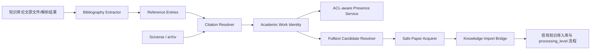

# 论文参考文献发现与导入方案

> 状态：最终设计稿  
> 适用范围：参考文献提取、论文身份解析、跨知识库存在性查询、全文获取，以及单条、单篇和论文集合的批量导入。

## 1. 目标与范围

本方案满足四个用户场景：

1. 用户选中一条参考文献，查看它是否存在于当前知识库，以及用户可读的其他知识库。
2. 用户选中一条参考文献，查找并下载全文，加入指定知识库。
3. 用户选中一篇论文，整理其全部一跳参考文献，批量查找、下载并加入指定知识库。
4. 用户选中一个论文集合，合并、去重其全部一跳参考文献，批量查找、下载并加入指定知识库。

第一阶段的“全部参考文献”只指来源论文 bibliography 中的一跳引用，不递归下载参考文献的参考文献。无合法全文时允许保存论文身份和元数据，或等待用户上传，但不得把摘要、搜索片段或落地页伪装成全文。

## 2. 系统基础与建设边界

### 2.1 基础设施

| 已有能力 | 当前实现 | 本功能如何使用 |
| --- | --- | --- |
| 知识库分级处理 | `stored / parsed / chunked / indexed` | 导入时直接服从目标知识库级别，无需另建论文专用处理模式 |
| 能力矩阵 | `list / read / search / retrieve` | 参考文献功能只检查目标库写权限；后续解析、切片、索引由知识库现有流程决定 |
| 模型门禁 | 只有 `indexed` 要求 embedding | 可向 stored/parsed/chunked 库导入论文，向量模型不是下载或入库前提 |
| Reader 风险预检 | 创建/切换有 OCR fallback 提示 | 导入任务复用目标库已经确认的 reader 策略，不重复发明一套 OCR 设置 |
| 文档处理状态 | parse/chunk/index 分阶段状态和 coverage | 导入项关联最终文档与处理状态，展示“文件已入库但解析失败”等真实结果 |
| 原文件与内容哈希 | 上传文件持久化、`content_hash`、同用户哈希复用 | 下载后做文件级去重，并复用已有文件创建任务能力 |
| 文档读取 | Core content/chunks、Chat `KBToolkit.read_document` | bibliography 提取优先消费已有解析结果；必要时按现有读取/处理链路获得文本 |
| 知识库 ACL | read/write/upload 权限 | 跨库存在性只返回用户可读库；导入目标必须有写入/上传权限 |
| 异步任务 | `asyncjob` 幂等、租约、重试、取消和进度 | 承载批量 resolve、下载和导入 |
| 学术搜索 | Sciverse、arXiv 和统一 `academic_search` | 复用 Provider 请求和用户凭证，但增加稳定的领域适配层 |
| PDF/OCR/结构化提取 | PDF reader、MinerU、PaddleOCR、SchemaExtractor 等 | 复用解析产物，新建 bibliography 专用提取 contract |

论文导入调用现有文档入库服务，并携带论文来源元数据；最终产物由目标知识库的 `processing_level` 决定。

### 2.2 建设范围

本方案建设以下领域能力：

1. bibliography 区域识别、参考文献条目切分与字段抽取。
2. DOI、arXiv ID、标题作者年份等论文身份的规范化和持久化。
3. 同一逻辑论文在多个知识库、多个文件版本中的关联。
4. ACL-aware 的跨知识库论文存在性查询。
5. 从学术搜索结果解析“可合法下载的全文候选”。
6. 安全、限额、可审计的远程 PDF 下载器。
7. 单条/单篇/集合级批量导入的预检、逐项状态与失败重试。
8. 参考文献面板、批量预检和导入任务 UI。

## 3. 总体架构



模块职责必须保持清晰：

- `BibliographyExtractor` 只从来源论文中提取引用条目，不判断是否是同一论文。
- `CitationResolver` 解析论文身份，不下载文件。
- `PresenceService` 只查询有权访问的知识库，不泄露无权资源。
- `FulltextResolver` 给出候选及证据，不把搜索正文片段等同于 PDF。
- `PaperAcquirer` 负责安全下载、许可记录和文件验证。
- `KnowledgeImportBridge` 复用现有知识库文档创建流程，不自行解析、切片或向量化。

建议新建 Core 领域包 `backend/core/academic/`，让身份、ACL、任务和导入事务由 Core 管理。Algo/LazyLLM 只承载抽取与 Provider adapter，Frontend 只编排用户交互。

## 4. 领域数据模型

### 4.1 逻辑论文 `academic_works`

一篇逻辑论文只建一条记录：

```text
id
canonical_title, normalized_title
authors_json, first_author_normalized
publication_year, venue, abstract
doi_normalized
arxiv_id_base
external_ids_json
metadata_provenance_json
resolution_confidence
created_at, updated_at
```

约束：

- DOI 使用去协议、去 `doi:` 前缀、大小写规范化后的部分唯一索引。
- arXiv 使用不含 `vN` 的基础 ID 建部分唯一索引，版本单独存储。
- Provider ID 必须与 provider namespace 组合，不能跨 Provider 直接比较。
- 标题近似不得建立唯一约束，只能形成待确认候选。

### 4.2 论文与知识库文档关系 `academic_work_documents`

```text
academic_work_id
dataset_id, document_id
version_kind              preprint | accepted_manuscript | publisher | unknown
source_provider, source_locator, source_version
content_sha256
match_method, match_confidence
is_preferred_version
created_at, updated_at
```

此表是“是否已存在”的主查询入口。它允许同一论文存在于多个知识库，也允许同一库保留 arXiv v1、v3 或 publisher 版本，而不会把“论文相同”和“文件相同”混为一谈。

### 4.3 参考文献条目 `academic_references`

```text
id
source_document_id, source_work_id
reference_key
raw_text
title, authors_json, publication_year
doi_normalized, arxiv_id_base
resolved_work_id
resolution_status         unresolved | exact | high_confidence | possible | rejected
resolution_method, resolution_confidence
page, bbox_json, segment_ids_json
extractor_name, extractor_version, source_fingerprint
created_at, updated_at
```

即使无法 resolve，也必须保留 `raw_text` 和定位信息，便于用户查看、人工纠正及未来重新解析。

### 4.4 批量导入

`paper_import_batches`：

```text
id
entry_type                single_reference | paper_references | collection_references
target_dataset_id, target_pid
source_document_ids_json
policy_snapshot_json
status
total/completed/failed/skipped/needs_action
async_job_id, idempotency_key
created_by, created_at, updated_at
```

`paper_import_items`：

```text
id, batch_id, academic_work_id
reference_ids_json
presence_snapshot_json
selected_candidate_json
stage                     resolve | presence | acquire | validate | import | process | done
status                    pending | running | succeeded | skipped | failed | needs_user_action
content_sha256
document_id, document_task_id
attempt_count, error_code, error_details_json
created_at, updated_at
```

`asyncjob` 仍是执行底座；上述表只保存产品可查询的业务状态，不能把数百个条目全部塞入一个 job JSON。

## 5. 参考文献提取方案

### 5.1 输入选择

按以下顺序获取来源论文内容：

1. 已有 parsed/chunked/indexed 产物：直接读取解析 blocks/chunks。
2. stored 但已有按需解析缓存：读取缓存。
3. 只有原文件：显式发起解析任务，等待现有文档处理状态完成。
4. 解析失败：保留原文件，不生成虚假 bibliography；返回 OCR_REQUIRED、PARSE_EMPTY_OUTPUT 等现有/统一错误。

提取 bibliography 是业务派生任务，不改变知识库全局 `processing_level`。stored 库中的论文可能因为该显式动作产生 parsed 缓存，这是现有按需处理语义。

### 5.2 提取流水线

采用“规则优先、模型补全、Provider 校验”：

1. 根据 heading、字号、版面块定位 References/Bibliography/参考文献区域。
2. 根据编号、悬挂缩进、行距、标点和跨页连续性切分条目。
3. 使用 DOI、arXiv、年份等正则提取强标识。
4. 使用现有结构化抽取工具补齐标题、作者、venue 等字段。
5. 调用 Citation Resolver 对候选做 Provider 校验。
6. 保存原始文本、版面定位、提取器版本、源解析指纹和置信度。

不要重新实现 PDF/OCR reader。bibliography extractor 只消费现有解析结果，并通过独立版本号支持重跑。

### 5.3 质量要求

建立真实论文回归集，至少覆盖：

- 数字编号、作者年份、脚注式引用。
- 双栏、跨页、悬挂缩进、长 URL/DOI 换行。
- 中英文混排、扫描 PDF、OCR 错字。
- References 后存在 appendix/author biography 的边界情况。
- 无 bibliography、损坏 PDF、只有摘要的文档。

指标至少包括 bibliography 边界、条目切分 F1、DOI/arXiv 提取准确率、论文 resolve top-1 准确率和自动合并误报率。

## 6. 论文身份解析与去重

### 6.1 Provider 适配层

复用现有 Sciverse/arXiv 请求能力，但增加稳定的非 Agent contract：

```json
{
  "provider": "sciverse | arxiv",
  "provider_work_id": "...",
  "title": "...",
  "authors": ["..."],
  "year": 2025,
  "venue": "...",
  "abstract": "...",
  "doi": "10.xxxx/yyy",
  "arxiv_id": "2501.01234",
  "arxiv_version": 3,
  "landing_url": "https://...",
  "fulltext_candidates": [],
  "provenance": {}
}
```

需要增强：

- arXiv 结果补齐基础 ID、版本、updated、category 和官方 PDF URL。
- Sciverse 保留 DOI、doc_id、字段来源和分页信息；只有明确的全文资源才生成下载候选。
- Core 批量 resolve 直接调用领域 adapter，不依赖 LLM 自由选择工具完成关键身份合并。
- Provider 调用保留来源、请求时间和原始标识，密钥仍复用现有用户配置注入。

### 6.2 匹配顺序

1. 规范化 DOI 完全一致：`exact`。
2. arXiv 基础 ID 一致：`exact`，版本独立比较。
3. 已验证的 provider namespace + ID 一致：`exact`。
4. 规范化标题 + 第一作者 + 年份：达到严格阈值时 `high_confidence`。
5. 仅标题近似：`possible`，必须用户确认，不能自动合并。

论文身份去重与文件去重分开：

- 学术身份判断是不是同一逻辑论文。
- `content_sha256` 判断是不是同一份二进制文件。
- 同一论文的新版本默认提示“已有其他版本”，由导入策略决定跳过、并存或替换 preferred version。

身份 merge 必须有审计记录并可撤销。

## 7. 跨知识库存在性

### 7.1 查询语义

输入优先使用 `academic_work_id`；尚未持久化时允许传规范化 DOI/arXiv/标题作者年份。输出：

```json
{
  "work_id": "...",
  "current_dataset": {
    "status": "exact | other_version | possible | absent",
    "documents": []
  },
  "other_datasets": [
    {
      "dataset_id": "...",
      "dataset_name": "...",
      "status": "exact | other_version | possible",
      "documents": []
    }
  ],
  "importing": []
}
```

### 7.2 权限与性能

- 服务端先按现有 ACL 求用户可读 dataset 集合，再查关联表。
- 无权知识库必须表现为不存在，不返回名称、数量或模糊提示。
- 目标导入库另外校验 write/upload 权限。
- 提供批量 presence API，单篇或集合预检不能逐条 N+1 查询。
- 将进行中的 import item 纳入结果，避免用户重复提交同一论文。

### 7.3 历史文档回填

新关系表上线后，已有 PDF 尚无 academic identity。需要后台渐进回填：

1. 先扫描文档已有元数据、文件名和解析文本中的 DOI/arXiv。
2. 高置信结果建立 work-document 关系。
3. 低置信结果只记候选，不自动合并。
4. 用户查询某参考文献时，可对相关候选做惰性补全。

不要求上线前一次性处理完所有历史文档；presence 响应应注明 `coverage_complete`，避免“未回填”被解释成绝对不存在。

## 8. 全文候选与安全下载

### 8.1 候选策略

优先级建议：

1. arXiv 官方 PDF。
2. Provider 明确返回的开放全文 PDF。
3. DOI/出版社或机构仓储提供的合法开放获取链接。
4. 用户已授权数据源中的文件。
5. 无全文时保存元数据或等待用户上传。

每个候选保存 `source_type`、URL、许可/访问依据、版本、预期 MIME、证据和优先级。Sciverse `get_content` 或搜索 snippet 默认不是全文候选。

### 8.2 `PaperFulltextAcquirer`

可以抽取 knowledge-market downloader 的流式下载、进度、取消、哈希 primitive，但不能直接照搬其信任模型。新增下载器必须做到：

- 仅允许 HTTP/HTTPS，优先 Provider adapter 生成的候选。
- 初始请求和每次重定向均校验域名、DNS 结果、私网/回环/link-local/云元数据地址。
- 限制重定向次数、单文件大小、批次总量、连接/读取/总超时和并发数。
- 验证 HTTP 状态、Content-Type、PDF magic bytes、最小结构及实际文件类型。
- 识别 HTML 登录页、验证码、错误页和伪 PDF。
- 临时目录隔离；失败、取消和超时后清理。
- 记录最终 URL、来源、许可证据、字节数和 SHA-256，但不记录凭证或短期签名参数。
- 尊重 Provider 服务条款和用户授权，不绕过付费墙或访问控制。

下载成功后再次执行 identity/file 去重，处理预检与执行之间的并发竞态。

## 9. 入库桥接

新增 `KnowledgeImportBridge.ImportDownloadedPaper`，把受控下载文件转为现有文档创建请求：

```text
输入：local temp file + target dataset/pid + academic metadata + content hash
输出：document_id + document_task_id + processing state
```

职责：

1. 校验目标知识库写入权限及目标目录。
2. 根据 `content_sha256` 复用当前同用户文件能力，或安全复制/硬链接到正式存储。
3. 创建 Document、UploadedFile/Task，并写入 `DataSourceType=ACADEMIC_PROVIDER` 等来源元数据。
4. 调用现有入库流程；不得绕过目标知识库 `processing_level`：
   - stored：保存原文件、元数据和指纹。
   - parsed：解析。
   - chunked：解析并切片，不做 embedding。
   - indexed：沿用完整索引流程，模型检查仍由现有知识库规则负责。
5. 原子写入或最终补写 `academic_work_documents`。
6. 导入项关联底层 document/task，持续同步 processing 状态。

需要先把当前 HTTP handler 内可复用的“服务端文件创建文档/任务”逻辑抽成 service，浏览器上传与论文远程导入共同调用。不要让论文 worker 伪造 multipart 浏览器上传。

文件已成功入库但解析失败时，import item 不应标记成“下载失败”。建议区分：

- `import_status=succeeded`：原文件已进入知识库。
- `processing_status=failed`：后续解析/切片/索引失败。

用户可以直接使用现有知识库重试能力。

## 10. 四个用户场景

### 10.1 选中一条参考文献：发现是否存在

1. 从 `academic_references` 读取条目；没有结构化条目时先对选区或所在 bibliography 做提取。
2. 有 DOI/arXiv 时直接 resolve；否则批量搜索候选并计算置信度。
3. 对 resolved work 调用 Presence Service。
4. UI 展示当前库、其他可读库、导入中、其他版本、可能匹配、未发现。
5. `possible` 结果展示依据并允许人工确认；不可静默当成已存在。

### 10.2 选中一条参考文献：查找、下载并加入指定知识库

1. 完成身份 resolve 和 presence 查询。
2. 用户选择有写权限的目标知识库/目录。
3. 若目标库已有同版本，默认跳过；只有其他版本时让用户选择跳过、并存或导入新版本。
4. Fulltext Resolver 列出候选及版本/许可；高置信唯一候选可默认选中。
5. 创建单 item batch，执行 acquire → validate → final dedupe → import。
6. 返回 document ID，并显示目标库对应的 stored/parsed/chunked/indexed 处理进度。

### 10.3 选中一篇论文：导入全部参考文献

1. 确保来源论文 bibliography 已抽取；失败时展示原因并允许配置 OCR 后重试。
2. `imports:preview` 批量 resolve、去重、presence 和全文候选评估，不先下载大文件。
3. 按已存在、其他版本、可下载、需确认、仅元数据、无法识别分组。
4. 用户筛选条目、选择目标知识库和版本策略后提交。
5. batch worker 限并发处理；单项失败不终止整批。

### 10.4 选中论文集合：整理并导入全部参考文献

1. 接受显式 document IDs；服务端验证均为用户可读文档。
2. 并行提取每篇来源论文 bibliography。
3. 汇总所有 reference，按 exact identity 去重；`high_confidence` 可按策略合并，`possible` 不自动合并。
4. 保留“work 被哪些源论文引用”的 reference IDs，因此同一论文只下载一次但不丢引用关系。
5. 预检展示来源论文数、原始引用数、去重后 work 数、存在数、可下载数、待确认数、无全文数、预计总下载量。
6. 大批次支持取消、失败项重试和断点续跑；重跑复用已 resolve、已下载或已入库的结果。

## 11. Core API 建议

```http
GET  /academic/documents/{document_id}/metadata
GET  /academic/documents/{document_id}/references
POST /academic/documents/{document_id}/references:extract

POST /academic/references:resolve
POST /academic/works:presence

POST /academic/imports:preview
POST /academic/imports
GET  /academic/imports/{batch_id}
POST /academic/imports/{batch_id}:cancel
POST /academic/imports/{batch_id}:retry
```

关键约束：

- `references:extract`、`imports:preview` 和正式 import 都接受 idempotency key。
- preview 返回稳定 `preview_token` 和策略快照；正式提交必须引用它，并在过期时重新校验 presence/下载候选。
- 批量端点限制来源论文数、reference 数和单次返回大小，使用 cursor 分页。
- presence、references 和 import item 响应包含 match confidence、provenance 和用户可理解的 error code。

## 12. Frontend 方案

### 12.1 复用

- PDF/文档阅读页的右侧面板结构。
- 知识库选择器、目录选择、权限反馈。
- 表格多选、批量操作、任务中心/进度 UI。
- 已有知识库 processing level 与文档处理状态展示。

### 12.2 新增

1. `DocumentReferencesPanel`
   - 条目列表、原文定位、resolve 状态、当前库/其他库存在性。
   - 单条“查找并导入”、多选导入、人工纠正候选。
2. `PaperImportPreview`
   - 支持单条、单篇、集合三种入口的统一预检。
   - 分组筛选、版本策略、目标库/目录、下载量和失败风险。
3. `PaperImportTaskDetail`
   - 展示每项 resolve/presence/acquire/import/process 状态。
   - 允许取消整批、重试失败项、处理 needs_user_action。
4. 集合入口
   - 在知识库文档多选中增加“导入这些论文的参考文献”。

PDF 正文 citation 与 bibliography 的双向跳转可作为第二阶段；第一阶段先保证 bibliography 面板和导入闭环。

## 13. Chat 与工具能力

UI 是主入口，但建议同时为 Chat 暴露受控领域工具：

```text
academic.list_references(document_id)
academic.resolve_references(reference_ids)
academic.check_presence(work_ids, current_dataset_id?)
academic.preview_import(source_document_ids/reference_ids, target_dataset_id)
academic.start_import(preview_token, selected_item_ids)
academic.get_import(batch_id)
```

工具调用 Core 领域 API，不让 Agent 自行拼接下载 URL或直接写知识库。需要用户确认的大批量下载、版本覆盖或付费/授权内容必须停在 preview，不由 Agent 自动越过。

现有 `academic_search` 继续用于探索式搜索；确定性的批量 resolve/import 使用上述领域接口。

## 14. 实施计划

### Phase 0：契约和样本验证

- 定义 `PaperCandidate`、`ReferenceEntry`、`FulltextCandidate` contract。
- 建 bibliography 标注回归集和身份匹配 golden set。
- 验证 parsed/chunked/indexed 文档的解析产物读取路径；验证 stored 文档显式提取时的按需解析。
- 验证现有 content hash 文件复用能否安全用于服务端导入。

交付：技术验证报告、错误码表、性能/准确率基线。

### Phase 1：论文身份与存在性 MVP

- 新增 `academic_works`、`academic_work_documents`、`academic_references` 及迁移。
- 完成 DOI/arXiv 规范化和 Sciverse/arXiv 领域 adapter。
- 实现 bibliography 提取 MVP 和单条/批量 resolve。
- 实现 ACL-aware presence API。
- 阅读页上线参考文献列表和“是否存在”展示。

交付：满足目标 1。

### Phase 2：单条全文导入

- 实现 Fulltext Resolver。
- 实现安全 `PaperFulltextAcquirer`。
- 抽取 `KnowledgeImportBridge`，复用现有知识库入库流程。
- 新增 batch/item 最小模型、单条 preview 和任务详情。

交付：满足目标 2。

### Phase 3：单篇论文全部参考文献

- 批量 resolve/presence/candidate API。
- 预检分组、勾选、版本策略和限额提示。
- batch worker 并发控制、取消、失败项重试、断点续跑。

交付：满足目标 3。

### Phase 4：论文集合

- 集合来源校验与 bibliography fan-out。
- 跨来源引用合并和 provenance 保留。
- 大批次分页、配额、预计下载量、任务中心集成。

交付：满足目标 4。

### Phase 5：历史回填与增强

- 后台渐进识别历史论文文档和 work 关系。
- 正文 citation ↔ bibliography 双向定位。
- 人工纠错、identity merge/split 和审计 UI。
- 根据实际 Provider 情况扩展合法全文来源。

## 15. 验收标准

### 功能

- DOI/arXiv exact reference 能准确显示当前库和所有用户可读库中的版本。
- 无权知识库的存在性完全不泄露。
- 单条参考文献可完成候选选择、下载验证、去重和入库。
- 入库行为严格服从目标知识库 processing level。
- 单篇和集合级任务能先预检、再选择、再执行；同一 work 在一个批次只下载一次。
- 无全文、解析失败、下载失败、入库成功但后处理失败均有不同状态和可操作提示。
- 任务可取消、失败项可重试，重复提交不会重复下载或重复建文档。

### 安全与合规

- SSRF、重定向绕过、超大文件、HTML 伪 PDF、损坏 PDF 测试通过。
- 不持久化 Provider 密钥和短期签名 URL。
- 不绕过付费墙；下载项可追踪来源和许可依据。
- 所有 presence 和导入操作经过服务端 ACL。

### 兼容

- 不修改现有知识库 processing level、上传、读取和检索 API 语义。
- 非论文文档不受新增表和后台任务影响。
- 现有 `academic_search` 和 Chat `KBToolkit` 保持可用。
- 旧知识库不要求同步完成论文身份回填；通过 coverage 和惰性识别逐步补齐。

## 16. 推荐的最小交付切片

最小但完整的首个版本建议只做：

1. 支持已有解析论文的 bibliography 提取。
2. 只用 DOI、arXiv ID 做自动 exact identity；标题作者匹配只给候选，不自动合并。
3. presence 覆盖当前库和用户可读的其他库。
4. 下载源首期只支持 arXiv 官方 PDF，以及 Sciverse 明确标记为可下载的全文候选。
5. 支持单条导入和单篇论文的一跳批量导入。
6. 导入桥接完全复用现有四级知识库处理流程。
7. 集合级入口复用同一 preview/batch 模型，在单篇链路稳定后开放。

这个切片能先交付目标 1、2、3，并为目标 4 保留同一数据模型和执行链路；不会再次改造已经完成的知识库底座。
