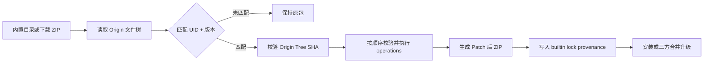

# 内置 Skill 与精选能力 Skill Monkeypatch 使用手册

> 编写时校验快照：`ch/skill_patch@6cc95222`。本文中的命令均从仓库根目录执行。

## 1. 适用范围

本手册用于维护平台侧的兼容性补丁，适用于：

1. `skills/builtin-sources.yaml` 中 `bundled_skills` 声明的内置 Skill。
2. `skills/featured/<id>/featured.yaml` 中 `skill.source_url` 指向的精选能力 Skill。

Patch 只修复底层 Skill 包内容，例如脚本路径、配置文件、提示词或缺失文件。精选能力的卡片文案、任务配置、封面和展示信息仍应直接修改 `featured.yaml`，不应通过 Patch 修改。

所有 Patch 统一存放在 `skills/patches/`。构建器只加载这一份 Catalog，并让内置 Skill、普通下载型 Skill 和精选能力 Skill 经过同一套 Patch Engine。[Patch Catalog 接线](../skills/builtin-sources.yaml#L1-L3) [构建器加载 Patch](../backend/core/cmd/builtin-skill-bundle/main.go#L121-L132)

## 2. 核心原则

### 2.1 不修改原始 Skill

原始目录或下载 ZIP 作为 Origin 保持不变。Patch Engine 复制文件树后再执行 `upsert` 或 `delete`，最终生成新的不可变分发 ZIP。[复制与应用逻辑](../backend/core/skillv2/skillpatch/engine.go#L20-L44) [输入不原地修改](../backend/core/skillv2/skillpatch/engine.go#L84-L90)

### 2.2 补丁必须绑定原始指纹

每个 Patch 必须同时绑定：

- Skill UID；
- 原始 Skill 版本；
- 原始完整文件树 SHA256；
- 每个待修改文件的原始 SHA256，或新文件标记 `absent`。

完整文件树或目标文件发生变化时，构建立即失败，不会尝试模糊套用旧 Patch。[Tree 校验](../backend/core/skillv2/skillpatch/engine.go#L20-L31) [文件校验](../backend/core/skillv2/skillpatch/engine.go#L56-L70)

### 2.3 Catalog 只登记当前有效 Patch

构建结束时，每个 Catalog 条目必须恰好应用一次。目标不存在、版本不匹配或同一 Patch 被多次匹配都会导致构建失败。因此不要把历史 Patch 长期留在活动 Catalog 中。[应用次数校验](../backend/core/skillv2/skillpatch/engine.go#L47-L53) [构建器总校验](../backend/core/cmd/builtin-skill-bundle/main.go#L232-L245)

## 3. 端到端流程



精选能力不会绕开这条链路。构建器读取所有 `published` Featured 定义，将其 `skill.source_url` 加入相同的 sources 列表，然后统一打包；精选能力底层包会被标记为 `market_visible=false`，避免同时出现在普通技能广场。[Featured 加入统一源列表](../backend/core/cmd/builtin-skill-bundle/main.go#L142-L159) [统一打包循环](../backend/core/cmd/builtin-skill-bundle/main.go#L187-L243)

## 4. 文件布局

```text
skills/
├── builtin-sources.yaml
├── builtin-skills.lock.json
├── patches/
│   ├── README.md
│   ├── catalog.yaml
│   └── <skill-uid>/
│       └── <patch-name>/
│           ├── patch.yaml
│           └── files/
│               └── <Patch 后的完整替换文件>
├── research/、review/、search/ ...      # 内置 Skill 原始目录
└── featured/
    └── <featured-id>/
        ├── featured.yaml
        ├── locales/
        └── assets/
```

`files/` 下的路径只用于保存 Patch payload；`patch.yaml` 中 `operations[].path` 才是 Skill ZIP 内的目标路径。[目录约定](../skills/patches/README.md#L5-L15)

## 5. 第一步：隔离探测原始包

不要为了获取哈希直接向正在运行的 `skills/.runtime` 输出未打补丁包。先使用隔离目录生成 Origin 探测结果：

```bash
repo_root="$(pwd)"
probe_dir="$(mktemp -d /private/tmp/lazymind-skill-origin.XXXXXX)"

(
  cd backend/core
  go run ./cmd/builtin-skill-bundle \
    --sources "$repo_root/skills/builtin-sources.yaml" \
    --lock "$probe_dir/builtin-skills.lock.json" \
    --cache "$repo_root/skills/.runtime/cache" \
    --output "$probe_dir/builtin-skills" \
    --featured-sources "$repo_root/skills/featured" \
    --featured-output "$probe_dir/featured-skills"
)
```

这个命令使用正式 bundler，但输出只进入临时目录。`make skills-build` 和 `make skills-materialize` 使用的是同一个入口和参数结构。[标准构建命令](../Makefile#L315-L332)

> 如果目标已经有活动 Patch，探测构建仍会应用它。此时原始 Tree SHA 应读取正式 lock 中的 `origin_tree_sha256`；原始 ZIP 可通过 `origin_archive_sha256` 在 `skills/.runtime/cache/<sha>.zip` 中找到。不要用 Patch 后的 `tree_sha256` 代替 Origin SHA。

## 6. 给内置 Skill 添加 Patch

### 6.1 找到 UID、版本和原始 Tree SHA

内置 Skill 的 UID 与版本显式声明在 `bundled_skills` 中，源地址为 `builtin://<path>`。[内置源声明](../skills/builtin-sources.yaml#L3-L23)

例如按源路径查询探测 lock：

```bash
target_source="builtin://research/deep-research"

jq --arg source "$target_source" \
  '.skills[] | select(.source_url == $source) |
   {uid, version, tree_sha256, archive_sha256, package_file}' \
  "$probe_dir/builtin-skills.lock.json"
```

对于尚未打 Patch 的 Skill：

- `tree_sha256` 就是 `target.origin_tree_sha256`；
- `archive_sha256` 是原始 ZIP SHA；
- `uid` 与 `version` 原样写入 Patch target。

### 6.2 计算目标文件 SHA

本地内置 Skill 可以直接计算：

```bash
skill_path="research/deep-research"
target_file="SKILL.md"
shasum -a 256 "skills/$skill_path/$target_file"
```

也可以从探测 ZIP 计算，以确保验证的正是打包输入：

```bash
uid="<上一步得到的 uid>"
target_file="SKILL.md"

unzip -p "$probe_dir/builtin-skills/packages/$uid.zip" "$target_file" \
  | shasum -a 256
```

### 6.3 创建 Patch 目录

```text
skills/patches/<uid>/fix-runtime-instruction-v1/
├── patch.yaml
└── files/
    └── SKILL.md
```

`files/SKILL.md` 必须是修复后的完整文件，不是 unified diff。

`patch.yaml` 示例：

```yaml
schema_version: 1
id: deep-research/fix-runtime-instruction-v1
description: Fix a runtime-incompatible instruction
target:
  uid: <lock 中的 uid>
  version: <lock 中的 version>
  origin_tree_sha256: <探测 lock 中的 tree_sha256>
operations:
  - op: upsert
    path: SKILL.md
    file: files/SKILL.md
    before_sha256: <原始 SKILL.md SHA256>
```

### 6.4 注册 Patch

编辑 `skills/patches/catalog.yaml`：

```yaml
schema_version: 1
patches:
  - <uid>/fix-runtime-instruction-v1/patch.yaml
```

Catalog 路径相对于 `skills/patches/`，且必须以 `patch.yaml` 结尾；重复路径和重复 Patch ID 会被拒绝。[Catalog 路径校验](../backend/core/skillv2/skillpatch/catalog.go#L91-L135)

## 7. 给精选能力 Skill 添加 Patch

### 7.1 不要重复声明 source_url

精选能力的底层 Skill 来源只写在：

```yaml
skill:
  source_url: https://example.com/path/to/skill
  required_version: 1.0.0
```

不要把同一个 URL 再写入 `skills/builtin-sources.yaml` 的 `skills` 列表，否则构建器会以“同时属于普通市场 Skill 和 featured-only Skill”为由失败。[重复来源保护](../backend/core/cmd/builtin-skill-bundle/main.go#L149-L159)

当前真实配置可参考：[高考志愿填报顾问](../skills/featured/gaokao-volunteer-advisor/featured.yaml#L1-L15) 和 [K12 智能老师](../skills/featured/k12-smart-teacher/featured.yaml#L1-L15)。

### 7.2 从 lock 获取 UID，不要手写

下载型 Skill 的 UID 根据稳定来源 identity 计算，必须从探测 lock 或正式 lock 读取，不要自行猜测。[UID 生成规则](../backend/core/cmd/builtin-skill-bundle/main.go#L572-L578)

```bash
target_source="https://skillhub.cn/skills/user_7c4df347/gaokao-volunteer-advisor"

jq --arg source "$target_source" \
  '.skills[] | select(.source_url == $source) |
   {uid, version, market_visible, tree_sha256, archive_sha256, package_file}' \
  "$probe_dir/builtin-skills.lock.json"
```

预期 `market_visible=false`。这是 Featured-only 底层包的正常状态，不代表它不会出现在“精选能力”中。

### 7.3 计算原始文件 SHA

```bash
uid="<lock 中的 uid>"
target_file="scripts/run.py"

unzip -p "$probe_dir/builtin-skills/packages/$uid.zip" "$target_file" \
  | shasum -a 256
```

### 7.4 创建并注册 Patch

目录和 Schema 与内置 Skill 完全相同：

```text
skills/patches/<featured-skill-uid>/fix-runtime-path-v1/
├── patch.yaml
└── files/scripts/run.py
```

```yaml
schema_version: 1
id: gaokao-volunteer-advisor/fix-runtime-path-v1
description: Make the Featured Skill compatible with the LazyMind runtime
target:
  uid: <lock 中的 uid>
  version: <lock 中的 version>
  origin_tree_sha256: <探测 lock 中的 tree_sha256>
operations:
  - op: upsert
    path: scripts/run.py
    file: files/scripts/run.py
    before_sha256: <原始文件 SHA256>
```

然后将 Patch 路径加入 `skills/patches/catalog.yaml`。

### 7.5 版本规则

兼容性 Patch 原则上不要修改 `SKILL.md` 中的 `version`。Featured 的 `required_version` 会与最终包版本严格比对，不一致时构建失败。[Featured 版本绑定](../backend/core/cmd/builtin-skill-bundle/main.go#L259-L275)

如果修复必须改变产品版本，应先升级 Featured 定义中的 `version` 和 `required_version`，再为新版本创建新的 Patch ID；不要让同一个 Patch ID 跨版本复用。

## 8. Operation 参考

### 8.1 替换已有文件

```yaml
- op: upsert
  path: scripts/run.py
  file: files/scripts/run.py
  before_sha256: <已有文件 SHA256>
```

### 8.2 新增文件

```yaml
- op: upsert
  path: config/runtime.yaml
  file: files/config/runtime.yaml
  before_sha256: absent
```

如果目标路径已经存在，新增操作会失败。

### 8.3 删除文件

```yaml
- op: delete
  path: obsolete.txt
  before_sha256: <原始文件 SHA256>
```

`delete` 不允许填写 `file`，也不能使用 `before_sha256: absent`。[Operation 规则](../backend/core/skillv2/skillpatch/catalog.go#L190-L243)

### 8.4 多个 Operation

Operations 按 YAML 顺序执行。建议一个目标路径只由一个活动 Patch 维护；如果多个 Patch 必须依次修改同一文件，后一个 Patch 的 `before_sha256` 必须匹配前一个 Patch 产生的内容，这会增加升级维护成本。

## 9. 构建与验收

### 9.1 生成最终分发包和 lock

```bash
make skills-build
```

该命令会同时生成：

- `skills/.runtime/builtin-skills/catalog.json`；
- `skills/.runtime/builtin-skills/packages/<uid>.zip`；
- `skills/.runtime/featured-skills/catalog.json`；
- `skills/builtin-skills.lock.json`。

### 9.2 查看 provenance

```bash
uid="<目标 uid>"

jq --arg uid "$uid" \
  '.skills[] | select(.uid == $uid) |
   {
     version,
     origin_archive_sha256,
     origin_tree_sha256,
     patch_set_sha256,
     applied_patches,
     archive_sha256,
     tree_sha256,
     package_file
   }' \
  skills/builtin-skills.lock.json
```

验收标准：

1. `origin_archive_sha256`、`origin_tree_sha256`、`patch_set_sha256` 非空；
2. `applied_patches` 包含预期 Patch ID；
3. `origin_archive_sha256 != archive_sha256`；
4. 修改文件时，通常 `origin_tree_sha256 != tree_sha256`；
5. 只有预期 Skill 的 lock 条目发生变化。

这些 provenance 字段由构建器写入最终 Catalog，并在运行时加载时校验完整性。[provenance 写入](../backend/core/cmd/builtin-skill-bundle/main.go#L459-L499) [provenance Schema](../backend/core/skillv2/builtin/catalog.go#L33-L59) [provenance 完整性校验](../backend/core/skillv2/builtin/catalog.go#L151-L180)

### 9.3 检查最终 ZIP 内容

```bash
package_file="$(jq -r --arg uid "$uid" \
  '.skills[] | select(.uid == $uid) | .package_file' \
  skills/builtin-skills.lock.json)"
target_file="SKILL.md"

unzip -p "skills/.runtime/builtin-skills/$package_file" "$target_file"
```

输出必须与 `skills/patches/<uid>/<patch-name>/files/<target-file>` 一致，而原始 Skill 文件应保持不变。

### 9.4 Frozen lock 与测试

```bash
make skills-materialize
make featured-check

cd backend/core
go test ./cmd/builtin-skill-bundle ./skillv2/skillpatch
```

`skills-materialize` 使用 `--frozen-lockfile`，用于确认下载来源、分发属性、原始内容、Patch 和最终 lock 仍然一致。[Frozen 构建命令](../Makefile#L324-L332)

## 10. 上游升级时如何处理

### 情况 A：上游已经包含修复

1. 从 `skills/patches/catalog.yaml` 删除旧 Patch 条目；
2. 删除活动 Patch 目录，Git 历史保留审计记录；
3. 运行 `make skills-build` 更新 lock；
4. 确认最终包仍包含修复且 `applied_patches` 已消失。

### 情况 B：上游升级后仍需要修复

1. 重新隔离探测新版本原包；
2. 重新审查上游变化，不能只更新 SHA；
3. 创建新的 Patch ID，例如 `fix-runtime-path-v2`；
4. 更新 UID/版本、Origin Tree SHA 和文件 SHA；
5. 用新 Patch 替换 Catalog 中的旧条目；
6. 重新执行全部验收。

旧 Patch 在版本不匹配时不会被静默忽略：由于活动 Catalog 条目必须恰好应用一次，最终构建会失败并要求维护者处理。[匹配与精确一次规则](../backend/core/skillv2/skillpatch/engine.go#L20-L53)

## 11. 已安装且发生用户进化时

Patch 不直接修改用户已经安装的 Revision。Patch 后 ZIP 会成为新的平台分发制品；升级时使用三方合并：

```text
Base   = 用户安装时的旧分发包
Ours   = 用户当前 Head Revision
Theirs = 最新 Patch 后分发包
```

无冲突修改可以自动合并；冲突进入现有 Draft Review。开启自动更新时，无冲突升级自动创建一个平台更新 Revision，有冲突时停留待确认，不创建 Revision。[三方合并说明](skill-distribution-upgrade.md#L3-L11) [自动更新行为](skill-distribution-upgrade.md#L29-L39)

因此，用户自进化不会让 Patch 本身“失效”：Patch 针对的是平台 Origin 包，用户修改在之后的三方合并阶段处理。

## 12. 常见错误

| 错误 | 原因 | 处理方式 |
| --- | --- | --- |
| `origin tree mismatch` | 上游内容变化，旧 Patch 已过期 | 重新探测并人工审查，不要只替换 SHA |
| `file ... hash mismatch` | 目标文件内容与 Patch 预期不同，或前序 Patch 已修改它 | 检查 Patch 顺序与真实原文件 |
| `applied 0 times, want exactly once` | UID/版本不匹配，或目标 Skill 已移除 | 更新 Patch 或从活动 Catalog 删除 |
| `applied 2 times` | 同一 UID/来源被重复打包 | 删除重复 source 声明 |
| `source ... cannot be both...` | Featured URL 又被加入普通 `skills` | 只保留 Featured 的 `skill.source_url` |
| `requires version ..., got ...` | Featured `required_version` 与最终 Skill 版本不一致 | 对齐版本；兼容 Patch 不要擅自改版本 |
| `requires a file under files/` | upsert payload 不在 Patch 的 `files/` 下 | 按标准目录移动 payload |
| `path escapes patch root` | Patch 路径或符号链接逃逸 | 使用相对安全路径，禁止 `../` 与外部链接 |

## 13. 提交前检查清单

- [ ] Patch 是兼容性修复，而不是 Featured 展示配置。
- [ ] 原始 Skill 文件或下载 ZIP 未被直接修改。
- [ ] UID 和版本来自最新隔离探测 lock。
- [ ] `origin_tree_sha256` 来自未打补丁的原始文件树。
- [ ] 每个 `before_sha256` 来自对应原始文件。
- [ ] 新文件使用 `before_sha256: absent`。
- [ ] Patch ID 包含目标和修复语义，并在升级时创建新 ID。
- [ ] Catalog 只包含当前有效 Patch。
- [ ] `make skills-build` 通过。
- [ ] lock provenance 与最终 ZIP 内容已人工核对。
- [ ] `make skills-materialize`、`make featured-check` 和 Patch 单测通过。
- [ ] `git diff -- skills/builtin-skills.lock.json` 没有无关来源漂移。

## 14. 可信度与边界

| 内容 | 可信度 | 依据 |
| --- | --- | --- |
| 两类 Skill 共用 Patch Engine | 高 | bundler 的统一 sources 列表与打包循环 |
| Tree/File SHA 失配时失败关闭 | 高 | Patch Engine 校验与单元测试 |
| Featured-only 包不进入普通市场 | 高 | `MarketVisible` 构建赋值与 Featured 测试 |
| 用户进化通过三方合并保留 | 高 | Distribution Upgrade 服务与流程文档 |
| GitHub 分支保护是否强制这些命令 | 未验证 | 属于仓库外平台设置，需要管理员确认 |

关键实现与测试：

- [Patch Schema 与安全路径](../backend/core/skillv2/skillpatch/catalog.go)
- [Patch 应用引擎](../backend/core/skillv2/skillpatch/engine.go)
- [Patch 单元测试](../backend/core/skillv2/skillpatch/engine_test.go)
- [统一 Bundler](../backend/core/cmd/builtin-skill-bundle/main.go)
- [Bundler 集成测试](../backend/core/cmd/builtin-skill-bundle/main_test.go)
- [三方合并升级说明](skill-distribution-upgrade.md)
