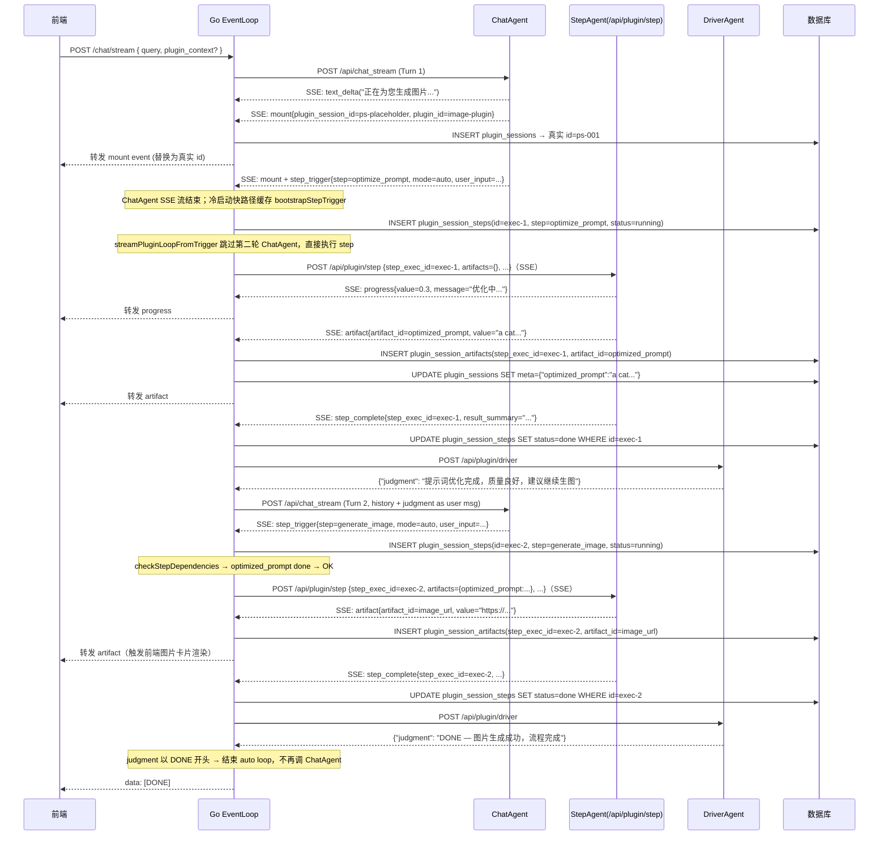
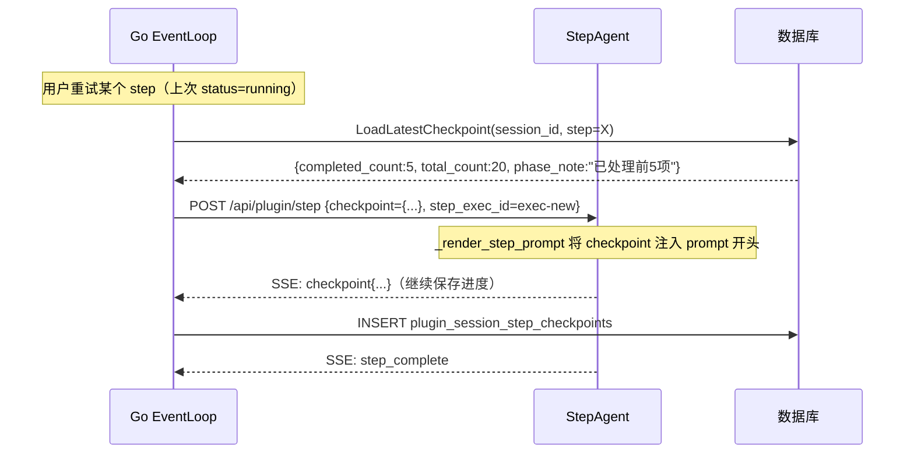
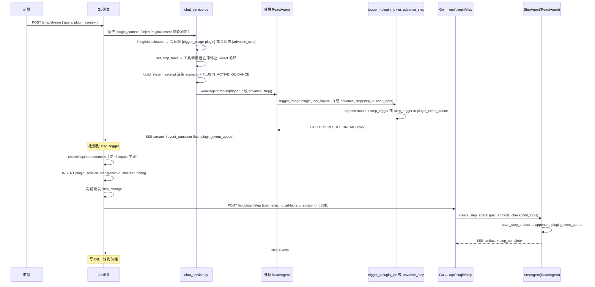

# M1 — 极简 POC + Scenario 基建（完整闭环版）

## 概述

**里程碑目标**：打通**完整最小闭环**——Scenario 加载与校验、Go 驱动的多轮 Agent 调度、前端插件卡片展示、checkpoint 存读、用户多轮干预（human 模式）、step 内依赖校验与报错，确保后续里程碑只需在此基础上扩展能力，不需重构架构。

**依赖关系**：无前置依赖，M1 是整个插件系统的起点。

**验收标准（一句话）**：用户发送「生成一只戴帽子的猫」→ ChatAgent 冷启动 `trigger_image-plugin`（mount + step_trigger 一次完成）→ Go 直接调用 StepAgent 执行 optimize_prompt → DriverAgent 评判 → ChatAgent `advance_step` 触发 generate_image → StepAgent 保存 image_url → DriverAgent 返回 DONE 结束 loop → 前端弹出图片卡片；scenario 文件启动时校验通过并正确注入 agent context；checkpoint 写入 DB 并在重试时恢复；human 模式下等待用户输入后继续。

**当前落地状态（2026-06-12）**：后端 curl 端到端已通（`optimize_prompt → generate_image → DONE`）；前端 plugin 卡片展示仍待验证。详见 [十四、落地记录与计划偏差](#十四落地记录与计划偏差2026-06-11--2026-06-12)。

---

## 一、重要准则

### 1.1 架构层次：Go 是唯一 Orchestrator

```
前端 ←──SSE──→ Go（事件循环） ←── ChatAgent（决策）
                              ←── StepAgent（执行）
                              ←── DriverAgent（评判）
```

- **Go 是唯一 Orchestrator**：负责调度 ChatAgent、StepAgent、DriverAgent，驱动多轮循环，写入所有持久化数据。
- **Python 侧全部为无状态单次调用**：每个 API 端点接收上下文参数、执行、返回结果，无跨请求状态。
- **ChatAgent 是决策者**：分析用户意图，决定触发哪个 step，通过 `step_trigger` 事件通知 Go；**不直接调用 StepAgent**。
- **冷启动合并（已落地）**：无活跃 plugin session 时，ChatAgent 调用 `trigger_<plugin_id>` 一次性发出 `mount` + `step_trigger`；Go 缓存该 trigger 并走 `streamPluginLoopFromTrigger` 冷启动快路径，**跳过第二轮 ChatAgent** 直接执行首个 step。
- **会话内推进（已落地）**：有活跃 plugin session 时，ChatAgent 仅暴露单一 `advance_step(step_id, user_input)` 工具（非原计划的 per-step `trigger_<step_id>`）；终端 step 不提供 `advance_step`，由 DriverAgent 返回 `DONE` 结束 loop。
- **StepAgent 是执行者**：由 Go 直接调用（`/api/plugin/step` SSE 端点），接收完整上下文（step_spec、artifacts、checkpoint、step_exec_id），通过 SSE 流返回事件。
- **DriverAgent 是评判者**：auto 模式下 step 完成后由 Go 调用，输出自然语言评判，不调用任何工具。

### 1.2 单一 SSE 连接 + 复用对话 Event Loop

- **复用对话 Event Loop**：plugin 调度在同一个 `/chat/stream` SSE 连接上进行，不新建独立 SSE 连接。
- Go 在同一个 HTTP handler 内串行：ChatAgent 调用 → 检测 `step_trigger` → 创建 DB 记录 → StepAgent 调用 → 检测 `step_complete` → 获取「下一轮用户消息」→ 再次 ChatAgent 调用 → …
- **auto 模式全局上限**：`maxAutoTurns = 5 * num_steps` 轮，防止无限循环。
- **per-step 动态重试上限**（auto 模式）：每次执行 step_trigger 时，计算当前 step 本轮可用额度 = `floor((maxAutoTurns - turn) / remainingSteps * 1.5)`（remainingSteps = 状态机中从当前 step 可达的 step 数，含自身；最小值为 1）。超过上限则强制终止并发 error 事件。human 模式无此限制。

**human 模式与 auto 模式的 Go 驱动逻辑完全一致，唯一区别在于「下一轮用户消息」的来源**：

- **auto 模式**：Go 调用 DriverAgent，将其评判文字作为「下一轮用户消息」注入，继续调用 ChatAgent。
- **human 模式**：Go 向前端发送 `step_waiting` 事件并关闭当轮 SSE；等待用户从前端传来「下一轮用户消息」后，Go 开启新一轮处理。

**human 模式下用户消息的来源与 Go 处理策略**：


| 前端行为                    | `advance` | 上次 step 状态（Go 从 DB 查） | Go 行为                                                                                               |
| ----------------------- | --------- | --------------------- | --------------------------------------------------------------------------------------------------- |
| 用户输入对话（问题、修改意见等）        | `false`   | 任意                    | 以用户实际输入调用 ChatAgent，LLM 决定触发哪个 step                                                                 |
| 用户点击「继续」（step 执行到一半被中断，但进程仍活跃） | `true`    | `running`（心跳未超时）      | 等待当前执行完成，不重复触发                                                                                      |
| 用户点击「继续」（step 被动中断，进程已消亡）| `true`    | `interrupted`         | **直接调 StepAgent**（跳过 ChatAgent）：加载 checkpoint，重跑同一 step                                             |
| 用户点击「继续」（step 已完成，等待推进） | `true`    | `done`                | 构造合成消息「Step X completed. User confirmed. Please proceed.」，调用 ChatAgent，LLM 结合 scenario.md 决定下一 step |


**Case 1（interrupted → 恢复执行）**：step 已确定（就是那个 `interrupted` 的 step），checkpoint 已知，无需 LLM 介入，Go 直接构造 StepTriggerInfo 并调 StepAgent。

**Case 2（done → 进入下一步）**：下一步由状态机决定，Go 不实现状态机逻辑，交给 ChatAgent + scenario.md 判断。

Go 通过查询 `plugin_session_steps WHERE step=pctx.Step ORDER BY created_at DESC LIMIT 1` 拿到 `step_status`，以此区分三种情况：`running`（活跃，等待）/ `interrupted`（被动中断，checkpoint 恢复）/ `done`（已完成，推进）。

### 1.3 插件文件统一放在 plugin/ 目录

每个插件的所有文件（scenario、tools、前端代码）统一放在 `plugin/plugins/<plugin-id>/` 下，不分散到 `algorithm/` 或 `frontend/`。

**工程约束（必须落地）**：

- **Frontend Docker 镜像的 build context 改为仓库根目录**（原来是 `./frontend`），以便在 Dockerfile 中 `COPY plugin/plugins/<id>/frontend/ ...` 拷贝插件前端代码进镜像。
- **Algorithm Docker 镜像同理**：build context 改为根目录，`COPY plugin/plugins/ ./plugin/plugins/` 拷贝插件脚本。
- `docker-compose.yml` 中 frontend、algorithm service 的 `build.context` 均改为 `.`（仓库根目录）。

### 1.4 Scenario 文件职责严格分离


| 文件            | 读取方                      | 职责                                                         |
| ------------- | ------------------------ | ---------------------------------------------------------- |
| `scenario.md` | ChatAgent system prompt  | 用户意图识别指南；描述各 step 能力；状态机语义说明                               |
| `state.yml`   | loader → 状态机 + step spec | 状态机（transitions）+ 每 step 执行细节（prompt/tools/inputs/outputs） |
| `driver.md`   | DriverAgent（单次调用）        | auto 模式评判策略，**仅** DriverAgent 使用，绝不用于 StepAgent guidance   |


### 1.5 降级逻辑

**state.yml 存在时（标准模式）**：

1. 同时加载 `scenario.md` 和 `state.yml`。
2. 运行**一致性检查**：state.yml 的每个 step_id 必须在 scenario.md 文本中出现（简单字符串匹配，不做语义检查）；不通过则产生 warning，仍继续加载。
3. step_spec 从 state.yml 的 `steps.<step_id>` 读取；scenario.md 注入 ChatAgent system prompt。
4. 状态机从 state.yml `transitions` 解析。

**state.yml 不存在时（降级/Legacy 模式）**：

1. 以 `scenario.md` 为准，加载全文作为 ChatAgent guidance。
2. 无 step_spec：StepAgent 使用 `scenario.md` 全文作为 prompt guidance（无模板变量替换）。
3. 无状态机：从 `scenario.md` 提取所有 `trigger_<step_id>` 格式字符串，推断可达 step 列表，所有 step 互相可达。
4. **不使用 driver.md** 作为 guidance（driver.md 始终只给 DriverAgent）。
5. 产生 warning：`Plugin {id} loaded in legacy mode (no state.yml)`。

### 1.6 ChatAgent 工具语义（冷启动 vs 会话内）

**两类工具，均为「决策+校验+信号」，不执行 StepAgent。**

| 场景 | 工具 | 行为 |
| ---- | ---- | ---- |
| 无活跃 session（冷启动） | `trigger_<plugin_id>(user_input)` | 一次性 emit `mount` + `step_trigger(initial_step)` |
| 有活跃 session（推进） | `advance_step(step_id, user_input)` | emit 单个 `step_trigger`；终端 step 不提供此工具 |

`advance_step` / `trigger_<plugin_id>` 内部均调用 `trigger_plugin_step()`，执行两层校验后再发出信号：

1. **格式校验**（Python 层，不需要 DB）：step_id 是否在状态机可达 step 中；user_input 是否非空。
2. **依赖状态校验**（Python 层，查 DB）：从 `lazyllm.globals['agentic_config']['db_session_factory']` 获取 DB 连接，查询依赖 artifact 的实际状态，按 required/optional 语义判断是否满足。

任一校验不通过，工具**直接返回结构化报错字符串**（含具体原因和建议操作），LLM 收到报错后在同一 ReAct 循环内重新决策（触发其他 step 或直接回答用户）。两层校验全部通过后，才 emit `step_trigger` 事件并返回。

Go 收到 `step_trigger` 事件后负责创建 DB 记录并调用 StepAgent。ChatAgent **不等待** StepAgent 完成。

**Go 侧 `checkStepDependencies()` 保留为兜底断言**：trigger 工具已做主路径校验，Go 侧的依赖检查降级为防御性断言，正常路径不应触发。

曾考虑让 ChatAgent 内部直接调用 StepAgent，最终放弃——Go 作为唯一 Orchestrator 职责更清晰，且 Go 能在调 StepAgent 前预先完成 DB 初始化（生成 step_exec_id）。

**ReactAgent 终端工具（落地新增）**：

- `chat_service.py` 对 `trigger_<plugin_id>` 和 `advance_step` 调用 `react_agent.set_stop_tools(...)`，工具调用成功后 ReAct 循环**立即停止**，不再进入 summarize。
- LazyLLM `ReactAgent` 新增 `set_stop_tools()` / `stop_condition` 支持（`algorithm/lazyllm/lazyllm/tools/agent/reactAgent.py`）。
- StepAgent 侧对 `save_step_artifact` 同样设置 `set_stop_tools`，保存 artifact 后即结束。

**LLM 未调用工具时的 fallback（落地新增）**：

- 当 LLM 在 plugin 推进轮只输出纯文本（如 reasoning 模式）而未调用 `advance_step` 时，`chat_service.py` 会**合成 fallback `step_trigger`**，自动选取 `get_reachable_steps()[0]` 作为下一步。
- 终端 step 不合成 fallback，避免死循环。

### 1.7 DriverAgent 语义

**DriverAgent 是「评判者」而非「执行者」**：输出自然语言评判，不调用任何工具，不主动触发下一步。评判结果由 Go 以 `role: user` 注入下一轮 chat，ChatAgent 根据评判决定触发哪个 step。

**driver.md 与 step_mode 的强制关联**：

- `driver.md` **不存在**：该插件**禁止使用 auto 模式**。plugin_loader 在加载时检查：若插件任一 step 的 `default_mode` 为 `auto` 且 `driver.md` 不存在，则产生 **error**（阻止加载）。插件作者必须要么提供 `driver.md`，要么将所有 step 改为 `human` 模式。
- `driver.md` **存在但字数 < 3000**：`evaluate_step()` 在调用 LLM 前，自动在 prompt 末尾追加完整 `scenario.md` 内容，补充 DriverAgent 的场景语境。
- `driver.md` **存在且字数 ≥ 3000**：直接使用 `driver.md`，不追加 scenario.md。

**DriverAgent 裁决词扩展（落地偏差）**：

- 原设计仅 PASS / RETRY / FAIL；落地后增加 **`DONE`** 语义：当末步成功且无需继续时，DriverAgent 以 `DONE` 开头输出裁决，Go `streamPluginLoop` 检测到后**立即结束 auto loop**，不再调用 ChatAgent。
- 原因：`image-plugin` 的 `generate_image` 在 state.yml 中**非严格终端**（可回退 `optimize_prompt`），不能仅靠「无后继 step」判断流程结束。

### 1.8 可选依赖语义（Go 层执行）

`每个step的输入参数，如果required: false` ，它的语义是允许依赖 step 从未执行过，但不允许执行了却未完成：

- Step 从未执行 → `artifacts[key] = null`，StepAgent prompt 中该变量为空，自行 fallback。
- Step 最近执行 `abandoned` → 查最后一次 `done` 的 artifact；若无则 `null`。
- Step 最近执行 `running` 或 `failed` → **无论 required 是否为 true，均报错，阻止调用 StepAgent**。

依赖校验在 **Go 层 `checkStepDependencies()`** 执行，Python 侧只做内存映射。

---

## 二、完整事件流

### 2.1 核心时序（auto 模式完整流程）




### 2.2 human 模式时序

```mermaid
sequenceDiagram
    participant FE as 前端
    participant Go as Go EventLoop
    participant CA as ChatAgent
    participant SA as StepAgent

    FE->>Go: POST /chat/stream { query }
    Go->>CA: POST /api/chat_stream (Turn 1)
    CA-->>Go: SSE: mount + step_trigger{step=X, mode=human}
    Go->>SA: POST /api/plugin/step（SSE）
    SA-->>Go: SSE: artifact + step_complete
    Go-->>FE: 转发 step_waiting{step=X, step_exec_id=exec-1}
    Go-->>FE: data: [DONE]（当轮 SSE 结束）

    Note over FE: 显示"等待您的指令"状态\npluginSessionStore.isWaiting=true\nactivePluginContextStore.step=X

    alt 用户点击「继续」且上次 step=X 状态为 running（被中断）
        FE->>Go: POST /chat/stream { query="", plugin_context={..., step=X, advance=true} }
        Note over Go: advance=true + status=running\n→ 直接恢复执行（跳过 ChatAgent）
        Go->>DB: LoadLatestCheckpoint(session, step=X)
        Go->>SA: POST /api/plugin/step {step_exec_id=new, checkpoint={...}}（SSE）
        SA-->>Go: SSE: step_complete
    else 用户点击「继续」且上次 step=X 状态为 done（已完成）
        FE->>Go: POST /chat/stream { query="", plugin_context={..., step=X, advance=true} }
        Note over Go: advance=true + status=done\n→ 合成「Step X completed. Please proceed.」
        Go->>CA: POST /api/chat_stream（合成消息）
        CA-->>Go: SSE: step_trigger{step=Y, mode=human}
    else 用户输入对话消息（advance=false）
        FE->>Go: POST /chat/stream { query="用户消息", plugin_context={..., step=X} }
        Go->>CA: POST /api/chat_stream（原始用户消息）
        CA-->>Go: SSE: step_trigger{step=Y, mode=human}（或直接回答）
    end
    Go->>SA: POST /api/plugin/step（SSE）
    ...
```


### 2.3 checkpoint 恢复时序




### 2.4 事件类型完整定义


| type            | 来源            | Go 处理                                                       | 是否转发前端 |
| --------------- | ------------- | ----------------------------------------------------------- | ------ |
| `mount`         | ChatAgent SSE | 创建 plugin_sessions；替换 placeholder id                        | ✅      |
| `step_trigger`  | ChatAgent SSE | 创建 plugin_session_steps(running)；调用 /api/plugin/step        | ❌      |
| `step_change`   | Go 内部生成       | 处理 step_trigger 时更新 current_step_id，通知前端                    | ✅      |
| `progress`      | StepAgent SSE | 透传                                                          | ✅      |
| `artifact`      | StepAgent SSE | INSERT plugin_session_artifacts；UPDATE plugin_sessions.meta | ✅      |
| `checkpoint`    | StepAgent SSE | INSERT plugin_session_step_checkpoints                      | ❌      |
| `step_complete` | StepAgent SSE | UPDATE plugin_session_steps.status=done；提取 StepCompleteInfo | ❌      |
| `step_done`     | Go 内部生成       | step_complete 处理完成后发给前端，通知 UI 该 step 已成功完成                  | ✅      |
| `step_error`    | StepAgent SSE | UPDATE plugin_session_steps.status=failed；转发错误              | ✅      |
| `step_waiting`  | Go 内部生成       | human 模式 step_complete 后发给前端，关闭当轮 SSE                       | ✅      |


---

## 三、插件文件结构

### 目录约定

```
plugin/plugins/<plugin-id>/
  plugin.yaml              # 注册元数据
  tools.py                 # 插件自定义纯函数工具（可选）
  scenario/
    state.yml              # 状态机 + step 执行 spec（可选；不存在时降级）
    scenario.md            # ChatAgent 意图识别指南（必须存在）
    driver.md              # DriverAgent 评判策略（auto 模式推荐存在）
    prompts/               # 可选：独立 prompt 文件
  frontend/                # 插件前端代码（Frontend 镜像 build 时拷贝）
    index.tsx
    config.ts
    *.scss
```

### plugin.yaml

```yaml
id: image-plugin
name: AI 图片生成
description: 帮助用户生成高质量图片，先优化提示词再生成图片

trigger_description: |
  Launch image generation when user asks to create, generate, or draw any image,
  illustration, photo, or visual.

steps:
  - id: optimize_prompt
    label: 优化提示词
    default_mode: auto
  - id: generate_image
    label: 生成图片
    default_mode: auto

tool_scripts:
  - path: tools.py
    functions: [dalle_generate]

artifacts:
  optimized_prompt: { type: text }
  image_url:        { type: image }
```

### scenario/state.yml

```yaml
# ---- 状态机 ----
initial: optimize_prompt
transitions:
  optimize_prompt:
    - to: optimize_prompt
      condition: "用户对提示词不满意，要求修改优化方向或重新优化"
    - to: generate_image
      condition: "提示词优化完成，auto 模式下自动进入生图"
  generate_image:
    - to: optimize_prompt
      condition: "用户对图片不满意，要求修改描述内容或方向，需重新优化提示词"
    - to: generate_image
      condition: "用户要求保持描述不变但重新生图"

# ---- 每个 step 的执行 spec ----
steps:
  optimize_prompt:
    prompt: |
      The user wants to generate an image. Their description: {{user_input}}
      Optimize this prompt for high-quality image generation:
      - Make it descriptive and visually specific
      - Add lighting, style, and composition hints if appropriate
      When done, call save_step_artifact('optimized_prompt', your_optimized_text).
    tools: []
    outputs:
      - artifact_id: optimized_prompt
        format: text

  generate_image:
    prompt: |
      Generate an image using the optimized prompt: {{optimized_prompt}}
      Call dalle_generate(prompt) to produce the image.
      When done, call save_step_artifact('image_url', the_returned_url).
    tools: [dalle_generate]
    inputs:
      - artifact_id: optimized_prompt
        payload_key: optimized_prompt
        required: true
    outputs:
      - artifact_id: image_url
        format: url
```

### scenario/scenario.md

```markdown
# AI 图片生成插件

## 场景描述

帮助用户生成高质量图片。流程分两步：先将用户描述优化为专业英文 prompt，再调用图片生成模型。两步均自动执行。

## 各步骤能力

- **optimize_prompt**：将用户的自然语言描述优化为高质量英文图片生成 prompt
- **generate_image**：根据优化后的 prompt 调用图片生成模型

## 用户意图识别

- 生成/绘制/创建图片类请求 → 调用 `trigger_optimize_prompt(user_input=...)`
- 用户对图片不满意，要求修改描述 → 调用 `trigger_optimize_prompt(user_input=新描述)`
- 用户要求重新生图（保持描述不变）→ 调用 `trigger_generate_image(user_input=...)`
- 无关问题 → 直接回答，不调用任何 trigger 工具

## 状态说明

- `optimize_prompt`：正在或已完成提示词优化
- `generate_image`：正在生成或已完成图片展示
```

---

## 四、Python 实现层

### 4.1 Python 事件 JSON 格式约定

Python 侧不定义 `PluginEvent` 类，事件直接以 JSON-serializable dict 写入队列。各事件的结构约定如下：

**ChatAgent 发出的事件（写入 `lazyllm.globals['plugin_event_queue']`，由 event_translator flush 到 ChatAgent SSE 流）**：

```json
// mount：新 plugin session 开始
{"type": "mount", "plugin_session_id": "ps-placeholder-uuid", "plugin_id": "image-plugin"}

// step_trigger：ChatAgent 决定执行某个 step（含 inputs 声明供 Go 做依赖校验）
{"type": "step_trigger", "plugin_id": "image-plugin", "step_id": "generate_image",
 "step_mode": "auto", "user_input": "...",
 "inputs": [{"artifact_id": "optimized_prompt", "required": true}]}
```

**StepAgent 发出的事件（写入 `lazyllm.globals['plugin_event_queue']`，由 `/api/plugin/step` 端点 flush 到 StepAgent SSE 流）**：

```json
// progress：执行进度
{"type": "progress", "progress": 0.3, "message": "正在优化提示词..."}

// artifact：保存 step 输出
{"type": "artifact", "artifact_id": "optimized_prompt", "value": "a cat wearing..."}

// checkpoint：保存断点（Go 写 DB，不转发前端）
{"type": "checkpoint", "value": {"completed_count": 5, "total_count": 20,
  "partial_results": [...], "phase_note": "已处理前5项"}}

// step_complete：step 执行完成（Go 消费，不转发前端）
{"type": "step_complete", "result_summary": "Optimized prompt: a cat wearing..."}

// step_error：step 执行出错
{"type": "step_error", "error": "dalle_generate failed: rate limit exceeded"}
```

**Go 内部生成的事件（直接写入前端 SSE 流，不经 Python）**：

```json
// step_change：step 变更通知（Go 处理 step_trigger 后发出）
{"type": "step_change", "plugin_session_id": "ps-001", "step_id": "optimize_prompt"}

// step_done：step 成功完成通知（Go 在处理完 step_complete 后发出）
{"type": "step_done", "plugin_session_id": "ps-001", "step_id": "optimize_prompt", "step_exec_id": "exec-1"}

// step_waiting：human 模式等待用户输入
{"type": "step_waiting", "plugin_session_id": "ps-001", "step_id": "optimize_prompt"}
```

### 4.2 plugins/validator.py — PluginValidator

```python
@dataclass
class ValidationResult:
    errors: list[str]
    warnings: list[str]
    infos: list[str]

    @property
    def is_valid(self) -> bool:
        return len(self.errors) == 0

def validate_state_yml(state_yml: dict, plugin_yaml: dict) -> ValidationResult:
    # 语法检查：YAML 格式合法
    # 存在性：initial 必须在 plugin.yaml steps 列表中
    # 连通性：transitions 中每个 to 必须在 steps 中声明
    # 多余 transition 步骤 → warning；缺少 transitions 的步骤 → info

def validate_consistency(state_yml: dict, scenario_md: str) -> ValidationResult:
    '''一致性检查：state.yml steps keys 应在 scenario.md 文本中出现。
    不通过 → warning（不阻止加载）。
    '''

def validate_driver_mode(plugin_yaml: dict, driver_md_exists: bool) -> ValidationResult:
    '''driver.md 不存在时，若任一 step default_mode=auto → error（阻止加载）。
    插件必须提供 driver.md 或将所有 step 改为 human 模式。
    '''

def validate_all(plugin_dir: str) -> ValidationResult:
    # 读取 plugin.yaml + state.yml（若存在）+ scenario.md，聚合所有校验结果
    # 包含 validate_driver_mode 检查
```

### 4.3 plugins/loader.py — PluginLoader

启动时扫描 `PLUGIN_DIR/*/plugin.yaml`，对每个插件：

1. 解析 `plugin.yaml`。
2. 运行 `validate_all()`；有 error → 跳过该插件并记录日志。
3. 加载 `scenario/` 目录：
  - `scenario.md`（必须存在）
  - `driver.md`（可选）
  - `state.yml`：存在则解析为 `StateMachine + step_specs`，并运行 `validate_consistency()`；不存在则初始化 `LegacyStateMachine`。
4. 按 `tool_scripts` 动态导入插件工具函数（`importlib`）。

**降级逻辑实现**：

```python
def get_step_config(self, plugin_id: str, step_id: str) -> dict:
    '''
    state.yml 存在：返回 state.yml steps.<step_id> 的完整 spec dict。
    state.yml 不存在（降级模式）：返回 {'prompt': scenario_md_full_text, 'tools': []}。
    注意：降级模式不注入 driver.md；driver.md 永远只给 DriverAgent。
    '''

def is_legacy_mode(self, plugin_id: str) -> bool:
    return plugin_id in self._legacy_plugins
```

**StateMachine（state.yml 存在时）**：

```python
class StateMachine:
    def is_valid_transition(self, from_step: str, to_step: str) -> bool
    def reachable_edges(self, from_step: str) -> list[dict]   # 含 condition
    def get_reachable_steps(self, from_step: str) -> list[str]  # 含 from_step 自身（可重试）
    def is_reachable(self, current: str, target: str) -> bool
```

**LegacyStateMachine（降级模式）**：

```python
class LegacyStateMachine:
    '''从 scenario.md 提取所有 trigger_<step_id> 推断可达 step，所有 step 互相可达。'''
    def get_reachable_steps(self, from_step: str) -> list[str]
    def is_reachable(self, current: str, target: str) -> bool:
        return True   # 降级模式无转移限制
```

**查询 API**：


| 方法                                    | 返回                                |
| ------------------------------------- | --------------------------------- |
| `get_scenario(plugin_id)`             | scenario.md 全文                    |
| `get_driver(plugin_id)`               | driver.md 全文（不存在返回 `''`）          |
| `get_state_machine(plugin_id)`        | StateMachine 或 LegacyStateMachine |
| `get_step_config(plugin_id, step_id)` | step spec dict                    |
| `get_plugin_yaml(plugin_id)`          | plugin.yaml 解析结果                  |
| `get_plugin_tools(plugin_id)`         | 插件工具函数列表                          |
| `list_plugin_ids()`                   | 已加载插件 ID 列表                       |
| `is_legacy_mode(plugin_id)`           | bool                              |


### 4.4 plugins/config.py

使用 `lazymind.config` 统一读取配置，不直接读取环境变量：

```python
from lazymind.config import config

PLUGIN_DIR:            str = config.get('plugin_dir',            '/app/plugin/plugins')
PLUGIN_WORKSPACE_BASE: str = config.get('plugin_workspace_base', '/data/plugin_workspace')
```

`PLUGIN_WORKSPACE_BASE` 是所有 step 执行的文件落盘根目录，每个 step 执行实例在其下拥有独立子目录（由 Go 预分配，Python 直接使用，不感知路径规则）。

### 4.5 事件队列约定

Python 侧不需要 `PluginEventBus` 类。事件通过 **`agentic_config['plugin_event_queue']` 共享 list** 传递（由 `PluginMiddleware` 创建），而非仅依赖 `lazyllm.globals`（globals 在 asyncio 子任务间不可共享）。

```python
# PluginMiddleware 创建共享队列
event_queue: list = []
agentic_config['plugin_event_queue'] = event_queue
lazyllm.globals['plugin_event_queue'] = event_queue  # 兼容 legacy 读取

# builtin tools / trigger 工具写入（注意：空 list 是合法队列，不能用 or []）
_cfg_queue = lazyllm.globals.get('agentic_config', {}).get('plugin_event_queue')
_queue = _cfg_queue if _cfg_queue is not None else lazyllm.globals.get('plugin_event_queue', [])
_queue.append({'type': '...', ...})
```

队列在两处 flush：

- **ChatAgent SSE**：`PluginMiddleware.iter_pending_events()` + `event_translator.py` 在流结束时遍历队列，以 `plugin_event` 字段写入 SSE。
- **StepAgent SSE（`/api/plugin/step`）**：端点在 agent 执行完成后遍历队列，逐条写入 SSE 流；**不得**用 `queue = []` 重建 list（会丢失引用）。

### 4.6 plugins/step_agent.py — StepAgent 工厂

StepAgent 不是独立类，而是工厂函数模块。LazyLLM 的 `ReactAgent` 直接满足需求。

`**create_step_agent(step_config, artifacts, checkpoint, default_tools, llm, step_exec_id)`**：

- `**_render_step_prompt(step_config, artifacts, checkpoint)`**：
  - 替换 `{{artifact_id}}` 模板变量（从 artifacts dict 取值，未找到替换为空字符串）。
  - 若 checkpoint 非空：在 prompt 开头注入概览块（`completed_count/total_count/phase_note`，**不注入 partial_results**，partial_results 通过 `get_checkpoint_details` 懒加载）。
  - 追加内置工具使用说明（`save_step_artifact` / `save_step_checkpoint`）。
- `**_resolve_step_tools(step_config, default_tools)`**：
  - `tools: []`（空列表）→ 继承全量 `default_tools`。
  - 否则按名称过滤，结果追加内置 3 个工具。
- `**_build_builtin_tools()`**：返回内置工具列表（直接写队列，无 bus 抽象）：

```python
def save_step_artifact(artifact_id: str, value) -> str:
    '''Persist the final output of this step. Call when the task is complete.
    value: 文本/URL 直接传字符串；二进制文件传本地路径（框架自动复制到 step_workspace）。
    '''
    workspace = lazyllm.globals['agentic_config'].get('step_workspace', '')
    stored_value = _maybe_copy_to_workspace(value, artifact_id, workspace)
    # 对于文件：复制到 step_workspace/<artifact_id>，stored_value = workspace 内的路径
    # 对于文本/URL：stored_value = value 原值
    lazyllm.globals.setdefault('plugin_event_queue', []).append(
        {'type': 'artifact', 'artifact_id': artifact_id, 'value': stored_value}
    )
    return f'Artifact {artifact_id!r} saved.'

def _maybe_copy_to_workspace(value, artifact_id: str, workspace: str):
    '''若 value 是本地文件路径且目标不在 workspace 内，复制到 workspace 并返回新路径。
    否则直接返回 value。工具函数本身不感知此逻辑——LLM 只管传值。
    '''

def save_step_checkpoint(data: dict) -> str:
    '''Persist intermediate progress. Call every ~10 items or at major milestones.
    data keys: completed_count (int), total_count (int),
               partial_results (list, 每项可含本地文件路径), phase_note (str)
    框架自动将 partial_results 中的本地文件路径复制到 step_workspace。
    '''
    workspace = lazyllm.globals['agentic_config'].get('step_workspace', '')
    stored_data = _normalize_checkpoint_data(data, workspace)
    lazyllm.globals.setdefault('plugin_event_queue', []).append(
        {'type': 'checkpoint', 'value': stored_data}
    )
    return f'Checkpoint: {data["completed_count"]}/{data["total_count"]} done.'

def get_checkpoint_details(item_range: str) -> list:
    '''Lazily fetch specific past partial_results. item_range e.g. "0-9".
    Loads from checkpoint stored in agentic_config.
    '''
    checkpoint = lazyllm.globals['agentic_config'].get('step_checkpoint', {})
    partial = checkpoint.get('partial_results', [])
    # 按 item_range 截取并返回
```

### 4.7 plugins/manager.py

**工具构建（落地后的实际 API，与原计划 per-step `trigger_<step_id>` 不同）**：

| 函数 | 场景 | 返回 |
| ---- | ---- | ---- |
| `build_all_plugin_tools()` | 冷启动（无活跃 session） | 每个已加载插件一个 `trigger_<plugin_id>` |
| `build_advance_step_tool(plugin_id, current_step)` | 会话内推进 | 单一 `advance_step(step_id, user_input)`；终端 step 返回 `[]` |
| `_launch_plugin(plugin_id, user_input)` | 冷启动内部实现 | emit `mount` + `step_trigger(initial_step)` |

`**trigger_plugin_step(step_id, user_input) -> str`**（`advance_step` 与冷启动 trigger 的共享内部实现）：

```python
def trigger_plugin_step(step_id: str, user_input: str) -> str:
    plugin_id      = lazyllm.globals['agentic_config']['plugin_id']
    plugin_session_id = lazyllm.globals['agentic_config'].get('plugin_session_id', '')
    current_step   = lazyllm.globals['agentic_config'].get('plugin_step', '')
    db_factory     = lazyllm.globals['agentic_config'].get('db_session_factory')

    # --- 第一层：格式校验（不需要 DB）---
    if not user_input or not user_input.strip():
        return 'Error: user_input must not be empty. Please provide a description of what the user wants.'

    sm = plugin_loader.get_state_machine(plugin_id)
    if not sm.is_reachable(current_step, step_id):
        reachable = sm.get_reachable_steps(current_step)
        return (f'Error: step {step_id!r} is not reachable from {current_step!r}. '
                f'Reachable steps: {reachable}. Please trigger one of the reachable steps.')

    # --- 第二层：依赖状态校验（查 DB）---
    step_config = plugin_loader.get_step_config(plugin_id, step_id)
    inputs      = step_config.get('inputs', [])

    if inputs and db_factory:
        with db_factory() as db:
            for inp in inputs:
                artifact_id = inp['artifact_id']
                required    = inp.get('required', True)
                # 反查 producer step
                producer_step = _find_producer_step(plugin_id, artifact_id)
                if not producer_step:
                    continue
                # 查最近执行记录
                record = db.execute(
                    'SELECT step_status FROM plugin_session_steps '
                    'WHERE session_id=:sid AND step=:step ORDER BY created_at DESC LIMIT 1',
                    {'sid': plugin_session_id, 'step': producer_step}
                ).fetchone()

                if record is None:
                    if required:
                        return (f'Error: required artifact {artifact_id!r} is not available. '
                                f'Step {producer_step!r} has never been executed. '
                                f'Please trigger {producer_step!r} first.')
                    # optional + 从未执行 → 允许
                    continue

                status = record['step_status']
                if status in ('running', 'failed', 'interrupted'):
                    return (f'Error: artifact {artifact_id!r} is not ready (producer step '
                            f'{producer_step!r} status: {status!r}). '
                            f'Cannot proceed until it completes or is retried.')
                # done / abandoned → 允许（abandoned 查最后一次 done，由 Go 兜底）

    # --- 校验通过，发出信号 ---
    plugin_yaml = plugin_loader.get_plugin_yaml(plugin_id)
    step_mode   = next(
        (s.get('default_mode', 'human') for s in plugin_yaml.get('steps', [])
         if s['id'] == step_id),
        'human'
    )

    lazyllm.globals.setdefault('plugin_event_queue', []).append({
        'type':       'step_trigger',
        'plugin_id':  plugin_id,
        'step_id':    step_id,
        'step_mode':  step_mode,
        'user_input': user_input,
        'inputs':     inputs,   # 供 Go 兜底校验
    })
    return f'Step {step_id!r} has been triggered. Stop here and do not output any further text.'
```

### 4.8 plugins/driver_agent.py — DriverAgent

```python
def evaluate_step(plugin_id: str, step_id: str, step_result: str,
                  artifacts: dict, attempt: int) -> str:
    driver_md = plugin_loader.get_driver(plugin_id)
    if not driver_md:
        # driver.md 不存在时 plugin_loader 已在加载阶段阻止 auto 模式，
        # 此处仅作兜底保护，正常路径不应到达。
        return 'Step completed successfully. Proceed to the next step.'

    # driver.md 字数 < 3000 时追加 scenario.md 补充场景语境
    if len(driver_md) < 3000:
        scenario_md = plugin_loader.get_scenario(plugin_id)
        driver_md = driver_md + '\n\n---\n## Scenario context\n' + scenario_md

    artifacts_summary = '\n'.join(
        f'- {k}: {str(v)[:100]}' for k, v in artifacts.items() if v is not None
    )
    prompt = (
        driver_md + '\n\n---\n## Current execution context\n'
        f'Current step: {step_id}\nAttempt: {attempt}\n'
        f'Step result:\n{step_result[:500]}\n'
        f'Saved artifacts:\n{artifacts_summary}'
        '\n\nBased on the rules above, output your evaluation.'
    )
    try:
        return llm(prompt).strip() or 'Step completed. Proceed.'
    except Exception as e:
        return f'Driver evaluation failed ({e}). Proceeding.'
```

### 4.9 plugins/middleware.py + service/chat_service.py 集成

**PluginMiddleware（落地新增）**：封装 plugin 注入逻辑，`handle_chat` 通过 async factory 创建：

```python
# chat_service.py 核心集成
mw = await PluginMiddleware.create(plugin_context, agentic_config)
agent_tools += mw.extra_tools          # 冷启动 trigger_* 或会话内 advance_step
plugin_prompt = mw.plugin_prompt       # 注入 system prompt

# plugin 推进轮禁用 force_summarize，强制 LLM 调用 advance_step
react_agent.set_stop_tools(['advance_step'] + stop_tool_names)

# LLM 未调用工具时合成 fallback step_trigger（终端 step 除外）
async for ev in mw.iter_pending_events():
    yield ev
```

`PluginMiddleware.create()` 将阻塞 DB 查询（`load_plugin_info` / `load_execution_path`）offload 到 `run_in_executor`，避免阻塞 asyncio 事件循环。

**plugin_context 仍由 Go 透传**（仅含会话身份字段，不含 artifacts/checkpoint）：

```python
# Go 每轮 ChatAgent 调用前通过 injectPluginContext() 写入
{ "plugin_session_id": "ps-001", "plugin_id": "image-plugin", "step": "optimize_prompt", "advance": false }
```

**plugin_context 结构**（前端 → Go → ChatAgent）：

```json
{ "plugin_session_id": "ps-001", "plugin_id": "image-plugin", "step": "optimize_prompt" }
```

artifacts 和 checkpoint 由 Go 从 DB 加载后直接传给 StepAgent（`/api/plugin/step` 请求体），ChatAgent 不感知这些值。

### 4.11 engine/prompts/guidance.py + system_prompt.py

`**PLUGIN_ACTIVE_GUIDANCE**`（guidance.py 新增）：描述 active plugin session 约束，包含 scenario block、可达 step 列表、决策协议。其中必须包含以下强约束：

> **调用 `advance_step` 后，你必须立即停止。不得在工具调用之后输出任何文字，不得调用其他任何工具。advance_step 的返回值即为本轮响应的终点。**

`**_build_plugin_context_prompt(environment_context)**`（system_prompt.py 新增）：

- 读取 `active_plugin_id`、`active_plugin_step`、`plugin_scenario`、`plugin_reachable_steps`。
- 渲染 `PLUGIN_ACTIVE_GUIDANCE`，注入 `build_system_prompt()` 的 prompt_parts。

---

## 五、Python API 端点

新增 `algorithm/lazymind/chat/api/plugin_routes.py`（FastAPI APIRouter）。

### 5.1 POST /api/plugin/step（SSE，新增）

**Go 直接调用此端点执行一个 step**。端点接收完整上下文，内部构建 StepAgent 并执行，通过 SSE 流逐步返回事件。

**Request**：

```json
{
  "plugin_id": "image-plugin",
  "step_id": "optimize_prompt",
  "step_exec_id": "exec-uuid-generated-by-go",
  "step_workspace": "/data/plugin_workspace/user-123/ps-001/exec-uuid/",
  "user_input": "a cat with a hat",
  "artifacts": { "optimized_prompt": null },
  "checkpoint": {}
}
```

**Response（SSE 流）**：

```
data: {"type": "progress", "value": 0.3, "message": "正在优化提示词..."}
data: {"type": "artifact", "artifact_id": "optimized_prompt", "value": "..."}
data: {"type": "step_complete", "step_exec_id": "exec-uuid", "result_summary": "..."}
```

**实现**：

```python
@router.post('/api/plugin/step')
async def run_plugin_step(request: PluginStepRequest):
    step_config = plugin_loader.get_step_config(request.plugin_id, request.step_id)
    default_tools = get_default_tools()
    plugin_tools = plugin_loader.get_plugin_tools(request.plugin_id)

    # step_exec_id / step_workspace 均由 Go 生成并传入；Python 不计算路径，直接使用
    lazyllm.globals['agentic_config'] = {
        'plugin_id':        request.plugin_id,
        'plugin_session_id': request.plugin_session_id,
        'step_exec_id':     request.step_exec_id,
        'step_workspace':   request.step_workspace,   # 文件落盘根目录，builtin tools 使用
        'step_checkpoint':  request.checkpoint,
    }
    lazyllm.globals['plugin_event_queue'] = []

    agent = create_step_agent(
        step_config=step_config,
        artifacts=request.artifacts,
        checkpoint=request.checkpoint,
        default_tools=default_tools + plugin_tools,
        llm=get_llm(),
    )

    async def event_stream():
        try:
            result = agent(request.user_input or '')
            # flush event_queue → SSE（artifact / checkpoint / progress 事件）
            for event in lazyllm.globals.get('plugin_event_queue', []):
                yield f'data: {json.dumps(event)}\n\n'
            # 最后发出 step_complete
            yield f'data: {json.dumps({"type": "step_complete", "result_summary": str(result)[:300]})}\n\n'
        except Exception as e:
            yield f'data: {json.dumps({"type": "step_error", "error": str(e)})}\n\n'

    return StreamingResponse(event_stream(), media_type='text/event-stream')
```

### 5.2 POST /api/plugin/driver

```json
// Request
{ "plugin_id": "image-plugin", "step_id": "optimize_prompt",
  "step_result": "...", "artifacts": {}, "attempt": 1 }
// Response
{ "judgment": "提示词优化完成，质量良好，建议继续生图" }
```

### 5.3 POST /api/plugin/validate/{plugin_id}

返回 `{ "is_valid": bool, "errors": [...], "warnings": [...], "infos": [...] }`

### 5.4 GET /api/plugin/list

返回 `{ "plugins": [{ "id": "...", "name": "...", "legacy_mode": false }] }`

---

## 六、Go 实现层

### 6.1 backend/core/chat/plugin_event.go

**核心数据结构**：

```go
type PluginEvent struct {
    Type            string      `json:"type"`
    PluginSessionID string      `json:"plugin_session_id"`
    PluginID        string      `json:"plugin_id,omitempty"`
    StepID          string      `json:"step_id,omitempty"`
    StepMode        string      `json:"step_mode,omitempty"`
    StepExecID      string      `json:"step_exec_id,omitempty"`
    ArtifactID      string      `json:"artifact_id,omitempty"`
    Value           interface{} `json:"value,omitempty"`
    ResultSummary   string      `json:"result_summary,omitempty"`
    Progress        float64     `json:"progress,omitempty"`
    Message         string      `json:"message,omitempty"`
    UserInput       string      `json:"user_input,omitempty"`
    Error           string      `json:"error,omitempty"`
    InitialState    interface{} `json:"initial_state,omitempty"`
}

type StepTriggerInfo struct {
    PluginSessionID string
    PluginID        string
    StepID          string
    StepMode        string          // 'auto' | 'human'
    UserInput       string
    Inputs          []StepInputSpec // 依赖声明，由 Python trigger 工具随事件传来
}

type StepInputSpec struct {
    ArtifactID string `json:"artifact_id"`
    Required   bool   `json:"required"`
}

type StepCompleteInfo struct {
    StepExecID    string
    PluginSessionID string
    StepID        string
    StepMode      string
    ResultSummary string
}
```

**事件路由 `handlePluginEvent(event PluginEvent, db *gorm.DB, sseSender SSESender) (*StepTriggerInfo, *StepCompleteInfo, error)`**：


| event type      | 处理逻辑                                                                                 |
| --------------- | ------------------------------------------------------------------------------------ |
| `mount`         | `CreatePluginSession(db, event)` → 替换 placeholder session_id → 转发前端                  |
| `step_trigger`  | 返回 `StepTriggerInfo`；`UpdateCurrentStep(db)` + 向前端发 `step_change`；不直接转发 step_trigger |
| `artifact`      | `UpsertPluginArtifact(db, event)` + `UpdateSessionMeta(db, event)` → 转发前端            |
| `checkpoint`    | `InsertPluginCheckpoint(db, event)` → 不转发前端                                          |
| `step_complete` | `UpdateStepStatus(db, stepExecID, 'done')` → 返回 `StepCompleteInfo`；不转发前端；随即向前端发 `step_done` 事件 |
| `step_error`    | `UpdateStepStatus(db, stepExecID, 'failed')` → 转发前端                                  |
| `progress`      | 透传前端                                                                                 |


`**CallPluginDriver(ctx, pythonBaseURL, stepComplete, artifacts, attempt) -> (string, error)**`：

- POST `/api/plugin/driver`；失败时返回 fallback 字符串，不中断 loop。

### 6.2 backend/core/chat/plugin_loop.go + conversation_logic.go — 完整 Event Loop

**冷启动入口（conversation_logic.go）**：

```
streamSingleAnswer() → 检测 mount + step_trigger（bootstrapStepTrigger）
  → streamPluginLoopFromTrigger()   # 首轮直接执行 step，跳过第二轮 ChatAgent
  → 或 streamPluginLoop()           # 常规多轮推进
```

**`streamPluginLoopFromTrigger()`（落地新增）**：接收冷启动缓存的 `StepTriggerInfo`，第一轮直接 `streamStepTurn`，后续轮次与 `streamPluginLoop` 相同（ChatAgent → step → Driver → …）。

**`injectPluginContext(reqBody, pctx, currentStepID)`（落地新增）**：每轮 ChatAgent 调用前将 `plugin_context` 写入 `reqBody`，确保多轮 loop 中 LLM 始终拿到 `advance_step` 工具和当前 step。

**`upstreamSessionID(convID)`（落地新增）**：每轮 ChatAgent 使用独立 `session_id`（`{convID}-plugin-{turn}`），避免 lazyllm globals 跨轮污染。

`streamPluginLoop()` 实现完整 plugin auto/human 循环：

```
streamSingleAnswer(ctx, req, sseSender):
    pctx = req.PluginContext   // {plugin_session_id, plugin_id, step, advance}

    // advance=true：区分「活跃执行中」「被动中断可恢复」「完成推进」三种情况
    currentReqBody = buildInitialReqBody(req)
    if pctx != nil && pctx.Advance && pctx.Step != '':
        lastStepRecord = QueryLatestStepRecord(db, pctx.PluginSessionID, pctx.Step)

        if lastStepRecord != nil && lastStepRecord.StepStatus == 'running':
            // Case 0: step 仍活跃执行中（心跳未超时）→ 等待，不重复触发
            sseSender.Send(infoEvent('step is still running, please wait'))
            goto done

        else if lastStepRecord != nil && lastStepRecord.StepStatus == 'interrupted':
            // Case 1: step 被动中断（进程崩溃/服务重启遗留）→ 直接恢复，跳过 ChatAgent
            checkpoint    = LoadLatestCheckpoint(db, pctx.PluginSessionID, pctx.Step)
            artifacts     = LoadPluginSessionArtifacts(db, pctx.PluginSessionID)
            stepExecID    = generateUUID()
            workspacePath = buildWorkspacePath(cfg.PluginWorkspaceBase, session.CreateUserID,
                                               pctx.PluginSessionID, stepExecID)
            os.MkdirAll(workspacePath, 0755)
            InsertPluginSessionStep(db, pctx.PluginSessionID, pctx.Step,
                                    stepExecID, lastStepRecord.StepMode, workspacePath, 'running')
            sseSender.Send(stepChangeEvent(pctx.PluginSessionID, pctx.Step))
            triggerInfo = StepTriggerInfo{StepID: pctx.Step, StepMode: lastStepRecord.StepMode}
            stepComplete = streamStepTurn(ctx, triggerInfo, stepExecID, workspacePath, artifacts, checkpoint, sseSender)
            // 恢复执行后按 StepMode 继续 auto/human 逻辑（同正常路径的 7a/7b）
            handlePostStep(ctx, stepComplete, triggerInfo, currentReqBody, sseSender)
            goto done

        else:
            // Case 2: step 已完成 → 合成消息，让 ChatAgent 决定下一步
            syntheticMsg = fmt.Sprintf(
                'Step %q completed. User confirmed to proceed. Please trigger the next appropriate step.',
                pctx.Step,
            )
            currentReqBody = overrideUserMessage(currentReqBody, syntheticMsg)

    for turn := 0; turn < maxAutoTurns; turn++:
        // 1. 调用 ChatAgent（单轮）
        stepTrigger = streamChatTurn(ctx, currentReqBody, sseSender)

        if stepTrigger == nil:
            break   // ChatAgent 无 step_trigger，对话自然结束

        executeStepAndLoop(ctx, req, stepTrigger, sseSender) 内联逻辑：

        // 2. per-step 重试上限检查（auto 模式）
        if stepTrigger.StepMode == 'auto':
            stepAttemptCount[stepTrigger.StepID]++
            remainingSteps = max(1, len(getReachableSteps(stepTrigger.StepID)))
            maxStepRetries = max(1, int(float64(maxAutoTurns-turn)/float64(remainingSteps)*1.5))
            if stepAttemptCount[stepTrigger.StepID] > maxStepRetries:
                sseSender.Send(errorEvent(fmt.Sprintf(
                    'step %q exceeded max retries (%d)', stepTrigger.StepID, maxStepRetries)))
                break

        // 3. 依赖校验
        if err := checkStepDependencies(db, stepTrigger); err != nil:
            sseSender.Send(errorEvent(err))
            break

        // 3. 创建 step 执行记录（生成 step_exec_id 和独立文件目录）
        stepExecID     = generateUUID()
        workspacePath  = buildWorkspacePath(cfg.PluginWorkspaceBase, session.CreateUserID,
                                            stepTrigger.PluginSessionID, stepExecID)
        os.MkdirAll(workspacePath, 0755)   // 预创建目录，Python 侧可直接写文件
        InsertPluginSessionStep(db, stepTrigger.PluginSessionID, stepTrigger.StepID,
                                stepExecID, stepTrigger.StepMode, workspacePath, 'running')
        // Go 同步发送 step_change 事件给前端
        sseSender.Send(stepChangeEvent(stepTrigger.PluginSessionID, stepTrigger.StepID))

        // 4. 加载 checkpoint（同名 step 的上次 running 记录的最新 checkpoint）
        checkpoint = LoadLatestCheckpoint(db, stepTrigger.PluginSessionID, stepTrigger.StepID)

        // 5. 加载当前 artifacts
        artifacts = LoadPluginSessionArtifacts(db, stepTrigger.PluginSessionID)

        // 6. 调用 StepAgent（传入 workspacePath，Python 放入 agentic_config['step_workspace']）
        stepComplete = streamStepTurn(ctx, stepTrigger, stepExecID, workspacePath, artifacts, checkpoint, sseSender)

        if stepComplete == nil:
            break

        if stepTrigger.StepMode == 'auto':
            // 7a. auto 模式：调用 DriverAgent，注入评判，继续循环
            artifacts = LoadPluginSessionArtifacts(db, stepTrigger.PluginSessionID)
            judgment, _ = CallPluginDriver(ctx, stepComplete, artifacts, turn+1)
            if strings.HasPrefix(strings.TrimSpace(judgment), "DONE"):
                break   // 全流程完成，不再调 ChatAgent
            currentReqBody = InjectDriverJudgment(currentReqBody, judgment)
            // 继续下一轮

        else:
            // 7b. human 模式：发送 step_waiting 事件给前端，结束本轮 SSE
            sseSender.Send(stepWaitingEvent(stepComplete))
            break

    sseSender.Send("[DONE]")
```

`**overrideUserMessage(reqBody, syntheticMsg)**`：将 `reqBody` 中最后一条 `role: user` 消息的 content 替换为 `syntheticMsg`（或追加新消息）。ChatAgent 收到后，凭 system prompt 中的 scenario.md 和当前 step 信息，自主决定触发哪个 step。

`**streamChatTurn(ctx, reqBody, sseSender) -> *StepTriggerInfo**`：

- 发起 `POST /api/chat_stream` SSE 流。
- 处理每个 chunk：plugin_event → `handlePluginEvent()`；text delta → 转发前端。
- **SSE 解析兼容裸 JSON**：除 `data: {...}` 外，也接受无 `data:` 前缀的 `{...}` 行（Python 侧 `plugin_event` 帧格式）。
- `step_trigger` 事件 → 存入 result 返回给 caller，不转发前端；**同时 `UpdateCurrentStep(db)`**；此后收到的所有文字 delta 均丢弃。
- `mount` 事件 → 创建 DB 记录，转发前端（含真实 session_id）。
- StepAgent 误发的 `step_trigger` 在 `streamStepTurn` 中丢弃并 WARN。

`**streamStepTurn(ctx, trigger, stepExecID, workspacePath, artifacts, checkpoint, sseSender) -> *StepCompleteInfo**`：

- 调用 `POST /api/plugin/step` SSE 端点（传入 step_exec_id、step_workspace、artifacts、checkpoint）。
- 处理每个事件：
  - `artifact` → `UpsertPluginArtifact()` + 转发前端。
  - `checkpoint` → `InsertPluginCheckpoint()`。
  - `progress` → 转发前端。
  - `step_complete` → `UpdateStepStatus(done)` + 返回 StepCompleteInfo。
  - `step_error` → `UpdateStepStatus(failed)` + 转发前端 + 返回 nil。

`**checkStepDependencies(db, trigger) -> error**`：

**兜底断言（主路径校验已由 trigger 工具在 Python 层完成）**。正常流程下不应触发，仅作防御性保护：若 Go 收到 `step_trigger` 事件但 Python 侧校验未覆盖某些边界情况，Go 侧仍执行一次依赖状态检查，阻止 StepAgent 调用。

`inputs` 声明已包含在 `step_trigger` 事件中（由 Python trigger 工具从 step_config 读取后随事件传来），无需额外 API 调用。

对每个 `input` 执行两步检查，职责严格分离：

**第一步：查 `plugin_session_steps`，获取「产出该 artifact 的 step」的最近执行状态**

```
产出 artifact_id X 的 step 是哪个？→ 从 inputs[i].artifact_id 反查 state.yml outputs，
得到 producer_step_id（如 optimized_prompt → optimize_prompt）。

SELECT * FROM plugin_session_steps
WHERE session_id = ? AND step = producer_step_id
ORDER BY created_at DESC LIMIT 1
```

根据查询结果：

- 无记录（从未执行）→ `required=true` 报错；`required=false` 允许（artifact 值为 null）
- `status = 'running'` → **无论 required 是否为 true，报错**（正在执行中，不可读取）
- `status = 'failed'`  → **无论 required 是否为 true，报错**（执行失败，结果不可信）
- `status = 'abandoned'` → 继续第二步，查找上一条 `done` 的记录
- `status = 'done'` → 继续第二步，确认 artifact 存在

**第二步：仅当第一步状态为 `done` 或 `abandoned` 时，查 `plugin_session_artifacts` 确认 artifact 值存在**

```
SELECT value FROM plugin_session_artifacts
WHERE session_id = ? AND artifact_id = ?
  AND step_exec_id IN (
    SELECT id FROM plugin_session_steps
    WHERE session_id = ? AND step = producer_step_id AND step_status = 'done'
    ORDER BY created_at DESC LIMIT 1
  )
```

- 有值 → OK，将 value 纳入 artifacts 映射
- 无值 → `required=true` 报错；`required=false` 允许（artifact 值为 null）

`**LoadLatestCheckpoint(db, sessionID, stepID) -> map[string]interface{}**`：

- 查 `plugin_session_steps`：找最近一条 `session_id=? AND step=? AND step_status IN ('running','interrupted')`。
- **不查 `done` 记录**（落地修复：避免新 step 执行误命中刚插入的 `running` 记录导致 checkpoint 为空）。
- 若找到，查 `plugin_session_step_checkpoints`：该 step_exec_id 的最大 sequence 记录。
- 返回 `{completed_count, total_count, partial_results, phase_note}`，若无则返回 `{}`。
- checkpoint 写入采用 **delta 语义**：StepAgent `save_step_checkpoint` 只发增量字段，Go 侧 merge 后落库。

`**LoadPluginSessionArtifacts(db, sessionID) -> map[string]interface{}**`：

- 对每个 `artifact_id`，取 `plugin_session_artifacts` 中 `session_id=? AND artifact_id=?` 的最新一条（按 `created_at` DESC）。
- 返回 `map[artifact_id -> value]`。

`**InjectDriverJudgment(reqBody, judgment) -> reqBody**`：

- 追加 `{role: "user", content: judgment}` 到 history 数组。

### 6.3 backend/core/routes.go

新增 plugin_routes 注册（Python 侧 API 路由，Go 侧仅透传请求时无需额外路由）。

---

## 七、数据层（M1 完整建立，共 4 张表）

**全部在 M1 创建**，无任何字段推迟到后续里程碑。

### 7.1 plugin_sessions

```sql
CREATE TABLE plugin_sessions (
    id               VARCHAR(36)  PRIMARY KEY,       -- 'ps-' + UUID
    conversation_id  VARCHAR(36)  NOT NULL,
    history_id       VARCHAR(36),
    plugin_id        VARCHAR(64)  NOT NULL,
    current_step_id  VARCHAR(64),                    -- 当前 step_id 字符串
    meta             JSONB        NOT NULL DEFAULT '{}',  -- artifact 最新值快照
    is_active        BOOLEAN      NOT NULL DEFAULT TRUE,  -- 落地新增：流程结束后标 false
    create_user_id   VARCHAR(255),
    created_at       TIMESTAMP    NOT NULL DEFAULT NOW(),
    updated_at       TIMESTAMP    NOT NULL DEFAULT NOW()
);
CREATE INDEX idx_plugin_sessions_conversation ON plugin_sessions(conversation_id);
CREATE INDEX idx_plugin_sessions_active ON plugin_sessions(conversation_id, is_active);  -- 落地新增
CREATE INDEX idx_plugin_sessions_user ON plugin_sessions(create_user_id);
```

`meta` JSONB 是所有 artifact 的最新值快照，用于页面刷新时恢复展示。每次 `UpsertPluginArtifact` 时同步更新。

**`is_active` 语义（落地新增）**：`GetActivePluginSession` 仅查 `is_active=true` 且 `create_user_id` 匹配的记录；plugin 流程结束或用户发起普通对话时 `DeactivatePluginSession`，避免已完成 session 被误复用。

### 7.2 plugin_session_steps

```sql
CREATE TABLE plugin_session_steps (
    id             VARCHAR(36)  PRIMARY KEY,       -- step_exec_id，Go 生成（UUID）
    session_id     VARCHAR(36)  NOT NULL REFERENCES plugin_sessions(id),
    step           VARCHAR(64)  NOT NULL,           -- step_id 字符串，同一 step 可多条（重试）
    step_mode      VARCHAR(16)  NOT NULL,           -- 'human' | 'auto'
    step_status    VARCHAR(16)  NOT NULL DEFAULT 'running',
                                                    -- 'running' | 'interrupted' | 'done' | 'failed' | 'abandoned'
                                                    -- running：执行中（心跳活跃）
                                                    -- interrupted：进程崩溃/服务重启遗留，可 checkpoint 恢复
                                                    -- done：成功完成
                                                    -- failed：执行报错
                                                    -- abandoned：用户主动弃用（结果不理想/偏离设计）
    last_heartbeat TIMESTAMP    NOT NULL DEFAULT NOW(),  -- Go 在 StepAgent SSE 流中定期更新
    workspace_path VARCHAR(512) NOT NULL,           -- 本次执行的文件落盘目录（Go 预创建）
    created_at     TIMESTAMP    NOT NULL DEFAULT NOW(),
    updated_at     TIMESTAMP    NOT NULL DEFAULT NOW()
);
CREATE INDEX idx_plugin_session_steps_session ON plugin_session_steps(session_id);
CREATE INDEX idx_plugin_session_steps_step    ON plugin_session_steps(session_id, step);
```

`**workspace_path` 规则**（由 Go 统一生成，Python 不自行计算）：

```
{PLUGIN_WORKSPACE_BASE}/{create_user_id}/{session_id}/{step_exec_id}/
```

- 不同用户、不同 session、同 session 内不同次执行（重试）均隔离
- Go 在 `InsertPluginSessionStep` 时调用 `os.MkdirAll(path, 0755)` 预创建目录
- 路径写入 DB，也随 `/api/plugin/step` 请求参数传给 Python

### 7.3 plugin_session_step_checkpoints

```sql
CREATE TABLE plugin_session_step_checkpoints (
    id              VARCHAR(36)  PRIMARY KEY,
    step_exec_id    VARCHAR(36)  NOT NULL REFERENCES plugin_session_steps(id),
    sequence        INT          NOT NULL,           -- 递增，越大越新
    completed_count INT          NOT NULL DEFAULT 0,
    total_count     INT          NOT NULL DEFAULT 0,
    partial_results JSONB        NOT NULL DEFAULT '[]',
    phase_note      TEXT,                            -- 恢复时注入 prompt 的可读说明
    created_at      TIMESTAMP    NOT NULL DEFAULT NOW()
);
CREATE INDEX idx_checkpoints_step_exec ON plugin_session_step_checkpoints(step_exec_id);
```

### 7.4 plugin_session_artifacts

```sql
CREATE TABLE plugin_session_artifacts (
    id           VARCHAR(36)  PRIMARY KEY,
    session_id   VARCHAR(36)  NOT NULL REFERENCES plugin_sessions(id),
    step_exec_id VARCHAR(36)  NOT NULL REFERENCES plugin_session_steps(id),
    artifact_id  VARCHAR(64)  NOT NULL,    -- 如 'optimized_prompt', 'image_url'
    value        JSONB        NOT NULL,    -- artifact 值
    created_at   TIMESTAMP    NOT NULL DEFAULT NOW()
);
CREATE INDEX idx_artifacts_session    ON plugin_session_artifacts(session_id, artifact_id);
CREATE INDEX idx_artifacts_step_exec  ON plugin_session_artifacts(step_exec_id);
```

同一 `artifact_id` 可有多条记录（step 重试时写入新行）。`LoadPluginSessionArtifacts` 按 `created_at` DESC 取最新一条。

### 7.5 Go ORM 结构体

`**backend/core/common/orm/plugin_session.go**`（新文件，含 4 个结构体）：

```go
type PluginSession struct {
    ID            string         `gorm:"primaryKey;column:id"`
    ConversationID string        `gorm:"column:conversation_id"`
    HistoryID     string         `gorm:"column:history_id"`
    PluginID      string         `gorm:"column:plugin_id"`
    CurrentStepID string         `gorm:"column:current_step_id"`
    Meta          datatypes.JSON `gorm:"column:meta;type:jsonb"`
    CreateUserID  string         `gorm:"column:create_user_id"`
    CreatedAt     time.Time
    UpdatedAt     time.Time
}

type PluginSessionStep struct {
    ID            string    `gorm:"primaryKey;column:id"`
    SessionID     string    `gorm:"column:session_id"`
    Step          string    `gorm:"column:step"`
    StepMode      string    `gorm:"column:step_mode"`
    StepStatus    string    `gorm:"column:step_status"`  // running|interrupted|done|failed|abandoned
    LastHeartbeat time.Time `gorm:"column:last_heartbeat"`
    WorkspacePath string    `gorm:"column:workspace_path"`
    CreatedAt     time.Time
    UpdatedAt     time.Time
}

type PluginSessionStepCheckpoint struct {
    ID             string         `gorm:"primaryKey;column:id"`
    StepExecID     string         `gorm:"column:step_exec_id"`
    Sequence       int            `gorm:"column:sequence"`
    CompletedCount int            `gorm:"column:completed_count"`
    TotalCount     int            `gorm:"column:total_count"`
    PartialResults datatypes.JSON `gorm:"column:partial_results;type:jsonb"`
    PhaseNote      string         `gorm:"column:phase_note"`
    CreatedAt      time.Time
}

type PluginSessionArtifact struct {
    ID          string         `gorm:"primaryKey;column:id"`
    SessionID   string         `gorm:"column:session_id"`
    StepExecID  string         `gorm:"column:step_exec_id"`
    ArtifactID  string         `gorm:"column:artifact_id"`
    Value       datatypes.JSON `gorm:"column:value;type:jsonb"`
    CreatedAt   time.Time
}
```

### 7.6 DB Migration 文件

`**backend/core/migrations/20260609100000_create_plugin_sessions.up.sql**`：包含上述 4 张表的完整建表 DDL。

`**backend/core/migrations/20260609100000_create_plugin_sessions.down.sql**`：DROP TABLE（逆序）。

---

## 八、前端实现层

### 8.1 plugins/types.ts

```typescript
export interface PluginEvent {
    type: string;
    plugin_session_id: string;
    plugin_id?: string;
    step_id?: string;
    step_mode?: 'human' | 'auto';
    step_exec_id?: string;
    artifact_id?: string;
    value?: unknown;
    progress?: number;
    message?: string;
    error?: string;
    initial_state?: Record<string, unknown>;
}

export interface PluginSessionState {
    sessionId: string;
    pluginId: string;
    currentStep: string;
    artifacts: Record<string, unknown>;
    stepProgress: { progress: number; message: string } | null;
    isWaiting: boolean;     // human 模式下等待用户输入
    stepError: string | null;
}
```

### 8.2 plugins/pluginSessionStore.ts（Zustand）


| event          | 处理逻辑                                                                                    |
| -------------- | --------------------------------------------------------------------------------------- |
| `mount`        | 新建 PluginSessionState；存入 `sessions[sessionId]`                                          |
| `artifact`     | 更新 `artifacts[artifact_id]`；触发组件重渲染                                                     |
| `step_change`  | 更新 `currentStep`；同步写入 activePluginContextStore（更新 step 字段）                              |
| `progress`     | 更新 `stepProgress`                                                                       |
| `step_waiting` | 设置 `isWaiting=true`；`activePluginContextStore.step` 更新为 waiting 的 step_id（供 advance 使用） |
| `step_done`    | 清除 `stepProgress`；UI 展示该 step 完成态                                                     |
| `step_error`   | 设置 `stepError`；`isWaiting=false`                                                        |


### 8.3 plugins/activePluginContextStore.ts（Zustand）

```typescript
interface PluginContext {
    plugin_session_id: string;
    plugin_id: string;
    step: string;     // 当前 step_id：正常情况为「已完成的 step」；step_waiting 后为「待推进的 step」
    advance: boolean; // true = 用户点击「继续」按钮，Go 跳过 ChatAgent 直接推进
}

// Actions
setContext(ctx: PluginContext | null)  // step_change 时由 pluginSessionStore 写入
requestAdvance()    // 用户点击「继续」按钮，设置 advance=true
clearAdvance()      // 消息发送后重置为 false
clearContext()      // 插件关闭时清除
```

前端发消息 hook 读取 `useActivePluginContextStore.getState().context`，非空时附加到请求体的 `plugin_context` 字段。`advance` 由 Go 消费后不透传给 Python。artifacts / checkpoint / step_exec_id 由 Go 从 DB 加载，不经前端传递。

### 8.4 前端组件

- `**PluginRenderer.tsx**`：根据 `plugin_id` 从 `registry.ts` 选择渲染组件，挂载在消息列表中。
- `**PluginShell.tsx/scss**`：通用容器（标题、主内容区、loading 态、error 态、human 模式"等待输入"提示）。
- `**ImageCard.tsx/scss**`：图片 + optimized_prompt 展示。
- `**registry.ts**`：`Map` + `registerPlugin()` 动态注册（落地改造，非静态 `PLUGIN_REGISTRY`）；未注册插件降级到 `GenericPluginView`。
- `**StreamManager.ts**`：解析 SSE 中 `plugin_event` 字段，派发到 `pluginSessionStore`。
- `**types.ts**`：`PluginEvent`、`PluginSession`、`PluginSessionState` TypeScript 类型。

### 8.5 Docker & 工程配置

`**frontend/Dockerfile**`（build context 改为根目录后）：

```dockerfile
# context = . （仓库根目录）
COPY frontend/ ./
COPY plugin/plugins/ /app/plugin/plugins/
# 前端 vite/webpack build 时可访问 /app/plugin/plugins/<id>/frontend/
```

`**algorithm/Dockerfile**`（build context 改为根目录后）：

```dockerfile
# context = . （仓库根目录）
COPY algorithm/ ./
COPY plugin/plugins/ /app/plugin/plugins/
```

`**docker-compose.yml**`：

```yaml
frontend:
  build:
    context: .                      # 仓库根目录
    dockerfile: frontend/Dockerfile

algorithm:
  build:
    context: .                      # 仓库根目录
    dockerfile: algorithm/Dockerfile
```

---

## 九、两层 Agent 模型与工具隔离




**工具可见性规则**：


| 场景                | 外层 ReactAgent 工具                      |
| ----------------- | ------------------------------------- |
| 无 plugin session  | 全量默认工具 + 各插件 `trigger_<plugin_id>` 冷启动工具 |
| plugin session 活跃 | 仅 `advance_step`（终端 step 时不提供） |


| state.yml step.tools 声明   | StepAgent 可用工具               |
| ------------------------- | ---------------------------- |
| `tools: [dalle_generate]` | 这些工具 + 内置 3 个                |
| `tools: []`（空）            | 全量默认工具（从 globals 继承）+ 内置 3 个 |


---

## 十、实施计划

### 模块一：Docker & 工程基础

- `frontend/Dockerfile`：build context 改为根目录，添加 `COPY plugin/plugins/`
- `algorithm/Dockerfile`：build context 改为根目录，添加 `COPY plugin/plugins/`
- `docker-compose.yml`：frontend / algorithm `build.context` 均改为 `.`

### 模块二：数据层（全部 M1 建立）

- `backend/core/migrations/...up.sql`：4 张表完整 DDL
- `backend/core/migrations/...down.sql`：对应 DROP
- `backend/core/common/orm/plugin_session.go`：4 个 ORM 结构体
- Go CRUD 函数：`CreatePluginSession` / `InsertPluginSessionStep` / `UpdateStepStatus` / `UpsertPluginArtifact` / `UpdateSessionMeta` / `InsertPluginCheckpoint` / `LoadPluginSessionArtifacts` / `LoadLatestCheckpoint` / `UpdateCurrentStep`
- `backend/core/common/orm/all_models.go`：注册新模型

### 模块三：Python 基建

- `plugins/validator.py`：`validate_state_yml` + `validate_consistency` + `validate_all`
- `plugins/loader.py`：`StateMachine` + `LegacyStateMachine` + 降级逻辑 + step_specs + driver.md 加载
- `plugins/config.py`：`PLUGIN_DIR`（使用 `lazymind.config`）

### 模块四：三角色核心

- `plugins/step_agent.py`：`create_step_agent` + `_render_step_prompt`（含 checkpoint 注入）+ `_resolve_step_tools` + builtin tools + `set_stop_tools(['save_step_artifact'])`
- `plugins/driver_agent.py`：`evaluate_step()`
- `plugins/manager.py`：`build_all_plugin_tools` + `build_advance_step_tool` + `_launch_plugin` + `trigger_plugin_step`（signal only）
- `plugins/middleware.py`：**落地新增** — `PluginMiddleware` async factory + 共享 event queue + 工具/prompt 注入
- `plugins/config.py`：**落地新增** — `load_plugin_info` / `load_execution_path` / DB session factory
- `service/chat_service.py`：PluginMiddleware 集成 + `set_stop_tools` + fallback step_trigger 合成
- `algorithm/lazyllm/.../reactAgent.py`：**落地改造** — `set_stop_tools()` / `stop_condition`

### 模块五：Prompt 注入

- `engine/prompts/guidance.py`：`PLUGIN_ACTIVE_GUIDANCE`
- `engine/prompts/system_prompt.py`：`_build_plugin_context_prompt`
- `chat_service.py`：`_inject_plugin_scenario_context` + `_inject_reachable_steps_to_env`

### 模块六：Python API 端点

- `api/plugin_routes.py`：
  - `POST /api/plugin/step`（SSE，StepAgent 执行入口）
  - `POST /api/plugin/driver`
  - `POST /api/plugin/validate/{plugin_id}`
  - `GET /api/plugin/list`
- `app.py`：注册 plugin_router

### 模块七：Go Event Loop

- `backend/core/chat/plugin_event.go`：`PluginEvent` / `StepTriggerInfo` / `StepCompleteInfo` / `handlePluginEvent` / `CallPluginDriver`
- `backend/core/chat/plugin_loop.go`：**落地新增/集中** — `streamPluginLoop` / `streamPluginLoopFromTrigger` / `injectPluginContext` / `runInterruptedStep`
- `backend/core/chat/conversation_logic.go`：
  - `streamSingleAnswer`（冷启动检测 `bootstrapStepTrigger`）
  - `upstreamSessionID`（每轮独立 session_id）
  - `streamChatTurn`（单轮 ChatAgent，返回 StepTriggerInfo，兼容裸 JSON SSE）
  - `streamStepTurn`（调用 /api/plugin/step，处理 step events）
  - `checkStepDependencies`（**已接通**，创建 step 前调用）
  - `InjectDriverJudgment` + DONE 检测
  - `stepWaitingEvent`（human 模式生成 step_waiting 事件）
- `backend/core/migrations/20260611100000_add_plugin_session_is_active`：**落地新增**
- `backend/core/main.go`：启动时扫描 stale `running` → `interrupted`

### 模块八：图片插件示例文件

- `plugin/plugins/image-plugin/plugin.yaml`
- `plugin/plugins/image-plugin/scenario/state.yml`
- `plugin/plugins/image-plugin/scenario/scenario.md`（**待更新**：当前仍写 `trigger_<step_id>`，应改为 `advance_step(step_id=...)` 语义）
- `plugin/plugins/image-plugin/scenario/driver.md`
- `plugin/plugins/image-plugin/tools.py`（`dalle_generate` 纯函数）
- `plugin/plugins/image-plugin/frontend/index.tsx`（ImagePluginView）
- `plugin/plugins/image-plugin/frontend/config.ts`

### 模块九：前端

- `plugins/types.ts`
- `plugins/pluginSessionStore.ts`（含 step_waiting 处理）
- `plugins/activePluginContextStore.ts`（含 `advance` 字段、`requestAdvance()` / `clearAdvance()` 方法）
- `utils/StreamManager.ts`（扩展 plugin_event 派发）
- `plugins/PluginRenderer.tsx`
- `plugins/components/PluginShell.tsx/scss`（含 human 模式等待 UI）
- `plugins/components/ImageCard.tsx/scss`
- `plugins/registry.ts`（动态 `registerPlugin` + `GenericPluginView` 降级）
- `chat/components/MessageList.tsx`：挂载 PluginRenderer
- `chat/components/ChatContainer` + `newChatContainer`：Resume 路径补 `pluginMount` 回调
- `chat/pages/chatLayout`：`loadConversation` 时 `clearContext` 防 advance 串会话
- `StreamManager.ts`：Resume 路径拦截 `plugin_event`

### 模块十：联调与验收

- ✅ 后端 curl 端到端（auto 模式：`optimize_prompt → generate_image → DONE`）
- ⏳ 前端端到端展示（后端已通，前端 plugin_event / pluginMount 绑定仍待验证）
- human 模式联调（step_waiting → 用户输入 → 继续）
- checkpoint 写入与恢复联调
- 依赖校验拦截联调
- 降级模式联调（无 state.yml 插件）
- 单元测试补全（`test_manager.py` 部分已更新）

---

## 十一、测试方案

### 11.1 单元测试（Python）

**validator.py**

```python
def test_validate_state_yml_valid()
def test_validate_state_yml_missing_step()         # to 指向不存在步骤 → errors 非空
def test_validate_state_yml_initial_not_in_steps()
def test_validate_consistency_warns_on_step_missing_in_scenario_md()
def test_validate_consistency_passes_when_all_steps_mentioned()
def test_validate_all_blocks_on_error()
def test_validate_driver_mode_auto_without_driver_md_is_error()   # 缺 driver.md 但有 auto step → error
def test_validate_driver_mode_human_without_driver_md_ok()        # 所有 step 为 human → 无 error
```

**loader.py**

```python
def test_loader_standard_mode_loads_both_scenario_md_and_state_yml()
def test_loader_legacy_mode_when_no_state_yml()
def test_loader_legacy_mode_does_not_use_driver_md_as_step_guidance()
def test_loader_consistency_warning_does_not_block_load()
def test_get_step_config_returns_spec_from_state_yml()
def test_get_step_config_legacy_returns_scenario_md_only()
def test_loader_skips_invalid_plugin_on_error()
def test_is_legacy_mode_returns_true_without_state_yml()
```

**manager.py**

```python
def test_advance_step_appends_step_trigger_to_event_queue()
def test_advance_step_step_trigger_event_contains_inputs_field()
def test_advance_step_does_not_invoke_step_agent()
def test_build_advance_step_tool_returns_single_tool_with_reachable_steps()
def test_launch_plugin_emits_mount_and_step_trigger()
def test_trigger_plugin_unreachable_step_returns_error_string()
def test_trigger_plugin_empty_user_input_returns_error_string()          # 空 user_input → 报错
def test_trigger_plugin_required_artifact_never_run_returns_error()      # required 依赖从未执行 → 报错
def test_trigger_plugin_optional_artifact_never_run_passes()             # optional 依赖从未执行 → 允许
def test_trigger_plugin_artifact_running_returns_error()                 # 依赖 step running → 报错
def test_trigger_plugin_artifact_done_passes()                           # 依赖 step done → 允许，发出信号
def test_trigger_return_string_instructs_llm_to_stop()                   # 返回值含 stop 指令
```

**driver_agent.py**

```python
def test_evaluate_step_no_driver_md_returns_fallback()
def test_evaluate_step_with_driver_md_calls_llm()
def test_evaluate_step_llm_failure_returns_error_string_no_raise()
def test_evaluate_step_short_driver_md_appends_scenario_md()      # driver.md < 3k → prompt 含 scenario.md
def test_evaluate_step_long_driver_md_no_scenario_md_append()     # driver.md >= 3k → prompt 不含 scenario.md
```

### 11.2 单元测试（Go）

```go
func TestCreatePluginSession(t *testing.T)
func TestInsertPluginSessionStep(t *testing.T)
func TestUpdateStepStatus_DoneAndFailed(t *testing.T)
func TestUpsertPluginArtifact(t *testing.T)
func TestUpdateSessionMeta(t *testing.T)
func TestInsertPluginCheckpoint_SequenceIncrements(t *testing.T)
func TestLoadPluginSessionArtifacts_LatestValueWins(t *testing.T)
func TestLoadLatestCheckpoint_RunningStepReturnsCheckpoint(t *testing.T)
func TestLoadLatestCheckpoint_NoRunningStep_ReturnsEmpty(t *testing.T)

func TestCheckStepDependencies_RequiredArtifactMissing_Error(t *testing.T)
func TestCheckStepDependencies_RequiredArtifactDone_OK(t *testing.T)
func TestCheckStepDependencies_OptionalNeverRun_OK(t *testing.T)
func TestCheckStepDependencies_OptionalRunning_Error(t *testing.T)
func TestCheckStepDependencies_OptionalAbandoned_FindsPreviousDone(t *testing.T)

func TestHandlePluginEvent_Mount_CreatesSession(t *testing.T)
func TestHandlePluginEvent_StepTrigger_ReturnsInfoAndEmitsStepChange(t *testing.T)
func TestHandlePluginEvent_Artifact_WritesDB(t *testing.T)
func TestHandlePluginEvent_Checkpoint_WritesDB(t *testing.T)
func TestHandlePluginEvent_StepComplete_UpdatesStatus(t *testing.T)
func TestHandlePluginEvent_StepError_UpdatesStatusFailed(t *testing.T)
func TestInjectDriverJudgment_AppendsUserMessage(t *testing.T)
```

### 11.3 前端单元测试（Vitest）

```typescript
describe('pluginSessionStore', () => {
    it('mount event creates session in store')
    it('artifact event updates artifacts')
    it('step_change updates currentStep and syncs activePluginContextStore step field')
    it('step_waiting sets isWaiting=true')
    it('progress event updates stepProgress')
    it('step_error sets stepError')
})
```

### 11.4 集成测试

```python
def test_auto_drive_complete_loop():
    # optimize_prompt 完成 → driver judgment → generate_image 完成 → driver judgment → done
    # 验证：DB 有 2 条 plugin_session_steps(done), 2 条 artifacts

def test_human_mode_step_waiting_and_resume():
    # trigger step (human) → step_waiting 事件 → 用户发 "ok" → 继续下一 step

def test_checkpoint_save_and_restore():
    # StepAgent 调 save_step_checkpoint → DB INSERT checkpoint
    # LoadLatestCheckpoint 返回该 checkpoint
    # 新 StepAgent 请求携带 checkpoint → prompt 中出现 phase_note

def test_step_dependency_blocks_on_required_missing():
    # generate_image 触发时 optimize_prompt artifact 不存在 → error 事件

def test_step_dependency_blocks_on_optional_running():
    # optional step 处于 running 状态 → 即使 required=false 也报错

def test_legacy_mode_plugin_loads_and_runs():
    # 无 state.yml 的插件：加载成功（legacy_mode=true）
    # trigger 工具列表从 scenario.md 推断
    # StepAgent prompt 为 scenario.md 全文，driver.md 不出现在 StepAgent prompt

def test_consistency_warning_does_not_block_load():
    # state.yml 中有 scenario.md 未提及的 step → warning，插件正常加载
```

**Python API**：

```
POST /api/plugin/step               → SSE stream，最终 step_complete
POST /api/plugin/driver             → {"judgment": "..."}
POST /api/plugin/validate/{id}      → {"is_valid": true/false, ...}
GET  /api/plugin/list               → {"plugins": [...]}
```

### 11.5 端到端（E2E）验收

```
1. 打开对话框
2. 输入：「帮我生成一只戴帽子的猫」
3. 等待 SSE 流完成
   → 验证：聊天区域出现图片卡片
   → 验证：图片可正常加载
   → 验证：Go 日志显示 ≥2 次 driver judgment
4. 刷新页面
   → 验证：图片卡片仍然存在
5. 检查 DB：
   → plugin_sessions: 1 条记录，meta 含 image_url
   → plugin_session_steps: 2 条记录，均 status=done
   → plugin_session_artifacts: 2 条记录（optimized_prompt + image_url）
6. 测试 checkpoint（触发大批量任务场景）：
   → DB 有 checkpoint 记录，重试时 StepAgent prompt 含 phase_note
7. 测试 human 模式（修改 default_mode=human）：
   → step 完成后前端出现"等待输入"状态
   → 用户发消息后继续执行
```

---

## 十二、验收标准


| 验收项                                | 验收方式        | 通过标准                                               |
| ---------------------------------- | ----------- | -------------------------------------------------- |
| 图片生成端到端（auto 模式两步）                 | E2E         | 图片卡片出现，刷新后保留                                       |
| Go auto-drive loop 多轮驱动            | Go 日志 / curl | ≥1 轮 driver judgment；末步 DONE 结束 loop              |
| 冷启动合并（mount+step 一次完成）           | curl 日志     | `streamPluginLoopFromTrigger` 跳过第二轮 ChatAgent        |
| Scenario 启动时校验通过                   | 启动日志        | image-plugin 成功加载，无 error                          |
| state.yml 与 scenario.md 一致性检查      | 单测/日志       | 不一致时产生 warning，仍加载                                 |
| 降级模式（无 state.yml）正常加载              | 单测          | legacy_mode=true，driver.md 未注入 StepAgent prompt    |
| step_trigger 事件由 Go 驱动 StepAgent   | 单测/日志       | trigger 工具不直接执行 StepAgent                          |
| plugin_session_steps 记录正确写入        | DB 查询       | 每次 step 执行 = 一条 step 记录，含 step_exec_id             |
| artifact 写入 DB 并关联 step_exec_id    | DB 查询       | plugin_session_artifacts 有对应记录                     |
| checkpoint 写入并在重试时恢复               | 集成测试        | phase_note 出现在 StepAgent prompt，DB 有 checkpoint 记录 |
| 依赖校验拦截 required 缺失                 | 单测          | generate_image 前 optimize_prompt 未完成 → error 事件    |
| 依赖校验拦截 optional running/failed     | 单测          | 见 1.8 语义，running/failed 均报错                        |
| human 模式 step_waiting 事件           | 集成测试        | 前端收到 step_waiting，isWaiting=true，等待用户输入后继续         |
| DriverAgent 无 driver.md 时 fallback | 单测          | 返回 fallback string，不崩溃，loop 继续                     |
| Docker build context 正确            | CI/本地 build | frontend/algorithm 镜像可访问 plugin/ 目录                |
| REST API 格式正确                      | 接口测试        | HTTP 200 + 正确 JSON schema                          |


---

## 十三、注意事项与风险

1. `**step_exec_id` 由 Go 生成，Python 透传**：Go 在调用 `/api/plugin/step` 前创建 `plugin_session_steps` 记录，`step_exec_id` 作为请求参数传入 Python。Python builtin tools 从 `lazyllm.globals['agentic_config']['step_exec_id']` 读取，不自行生成。
2. `**step_trigger` 事件的时序**：ChatAgent 在 SSE 流末尾 emit `step_trigger` 事件。Go 在 ChatAgent SSE 流**完整结束后**处理 step_trigger，再调用 StepAgent。`event_translator.py` 必须确保在 SSE 流末尾 flush 所有事件，包括 step_trigger。
3. **checkpoint 的恢复语义**：`LoadLatestCheckpoint` 查找同一 session 中最后一条 `step=X AND status IN ('running','interrupted')` 的记录的最新 checkpoint。**不查 `done` 记录**（避免新执行误命中刚插入的 running 行）。若无匹配记录（首次执行），checkpoint={}，StepAgent 从头开始。checkpoint 写入为 delta 语义，Go 侧 merge 后落库。
4. **artifact 最新值语义**：同一 artifact_id 可能被多次写入（step 重试时）。`LoadPluginSessionArtifacts` 按 `created_at` DESC 取最新一条。`plugin_sessions.meta` 在每次 `UpsertPluginArtifact` 时同步更新，供页面刷新时恢复展示。
5. **auto-drive loop 与前端 SSE 稳定性**：Go 在同一 SSE 连接上最多 10 轮，总耗时可能较长。确认 frontend/nginx SSE 超时配置 ≥ 5 分钟。
6. `**advance=true` 的两种语义由 Go 通过 DB 区分**：Go 查 `plugin_session_steps` 找 `step=pctx.Step` 的最近一条记录：若 `status='running'`（step 被中断）→ 直接加载 checkpoint 恢复执行同一 step，跳过 ChatAgent（step 已确定）；若 `status='done'`（step 已完成）→ 构造合成消息调用 ChatAgent，由 ChatAgent 结合 scenario.md 和状态转移决定下一 step。前者是恢复执行，后者是推进决策，语义不同，Go 不实现状态机逻辑。
7. **Step 文件工作区完全隔离**：每次 step 执行（含重试）分配独立目录 `{base}/{user_id}/{session_id}/{step_exec_id}/`。同一 step 多次执行互不干扰——重试时生成新 `step_exec_id` 即得到新目录。Python builtin tools 从 `agentic_config['step_workspace']` 读取路径，模型层不感知路径规则。`plugin_session_artifacts.value` 对文件类型存该目录下的路径，对文本/URL 存原始值。目录由 Go 在 `InsertPluginSessionStep` 时预创建（`os.MkdirAll`），Python 可直接写文件，无需判断目录是否存在。
8. **降级模式插件的状态机无限制**：`LegacyStateMachine.is_reachable()` 始终返回 true，step 间无转移限制。这是有意的向后兼容行为，使用者应尽快为旧插件补充 state.yml。
9. **`running` 与 `interrupted` 的区分**：Go 在 `streamStepTurn` 执行期间，每收到一个 StepAgent SSE 事件就 UPDATE `last_heartbeat`。服务启动时，扫描 `step_status='running' AND last_heartbeat < NOW() - interval '5 minutes'` 的记录，批量标为 `interrupted`。前端收到 `advance=true` 时，Go 先检查心跳时间：活跃（未超时）的 `running` 记录直接返回"仍在执行中，请等待"；超时的 `running` 不会出现（已在启动时标为 `interrupted`）；`interrupted` 记录走 checkpoint 恢复路径。
10. **`is_active` 与 session 复用**：`GetActivePluginSession` 必须同时过滤 `is_active=true` 和 `create_user_id`。plugin 流程结束后 deactivate，防止普通对话误入 plugin 模式。
11. **每轮 ChatAgent 独立 `session_id`**：`upstreamSessionID` 生成 `{convID}-plugin-{turn}`，避免 lazyllm globals 跨轮污染导致工具/队列错乱。
12. **LazyLLM 框架改动需 volume 挂载**：`reactAgent.py` 的 `set_stop_tools` 改动在本地 lazyllm 源码中，`docker-compose.yml` 需挂载 `algorithm/lazyllm` 卷，否则容器内仍是旧版。

---

## 十四、落地记录与计划偏差（2026-06-11 ~ 2026-06-12）

> 本节记录 M1 首次编码落地后的实际状态，对照原方案标注偏差与已修复问题。基线提交：`bbd0945 plugin milestone-1`；后续修复提交：`045d8d9` / `bc119ec` / `optimize` 系列。

### 14.1 模块完成度


| 模块 | 状态 | 备注 |
| ---- | ---- | ---- |
| Docker & 工程基础 | ✅ | build context 改根目录，plugin 目录 COPY 进镜像 |
| 数据层 4 张表 | ✅ | 落地时发现子表 migration 未执行，已补建 + `is_active` 迁移 |
| Python 基建（loader/validator） | ✅ | |
| PluginMiddleware | ✅ | **原计划无此模块**，落地新增 |
| 三角色核心（Chat/Step/Driver） | ✅ | 工具模型与原计划不同（见 14.2） |
| Python API 端点 | ✅ | `/api/plugin/step` SSE + driver + validate + list |
| Go Event Loop | ✅ | `plugin_loop.go` 集中实现；冷启动快路径已通 |
| image-plugin 示例 | ✅ | driver.md 增加 DONE 语义 |
| 前端 plugin 卡片 | ⏳ | registry/Store/Shell 已改；端到端展示待验证 |
| 单元测试 | ⏳ | `test_manager.py` 部分更新，其余待补 |
| E2E curl 验收 | ✅ | `optimize_prompt → generate_image → DONE` 后端已通 |

### 14.2 相对原方案的主要架构偏差


| # | 原方案 | 实际落地 | 原因 |
| - | ------ | -------- | ---- |
| 1 | 冷启动：mount → Go loop → 再 ChatAgent advance | `trigger_<plugin_id>` 一次 emit mount+step_trigger；`streamPluginLoopFromTrigger` 跳过第二轮 ChatAgent | 减少一轮 RTT，改善首屏响应 |
| 2 | 会话内：per-step `trigger_<step_id>` 工具 | 单一 `advance_step(step_id, user_input)` | 工具数不随 step 数膨胀；docstring 枚举可达 step |
| 3 | ReactAgent 标准 ReAct 至 summarize | `set_stop_tools` 工具调用后立即停止 | trigger/advance 后不应再输出文字 |
| 4 | Driver 裁决 PASS/RETRY/FAIL | 增加 **DONE** 结束全流程 | `generate_image` 非严格终端（可回退 optimize_prompt） |
| 5 | `advance_step` 排除 current_step | 有后继时允许重试 current_step；**终端 step 不提供工具** | 支持 step 重试 + 防死循环 |
| 6 | LLM 必须 function call 推进 | `chat_service` 合成 fallback step_trigger | reasoning 模式常只输出文本不调工具 |
| 7 | checkpoint 全量覆盖 | delta 写入 + Go merge | 减少 payload，支持增量保存 |
| 8 | `LoadLatestCheckpoint` 查 running | 查 `running OR interrupted`，**排除 done** | 修复新 step 误命中刚插入 running 行 |
| 9 | `GetActivePluginSession` 按 conversation 查最新 | 加 `is_active` + `create_user_id` 过滤 | 防已完成 session 被复用 |
| 10 | 静态 `PLUGIN_REGISTRY` | `Map` + `registerPlugin()` + GenericPluginView | 新插件无需改核心代码 |
| 11 | chat_service 直接注入 plugin 逻辑 | 抽离 `PluginMiddleware` async factory | DB 查询 offload + 队列共享 |
| 12 | 事件队列用 `lazyllm.globals` | `agentic_config['plugin_event_queue']` 共享 list | asyncio 子任务间 globals 不可共享 |

### 14.3 联调期间修复的问题清单

**算法 / Python**

| 问题 | 修复 |
| ---- | ---- |
| `plugin_event_queue` 用 `or []` 把空 list 当缺失 | 显式 `is not None` 检查 |
| StepAgent 端点 `queue = []` 重建 list 丢事件 | 稳定 list 引用 + `del queue[:]` |
| `summary_func` 只看最后一批 artifact | `all_artifact_events` 累积全量 |
| `summary_func` 失败无 step_summary | result 文本 fallback |
| PluginMiddleware 同步 DB 阻塞事件循环 | `create()` + `run_in_executor` |
| Resume 路径无 plugin 事件拦截 | `StreamManager.restoreStreamCallbacks` 补拦截 |
| DriverAgent 缺 `llm_config` / sid | 与 step 同模式注入 |
| `_launch_plugin` 污染 `agentic_config` | 只写 event queue，不改全局 config |
| StepAgent 误发 `step_trigger` | Go `streamStepTurn` 丢弃并 WARN |

**Go 后端**

| 问题 | 修复 |
| ---- | ---- |
| `checkStepDependencies` 从未被调用 | `plugin_loop` 创建 step 前调用 |
| `GetActivePluginSession` 无 user 过滤 | 加 `create_user_id` |
| 已完成 session 被普通 chat 复用 | `is_active` + `DeactivatePluginSession` |
| mount 产生孤立 session（ChatAgent 中断） | 检测无 step_trigger 时 deactivate |
| 冷启动后多轮 loop 无 `plugin_context` | `injectPluginContext()` 每轮刷新 |
| SSE 只认 `data: ` 前缀 | 同时接受裸 `{...}` JSON 行 |
| `streamChatTurn` 收到 step_trigger 未更新 current_step | 加 `UpdateCurrentStep` |
| 多轮 ChatAgent 复用 session_id 致 globals 污染 | `upstreamSessionID` 每轮新 ID |
| `lazyStreamHandler` 丢 `plugin_event` RawText | 修复 JSON 解析路径 |
| Driver 无法表达流程结束 | DONE 检测 + break loop |

**前端**

| 问题 | 修复 |
| ---- | ---- |
| `loadConversation` 未 `clearContext`，advance 串会话 | `chatLayout` 切换对话时清理 |
| Resume 路径缺 `pluginMount` 回调 | `ChatContainer` / `newChatContainer` 补注册 |
| `PluginShell` 继续按钮无 session 校验 | 校验 `activePluginContext.sessionId` |
| `registry.ts` 写死插件列表 | 动态 `registerPlugin` + 降级 UI |

**数据库 / 环境**

| 问题 | 修复 |
| ---- | ---- |
| `plugin_session_steps` 等子表 migration 未执行 | 补建三张表 + 确认 migration 链路 |
| Router 子进程 DB 注册导致 503 | 健康检查 / 注册逻辑调整（环境相关） |

### 14.4 仍待完成 / 已知风险

1. **前端端到端**：后端 curl 已通，但用户反馈前端展示仍有问题（`pluginMount` / `plugin_session_id` 绑定、`finish_reason` 等）。
2. **补丁密度高**：fallback step_trigger、DONE、terminal step 抑制等逻辑叠加，需持续回归。
3. **LazyLLM 框架改动依赖 volume**：未挂载本地 lazyllm 时 `set_stop_tools` 不生效。
4. **SubAgent 能力**：对话中已讨论方案（`sub_agent_*` 事件 + 任务中心），**不在 M1 范围**，尚未实现。
5. **单元测试覆盖不足**：manager/loader/Go CRUD 大量测试用例仍待补全。
6. **scenario.md 与工具 API 不一致**：`image-plugin/scenario/scenario.md` 仍引用 `trigger_optimize_prompt` 等旧工具名，需改为 `advance_step(step_id=...)` 或 `trigger_image-plugin`。

### 14.5 关键代码入口（落地后）


| 职责 | 文件 |
| ---- | ---- |
| 冷启动工具 + advance_step | `algorithm/lazymind/chat/plugins/manager.py` |
| Plugin 注入中间件 | `algorithm/lazymind/chat/plugins/middleware.py` |
| ChatAgent 集成 + fallback | `algorithm/lazymind/chat/service/chat_service.py` |
| StepAgent 工厂 | `algorithm/lazymind/chat/plugins/step_agent.py` |
| Go plugin 主循环 | `backend/core/chat/plugin_loop.go` |
| 冷启动入口 | `backend/core/chat/conversation_logic.go` |
| 前端 plugin 状态 | `frontend/src/modules/chat/plugins/pluginSessionStore.ts` |
| 前端动态注册 | `frontend/src/modules/chat/plugins/registry.ts` |
| 示例插件 | `plugin/plugins/image-plugin/` |

