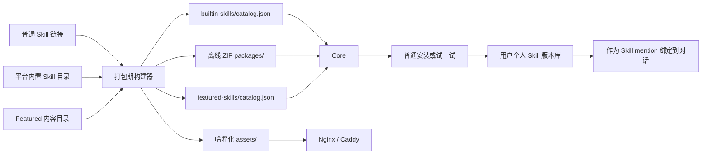

# 产品 Skill 下载打包与精选能力配置手册

> 适用对象：第一次接触 LazyMind Skill 基建的实习生和内容配置同学。
>
> 适用代码快照：`ch/skill` 分支，合并 `main@077d6dcd` 后的实现。
> 本手册只描述产品内的离线 Skill 包和“精选能力”，不描述 Codex 自身的 `.codex/skills`。

## 1. 先理解两个概念

产品内的 Skill 分为两种使用形态，但底层共用同一套 ZIP 下载、锁定、校验和按需安装能力。

| 类型 | 配置入口 | 用户看到的位置 | 安装时机 | 是否出现在普通技能广场 |
| --- | --- | --- | --- | --- |
| 普通可安装 Skill | `skills/builtin-sources.yaml` | 技能广场 | 用户点击“安装” | 是 |
| 精选能力 Featured | `skills/featured/<id>/` | 首页“精选能力”和案例广场 | 用户点击“试一试”后自动安装并绑定 | 否 |

这里的 `builtin` 表示“ZIP 已随产品离线打包”，不表示“已经安装到用户账户”。每个用户仍然在第一次点击安装或试用时，才会把 ZIP 内容写入自己的 Skill 版本库。普通 Skill 和 Featured Skill 的分发标记由构建器统一生成；同一个源链接不能同时出现在两个入口中。[构建合并逻辑](../backend/core/cmd/builtin-skill-bundle/main.go#L105-L131)



## 2. 支持什么下载链接

### 2.1 可以直接配置

- SkillHub 页面链接，例如：
  `https://skillhub.cn/skills/user_7c4df347/gaokao-volunteer-advisor`
- 任何直接返回 ZIP 文件的公开 HTTP(S) URL。
- GitHub Release 中直接下载 ZIP 的 asset URL。
- GitHub codeload/archive ZIP，但 ZIP 解压后必须满足第 3 节的 Skill 包结构。

SkillHub 页面链接会在构建期自动转换为 SkillHub 下载 API；其他 URL 会被当成 ZIP 直链直接请求。[链接解析实现](../backend/core/cmd/builtin-skill-bundle/main.go#L351-L383)

### 2.2 当前不支持

- 普通 GitHub 仓库首页：`https://github.com/<owner>/<repo>`
- GitHub `/tree/`、`/blob/` 页面。
- 需要登录或 Authorization Header 的私有下载地址。
- 一个大仓库中的任意 Skill 子目录自动截取。

这些页面通常返回 HTML，不是 ZIP，因此会在 ZIP 校验时失败。如果 Skill 位于 GitHub 仓库子目录，推荐发布一个只包含该 Skill 的 Release ZIP。

## 3. Skill ZIP 必须满足的结构

最推荐的 ZIP 结构：

```text
my-skill.zip
├── SKILL.md
├── README.md                 # 可选
├── scripts/                  # 可选
│   └── run.py
└── references/               # 可选
    └── guide.md
```

也允许 ZIP 外面多一层统一目录：

```text
my-skill.zip
└── my-skill/
    ├── SKILL.md
    ├── scripts/
    └── references/
```

构建器会自动去掉这唯一的一层包装目录。若 ZIP 中有多个并列根目录，或 `SKILL.md` 藏在仓库的深层子目录中，则不会自动寻找。[包装目录归一化](../backend/core/skillv2/skillpackage/package.go#L111-L138)

`SKILL.md` 至少包含：

```markdown
---
name: my-skill
description: 一句话说明什么时候应该使用这个 Skill
version: 1.0.0
category: external
tags:
  - research
  - report
---

# My Skill

这里填写 Skill 指令。
```

规则：

- `name` 和 `description` 必填。
- Featured Skill 强烈要求显式填写 `version`，并让 `required_version` 与它一致。
- `category` 缺失时构建器使用 `external`。
- `version` 缺失时会尝试读取 `_meta.json`；仍缺失则生成 `0.0.0+<tree-hash>`，不建议 Featured 内容依赖这种版本。
- 文件名必须精确为 `SKILL.md`。

构建器限制：下载文件不超过 64 MiB；ZIP 最多 512 个条目；单个解压文件不超过 32 MiB；总解压大小不超过 128 MiB；禁止路径穿越、反斜杠路径、重复路径和软链接。[下载限制](../backend/core/cmd/builtin-skill-bundle/main.go#L30) [ZIP 安全校验](../backend/core/skillv2/skillpackage/package.go#L21-L109)

## 4. 添加普通可安装 Skill

### 4.1 修改链接清单

编辑 `skills/builtin-sources.yaml`：

```yaml
schema_version: 1
# bundled_skills 由平台维护，用于把仓库内已有 Skill 打成相同格式的 ZIP；新增外部 Skill 时不要修改或删除。
bundled_skills:
  - uid: bsk_existing_uid
    path: research/existing-skill
    category: research
    version: 1.0.0
skills:
  - https://example.com/my-skill-1.0.0.zip
  - https://github.com/example/my-skill/releases/download/v1.0.0/my-skill.zip
```

注意：

- 这里只放需要出现在普通技能广场的 Skill。
- `bundled_skills` 保存平台已有 Skill 的稳定 UID、仓库相对目录、分类和版本；实习生添加链接时只编辑 `skills`。
- 不要把 Featured 的 `skill.source_url` 再写进这里，否则构建会报“同时属于 market 和 featured-only”。
- URL 必须唯一，空值和重复值会被拒绝。

### 4.2 下载并生成锁文件

在仓库根目录运行：

```bash
make skills-build
```

该命令会把平台已有 Skill 与外部链接 Skill 统一生成 ZIP 和 builtin Catalog，再生成 Featured Catalog 与素材。[Make 目标](../Makefile#L310-L333)

成功后重点检查：

```text
skills/builtin-skills.lock.json
skills/.runtime/
├── cache/
├── builtin-skills/
│   ├── catalog.json
│   └── packages/*.zip
└── featured-skills/
    ├── catalog.json
    └── assets/
```

提交规则：

- 提交 `skills/builtin-sources.yaml`。
- 提交更新后的 `skills/builtin-skills.lock.json`。
- 不提交 `skills/.runtime/`，这是本地生成目录。
- 仔细审查锁文件中的 `source_url`、`resolved_url`、`version`、`archive_sha256`、`tree_sha256` 和 `market_visible`。

## 5. 添加 Featured 精选能力

### 5.1 目录必须自包含

复制现有高考示例最方便：

```text
skills/featured/<featured-id>/
├── featured.yaml
├── locales/
│   └── en-US.yaml
└── assets/
    ├── cover.png
    └── result.png             # 可选
```

目录名必须与 `featured.yaml` 中的 `id` 完全一致。不要把 Featured 图片放进 `frontend/public/showcase`；所有新增素材统一放在当前 Featured 目录的 `assets/` 下。[真实示例](featured/gaokao-volunteer-advisor/featured.yaml)

首页 Featured 封面使用 `3:2` 图片舞台，推荐提供 `1536×1024`、`1200×800` 或其他同等比例的图片，避免关键内容在卡片中被裁剪。主体和文字不要贴近图片边缘。

### 5.2 最小可用配置

```yaml
schema_version: 2
id: my-featured-skill
type: work
version: 1.0.0
status: published
default_locale: zh-CN

skill:
  source_url: https://example.com/my-skill-1.0.0.zip
  required_version: 1.0.0

placement:
  home: true
  gallery: true
  order: 10

classification:
  category: 调研分析
  tags:
    - 调研
    - 报告

assets:
  cover:
    file: assets/cover.png
    role: cover

presentation:
  card:
    title: 市场调研助手
    description: 根据目标市场和业务背景生成结构化调研方案
    output_type: report
    output_label: 调研报告
    cover_asset: cover
    result_summary: 输出市场判断、证据来源和行动建议
  detail:
    title: 市场调研助手
    description: 从研究问题、资料检索到结论整理，生成可继续编辑的调研报告。
    attachment_hint: 行业资料、产品信息或目标市场说明

tasks:
  - id: market-research
    selector:
      title: 市场调研
      description: 分析市场规模、趋势、用户和竞争格局
      output_label: 市场调研报告
    launch:
      prompt_short: 帮我完成一份目标市场调研。
      prompt: 请根据我提供的行业、地区、目标用户和业务问题完成市场调研。信息不足时先询问关键条件。
    replay:
      steps:
        - title: 明确研究问题
          description: 确认行业、地区、用户和判断口径
        - title: 收集并核验资料
          description: 优先使用可靠来源并记录时间范围
        - title: 形成分析结论
          description: 整理市场趋势、竞争格局和机会风险
    result:
      template: generic_report_v1
      eyebrow: 市场调研报告
      title: 目标市场分析与机会建议
      summary: 汇总关键证据、市场判断和下一步行动
      highlights:
        - 市场规模与趋势
        - 用户需求与竞争格局
        - 机会、风险与行动建议
```

## 6. Featured 字段说明

### 6.1 顶层字段

| 字段 | 必填 | 说明 |
| --- | --- | --- |
| `schema_version` | 是 | 当前只能是 `2` |
| `id` | 是 | 小写字母、数字、`_`、`-`；必须与目录名一致 |
| `type` | 是 | `chat` 或 `work`；快速问答展示 `chat`，新建任务展示 `work` |
| `version` | 是 | 语义化版本，例如 `1.2.0` |
| `status` | 是 | `draft`、`published` 或 `disabled` |
| `default_locale` | 是 | `xx-YY` 格式，例如 `zh-CN` |
| `skill.source_url` | 是 | SkillHub 页面或公开 ZIP 直链 |
| `skill.required_version` | 推荐 | 要求下载到的 Skill 版本；不一致时构建失败 |

`draft` 和 `disabled` 会参与配置校验，但不会下载、编译或出现在页面中。`published` 必须至少开启一个 placement。

- `chat`：以咨询、问答、诊断和连续对话为主要体验，只出现在“快速问答”入口。
- `work`：以执行任务并交付报告、文档、表格、图片等结果为主要体验，只出现在“新建任务”入口。

类型不是前端硬编码 Skill 名单；前端根据现有入口模式读取 Catalog 中的 `type`。新增能力时修改 YAML 即可进入对应入口，不需要维护额外列表或滑块。

### 6.2 展示位置和分类

| 字段 | 说明 |
| --- | --- |
| `placement.home` | 是否显示在首页“精选能力” |
| `placement.gallery` | 是否显示在案例广场 |
| `placement.order` | 正整数；首页和广场统一按数字从小到大排序 |
| `classification.category` | 展示分类和筛选分类 |
| `classification.tags` | 搜索关键词；也应在 locale 中翻译 |

分类标签规则：

- `classification.category` 生成能力中心中的分类标签，例如 `教育咨询`。
- 当前语言下，多个 Featured 的 `classification.category` 字符串完全一致时，接口只返回一个分类标签；用户点击后会同时看到这些 Featured。
- 分类匹配是精确匹配，空格、大小写和标点不同都会被视为不同分类。需要放在同一分类中的 Skill，默认语言和每个 locale 都必须使用完全一致的分类名称。
- `locales/<locale>.yaml` 中的 `classification.category` 是该语言实际显示和分组使用的值。例如中文统一写 `教育咨询`，英文也应统一写 `Education consulting`。
- “全部”视图不会按分类重新排列卡片，而是继续按 `placement.order` 全局排序；分类标签用于筛选，不用于改变全局顺序。
- `classification.tags` 只参与搜索，不会生成分类标签。
- `type: chat | work` 决定首页入口：快速问答或新建任务；`classification.category` 是能力中心的业务分类筛选，两者相互独立。

同一分类的两个配置示例：

```yaml
# skills/featured/advisor-a/featured.yaml
classification:
  category: 教育咨询
  tags: [升学]

# skills/featured/advisor-b/featured.yaml
classification:
  category: 教育咨询
  tags: [专业选择]
```

两项会共用一个“教育咨询”标签；点击该标签时一起显示。

### 6.3 卡片和详情文本

| 字段 | 页面位置 |
| --- | --- |
| `presentation.card.title` | 首页和广场卡片标题 |
| `presentation.card.description` | 卡片描述 |
| `presentation.card.output_type` | 卡片视觉类型 |
| `presentation.card.output_label` | 交付物标签 |
| `presentation.card.cover_asset` | 封面素材 ID |
| `presentation.card.result_summary` | 卡片底部结果摘要 |
| `presentation.detail.title` | 详情页标题 |
| `presentation.detail.description` | 详情页描述 |
| `presentation.detail.attachment_hint` | 进入对话后的上传建议 |

`output_type` 只允许：

```text
report, dashboard, slides, document, images, web, meeting, table
```

### 6.4 Task 模型

每个 Featured 至少有一个 Task。前端始终读取 `tasks[]`：

| 分组 | 字段 | 作用 |
| --- | --- | --- |
| `selector` | `title`、`description`、`output_label` | 多任务时显示顶部任务选择卡 |
| `launch` | `prompt_short` | 详情页“用户任务” |
| `launch` | `prompt` | 点击“试一试”后填入对话框的完整提示词 |
| `replay` | `steps[]` | 左侧任务执行回放 |
| `result` | `template` 和内容槽位 | 右侧最终产出预览 |

只有一个 Task 时，详情页不显示任务选择区域；多个 Task 时，每个 Task 可以拥有完全不同的 prompt、步骤和结果内容。前端已有这两种布局，不需要新增页面组件。[单/多任务渲染](../frontend/src/modules/showcase/DetailPage.tsx#L134-L291)

## 7. 两种结果模板

### 7.1 `generic_report_v1`

适合报告、方案、分析、写作等大多数 Featured：

```yaml
result:
  template: generic_report_v1
  eyebrow: 位次分析报告
  title: 院校专业录取区间分析
  summary: 以位次为核心给出录取区间和风险判断
  highlights:
    - 历史数据对齐
    - 录取区间
    - 风险和数据局限
```

要求：

- `eyebrow`、`title`、`summary` 必填。
- `highlights` 至少一项。
- 不能同时配置 `product_report`。

### 7.2 `product_report_v1`

适合指标卡 + 双栏内容布局：

```yaml
result:
  template: product_report_v1
  eyebrow: PRODUCT DESIGN · AI AGENT
  title: 面向知识工作者的任务执行型 AI Agent
  summary: 以目标澄清、过程可控和结果可编辑为核心体验
  product_report:
    metrics:
      - label: 核心目标用户
        value: 3 类
        hint: 产品、市场、运营
        accent: true
      - label: 高频任务场景
        value: 6 个
        hint: 调研、分析、写作与创作
    sections:
      - title: 核心使用路径
        marker: number
        items:
          - label: 表达目标：
            description: 通过自然语言、附件或案例模板发起任务。
          - label: 确认计划：
            description: Agent 澄清约束并展示可调整步骤。
      - title: 关键产品机制
        marker: letter
        items:
          - description: 计划确认和步骤回放建立过程信任。
          - description: 结果内联编辑降低返工成本。
    deliverables: 交付物：产品定位 · 用户旅程 · 信息架构 · 核心交互
```

要求：

- 至少一个 `metric`，每项包含 `label`、`value`、`hint`。
- 至少一个 `section`。
- `marker` 只能是 `number` 或 `letter`。
- 每个 section item 必须有 `description`，`label` 可选。
- `deliverables` 必填。

这套模板只配置文案和既有槽位，不接受自定义 HTML、CSS 或 JavaScript。[模板数据结构](../backend/core/showcase/showcase.go#L18-L55) [前端结果组件](../frontend/src/modules/showcase/DetailPage.tsx#L47-L132)

## 8. 素材配置

### 8.1 素材注册

```yaml
assets:
  cover:
    file: assets/cover.png
    role: cover
  result-preview:
    file: assets/result-preview.webp
    role: result
```

引用：

```yaml
presentation:
  card:
    cover_asset: cover

tasks:
  - id: demo
    result:
      template: generic_report_v1
      image_asset: result-preview
```

当前 `image_asset` 会在 `generic_report_v1` 中显示；`product_report_v1` 主要使用 metrics/sections 布局，当前不会显示该结果图。两种模板的卡片封面都使用 `cover_asset`。

### 8.2 强制约束

- 格式：PNG、JPEG、WebP。
- 扩展名必须与真实 MIME 一致。
- 单文件最大 5 MiB。
- 单个 Featured 所有素材合计最大 20 MiB。
- 宽高必须在 64–8192 像素之间。
- 文件必须位于当前 Featured 的 `assets/` 下。
- 禁止绝对路径、`..`、反斜杠、软链接和跨目录引用。
- 素材 ID 必须被 card 或 result 实际引用，未使用素材会导致校验失败。

推荐但不强制：卡片封面使用 1536×1024；结果预览使用 1600×1000；在满足清晰度的前提下优先 WebP。[素材检查实现](../backend/core/showcase/catalog.go#L364-L452)

构建后文件会变成：

```text
featured-skills/assets/<id>/<version>/<sha12>-<原文件名>
```

前端统一使用：

```text
/showcase-assets/<id>/<version>/<sha12>-<原文件名>
```

不要在 YAML 中手写这个 URL，构建器会自动生成。[素材编译](../backend/core/showcase/catalog.go#L210-L233)

## 9. 多语言配置

默认语言内容写在 `featured.yaml`。其他语言放在：

```text
locales/en-US.yaml
locales/ja-JP.yaml
```

英文文件示例：

```yaml
locale: en-US

classification:
  category: Research
  tags:
    - Market research
    - Report

presentation:
  card:
    title: Market research assistant
    description: Build a structured market research plan
    output_type: report
    output_label: Research report
    cover_asset: cover
    result_summary: Deliver evidence-backed findings and recommendations
  detail:
    title: Market research assistant
    description: Move from research questions to an editable report.
    attachment_hint: Industry materials or a target-market brief

tasks:
  - id: market-research
    selector:
      title: Market research
      description: Analyze market size, trends, users, and competition
      output_label: Market research report
    launch:
      prompt_short: Help me research a target market.
      prompt: Complete a target-market analysis and ask for missing context first.
    replay:
      steps:
        - title: Define the research question
          description: Confirm the market, region, audience, and criteria
    result:
      template: generic_report_v1
      eyebrow: Market research report
      title: Market findings and opportunities
      summary: Summarize evidence, conclusions, and recommended actions
      highlights:
        - Market size and trends
        - Users and competition
        - Opportunities and risks
```

locale 对齐规则：

- 文件名必须等于 `locale`，例如 `en-US.yaml` → `locale: en-US`。
- locale 不能与 `default_locale` 重复。
- `output_type` 必须与默认语言一致。
- Task 数量、顺序、ID 和每个 Task 的结果模板必须与默认语言一致。
- 分类、标签、卡片、详情、Task、步骤和结果文案都应翻译。
- `cover_asset` 和 `image_asset` 仍引用主配置中同一套素材 ID。

任意未知 YAML 字段都会直接报错，不能依赖拼写错误被忽略。[严格解析与 locale 校验](../backend/core/showcase/catalog.go#L311-L362) [结构一致性校验](../backend/core/showcase/catalog.go#L684-L696)

## 10. 校验和构建流程

### 10.1 每次修改内容后

```bash
make featured-check
```

它只做 Featured Schema、locale 和素材校验，不下载 Skill ZIP，也不修改锁文件。

### 10.2 链接、ZIP 或版本发生变化后

```bash
make skills-build
```

它会：

1. 读取普通链接和所有 `published` Featured。
2. 下载 ZIP，最多重试 3 次。
3. 校验 ZIP 和 `SKILL.md`。
4. 计算 archive SHA256 和解压树 SHA256。
5. 生成或更新 `skills/builtin-skills.lock.json`。
6. 复制离线 ZIP 到 `skills/.runtime/builtin-skills/packages/`。
7. 编译 Featured catalog 和哈希素材。

### 10.3 锁文件规则

锁文件是发布输入，不是缓存：

- 第一次添加或主动升级上游 Skill 时，运行普通构建并审查锁文件变化。
- 发布构建使用 `--frozen-lockfile`；如果源数量、解析地址、market/featured 分发属性、ZIP 哈希、大小或文件树发生变化，构建会失败。
- 不要为了让 CI 通过而手改 SHA256。
- 如果上游在同一版本下偷偷替换 ZIP，先确认变更可信，再主动更新锁文件和 Featured 版本。

冻结校验逻辑见 [构建器 frozen 流程](../backend/core/cmd/builtin-skill-bundle/main.go#L133-L209)。

## 11. 在不同运行模式中启用

### 11.1 Docker Compose 开发环境

先生成本地产物：

```bash
make skills-build
```

macOS/Linux shell：

```bash
docker compose up -d --build core frontend
```

PowerShell：

```powershell
docker compose up -d --build core frontend
```

说明：

- Compose 将宿主机稳定目录 `./skills/.runtime` 只读挂载到 Core 和 Frontend 的 `/skills/.runtime`。
- Nginx 使用 `alias` 将 `/showcase-assets/` 映射到 `/skills/.runtime/featured-skills/assets/`；构建器重建 assets 子目录后无需重新绑定子目录。
- Core 默认读取 `/skills/.runtime/builtin-skills/catalog.json` 和 `/skills/.runtime/featured-skills/catalog.json`，不需要额外配置环境变量。

参见 [Compose Core 配置](../docker-compose.yml#L350-L396) 和 [Frontend 素材挂载](../docker-compose.yml#L421-L443)。

### 11.2 Native Local Runtime

在仓库根目录：

```bash
make skills-build
make local-up
```

Core 会从仓库标准目录 `skills/.runtime` 自动发现 catalog；Caddy 自动将 `/showcase-assets/*` 映射到同一目录下的 Featured 素材。[Core 默认发现](../backend/core/showcase/catalog.go#L166-L190) [Caddy 路由](../local/local-runtime-manager/frontend.go#L308-L361)

### 11.3 macOS Desktop

开发包：

```bash
make desktop-darwin-arm64
```

发布包：

```bash
LAZYMIND_RELEASE_BUILD=true make desktop-darwin-arm64
```

构建脚本会自动下载/冻结 Skill、编译素材、写 runtime manifest，并从源码 app 副本中排除 `skills/.runtime`，避免重复打包。[macOS 构建链路](../desktop/scripts/build-darwin-arm64.sh#L236-L259)

### 11.4 Windows Desktop

便携 ZIP：

```powershell
make desktop-windows-x64
```

安装器：

```powershell
make desktop-windows-x64-installer
```

发布构建前设置：

```powershell
$env:LAZYMIND_RELEASE_BUILD = "true"
make desktop-windows-x64
```

Windows 与 macOS 调用同一个 Go 构建器，生成相同的 catalog、ZIP 规则和 `/showcase-assets/` URL，不在配置中出现系统绝对路径。[Windows 构建链路](../desktop/scripts/build-windows-x64.ps1#L274-L351)

Desktop 的目录位置是固定约定，不再写入额外路径配置。runtime manifest 只声明离线能力已经包含，并记录文件校验和：

```json
{
  "features": {
    "offlineBuiltinSkills": true,
    "offlineFeaturedSkills": true
  }
}
```

参见 [manifest 生成](../desktop/scripts/write-runtime-manifest.mjs#L40-L124)。

## 12. 用户点击后的真实行为

### 12.1 普通 Skill

1. 技能广场读取 builtin catalog 元数据，不提前解压所有 ZIP。
2. 用户点击“安装”。
3. Core 校验 ZIP 大小和 SHA256，并安全解压。
4. 完整文件树写入该用户的 Skill revision store。
5. 再次安装返回同一个 Skill，不重复创建。
6. 如果 Skill 在回收站，系统恢复；如果被禁用，系统重新启用。

Featured-only 条目带有 `market_visible: false`，普通技能广场会过滤它。[builtin catalog](../backend/core/skillv2/builtin/catalog.go#L33-L49) [安装接口](../backend/core/skillv2/handler/builtin.go#L23-L246)

### 12.2 Featured “试一试”

1. 点击卡片主体直接进入“试一试”；卡片右上角“查看详情”进入流程和介绍页。
2. 详情页根据选中的 Task 跳转到新对话。
3. 前端调用同一个 builtin enable 接口。
4. 安装完成前输入框禁用。
5. 安装失败时显示“重新安装”，可以原地重试。
6. 成功后把个人 Skill ID 作为 `skill` mention 绑定到本次发送。
7. 用户清除案例后，绑定 mention 同步清除。

参见 [安装与重试 Hook](../frontend/src/modules/showcase/useFeaturedSkillBinding.ts#L7-L46)、[新对话接入](../frontend/src/modules/chat/pages/newChat/index.tsx#L53-L238) 和 [bound mentions 合并](../frontend/src/modules/chat/components/ChatInput/index.tsx#L500-L527)。

注意：Skill 安装成功不代表用户已经配置对话模型。新用户如果没有可用 LLM，页面仍会提示先配置模型；这不属于 Skill 安装失败。

## 13. 实习生验收清单

提交 PR 前逐项完成：

- [ ] Featured 目录名与 `id` 一致。
- [ ] `type` 已按主要使用体验配置为 `chat` 或 `work`。
- [ ] 快速问答只出现 `chat`，新建任务只出现 `work`；页面不再显示类型滑块。
- [ ] 卡片主体进入“试一试”，右上角“查看详情”进入流程介绍。
- [ ] 需要归入同一分类的 Featured，在默认语言和所有 locale 中使用完全一致的 `classification.category`。
- [ ] Skill ZIP 能直接下载，且包含有效 `SKILL.md`。
- [ ] `required_version` 与 ZIP 中的版本一致。
- [ ] Featured 源链接没有同时写进 `builtin-sources.yaml`。
- [ ] 默认语言和所有 locale 的 Task ID、顺序、模板一致。
- [ ] 单任务和多任务页面表现符合预期。
- [ ] 所有图片都在当前 Featured 的 `assets/` 下。
- [ ] 图片 ID、role 和引用关系正确，没有未使用素材。
- [ ] `make featured-check` 通过。
- [ ] `make skills-build` 通过，并审查 lock 变化。
- [ ] Featured 出现在预期的首页/广场位置。
- [ ] Featured-only Skill 不出现在普通技能广场。
- [ ] 点击“试一试”后自动安装，输入框恢复可用。
- [ ] 重复点击不会创建重复 Skill。
- [ ] 使用真实模型发送后，日志或结果确认 Skill 被显式加载。
- [ ] macOS/Windows 构建相关改动通过 Desktop 脚本测试。

推荐验证命令：

```bash
make featured-check

cd backend/core
go test ./showcase ./cmd/builtin-skill-bundle ./skillv2/builtin ./skillv2/handler ./skillv2/skillpackage

cd ../../frontend
pnpm exec vitest run \
  src/modules/showcase/FeaturedCases.test.tsx \
  src/modules/showcase/DetailPage.test.tsx \
  src/modules/showcase/useFeaturedSkillBinding.test.ts
pnpm exec eslint src/modules/showcase src/modules/chat/pages/newChat/index.tsx
pnpm build

cd ../desktop
node --test scripts/desktop-build.test.mjs
```

## 14. 常见错误排查

| 报错或现象 | 原因 | 处理方法 |
| --- | --- | --- |
| `invalid source URL` | 不是合法 HTTP(S) URL | 修正链接协议和地址 |
| 下载后提示不是 ZIP | 配置了 GitHub 页面或登录页 | 改成公开 ZIP 直链 |
| `skill package must contain SKILL.md` | ZIP 根结构不符合要求 | 把 Skill 单独打成 ZIP，或只保留一层包装目录 |
| `source ... cannot be both...` | 同一链接同时作为普通和 Featured | 从 `builtin-sources.yaml` 删除 Featured 链接 |
| `required version ... got ...` | Featured 版本与 ZIP 元数据不一致 | 更新 ZIP 版本或 `required_version` |
| `field ... not found` | YAML 拼写错误或使用了旧字段 | 按 Schema v2 修改，不要忽略错误 |
| `id ... must match directory` | 目录名和 id 不一致 | 两者统一 |
| `asset file must be ... under assets/` | 素材路径越界或不规范 | 移入当前 `assets/` 并使用相对路径 |
| `file extension does not match MIME` | 扩展名与真实图片格式不符 | 正确转换图片，不要只改后缀 |
| `asset ... is not referenced` | 配置了未使用素材 | 删除素材注册或在 card/result 中引用 |
| `task ids must match` | locale 缺 Task、顺序不同或 ID 不同 | 复制默认 Task 结构后只翻译文本 |
| `product result is incomplete` | product 模板缺 metrics/sections/deliverables | 补齐所有槽位 |
| frozen lock 不匹配 | 上游 ZIP、URL 或分发属性变化 | 先确认变更，再运行非 frozen 构建更新 lock |
| Featured API 返回 500 | 标准目录下只生成了一个 catalog，或两个 catalog 的 UID/版本/哈希不一致 | 重新运行 `make skills-build`，不要单独复制 catalog |
| 图片 404 | 未运行构建、Nginx/Caddy 未挂素材目录 | 检查 `skills/.runtime/featured-skills/assets` 和运行时配置 |
| “试一试”后仍不能发送 | 用户未配置 LLM，或安装正在重试 | 区分模型提示与 Skill 安装提示 |

## 15. 不在当前配置能力内的事项

实习生不要在本迭代自行扩展以下能力：

- 后台拖拽式 Featured 编辑器。
- 配置任意 HTML、CSS、JavaScript。
- 运行时从公网热更新 Featured。
- 一个 Featured 自动组合多个 Skill。
- 用户自行发布 Featured。
- 私有 GitHub Token 下载。
- CDN 上传与失效管理。

如果需求确实涉及以上内容，先单独做架构评审，不要在 YAML 中增加未定义字段。

## 16. 代码导航

| 关注点 | 位置 |
| --- | --- |
| Make 入口 | [`Makefile`](../Makefile#L310-L333) |
| 下载、SkillHub 解析、锁文件、编译调度 | [`backend/core/cmd/builtin-skill-bundle/main.go`](../backend/core/cmd/builtin-skill-bundle/main.go#L69-L251) |
| ZIP 安全解析 | [`backend/core/skillv2/skillpackage/package.go`](../backend/core/skillv2/skillpackage/package.go#L21-L138) |
| builtin catalog 和按需读取 | [`backend/core/skillv2/builtin/catalog.go`](../backend/core/skillv2/builtin/catalog.go#L34-L215) |
| Featured Schema、locale、素材和模板校验 | [`backend/core/showcase/catalog.go`](../backend/core/showcase/catalog.go#L26-L721) |
| Featured 与 builtin 绑定一致性 | [`backend/core/showcase/showcase.go`](../backend/core/showcase/showcase.go#L152-L192) |
| 普通安装/恢复/幂等 | [`backend/core/skillv2/handler/builtin.go`](../backend/core/skillv2/handler/builtin.go#L23-L246) |
| 详情页单/多任务和结果模板 | [`frontend/src/modules/showcase/DetailPage.tsx`](../frontend/src/modules/showcase/DetailPage.tsx#L47-L359) |
| “试一试”自动安装和重试 | [`frontend/src/modules/showcase/useFeaturedSkillBinding.ts`](../frontend/src/modules/showcase/useFeaturedSkillBinding.ts#L7-L46) |
| Compose catalog 和素材挂载 | [`docker-compose.yml`](../docker-compose.yml#L347-L443) |
| Local Caddy 素材路由 | [`local/local-runtime-manager/frontend.go`](../local/local-runtime-manager/frontend.go#L308-L361) |
| Desktop manifest | [`desktop/scripts/write-runtime-manifest.mjs`](../desktop/scripts/write-runtime-manifest.mjs#L40-L124) |
| 完整 Featured 示例 | [`skills/featured/gaokao-volunteer-advisor/`](featured/gaokao-volunteer-advisor/) |

## 17. 可信度说明

| 内容 | 可信度 | 依据 |
| --- | --- | --- |
| Schema 字段、限制和模板 | 高 | 当前 Go 类型和校验代码 |
| 构建命令与产物路径 | 高 | Makefile、构建脚本和 runtime manifest |
| Compose/Local/Desktop 接入 | 高 | 当前运行时配置和静态路由 |
| GitHub 普通页面不支持 | 高 | 当前下载器只直接 GET URL，无 GitHub 页面解析 |
| CI 是否为仓库强制合并门禁 | 未验证 | 分支保护属于远端平台设置，本地代码无法确认 |
